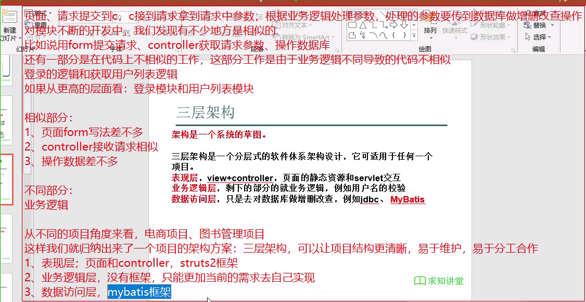
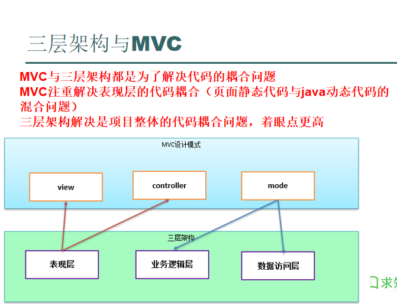
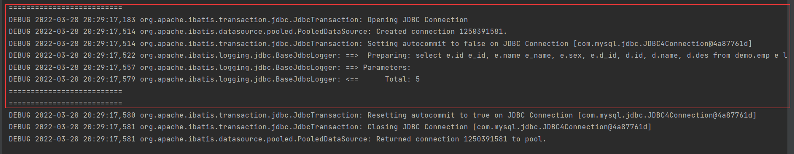
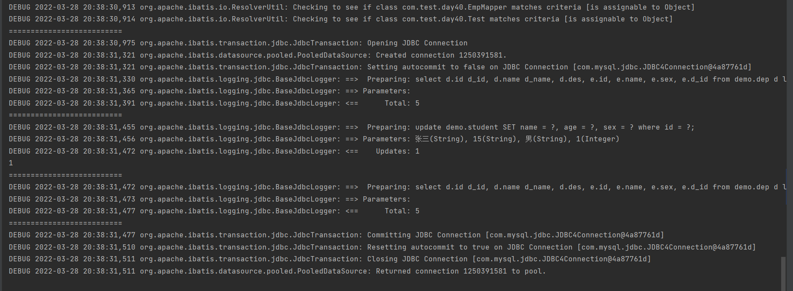
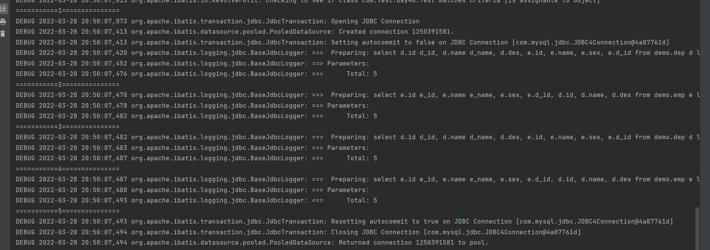
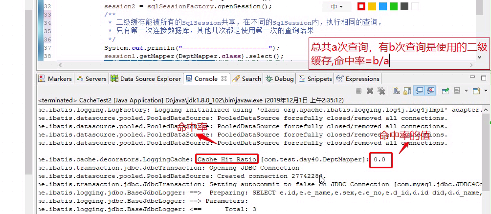

# 概述
* 读音:`[mai‘bətɪs]`,中文音译：麦-波蒂斯
* MyBatis是一个优秀的数据持久层框架，它对JDBC的操作数据库的过程进行封装。
* MyBatis使开发者只需要关注 SQL 本身，而不需要花费精力去处理例如注册驱动、创建Connection、创建Statement、手动设置参数、结果集检索等JDBC繁杂的过程代码。
* MyBatis通过xml或注解的方式将要执行的各种Statement（Statement、PreparedStatement、CallableStatement）配置起来，并通过Java对象和Statement中的SQL进行映射生成最终执行的SQL语句，最后由MyBatis框架执行SQL并将结果映射成Java对象并返回。

# 三层架构

* 表现层，view+controller，页面的静态资源和servlet交互
* 业务逻辑层，剩下的部分的就业务逻辑，例如用户名的校验
* 数据访问层，只是去对数据库做增删改查，例如jdbc、 MyBatis


# 三层架构与MVC


# MyBatis开发环境搭建
1. 下载mybatis的jar包:
   * 地址:`http://www.mybatis.cn/`
   * 在`D:\文档\编程\JAVA\求知讲堂Java\day56\day56\资料`中有这些jar包，其中还有mabatis的pdf英文文档
2. 创建web工程
3. 导入jar包:
   1. mybatis-3.5.2.jar:mybatis的jar包
   2. log4j-1.2.17.jar:
   3. mysql-connector-java-5.1.32.jar:这是JDBC的jar包
4. 编写mybaits主配置文件`myBatis-config.xml`
   * 可以放到资源文件夹下，资源文件夹下的文件在打包时会和src文件夹下的文件统合放到classes文件夹下

    ```xml
    <?xml version="1.0" encoding="UTF-8" ?>
    <!--使用的是mybatis3.5.2版本所以这里可以使用3.0版本的-->
    <!DOCTYPE configuration PUBLIC "-//mybatis.org//DTD Config 3.0//EN" 
    "http://mybatis.org/dtd/mybatis-3-config.dtd">
    <configuration>
        <!-- 
        environments,配置数据源环境，这里可以保护多个数据源的环境
        default属性，默认的意思，default的值就当前环境默认的数据源的id
        我们在项目的不同阶段，是有不同的数据源配置，不可能在所有阶段共用一个数据库
        开发的数据库和真正的生产数据库不是一个
        如果要是只有一个数据源
        就得在不同的阶段进行修改
        不如直接设置多个数据源
        -->
        <environments default="development">
            <!--
                具体的数据源环境配置
                id唯一
            -->
            <environment id="development">
                <!-- transactionManager事务管理，事务交给JDBC管理 -->
                <transactionManager type="JDBC"/>
                <!--
                dataSource,数据源
                type，类型，目前POOLED，就是数据库连接池
                -->
                <dataSource type="POOLED">
                    <!-- 数据库的驱动 -->
                    <property name="driver" value="com.mysql.jdbc.Driver"/>
                    <!--
                    数据库的连接
                    在连接后面加入?useUnicode=true&amp;characterEncoding=UTF-8
                    可以防止数据库乱码问题
                    -->
                    <property name="url" value="jdbc:mysql://localhost:3306/demo?userUnicode=true&amp;characterEncoding=UTF-8"/>
                    <property name="username" value="root"/>
                    <property name="password" value="root"/>
                </dataSource>
            </environment>
        </environments>
    </configuration>
    ```

5. 加入log4j配置文件(不是必须，但是建议加入)

# MyBatis映射器
* 使用MyBatis映射器实现数据库操作，常用的三种方式
  1. 纯xml映射器，利用SqlSession的各种方法实现增删改查。

## 纯XML映射器
1. 配置映射器xml文件
2. 在mybatis主配置文件中配置xml映射器
```xml
<!-- StudentMapper.xml文件 -->
<?xml version="1.0" encoding="UTF-8" ?>
<!DOCTYPE mapper PUBLIC "-//mybatis.org//DTD Mapper 3.0//EN" "http://mybatis.org/dtd/mybatis-3-mapper.dtd">
<!--
命名空间可以任意选名，但是要唯一，最好有一定的规则
这里我们直接用xml文件的路径当作命名空间
-->
<mapper namespace="com.test.day38.StudentMapper">
    <!-- 定义插入的sql语句，通过命名空间+id的方式被定位 -->
    <!--
    insert标签代表要写入的是插入SQL
    id属性是这个insert标签的唯一标识，这个值在当前的命名空间中是唯一的
    parameterType，这个属性是传递到这个SQL中的参数的封装类的全类名
    使用#{属性名}获得传入这个SQL中类的属性
    -->
    <insert id="insert_student" parameterType="com.test.day38.Student">
        insert into demo.student (id, name, class, sex, age, servlet, jsp) values (#{id}, #{name}, #{classes}, #{sex}, #{age}, #{servlet}, #{jsp});
    </insert>
</mapper>
```

```xml
<!-- myBatis-config.xml文件 -->
<!--
主配置文件引入映射器
-->
<mappers>
    <!--
    resource属性代表当前的mapper配置是引入的xml映射器
    属性的值就是映射器配置的路径
    -->
    <mapper resource="com/test/day38/StudentMapper.xml"/>
</mappers>
```

```java
// 使用XML映射器插入数据

//加载主配置文件，主配置文件中有数据库连接相关信息，还有映射器的相关信息
//参数是主配置文件的路径，我们的主配置文件是在跟路径下，所有直接写文件名就可以
Reader reader = Resources.getResourceAsReader("myBatis-config.xml");
//创建SqlSessionFactory工程
SqlSessionFactory sqlSessionFactory = new SqlSessionFactoryBuilder().build(reader);
//得到SqlSession对象，这个对象就是操作映射器的对象
SqlSession session = sqlSessionFactory.openSession();

//创建存入数据库的对象
Student stu = new Student();
stu.setAge("15");
stu.setClasses("三班");
stu.setId(13);
stu.setJsp(78);
stu.setServlet(98);
stu.setName("xml映射器");
stu.setSex("男");

/*
session.insert来操作映射器的inset的SQL
参数1，定位映射器，映射器所在mapper的namespace和自己的id拼接
参数2，是要传递到映射器的参数
    */
int res = session.insert("com.test.day38.StudentMapper.insert_student", stu);
System.out.println(res);

//提交
session.commit();

//关闭资源
session.close();
reader.close();
```

## XML映射器+接口
1. 接口
2. 配置映射器xml文件
3. 主配置文件中配置xml映射器

```java
// 接口
public interface StudentMapperIn {
    public int insertStudent(Student student);
}
```

```xml
<!-- StudentMapperIn.xml -->
<?xml version="1.0" encoding="UTF-8" ?>
<!DOCTYPE mapper PUBLIC "-//mybatis.org//DTD Mapper 3.0//EN" "http://mybatis.org/dtd/mybatis-3-mapper.dtd">
<!--
接口与XML映射器混合使用
mapper标签的namespace的属性名是接口的全类名
-->
<mapper namespace="com.test.day38.StudentMapperIn">
    <!--
    id属性是接口的方法名
    -->
    <insert id="insertStudent" parameterType="com.test.day38.Student" >
        insert into demo.student (id, name, class, sex, age, servlet, jsp) values (#{id}, #{name}, #{classes}, #{sex}, #{age}, #{servlet}, #{jsp});
    </insert>
</mapper>
```

```xml
<!-- myBatis-config.xml -->
<mappers>
    <!--
    resource属性代表当前的mapper配置是引入的xml映射器
    属性的值就是映射器配置的路径
    -->
    <mapper resource="com/test/day38/StudentMapper.xml"/>
    <mapper resource="com/test/day38/StudentMapperIn.xml"/>
</mappers>
```

```java
Reader reader = null;
SqlSessionFactory sqlSessionFactory = null;
SqlSession session = null;
try {
    reader = Resources.getResourceAsReader("myBatis-config.xml");
    sqlSessionFactory = new SqlSessionFactoryBuilder().build(reader);
    session = sqlSessionFactory.openSession();

    Student stu = Student.getRandomStudent(14, "接口与XML混合");
    /*
    getMapper中的参数是接口的全类名
    .insertStudent是调用的方法
    */
    int res = session.getMapper(StudentMapperIn.class).insertStudent(stu);
    System.out.println(res);

    //别忘了提交
    session.commit();
} catch (Exception e) {
    e.printStackTrace();
    //发生错误就回滚
    if (session != null) {
        session.rollback();
    }
} finally {
    try {
        if (reader != null) {
            reader.close();
        }
    } catch (IOException e) {
        e.printStackTrace();
    }
    if (session != null) {
        session.close();
    }
}
```

## 注解+接口混合
1. 接口
2. 写注解
3. 配置主配置文件

```java
public interface StudentAnoIn {
    /*
    @Insert对应xml映射器里面的insert标签
    里面的字符串参数就是insert标签中的SQL语句
     */
    @Insert("insert into demo.student (id, name, class, sex, age, servlet, jsp) values (#{id}, #{name}, #{classes}, #{sex}, #{age}, #{servlet}, #{jsp});")
    public int insertStudent(Student student);
}
```

```xml
<mappers>
		<!-- class属性，引入接口映射，值是接口的全类名 -->
		<mapper class="com.test.day38.StudentAnoIn"/>
</mappers>
```

* 如果接口有很多就要在主配置文件中配置很多个mapper，有一种简洁的方法，可以直接在mappers中配置package属性，直接将包下面的所有注解接口以及xml文件引入
```xml
<mappers>
    <!-- 直接配置包名，这样可以引入这个包下所有的带注解的接口 -->
    <package name="com.test.day38"/>
</mappers>
```

## 总结
* 实际应用中使用XML+接口或者注解+接口
  * 前者将SQL语句写在xml文件中，耦合度低
  * 后者开发方便

# MyBatis的CURD
* 新增
```xml
<insert id="唯一值" parameterType="参数类的全名">
	insert into 表名(字段名...)	values (#{变量名}...);
</insert>
```
* 修改
```xml
<update id="唯一值" parameterType="参数类的全名">
    update 表名 set 字段名 = #{变量名} where 字段名 = #{变量名};
</update>
```
* 删除
```xml
<delete id="唯一值" parameterType="参数类的全名">
	delete from 表名 where 字段名 = #{变量名};
</delete>
```

## MyBatis的查询
* 如果数据库中的字段名和返回类的制度按摩不同，则要配置resultMap,通过设置selsect的resultMap属性来返回
```xml
<resultMap type="表对应的实体类全类名" id="resultMap唯一值">
	<!-- id标签对应主键 -->
	<id property="类属性" column="字段"/>
	<result property="类属性" column="字段"/>
</resultMap>
<select id="唯一值" resultMap="resultMap的id">
	select * from 表名 where ...;
</select>
```
* 如果数据库中的字段名和属性名完全一致，可以直接用resultType接收返回值
```xml
<!-- 使用resultType，必须类属性与字段名完全一致 -->
<select id="唯一值" resultType="表对应的实体类全类名">
	select * from 表名 where ...;
</select>
```
* 也可以用Map来接收查询结果
```xml
<select id="selectStuById03" resultType="Map" parameterType="Integer">
    select * from student where id = #{abc};
</select>
```
* 如果查询返回有多条结果，那么将返回一个resultType的List列表
* 如果想要输入多个不同类型的参数，可以使用@Param注解用于对参数的重命名,不写parameterType属性,并且#{}支持`引用类型名.属性名`这种形式
```xml
<!-- 
public List<Student> getStudent(@Param("classes")A a,@Param("grade")B b);
这种参数传递方式，对增删改查都适用
    -->
<select id="getStudent" resultMap="StudentResultMap">
    select * from student where class = #{classes.b.c.d.classes} and jsp > #{grade.c.d.grade};
</select>
```

# 别名
* 每次输入parameterType这些参数的时候要输入全类名，这样很长，我们可以设置设置一个短的别名

```xml
<!-- myBatis-config.xml -->
<!-- 
配置别名集，注意，配置别名要放在主配置文件开头
别名可以配置多个
    -->
<typeAliases>
    <!-- 
    type属性是原有的实体类的全类名
    alias属性是原实体类的别名
    定义了别名之后，在xml映射器需要实体这个实体类的时候直接使用别名就可以
        -->
    <typeAlias type="com.test.day38.Student" alias="Student"/>
    <typeAlias type="com.test.day38.User" alias="User"/>
</typeAliases>
```

# MyBatis的动态SQL
## if标签
* `<if test=“  ”>xxxx</if>`
* 符合if条件的分段SQL可以被加入的整体的SQL中去执行
```xml
<!--
如果age属性是null，那么它就不会被拼接到sql语句中
这样在数据库存的就会是age的默认值(在创建表的时候设置的初始值)
否则数据库中存的age会是null
-->
<insert id="insertStudent" parameterType="Student">
    insert into demo.student (id
    <if test="age != null">,age</if>
    ) values
    (#{id}
    <if test="age != null">,#{age}</if>
    );
</insert>
```
* 善用`1=1`,防止where后面为空的情况,以及多一个and的情况
```xml
<select ...>
	select * from dept where 1 = 1 
	<if test="deptId != null">
		and dept_id=#{deptId} 
	</if>
	<if test="deptName != null">
		and dept_name=#{deptName} 
	</if>
</select>
```
* 极端情况，根据字符串返回值
```xml
<select id="selectFromStr" resultType="Map">
    <if test="str == 'abc'">select * from demo.student</if>
    <if test="str == 'ss'">select * from demo.emp</if>
</select>
```

## where标签
* 用于解决上面if标签中需要用到`1=1`的情况

```xml
    <!--
	where标签，假设被where标签包含的部分没有SQL段，我们的SQL就不会拼接where
	只剩select * from student
	如果被where标签包含的部分存在SQL段，mybatis会自动的在主题的SQL后面先拼接where，
	然后去除紧跟where后的第一个and字符串
	例如：select * from student where and id = #{id} and name = #{name}，
	就会去掉第一个and，变成select * from student where id = #{id} and name = #{name}
	 -->
    <select id="selectStu" resultMap="studentMap" parameterType="Student">
        select * from demo.student
        <where>
            <if test="id != null">and id = #{id}</if>
            <if test="name != null">and name = #{name}</if>
        </where>
    </select>
```

## choose(when,otherwise)标签
* 类似if() else if() else()
```xml
<!--
查询student表，根据年龄，如果年龄小于16，只查询姓名字段
如果年龄大于17，查询姓名和性别字段
如果不是以上的两个条件，查询姓名、性别、班级字段
在mybatis中，<使用lt替代，>使用gt替代，<=用lte，>=用gte
-->
<select id="selectStuByAge" resultMap="studentMap" parameterType="Integer">
    select
    <choose>
        <when test="age lt 16">name</when>
        <when test="age gt 17">name,sex</when>
        <otherwise>name,sex,class</otherwise>
    </choose>
    from demo.student where age = #{age};
</select>
```

## set标签
* 用于解决update标签中多了一个逗号的情况，一般和if一起使用
```xml
<!--
在update中，如果有的值是null，就不要去set值
可能会出现以下的情况
update student set
name = #{name},
age = #{age},
where id = #{id}
这个SQL多了一个逗号
mybatis处理这种问题使用set标签解决
用set标签替代set，把需要改的字段括起来
这样就可以自动去掉多余的逗号
-->
<update id="updateStu" parameterType="Student">
    update demo.student
    <set>
        <if test="name != null">name = #{name},</if>
        <if test="age != null">age = #{age},</if>
        <if test="sex != null">sex = #{sex},</if>
    </set>
    where id = #{id};
</update>
```

## forEach标签
* 用于遍历输入的list或者数组参数
* 属性:
  1. collection:要做foreach的对象，作为入参时，List对象默认用"list"代替作为键，数组对象有"array"代替作为键，Map对象没有默认的键。当然在作为入参时可以使用@Param("keyName")来设置键，设置keyName后，list,array将会失效。
  2. item:合中元素迭代时的别名，该参数为必选
  3. index：在list和数组中,index是元素的序号，在map中，index是元素的key，该参数可选
  4. open：foreach代码的开始符号，一般是(和close=")"合用。常用在in (),values ()时。该参数可选
  5. separator：元素之间的分隔符，例如在in()的时候，separator=","会自动在元素中间用“,“隔开，避免手动输入逗号导致sql错误，如in(1,2,)这样。该参数可选。
  6. close: foreach代码的关闭符号，一般是)和open="("合用。常用在in(),values()时。该参数可选。
* 两个例子
```xml
<!--
要传递一个id数组
根据id数组查询student
使用foreach标签
collection＝“array或list”,array用来对应参数为数组，list对应参数为集合，
item是为当前元素的变量名称，separator是以什么符号来分隔元素，
open和close分别是以什么符号来作为整体字符串的开头和结尾。
-->
<select id="selectStuByIds" resultMap="studentMap" parameterType="Integer[]">
    select * from demo.student where id in
    <foreach collection="array" item="id" open="(" separator="," close=")">
        #{id}
    </foreach>
</select>

<!--
foreach标签可以完成批量操作
批量插入，例如insert into student (id,name) values (1,''),(2,''),(3,'')
foreach标签遍历对象类型的集合
    -->
<insert id="insertStudents">
    insert into demo.student (id, name, class, sex, age, servlet, jsp) VALUES
    <foreach collection="stus" item="stu" separator=",">
        (#{stu.id}, #{stu.name}, #{stu.classes}, #{stu.sex}, #{stu.age}, #{stu.servlet}, #{stu.jsp})
    </foreach>
</insert>
```

## sql标签
* sql标签的内容是一些需要重复的sql段，可以通过include标签直接引用
* ql标签中，我们写SQL段时候，可以使用之前学习的set，where，if，choose(when),trim，foreach

```xml
<sql id="updateVal">
<!-- trim suffixOverrides=","
这样可以去掉被trim标签所包含的,
-->
    <trim suffixOverrides=",">
        <if test="name != null">name = #{name},</if>
        <if test="age != null">age = #{age},</if>
        <if test="sex != null">sex = #{sex},</if>
    </trim>
</sql>

<update id="updateStu1" parameterType="Student">
    update demo.student set
    <include refid="updateVal"/>
    where id = #{id};
</update>
```

# Mybatis关联查询
## 一对一或者多对一关系
* 例如员工为主表关联部门表查询，一个员工在一个部门或者多个员工在一个部门
* 可以给员工类加一个部门类属性，再在resultMap中用association声明
* 注意以下几个问题:
  1. 与数据库中表相对应的对象应该序列化，序列化后该对象就可以通过二进制进行网络传输或者存储，在对数据库增删改的时候是直接用这个对象在硬盘上做修改，所以要序列化
  2. resulMap可以不全配置，值配置你需要的部分，比如说类有10个属性，值需要使用其中的5个属性与表的字段去对应，你就配置5个
  3. 一个类可以配置多个resultMap，resultMap的id不重复即可
  4. 为了防止重复的配置，可以继承resultMap继承其他的resultMap
  5. 在子的resultMap中重新配置父的属性映射，子的映射可以覆盖父的映射，但是只是在子的resultMap生效，不影响父的resultMap
  6. association标签实现一对一或多对一关联查询，就是主表与关联表的数据是一对一或多对一，例如员工为主表，关联部门表查询，1个员工在一个部门或者多个员工在1个部门。
  7. association中属性:
     1. property="dept",emp类的dept属性名
     2. javaType="Dept"，emp类的dept属性的类型是Dept类
     3. resultMap="com.test.day40.DeptMapper.deptMap",emp类的dept属性对应的resultMap，如果这个resultMap不在当前的xml配置文件中，值就要写成resultMap所在的配置文件的namespace.resultMap的id。
  8. 在关联查询中，哪个是主表，就把这个查询写在哪个的xml配置文件中
  9. 如果在查询个过程中，查询的字段出现相同的字段名，我们要给其中一个加别名，保证没有重名的字段加了别名的字段，要在resultMap中修改属性与字段的映射
```xml
<!-- EmpMapper.xml -->
<mapper namespace="com.test.day40.EmpMapper">
    <resultMap id="empMap" type="Emp">
        <id property="id" column="id"/>
        <result property="name" column="name"/>
        <result property="sex" column="sex"/>
        <result property="dId" column="d_id"/>
    </resultMap>

    <resultMap id="empAndDep" type="Emp" extends="empMap">
        <id property="id" column="e_id"/>
        <result property="name" column="e_name"/>
        <association property="dep" javaType="Dep" resultMap="com.test.day40.DepMapper.depMap"/>
    </resultMap>

    <select id="selectAll" resultMap="empAndDep">
        select e.id e_id, e.name e_name, e.sex, e.d_id, d.id, d.name, d.des from demo.emp e
        left join demo.dep d on e.d_id = d.id;
    </select>
</mapper>
```

```xml
<!-- DepMapper.xml -->
<mapper namespace="com.test.day40.DepMapper">
    <resultMap id="depMap" type="Dep">
        <id property="id" column="id"/>
        <result property="name" column="name"/>
        <result property="des" column="des"/>
    </resultMap>
</mapper>
```

## 一对多查询
* 例如用部门表为主表，关联员工表查询，每个部门都对应多个员工
* 给部门类加一个泛型为员工类的列表属性，再找resultMap中用collection声明
* collection属性:
  1. property:泛型为员工类的列表属性名
  2. ofType:列表中的泛型类型
  3. resultMap:给员工类返回的resultMap
* 同样要注意给相同名称的字段取别名
```xml
<!-- DepMapper.java -->
<resultMap id="depAndEmpMap" type="Dep" extends="depMap">
    <id property="id" column="d_id"/>
    <result property="name" column="d_name"/>
    <collection property="emps" ofType="Emp" resultMap="com.test.day40.EmpMapper.empMap"/>
</resultMap>

<select id="selectAll" resultMap="depAndEmpMap">
    select d.id d_id, d.name d_name, d.des, e.id, e.name, e.sex, e.d_id from demo.dep d
    left join demo.emp e on d.id = e.d_id;
</select>
```

# MyBatis的多级缓存
* 查看MyBatis的运行过程我们需要log4j输出，首先要配置log4j的配置文件，放到资源文件夹下,配置文件在`D:\文档\编程\JAVA\求知讲堂Java\day59\资料`中
```py
# Rules reminder:
# DEBUG < INFO < WARN < ERROR < FATAL

# 把debug及其以上级别以上的日志输出到stdout
log4j.rootLogger=debug,stdout

# cn.jbit.mybatisdemo的日志级别是DEBUG及其以上级别
log4j.logger.cn.jbit.mybatisdemo=DEBUG


#日志输出到控制台
log4j.appender.stdout=org.apache.log4j.ConsoleAppender
#输出格式为灵活输出格式
log4j.appender.stdout.layout=org.apache.log4j.PatternLayout
#日志格式为“日志级别 时间 输出类目: 输出代码中指定的消息 换行”
log4j.appender.stdout.layout.ConversionPattern=%5p %d %C: %m%n

#org.apache.ibatis的日志级别是DEBUG及其以上级别
log4j.logger.org.apache.ibatis=DEBUG
## log4j.logger.org.apache.jdbc.SimpleDataSource=DEBUG
#org.apache.ibatis.jdbc.ScriptRunner的日志级别是DEBUG及其以上级别
log4j.logger.org.apache.ibatis.jdbc.ScriptRunner=DEBUG
## log4j.logger.com.ibatis.sqlmap.engine.impl.SqlMapclientDelegate=DEBUG
#java.sql.Connection的日志级别是DEBUG及其以上级别
log4j.logger.java.sql.Connection=DEBUG
#java.sql.Statement的日志级别是DEBUG及其以上级别
log4j.logger.java.sql.Statement=DEBUG
#java.sql.PreparedStatement的日志级别是DEBUG及其以上级别
log4j.logger.java.sql.PreparedStatement=DEBUG
```

* 缓存，就是把本次查询的结果保存在某处（一般是内存中），等下次再需要这些数据不用再连接数据库查询，直接从内存中读取就可以。
* 使用缓存，我们可以避免频繁的与数据库进行交互，使用缓存可以提高系统性能。
* mybatis 也提供了对缓存的支持，分为一级缓存和二级缓存。
  1. 一级缓存指在同一个SqlSession内，执行相同的查询，只有第一次连接数据库，其他几次都是使用第一次的查询结果。
  2. 二级缓存能被所有的SqlSession共享，在不同的SqlSession内，执行相同的查询，只有第一次连接数据库，其他几次都是使用第一次的查询结果。
  3. 一级缓存默认自动开启，二级缓存需要配置
* mybatis两次查询之间不能有对数据库的增删改操作，否则第二次相同的查询依旧会连接数据库

## 一级缓存
```java
System.out.println("==========================");
session.getMapper(DepMapper.class).selectAll();
System.out.println("==========================");
session.getMapper(DepMapper.class).selectAll();
System.out.println("==========================");

session.commit();
```


* 但是如果其中有对数据库的其它增删改操作(可以查询)，那么就不会使用缓存
```java
System.out.println("==========================");
session.getMapper(DepMapper.class).selectAll();
System.out.println("==========================");
Student stu = new Student();
stu.setId(1);
stu.setName("张三");
stu.setAge("15");
stu.setSex("男");
System.out.println(session.getMapper(DynamicSql.class).updateStu(stu));
System.out.println("==========================");
session.getMapper(DepMapper.class).selectAll();
System.out.println("==========================");
```


* 如果在查询完第依次后提交session，第二次查询也不会使用缓存
```java
System.out.println("===========1===============");
session.getMapper(DepMapper.class).selectAll();
System.out.println("===========2===============");
session.getMapper(EmpMapper.class).selectAll();
//提交
session.commit();
System.out.println("===========3===============");
session.getMapper(DepMapper.class).selectAll();
System.out.println("===========4===============");
session.getMapper(EmpMapper.class).selectAll();
System.out.println("===========5===============");

session.commit();
```



## 二级缓存
1. 全局缓存配置(缓存总开关)
   * 主配置文件中标签是有顺序的：
     * `properties,settings,typeAliases,typeHandlers,objectFactory,objectWrapperFactory,reflectorFactory,plugins,environments,databaseIdProvider,mappers`
   * 全局缓存总开关默认是true，也就是要开启二级缓存不用配置，要关闭就要配置为false
```xml
<settings>
    <setting name="cacheEnabled" value="true"/>
</settings>
```
2. Mapper默认不开启二级缓存，要开启二级缓存就要在Mapper中配置`<cache/>`标签
```xml
<mapper namespace="....">
	<cache/>
	...
</mapper>
```
3. apper文件开启二级缓存时，可以对某个SQL配置useCache=“false” ，使其关闭二级缓存，这个配置只对当前SQL生效
```xml
<select ... userCache="false">
    ...
</select>
```
4. 当session提交后才存入二级缓存
5. 中间如果对被查询的表进行了增删改操作(包括其它用户进行的操作)，那么就会重新查询，但是对其它表操作则不会。

* cache命中率
 

### MyBatis二级缓存的问题
* 二级缓存以namespace为单位，相同的namespace下的操作可能会使缓存清除，不同namespace下的操作互不影响。
* 假设在不同的namespace下，对user表操作，先在名称为A的namespace下查询数据，然后在名为B的namespace下新增user，再在名称为A的namespace下查询数据，这时虽然数据库的user表数据确实发生了改变，但是名称为A的namespace没有感知，缓存没有清楚，第二次查询的结果还是从缓存中获取，和数据库的真实数据不一致。
* 缓存需要用，但是尽量不要使用mybatis自带的二级缓存，可以考虑一些成熟的第三方缓存方案。

# MyBatis特殊字符处理
* 在XML配置中，那不可避免地会遇到一些对XML来说是特殊的字符。如小于号 “<”，因此要进行转义。
* 主要有两个方式：
  1. 使用转义实体
    ```xml
    <!-- 
    &lt;     < 小于号
    &gt;     > 大于号
    &amp;   & 
    &apos;   ' 单引号
    &quot;   " 双引号
    小于等于“<=”，其转义为：&lt;=或者&lte;
    大小等于“>=”，转义为：&gt;=或者&gte;
    -->
    ```
  2. 使用 CDATA 部件：
     * CDATA部件以`<![CDATA[`标记开始，以`]]>`标记结束。在`<![CDATA[`和`]]>`之间的特殊字符的意义都不起作用，而转变为普通字符串内容。


# 两种参数接收方式
1. `#{}`接收:
   * 用占位符`?`代替sql语句中`#{}`的位置，然后将接收的参数set进去
   * 相当于在接收的参数用单引号括起来
   * 可以防止sql注入更加安全
   * 尽量使用`#{}`
2. `${}`接收
   * 之间将参数原样拼接到sql语句中
   * 如果参数是String类型可能报错比如出现`Select * from student where name = 张三`
   * 参数是Integer可以正常执行
   * like模糊查询`%${}%`如果将中间改成`#{}`会报错,如果想要用`#{}`就要将`%...%`整体作为参数输入


# MyBatis注解式开发
* 主要注意多表关联查询的时候不是用的join而是用的子查询，会发起多次查询
* 在单表上增删改查相对简单，但是代码耦合度高
* 在多表关联查询和动态SQL更复杂
* 在主配置文件中如果mapper标签和package标签同时存在，那么package标签要放在mapper标签的后面
* 为了开发的统一和维护的方便，建议使用接口+xml的方式开发。
```java
/**
 * 纯注解的接口映射器
 *
 */

@CacheNamespace//这个是开启当前接口的二级缓存，开启这个之后，当前接口的所有方法都可以使用二级缓存
public interface AnnotationsMapper {
	
	/**
	 * @Select代表xml的<select>标签
	 * 当接收结果的实体类的属性与查询的表的字段完全相同，我们就不用去定义实体类的属性与查询的表的字段的映射
	 * 这个和接口+xml映射器的案例思路相同
	 * @return 返回值是定义一个集合还是单个对象，看查询语句是返回多条数据还是一条数据
	 */
	@Select("select * from user")
	public List<User> selelctUsers();
	
	/**
	 * 当接收结果的实体类的属性与查询的表的字段不相同，定义实体类的属性与查询的表的字段的映射
	 * 就像我们在xml中定义resultMap一样
	 * @Results就相当于resultMap标签
	 * value={}这个{}里面就是实体类的属性与查询的表的字段的映射
	 * 
	 * @param id
	 * @return
	 */
	@Select("select * from student where id = #{id}")
	@Results(
			value={
					//如果属性对应的字段是主键，需要配置id=true
					@Result(id=true,property="id",column="id"),
					//property是实体类的属性名，column是表的字段名
					@Result(property="age", column="age"),
					@Result(property="name", column="name"),
					@Result(property="classes", column="class"),
					@Result(property="servlet", column="servlet"),
					@Result(property="jsp", column="jsp")
			})
	//接口开启二级缓存之后，接口的方法默认都是开启了二级缓存
	//使用@Options(useCache = false)，关闭当前注解对应方法的二级缓存
	@Options(useCache = false)
	public Student selelctStuById(Integer id);
	
	/**
	 * @Insert新增
	 * @param stu
	 * @return
	 */
	@Insert("insert into student(id,name) values (#{id},#{name})")
	public int insertStu(Student stu);
	
	/**
	 * @Update修改
	 * @param stu
	 * @return
	 */
	@Update("update student set name = #{name} where id = #{id}")
	public int updateStu(Student stu);
	
	/**
	 * @Delete删除
	 * @param stu
	 * @return
	 */
	@Delete("delete from student where id = #{id}")
	public int deleteStu(Student stu);
	
	
	/**
	 * SELECT 
		e.id,e.e_name,e.sex,e.e_no,e.d_id,d.id did,d.d_name,d.d_desc,d.d_no
		 FROM dept d LEFT JOIN emp e ON e.d_id = d.id
		对应注解方式
		先把主表查询拿出来，变成单表查询
		
		SELECT d.id did,d.d_name,d.d_desc,d.d_no FROM dept d
		
		再实现一个子查询，就关联表部分查询
		SELECT e.id,e.e_name,e.sex,e.e_no,e.d_id FROM emp e where e.d_id = #{id}
		
		在接口中定义两个方法，分别对应以上两个SQL语句，在主表的实体类与表的映射中，配置员工的集合属性时，去指明怎么查询怎么传递参数

	 */
	
	/**
	 * 通过注解的方式实现多表关联查询
	 * 当前是做1对多查询
	 * 主表查询
	 * @return
	 */
	@Select("SELECT "
		+ "d.id did,d.d_name,d.d_desc,d.d_no"
		+ " FROM dept d ")
	@Results(
			value={
					@Result(id=true,property="id",column="did"),
					@Result(property="dName", column="d_name"),
					@Result(property="dDesc", column="d_desc"),
					@Result(property="dNo", column="d_no"),
					/**
					 * 要把主表的查询与关联表的子查询结合起来
					 * property="emps"，主表实体类的集合属性的属性名
					 * 属性是集合，要使用many=@Many(select="")
					 * 上面的@Many(select="")里面的字符串，填的是子查询的接口全名称+接口名
					 * 这样就知道many对应的子查询是哪个
					 * many使用在一对多查询中
					 * column="did"，指定主表查询结果的哪个字段的值当做参数传递给子查询
					 */
					@Result(property="emps", column="did", many=@Many(select="com.test.day41.AnnotationsMapper.selectEmpByDid"))
			})
	public List<Dept> selectDepts();
	
	/**
	 * 子查询，根据部门id查询员工
	 * @param id
	 * @return
	 */
	@Select("SELECT "
			+ "e.id,e.e_name,e.sex,e.e_no,e.d_id"
			+ " FROM emp e where e.d_id = #{id}")
	@Results(
			value={
					@Result(id=true,property="id",column="id"),
					@Result(property="eName", column="e_name"),
					@Result(property="sex", column="sex"),
					@Result(property="eNo", column="e_no"),
					@Result(property="dId", column="d_id")
			})
	public List<Emp> selectEmpByDid(Integer id);
	
	/**
	 * 多对一，主表员工。关联表部门
	 * 关联表的查询
	 * @param id
	 * @return
	 */
	@Select("SELECT "
			+ "d.id,d.d_name,d.d_desc,d.d_no"
			+ " FROM dept d where d.id = #{id}")
	@Results(
			value={
					@Result(id=true,property="id",column="id"),
					@Result(property="dName", column="d_name"),
					@Result(property="dDesc", column="d_desc"),
					@Result(property="dNo", column="d_no")
			})
	public Dept selectDeptById(Integer id);
	
	/**
	 * 多对一，主表员工。关联表部门
	 * 主表查询
	 * @return
	 */
	@Select("SELECT "
			+ "e.id,e.e_name,e.sex,e.e_no,e.d_id"
			+ " FROM emp e ")
	@Results(
			value={
					@Result(id=true,property="id",column="id"),
					@Result(property="eName", column="e_name"),
					@Result(property="sex", column="sex"),
					@Result(property="eNo", column="e_no"),
					@Result(property="dId", column="d_id"),
					/**
					 * property="dept"，实体类的属性名
					 * 多对一或者一对一，这个映射需要配置one=@One..
					 * one代表当前的配置的属性是单个的对象，不是集合类型
					 * @One(select="")，这个里面是关联表子查询对应的接口的方法，接口的全名+方法名
					 * column="d_id"，指定主表查询结果的哪个字段的值当做参数传递给子查询
					 * 比如：当前的主表的d_id的值传递给selectDeptById方法，去根据部门id查询部门
					 */
					@Result(property="dept", column="d_id", one=@One(select="com.test.day41.AnnotationsMapper.selectDeptById"))
			})
	public List<Emp> selectEmps();
}
```

# MyBatis的源码分析
## 创建Sqlsession工厂
* `new SqlSessionFactoryBuilder().build(reader)`
1. 解析reader流，也就主配置文件，解析出来的内容放在configuration对象中
2. 对于主配置文件的mappers标签
   1. 如果是xml映射器(resource属性)，读取这个xml映射器文件，将这个mapper的相关配置解析出来放到configuration中
   2. 如果是存注解接口映射器(class属性)，就通过反射方法得到接口的Class对象，将该对象放到configuration对象中
   3. 返回的是一个DefaultSqlSessionFactory对象，这个对象有个Configuration记录了主配置文件中的信息，用SqlSessionFactory接口接收体现了对象的多态

## 得到SqlSession对象
* `sqlSessionFactory.openSession()`
1. 实际上是执行的DefaultSqlSessionFactory的openSession()方法，这个方法的逻辑是:
   1. 获取主配置文件的数据源信息(environment)
   2. 通过这个数据源信息创建数据库事务工厂
   3. 通过事务工厂创建事务对象
   4. 创建Executor对象，负责执行数据库的读写，事务的开启和提交，事务的回滚，缓存的刷新等等
   5. 返回DefaultSqlSession对象：在返回对象的构造函数中有三个参数:
      1. configuration对象,所有的配置信息
      2. executor对象，执行数据库操作
      3. autoCommit，Boolean值，false的时候是手动提交事务，这里是false

## SqlSession对象的操作
### 纯xml映射器的执行过程
* `session.insert(arg0,arg1)`
1. 实际上是执行的DefaultSqlSession中的insert方法，insert方法和delete方法都是直接调用update方法，也就是说这三种方法本质上都是使用了update方法，所以`<insert>、<update>、<delete>`标签中的内容其实可以共用。
2. update和selsect等方法的执行过程是:
   1. 根据第一个参数输入的xml映射器文件路径，从configuration对象中获取xml映射器的所有信息
   2. 将这些信息作为参数使用executor对象的query(读)或者update(写)来执行
3. executor对象的执行：
   1. executor是session创建的时候就赋予的一个操作器对象，在上文的openSession()生成SqlSession对象中已经讲到，是通过Configuration的newExecutor方法创建出来的，创建的时候要输入executor的类型参数，我们这里使用的是SimpleExecutor该类继承了BaseExecutor
   2. 这里执行的update方法实际上是BaseExecutor的update方法，而在这个方法中又通过this.doUpdate调用了SimpleExecutor的doUpdate方法。所以实际上是执行的SimpleExecutor的doUpdate和doQuery方法
   3. doUpdate混合doQuery方法的执行过程如下:
      1. 拿到Configuration
      2. 通过configuration.newStatementHandler创建StatementHandler对象
         * 这个StatementHandler对象就是对Statement、PreparedStatement、CallableStatement的封装，具体返回哪个看的是ms.getStatementType()默认下是PREPARED，也就是对PreparedStatement的封装。
      3. JDBC的封装，获取Connection，创建Statement对象，默认是创建PreparedStatement对象
      4. 具体执行的是PreparedStatement对象的update方法，关于返回值:
         1. 写操作，返回值是通过PreparedStatement对象的getUpdateCount()方法返回对数据库表影响的条数
         2. 读操作，调用的resultSetHandler.handleResultSets(ps)方法，这个方法的作用是从PreparedStatement对象中得到结果集ResultSet对象，遍历这个ResultSet对象，根据configuration对象中关于resultMap实体类属性与表字段对应关系，把ResultSet对象中的结果一一放到实体类中

### 接口映射器
* 分为接口+xml映射器和存接口注解映射器，这两种情况调用的方式都是通过`session.getMapper(AnnotationsMapper.class).selectEmps()`调用的。
1. 通过session.getMapper最终要得到一个接口的代理对象，过程如下:
   1. 根据传入的接口的class，去knownMappers中找到我们的接口和对应xml信息（或者接口及其注解），这些信息最终是以MapperProxyFactory的对象方式存储，这个对象有一个泛型，这个泛型的类型就是接口的class
   2. 通过MapperProxyFactory的newInstance去生成一个代理类MapperProxy，这个代理类的泛型与MapperProxyFactory的泛型相同,也就是，可以看成MapperProxy是实现了映射器对应的接口
   3. 最终session.getMapper返回了一个MapperProxy对象，这些对象实现了对应的映射器接口，这个MapperProxy对象就可以用映射器接口类型的变量来接收
   4. 注意：MapperProxy实现了InvocationHandler接口，这个InvocationHandler接口是用来完成jdk的动态代理
2. MapperProxy对象就可以用映射器接口类型的变量来接收，调用变量的方法就能进行方法对应的映射器的操作,过程如下：
   1. 调用接口类型变量的方法，走的是MapperProxy对象的invoke方法
   2. invoke方法中会做判断，看现在调用的方法是接口自定义的增删改查的操作方法:
      1. 如果不是，直接执行这些原有的方法
      2. 如果是，执行mapperMethod.execute
   3. mapperMethod.execute，这个方法中实际上根据SQL的不同（是增删改查哪一类），调用SqlSession不同的方法（最终就是调用的是SqlSession的读还是写的方法）
   4. SqlSession的读还是写本质上是调用executor的update和query方法

## Mybatis的大体运行流程
1. 加载主配置文件,主配置文件信息和映射器的信息放在configuration对象中
2. 创建SqlSessionFactory工厂
3. SqlSessionFactory工厂创建事务工厂，通过事务工厂创建事务对象,SqlSessionFactory工厂得到executor对象（执行器），把事务对象放到executor对象中,SqlSessionFactory工厂把configuration对象, executor对象放到SqlSession对象中,返回SqlSession对象
4. SqlSession对象数据库操作CURD,本质上executor对象（执行器）操作的CURD
5. 果有异常，事务回滚，本质上executor对象操作事务对象回滚
6. 如果没有异常，事务提交，本质上executor对象提交的事务

# MyBatis的项目实践
* 将图书管理系统的JDBC替换成MyBatis
* 要点:
  1. 配置jar包
  2. 公用BaseService文件
     1. 封装SqlSessionFactory为公共静态属性，值实例化一个工厂对象
     2. SqlSession为公共普通属性，封装获取SqlSession的方法
     3. 封装提交、回滚、关闭SqlSession的方法
        ```java
        public class BaseService {
            private static SqlSessionFactory sqlSessionFactory = null;
            private static Reader reader = null;
            protected SqlSession session = null;

            /*
            初始化建立SqlSessionFactory
            */
            static {
                try {
                    reader = Resources.getResourceAsReader("myBatis-config.xml");
                } catch (IOException e) {
                    e.printStackTrace();
                }
                
                sqlSessionFactory = new SqlSessionFactoryBuilder().build(reader);
            }
            
            /*
            返回session对象用于子类给session赋值
            */
            protected SqlSession getSession() {
                return sqlSessionFactory.openSession();
            }
            
            /*
            关闭session
            */
            protected void close(SqlSession session) {
                if (session != null) {
                    session.close();
                }
            }
            
            /*
            session回滚
            */
            protected void rollback(SqlSession session) {
                if (session != null) {
                    session.rollback();
                }
            }
            
            /*
            session提交
            */
            protected void commit(SqlSession session) {
                if (session != null) {
                    session.commit();
                }
            }
            
        }
        ```
    3. 业务Service继承BaseService
    4. 新增dao包下面放MyBatis的接口
    5. 新增xml包，下面放MyBatis的xml映射器
* 修改用户页查询功能
```java
// UserService.java
/**
* 使用Mybatis进行用户分页模糊查询
*/
public List<Map<String, String>> newUsersList(Users user, PagesLimit pagesLimit) {
    List<Map<String, String>> list = new ArrayList<>();
    try {
        session = getSession();
        //下面先查询用户总页数
        //没有选择查询条件的默认为查询全部
        int count = session.getMapper(UserMapper.class).selectUserCount(user.getStatus(), user.getRealName());
        if (count <= 0) {
            count = 1;
        }
        if (count % pagesLimit.getPageSize() == 0) {
            pagesLimit.setLastPageNum(count / pagesLimit.getPageSize());
        } else {
            pagesLimit.setLastPageNum(count / pagesLimit.getPageSize() + 1);
        }

        //用户页面信息查询
        //先判断查询页是否非法
        if (pagesLimit.getPageNum() < 1) {
            pagesLimit.setPageNum(1);
        }
        if (pagesLimit.getPageNum() > pagesLimit.getLastPageNum()) {
            pagesLimit.setPageNum(pagesLimit.getLastPageNum());
        }
        int pageNum = (pagesLimit.getPageNum() - 1) * pagesLimit.getPageSize();
        int pageSize = pagesLimit.getPageSize();
        list = session.getMapper(UserMapper.class).selectUsersPage(user.getStatus(), user.getRealName(), pageNum, pageSize);
        //给查出来的数据添加编号
        int userCount = (pagesLimit.getPageNum() - 1) * pagesLimit.getPageSize() + 1;
        for (Map<String, String> infoMap : list) {
            infoMap.put("id", String.valueOf(userCount));
            userCount++;
        }
    } catch (Exception e) {
        e.printStackTrace();
        rollback(session);
    } finally {
        close(session);
    }

    return list;
}
```
```xml
<!-- UserMapper.xml -->
<select id="selectUsersPage" resultType="Map">
    select u0.username, d0.`desc` status, u0.real_name realName, d1.`desc` sex, concat(d2.`desc`,d3.`desc`) grade, u0.id realId, d4.`desc` role from users u0
    left join dictionary d0 on u0.status = d0.value and d0.type = 'status'
    left join dictionary d1 on u0.sex = d1.value and d1.type = 'sex'
    left join dictionary d2 on u0.grade = d2.value and d2.type = 'grade'
    left join dictionary d3 on u0.class = d3.value and d3.type = 'class'
    left join dictionary d4 on u0.role = d4.value and d4.type = 'role'
    where u0.status like '%${status}%' and u0.real_name like '%${realName}%' order by u0.id limit #{pageNum},#{pageSize};
</select>
```
  * 注意:这里有个输入为空值的请求:
    * 如果`${}`内参数输入为空值，那么将转换成''(空字符串)
    * 如果`#{}`内参数输入为空值，那么就相当于PreparedStament用set传入一个null,不会进行转换。
