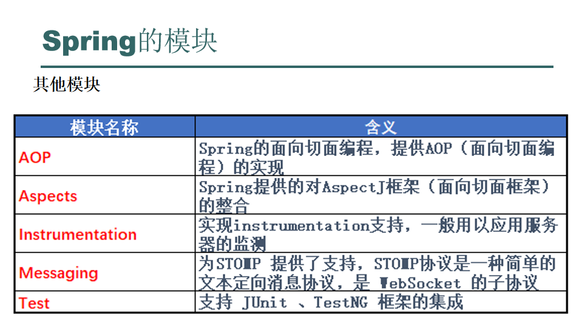
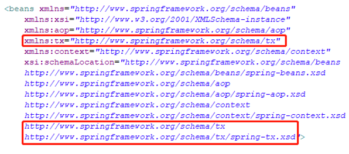

# 概述与模块划分


## 核心容器模块(Core Container)


## 封装集成数据访问模块(Data Access/Integration)


## Web开发模块


## 其它模块


# Spring的核心
* Spring是一个生态体系，其中自己开发了很多模块，也集成了很多的框架。在整个的生态体系中，有一部分是所有模块以及集成的框架都需要使用的，这个部分就是spring的核心容器（Core Container），也是spring的基础。
* 核心概念:
  1. 容器(Container)，存放对象，bean
  2. IoC(控制反转)，对象由Spring容器来创建并存放，创建的对象的生命周期由Spring容器来管理。IoC最大的作用是解耦(解程序员与对象创建的耦)
* Spring的绝大部分功能都是在容器和IoC（控制反转），的基础上发展出来的。

# Spring的继承环境搭建
* 如果想要把spring生态体系用起来，必须要先搭建基础环境。
1. 下载spring5相关jar
   * 网址`https://repo.spring.io/libs-release-local/org/springframework/spring/`
   * 选择5.2.2版本，该版本支持jdk的基准版本是jdk8
   * 在`D:\文档\编程\JAVA\求知讲堂Java\day60\资料`中有
2. 创建web工程，导入相关jar
   * 这里commons-logging-1.1.1.jar用于日志输出不是Spring中的jar包
    
3. 编写配置文件:
   * 在src根路径(资源文件夹下也可以)下创建applicationContext.xml
   * xml文件的具体内容:
    ```xml
    <?xml version="1.0" encoding="UTF-8"?>
    <beans xmlns="http://www.springframework.org/schema/beans"
        xmlns:xsi="http://www.w3.org/2001/XMLSchema-instance"
        xsi:schemaLocation="http://www.springframework.org/schema/beans
        http://www.springframework.org/schema/beans/spring-beans.xsd">
        <!-- 上面是beans的一些标签约束 -->
    </beans>
    ```

# Spring创建对象的四种方式
* 注意在**执行完new ClassPathXmlApplicationContext("applicationContext.xml")，实例就已经创建了**，下面的getBean只是获取实例
## 采用默认的无参构造创建实例
```xml
<!-- applicationContext.xml -->
<!--  
id是bean的唯一标识，
class就是当前创建的是哪个类的实例对象(对象全路径)
这个bean是最简单的配置
这种最简单的配置使用类的无参构造创建实例
-->
<bean id="stu" class="com.test.day41.Student"/>
```

```java
// Test.java
/*
加载Spring的配置文件，并且把实例创建出来放到Spring容器中
注意:执行完new ClassPathXmlApplicationContext("applicationContext.xml");
Spring配置文件的bean已经存在了
*/
ApplicationContext ctx = new ClassPathXmlApplicationContext("applicationContext.xml");

//从容器中获取bean,根据bean标签的id从容器中拿到bean实例
Student stu = (Student) ctx.getBean("stu");
System.out.println(stu);
```

## 采用有参构造创建实例
```xml
<!-- applicationContext.xml -->
<bean id="stu1" class="com.test.day41.Student">
<!--
构造方法的参数:
index:参数位，从0开始，0代表第一个参数
name:参数名,要与构造函数中参数名一致
type:参数类型
value:参数值

注意，可以通过参数位和对应的参数类型来确定具体调用的是类中的哪个构造方法
-->
<constructor-arg index="0" name="name" type="java.lang.String" value="李四"/>
<constructor-arg index="1" name="age" type="int" value="24"/>
</bean>
```

```java
// Test.java
/*
加载Spring的配置文件，并且把实例创建出来放到Spring容器中
注意:执行完new ClassPathXmlApplicationContext("applicationContext.xml");
Spring配置文件的bean已经存在了
*/
ApplicationContext ctx = new ClassPathXmlApplicationContext("applicationContext.xml");
System.out.println("---------------------------------------");

//从容器中获取bean,根据bean标签的id从容器中拿到bean实例
// Student stu = (Student) ctx.getBean("stu");
Student stu = (Student) ctx.getBean("stu1");
System.out.println(stu);
```
* 用于证明对象在执行new ClassPathXmlApplicationContext("applicationContext.xml");便已经创建


## 采用静态工厂来创建实例
```java
// StudentFactory.java
public class StudentFactory {
    public static Student newInstance() {
        return new Student();
    }
}
```

```xml
<!-- applicationContext.xml -->
<!--
通过工厂的静态方法创建bean
class:工厂的全类名
factory-method:工厂类的方法名，这个方法是生成bean实例的静态方法
-->
<bean id="stu2" class="com.test.day41.StudentFactory" factory-method="newInstance"/>
```

```java
Student stu = (Student) ctx.getBean("stu2");
```

## 通过实例工厂的方式来创建实例

```java
// StudentFactory.java
public class StudentFactory {
    public Student getStudent(int studentAge, String studentName) {
        return new Student(studentName, studentAge);
    }
}
```

```xml
<!-- applicationContext.xml -->
<!--
创建工厂的实例bean
-->
<bean id="studentFactory" class="com.test.day41.StudentFactory"/>

<!--
使用工厂的bean实例创建student对象
factory-bean:使用工厂的实例bean的id
factory-method:工厂实例的普通创建对象的方法
-->
<bean id="stu3" factory-bean="studentFactory" factory-method="getStudent">
    <constructor-arg index="0" value="25"/>
    <constructor-arg index="1" value="王五"/>
</bean>
```

# 四种创建方式的应用场景
1. 无参和有参构造创建实例:本质是把类交给Spring自带的工厂(BeanFactory)管理、由Spring自带的工厂模式帮我们维护和创建这个类的实例，多用于开发过程中自己编写的类
2. 静态工厂创建实例:Spring只是帮我们调用了静态工厂创建实例的方法，而创建实例的这个过程是由我们自己的静态工厂实现的。在实际的开发过程中，很多时候我们需要用到第三方jar包提供给我们的类，而这个类没有构造方法，而是通过第三方包提供的静态工厂创建的，这个时候就可以使用静态工厂配置创建实例
3. 实例工厂创建实例:其本质就是创建实例的工厂类交给Spring管理，同时把调用工厂类的方法创建实例的这个过程也交由Spring管理，在实际开发过程中，Spring整合框架如mybatis就是通过这个方式实现的。

# Spring给bean的属性赋值
* 注意:**想要用Spriing给bean的属性赋值，这些属性必须要有setter方法**
* 格式:
  ```xml
  <!--
  给普通属性赋值，
  基本数据类型极其封装类
  以及String
  -->
  <bean ....>
    <property name="属性名" value="属性值 "/>
  </bean>
  <!-- 
  给数组、list、set赋值
  对应的xxx分别位
  array、list、set
  -->
  <bean ...>
      <property name="属性名">
          <xxx>
            <value>第一个元素值</value>
            ......
          </xxx>
      </property>
  </bean>
  <!--
  给map赋值
  -->
  <bean ...>
      <property name="属性名">
          <map>
            <entry key="键值1" value="值1" />
            ......
          </map>
      </property>
  </bean>
  ```
## 举例
```java
// Student.java
public class Student {
    public String name = "张三";
    public int age = 21;

    private String[] strs;
    private List<String> list;
    private Set<Integer> set;
    private Map<String, String> map;

    public void setName(String name) {
        this.name = name;
    }

    public void setAge(int age) {
        this.age = age;
    }

    public void setStrs(String[] strs) {
        this.strs = strs;
    }

    public void setList(List<String> list) {
        this.list = list;
    }

    public void setSet(Set<Integer> set) {
        this.set = set;
    }

    public void setMap(Map<String, String> map) {
        this.map = map;
    }

    public Student() {
    }

    @Override
    public String toString() {
        return "Student{" +
                "name='" + name + '\'' +
                ", age=" + age +
                ", strs=" + Arrays.toString(strs) +
                ", list=" + list +
                ", set=" + set +
                ", map=" + map +
                '}';
    }
}
```

```xml
<!-- applicationContext.xml -->
<bean id="stu4" class="com.test.day41.Student">
    <property name="name" value="Lucy"/>
    <property name="age" value="35" />
    <property name="strs">
        <array>
            <value>数组1</value>
            <value>数组2</value>
            <value>数组3</value>
        </array>
    </property>
    <property name="list">
        <list>
            <value>列表1</value>
            <value>列表2</value>
            <value>列表3</value>
        </list>
    </property>
    <property name="set">
        <set>
            <value>111</value>
            <value>222</value>
            <value>333</value>
        </set>
    </property>
    <property name="map">
        <map>
            <entry key="键1" value="值1"/>
            <entry key="键2" value="值2"/>
            <entry key="键3" value="值3"/>
        </map>
    </property>
</bean>
```

```java
Student stu = (Student) ctx.getBean("stu4");
System.out.println(stu);
```
```java
// 输出
Student{name='Lucy', age=35, strs=[数组1, 数组2, 数组3], list=[列表1, 列表2, 列表3], set=[111, 222, 333], map={键1=值1, 键2=值2, 键3=值3}}
```

# Spring给bean的对象类型属性赋值，需要用到DI
* DI:依赖注入，当一个类(A)中的属性需要依赖另一个类(B)对象时，把B赋值给A的属性的过程就叫依赖注入。依赖注入的属性要有setter方法
* 主要使用了ref标签，ref的标签值位依赖的类的bean的id值

## 举例
* 包含一个直接给属性赋值和一个用构造函数给属性赋值的例子
```java
// Dept.java
public class Dept {
    private Integer deptId;
    private String deptName;

    public void setDeptId(Integer deptId) {
        this.deptId = deptId;
    }

    public void setDeptName(String deptName) {
        this.deptName = deptName;
    }

    public Dept() {
    }

    public Dept(Integer deptId, String deptName) {
        this.deptId = deptId;
        this.deptName = deptName;
        System.out.println("------正在创建Dept对象:" + this + "------");
    }

    @Override
    public String toString() {
        return "Dept{" +
                "deptId=" + deptId +
                ", deptName='" + deptName + '\'' +
                '}';
    }
}
```

```java
// Emp.java
public class Emp {
    private String empName;
    private Dept dept;

    public void setEmpName(String empName) {
        this.empName = empName;
    }

    public void setDept(Dept dept) {
        this.dept = dept;
    }

    public Emp() {
    }

    public Emp(String empName, Dept dept) {
        this.empName = empName;
        this.dept = dept;
        System.out.println("------正在创建Emp对象:" + this + "------");
    }

    @Override
    public String toString() {
        return "Emp{" +
                "empName='" + empName + '\'' +
                ", dept=" + dept +
                '}';
    }
}
```

```xml
<!-- applicationContext.xml -->
<!--
使用ref(引用)来给对象类型属性赋值
-->
<bean name="dept" class="com.test.day41.Dept">
    <property name="deptId" value="1"/>
    <property name="deptName" value="软件开发部门"/>
</bean>

<bean name="emp" class="com.test.day41.Emp">
    <property name="empName" value="张三"/>
    <property name="dept" ref="dept"/>
</bean>

<!--
使用构造函数
-->
<bean name="dept1" class="com.test.day41.Dept">
    <constructor-arg name="deptId" type="java.lang.Integer" index="0" value="2"/>
    <constructor-arg name="deptName" type="java.lang.String" index="1" value="销售部门"/>
</bean>

<bean name="emp1" class="com.test.day41.Emp">
    <constructor-arg index="0" name="empName" type="java.lang.String" value="李四"/>
    <constructor-arg index="1" name="dept" type="com.test.day41.Dept" ref="dept1"/>
</bean>
```

# bean标签的其它属性
## scope属性
* 设置当前bean是单例还是多例
* 值是:
  * singleton(单例),默认值
  * prototype(多例)
* 主要影响的是对应引用该类的时候是共用一个对象还是再创建一个对象

### 举例
```xml
<!-- applicationContext.xml -->
<!--  测试scope属性  -->
<bean name="emp2" class="com.test.day41.Emp">
    <constructor-arg index="0" name="empName" type="java.lang.String" value="scope1"/>
    <constructor-arg index="1" name="dept" type="com.test.day41.Dept" ref="dept2"/>
</bean>

<bean name="emp3" class="com.test.day41.Emp">
    <constructor-arg index="0" name="empName" type="java.lang.String" value="scope2"/>
    <constructor-arg index="1" name="dept" type="com.test.day41.Dept" ref="dept2"/>
</bean>

<bean name="dept2" class="com.test.day41.Dept" scope="prototype">
    <constructor-arg name="deptId" type="java.lang.Integer" index="0" value="3"/>
    <constructor-arg name="deptName" type="java.lang.String" index="1" value="运维部门"/>
</bean>
```

```java
ApplicationContext ctx = new ClassPathXmlApplicationContext("applicationContext.xml");
System.out.println("--------------------------------");
Emp emp = (Emp) ctx.getBean("emp2");
Emp emp1 = (Emp) ctx.getBean("emp3");
System.out.println(emp.getDept().hashCode());
System.out.println(emp1.getDept().hashCode());
```

```java
// 输出
------正在创建Dept对象:Dept{deptId=3, deptName='运维部门'}------
------正在创建Emp对象:Emp{empName='scope1', dept=Dept{deptId=3, deptName='运维部门'}}------
------正在创建Dept对象:Dept{deptId=3, deptName='运维部门'}------
------正在创建Emp对象:Emp{empName='scope2', dept=Dept{deptId=3, deptName='运维部门'}}------
--------------------------------
1511785794
963601816
```

## init-method和destroy-method方法
* 创建文bean对象后执行的bean的方法
* 容器销毁bean对象时调用的bean的方法，**只对单例对象有效**
```java
// User.java
public class User {
    private String beanId;

    public User(String beanId) {
        this.beanId = beanId;
        System.out.println("------生成User:" + this.beanId +
                "对象------");
    }

    public void init() {
        System.out.println("------初始化User:" + beanId +
                "对象------");
    }

    public void destroy() {
        System.out.println("------销毁User:" + beanId +
                "对象");
    }

}
```
```xml
<!-- applicationContext.xml -->
<!--  测试init-method和destroy-method  -->
<bean name="user1" class="com.test.day41.User" init-method="init" destroy-method="destroy">
    <constructor-arg index="0" name="beanId" type="java.lang.String" value="user1"/>
</bean>
<bean name="user2" class="com.test.day41.User" init-method="init" destroy-method="destroy">
    <constructor-arg index="0" name="beanId" type="java.lang.String" value="user2"/>
</bean>
```
```java
ClassPathXmlApplicationContext ctx = new ClassPathXmlApplicationContext("applicationContext.xml");
System.out.println("--------------------------------");
ctx.close();
```
```java
// 结果
------生成User:user1对象------
------初始化User:user1对象------
------生成User:user2对象------
------初始化User:user2对象------
--------------------------------
------销毁User:user2对象
------销毁User:user1对象
```

## lazy-init属性
* 是否延迟创建bean
* 值:
  * true，会在第一次从spring容器获取bean时创建bean。
  * false,默认，容器加载bean配置后直接创建bean
* 只对单例对象有效

```java
// LazyDemo.java
public class LazyDemo {
    public LazyDemo() {
        System.out.println("------创建LazyDemo------");
    }
}
```

```java
ClassPathXmlApplicationContext ctx = new ClassPathXmlApplicationContext("applicationContext.xml");
System.out.println("--------------------------------");
System.out.println(ctx.getBean("lazy").hashCode());
System.out.println(ctx.getBean("lazy").hashCode());
```

* 如果是不延迟
```xml
<!--  测试lazy-init  -->
<bean id="lazy" class="com.test.day41.LazyDemo"/>
```
```java
// 结果
------创建LazyDemo------
--------------------------------
1596467899
1596467899
```
* 如果延迟
```xml
<!--  测试lazy-init  -->
<bean id="lazy" class="com.test.day41.LazyDemo" lazy-init="true"/>
```
```java
// 结果
--------------------------------
------创建LazyDemo------
1596467899
1596467899
```
* 如果是是多例
```xml
<!--  测试lazy-init  -->
<bean id="lazy" class="com.test.day41.LazyDemo" lazy-init="false" scope="prototype"/>
```
```java
// 结果
--------------------------------
------创建LazyDemo------
1596467899
------创建LazyDemo------
377478451
```
* 发现:**如果bean是多例，那么bean只会在被获取(或者引用)时创建,不会在加载bean配置时创建**

# AOP
* 如何在不侵入java方法代码的前提下，扩展增强这个Java方法

* 解决方案:代理模式
  * 代理模式，是为了方便我们将一些非业务的东西或者公共的处理抽取出来，与业务代码解耦，不侵入原代码取强化类功能，如日志的记录或者一些功能的加强
  * 代理模式分静态代理和动态代理两种

## 静态代理
* 在运行前代理类的class文件已经存在
* 实现思路:
  1. 代理类继承原有类，重写原有类的方法，在重写的方法中调用父类的方法，在调用前后加入扩展的逻辑
  ```java
  // Person.java
  public class Person {
      public void run() {
          System.out.println("执行了run方法");
      }
  }
  ```
  ```java
  // PersonStaticProxy.java
  public class PersonStaticProxy extends Person{
      @Override
      public void run() {
          System.out.println("run执行前");
          super.run();
          System.out.println("run执行后");
      }
  }
  ```
  2. 代理类与原有类实现相同的接口，原有类对象作为代理类的属性，通过代理类的构造方法把原有类对象赋值给代理类的属性，代理类方法调用原有类对象的同名方法，并且在调用原有类对象的同名方法前后加入扩展逻辑，使用时使用接口接收代理类对象。

  ```java
  // MathematicsDao.java
  public interface MathematicsDao {
      public void add(int a, int b);
  }
  ```
  ```java
  // MathematicsImp.java
  public class MathematicsImp implements MathematicsDao{
      @Override
      public void add(int a, int b) {
          System.out.println(a + " + " + b + " = " + (a + b));
      }
  }
  ```
  ```java
  // MathematicsProxy.java
  public class MathematicsProxy implements MathematicsDao{
      MathematicsImp mathematicsImp;

      public MathematicsProxy(MathematicsImp mathematicsImp) {
          this.mathematicsImp = mathematicsImp;
      }

      @Override
      public void add(int a, int b) {
          System.out.println("add方法执行前");
          mathematicsImp.add(a, b);
          System.out.println("add方法执行后");
      }
  }
  ```
  ```java
  MathematicsDao m = new MathematicsProxy(new MathematicsImp());
  m.add(1, 2);
  ```
* 以上静态代理的方法虽然虽然完成目标，但是很繁琐。例如：有一百个类，需要在每个类的方法前输出"xx方法将执行"，就会非常的繁琐。


## 动态代理

* 代理面向的是方法
### JDK动态代理
```java
/**
 * 实现InvocationHandler
 * 这个类就是一个动态处理器
 * 作用是规定对指定的方法做什么样的扩展
 */
public class DemoProxyHandler implements InvocationHandler {
    //代理的目标对象，也就是要扩展的方法所属的对象
    private Object object;

    public DemoProxyHandler(Object object) {
        this.object = object;
    }

    /**
     * @param proxy
     * @param method 要扩展的方法
     * @param args 要扩展的方法的参数
     * @return 返回代理的方法的返回值
     * @throws Throwable
     */
    @Override
    public Object invoke(Object proxy, Method method, Object[] args) throws Throwable {
        System.out.println(method.getName() + "执行前");
        Object res = method.invoke(object, args);
        System.out.println(method.getName() + "执行后");
        return res;
    }
}
```
```java
/*
能被jdk动态代理的类得是实现了接口的类
例如给MathematicsImp类做扩展
  */
MathematicsDao m = new MathematicsImp();

//动态处理器
DemoProxyHandler dp = new DemoProxyHandler(m);

/*
动态创建代理类
参数1:ClassLoader指定当前被代理对象的类加载器
参数2:Class<?>[]被代理的目标对象的接口
参数3:InvocationHandler指定的动态处理器

返回值可以用被代理的类的接口类型的变量接收(要强转一次)
  */
MathematicsDao mm = (MathematicsDao) Proxy.newProxyInstance(MathematicsImp.class.getClassLoader(),
        MathematicsImp.class.getInterfaces(),
        dp);
mm.add(1, 2);
```

### 使用cglib动态代理
* 使用cglib需要导入cglib的jar包,位于`D:\文档\编程\JAVA\求知讲堂Java\day62\资料`
* cglib采用了非常底层的字节码技术，其原理是通过字节码技术为一个类**创建子类**，并在子类中采用方法拦截的技术拦截所有父类方法的调用，顺势织入横切逻辑。

```java
/**
 * 动态代理的处理器
 * 规定对被代理的目标对象的方法进行上面样的扩展
 */
public class CglibProxyHandler implements MethodInterceptor {


    /**
     * 根据被代理的目标对象返回其代理对象
     * 这个过程也可以写在外面
     * @param target 被代理的方法属于的对象
     * @return 返回被代理后的方法属于的对象，相当于被代理对象的子类对象
     */
    public Object getInstance(Object target) {

        //创建加强器，用于创建代理类
        Enhancer enhancer = new Enhancer();
        /*
        cglib是通过继承父类的方式实现的动态代理
        这里的父类指的就是被代理的目标对象的类
        继承被代理的目标对象的类就是动态代理类
        这个地方的参数要填父类也就是被代理的目标对象的类的class
         */
        enhancer.setSuperclass(target.getClass());

        /*
        这个方法叫设置回调
        实际上就设置对被代理目标对象的方法进行进行怎样的扩展
        这个方法需要的参数是一个实现了MethodInterceptor接口的对象
        MethodInterceptor的intercept方法就是定义对被代理目标对象的方法进行怎样的扩展
        类似jdk动态代理的invoke方法的作用
         */ 
        enhancer.setCallback(this);

        //创建动态代理类的对象并放回
        return enhancer.create();
    }

    /**
     * 这个方法就是真正对被代理目标对象的方法的扩展
     * @param o 加强器对象Enhancer
     * @param method 被代理的目标对象的方法，也就是要被扩展的方法
     * @param objects 该方法的参数
     * @param methodProxy 被代理的目标对象的方法的代理方法
     */
    @Override
    public Object intercept(Object o, Method method, Object[] objects, MethodProxy methodProxy) throws Throwable {
        Object res = null;
        System.out.println(method.getName() + "方法执行前");
        try {
            //相当于调用原方法
            res = methodProxy.invokeSuper(o, objects);
        } catch (Exception e) {
            e.printStackTrace();
            System.out.println(method.getName() + "方法执行异常");
        }
        System.out.println(method.getName() + "方法执行后");

        return res;
    }
}
```

```java
public class Person {
    public void run() {
        System.out.println("执行了run方法");
    }

    public void testError(String errorMsg) throws Exception {
        throw new Exception(errorMsg);
    }
}
```

```java
CglibProxyHandler cp = new CglibProxyHandler();
Person p = (Person) cp.getInstance(new Person());
p.testError("这是一个报错");
```

### JDK与Cglib代理对比
1. JDK只能针对有接口的类的接口方法进行代理
2. Cglib基于继承的方式实现代理，因此无法对static、final类进行代理
3. Cglib无法对private、sataic方法进行代理

## AOP简介
* AOP （Aspect-Oriented Programming）面向切面编程。
* AOP是一种编程思想，关注的是方法，是对具体的方法的拓展与分层（不侵入式的扩展），便于开发和维护。
* 代理模式是对AOP的一种具体实现
* AOP中的一些概念:
  1. Aspect(切面)：是一个类，是定义对具体的方法怎样进行拓展与分层。
  2. joinpoint(连接点)：要进行拓展与分层的方法。
  3. Pointcut(切入点)：在何时（如：方法执行前后）进行拓展分层。
  4. Advice(通知)：切面类中具体执行拓展分层的方法。
  5. Target(目标对象)：要被拓展分层的那个方法所属的对象。
  6. Weave(织入)：将aspects切面应用到target对象的过程。

# Spring AOP
* Spring AOP是一个基于动态代理的AOP框架。运行时通过创建目标对象的代理类，对目标对象进行增强，主要使用JDK动态代理和CGLIB代理的方式。
* Spring AOP框架使用起来要比直接自己使用JDK动态代理和CGLIB代理简单。
* 实现方式:
  1. xml配置
  2. 注解模式
* 需要jar包:
  1. aopalliance-1.0.jar
  2. aspectjweaver-1.7.2.jar
  3. spring-aop-5.2.2.RELEASE.jar
  4. spring-aspects-5.2.2.RELEASE.jar
  * 这些包在`D:\文档\编程\JAVA\求知讲堂Java\day62\资料\spring AOP的jar`
  * 前两个包不属于Spring包下

## Spring AOP具体实现
1. 编写通知类
```java
/**
 * spring的通知Advice类
 * 这个类的方法就是具体执行目标对象的方法进行怎样的扩展
 * 通知Advice类就是切面Aspect
 */
public class MyMethodAdvices {
    /**
     * 学名叫前置通知，就是在方法前执行
     * @param jp 连接点，要进行拓展与分层的方法
     */
    public void before(JoinPoint jp) {
        System.out.println("前置通知");
    }


    public void after(JoinPoint jp) {
        System.out.println("后置通知");
    }

    /**
     * 返回后通知，就是返回值返回后
     * @param jp 连接点
     * @param obj 连接点的返回值
     */
    public void afterReturning(JoinPoint jp, Object obj) {
        System.out.println("返回后通知，返回值:" + obj);
    }

    /**
     * 异常通知，在方法出现异常时的通知
     * @param jp 连接点
     * @param ex 连接点的异常
     */
    public void afterThrowing(JoinPoint jp, Exception ex) {
        System.out.println("异常通知, 异常:" + ex.getMessage());
    }

    /**
     * 如果要对一个连接点（要扩展的方法）方法，去扩展几个位置（方法执行前、执行后、异常的时候、返回值情况）
     * 可以在一个通知中完成这4个切入点
     * 这个通知就是环绕通知
     * @param pjp 连接点
     * @return 处理完连接点后的返回值
     */
    public Object around(ProceedingJoinPoint pjp) {
        Object res = null;//声明接收返回值的变量
        try {
            System.out.println("方法执行前逻辑");//相当于单独的前置通知
            res = pjp.proceed();//原样执行连接点（要扩展的方法）方法
            System.out.println("方法执行后逻辑，返回值:" + res);//相当于单独的返回后通知
        } catch (Throwable e) {
            System.out.println("方法执行异常");//相当于单独的异常通知
            e.printStackTrace();
        }
        System.out.println("返回后逻辑");//相当于单独的后置通知
        return res;
    }
}
```

2. 修改Spring配置文件

   1. 添加约束
    
    ```xml
    <beans xmlns="http://www.springframework.org/schema/beans"
        xmlns:xsi="http://www.w3.org/2001/XMLSchema-instance"
        xmlns:aop="http://www.springframework.org/schema/aop"
        xsi:schemaLocation="http://www.springframework.org/schema/beans
            http://www.springframework.org/schema/beans/spring-beans.xsd
            http://www.springframework.org/schema/aop
            http://www.springframework.org/schema/aop/spring-aop.xsd">
    ```
    2. 添加AOP配置
    

    ```xml
    <!--  创建通知类的bean对象  -->
    <bean id="myMethodAdvices" class="com.test.day43.MyMethodAdvices"/>

    <!--  AOP配置  -->
    <aop:config>
        <!--
        切入点表达式，定义我们给哪些类的哪些方法去做AOP处理
        execution(* com.test.day43.aop.*.*(..))解释:
        com.test.day43.aop包下所有类的任意方法（包含有参无参的），方法返回值类型任意（有无返回值都可以）
        第一个*:返回值类型，*代表任意
        第二个*:通配符，代表任意字符串，这里在方法(第三个*)前，表示类，例如UserDao*就是UserDao开头的任意类
        第三个*:在(..)前的*代表任意方法,*是任意字符串，例如A*就是以A开头的方法名，*A就是以A结尾的方法名
        (..):表示任意的参数类型
        -->
        <aop:pointcut id="pt" expression="execution(* com.test.day43.aop.*.*(..))"/>

        <!--    定义切面，用哪个bean做切面    -->
        <aop:aspect ref="myMethodAdvices">
            <!--
            前置通知
            method:切面对应的方法
            pointcut-ref:给哪些类的哪些方法做前置通知的扩展，值是切入点表达式的id
            -->
            <aop:before method="before" pointcut-ref="pt"/>
            <!-- 后置通知 -->
            <aop:after method="after" pointcut-ref="pt"/>
            <!--
            异常通知
            throwing的属性值是method属性对应方法的Exception类型参数名
            -->
            <aop:after-throwing method="afterThrowing" pointcut-ref="pt" throwing="ex" />
            <!--
            返回后通知
            returning属性的值，是method属性对应方法的Object类型参数参数名
            -->
            <aop:after-returning method="afterReturning" pointcut-ref="pt" returning="obj"/>
            <!-- 环绕通知 -->
            <aop:around method="around" pointcut-ref="pt"/>
        </aop:aspect>
    </aop:config>
    ```
      * 关于环绕通知:
        * 环绕通知可以自己定义集合前四种通知，对四种通知任意组合使用
        * 如果既配置了环绕通知又配置了其它四种通知，那么环绕通知将在前置通知后，后置通知和返回后通知前执行
        * 如果环绕通知中做了异常捕获处理，没有异常抛出，异常通知就步执行
        * 由于环绕通知会与之前的4种通知（前置、后置、返回后、异常）功能有重叠，所以一般不会与之前四种通知重复使用
        * spring aop的底层是jdk和cglib，环绕通知就相当于jdk动态代理的invoke方法或者cglib动态代理的intercept方法


## JoinPoint参数的常用API
```java
public class MyAspect {
    public void before(JoinPoint jp) {
        printJp(jp);
    }

    /**
     * 打印jp的常用API
     */
    private void printJp(JoinPoint jp) {
        System.out.println("被代理对象:" + jp.getTarget());
        System.out.println("代理对象:" + jp.getThis());
        System.out.println(jp.getTarget() == jp.getThis());
        System.out.println("目标方法名:" + jp.getSignature().getName());
        System.out.println("目标方法所属类的简单类名:" + jp.getSignature().getDeclaringType().getSimpleName());
        System.out.println("目标方法所属类的类名:" + jp.getSignature().getDeclaringTypeName());
        //这里jp.getSignature().getModifiers()返回的是个int类型，要经过Modifier.toString方法转化
        System.out.println("目标方法声明的类型:" + Modifier.toString(jp.getSignature().getModifiers()));
        //传入目标方法的参数
        Object[] args = jp.getArgs();
        int i = 1;
        for (Object arg : args) {
            System.out.println("第" + i + "个参数是:" + arg);
            i++;
        }
    }
}
```

```java
ApplicationContext ac = new ClassPathXmlApplicationContext("day44/applicationContext.xml");

Student stu = (Student) ac.getBean("stu");
System.out.println(stu.stuInfo("张三", "四", "三"));
```

```java
//输出
被代理对象:com.test.day44.aop.Student@7334aada
代理对象:com.test.day44.aop.Student@7334aada
false
目标方法名:stuInfo
目标方法所属类的简单类名:Student
目标方法所属类的类名:com.test.day44.aop.Student
目标方法声明的类型:public
第1个参数是:张三
第2个参数是:四
第3个参数是:三
四年级三班张三
```

## ProceedingJoinPoint的常用API
* ProceedingJoinPoint是JoinPoint的子类，所以JoinPoint的方法ProceedingJoinPoint也可以使用
* 主要是proceed方法极其重载方法的使用
  * proceed():执行原样的目标方法，不管目标方法有没有参数
  * proceed(Object[] args):修改参数执行目标方法

```java
public class MyAspect {
    public void before(JoinPoint jp) {
//        printJp(jp);
    }

    public Object around(ProceedingJoinPoint pjp) {
        Object res = null;
        try {
            Object[] returns = pjp.getArgs();
            returns[0] = "李四";
            res = pjp.proceed(returns);
        } catch (Throwable e) {
            e.printStackTrace();
        }
        printJp(pjp);
        return res;
    }

    /**
     * 打印jp的常用API
     */
    private void printJp(JoinPoint jp) {
        System.out.println("被代理对象:" + jp.getTarget());
        System.out.println("代理对象:" + jp.getThis());
        System.out.println(jp.getTarget() == jp.getThis());
        System.out.println("目标方法名:" + jp.getSignature().getName());
        System.out.println("目标方法所属类的简单类名:" + jp.getSignature().getDeclaringType().getSimpleName());
        System.out.println("目标方法所属类的类名:" + jp.getSignature().getDeclaringTypeName());
        //这里jp.getSignature().getModifiers()返回的是个int类型，要经过Modifier.toString方法转化
        System.out.println("目标方法声明的类型:" + Modifier.toString(jp.getSignature().getModifiers()));
        //传入目标方法的参数
        Object[] args = jp.getArgs();
        int i = 1;
        for (Object arg : args) {
            System.out.println("第" + i + "个参数是:" + arg);
            i++;
        }
    }
}
```
## Spring AOP具体实现 对之前学习的JDBC进行改进

* 通过AOP可以实现核心业务逻辑代码与外围代码的分离
* 尤其是在多个方法中外围代码重复的情况下
* 把外围代码提出来放到通知的方法中
* 目标方法本身只保留自己独特的核心业务逻辑就可以
* 这样大大简化了开发

<br>

* 例如:简化下面这段JDBC代码:
```java
public class JDBCDemo {
    private static String url = "jdbc:mysql://localhost:3306/demo?useUnicode=true&characterEncoding=utf-8";
    private static String user = "root";
    private static String password = "root";
    private Connection coon = null;
    private PreparedStatement pst = null;

    static {
        // 加载mysql数据库驱动
        try {
            Class.forName("com.mysql.jdbc.Driver");
        } catch (ClassNotFoundException e) {
            e.printStackTrace();
        }
    }

    public int[] updateAccount() {
        int[] is = null;
        try {
            coon = DriverManager.getConnection(url, user, password);
            //设置手动提交事务
            coon.setAutoCommit(false);
            pst = coon.prepareStatement("");

            pst.addBatch("update account set money = 601 where id = 1;");
            pst.addBatch("update account set money = 1401 where id = 2;");

            is = pst.executeBatch();

            coon.commit();
            pst.clearBatch();

        } catch (Exception e) {
            try {
                coon.rollback();
            } catch (SQLException ex) {
                ex.printStackTrace();
            }
            e.printStackTrace();
        } finally {
            try {
                coon.close();
                pst.close();
            } catch (SQLException e) {
                e.printStackTrace();
            }
        }
        return is;
    }

}
```
* 主要的逻辑代买是输入sql语句，其他的都可以提到外面

* 创建切面:
```java
public class JDBCAspect {
    public Object around(ProceedingJoinPoint pjp) {
        Object result = null;
        // 获取目标对象
        JDBCDemo jdbcDemo = (JDBCDemo) pjp.getTarget();
        try {
            jdbcDemo.coon = DriverManager.getConnection(JDBCDemo.getUrl(), JDBCDemo.getUser(), JDBCDemo.getPassword());
            jdbcDemo.coon.setAutoCommit(false);
            result = pjp.proceed();
            jdbcDemo.coon.commit();
        } catch (Throwable e) {
            try {
                jdbcDemo.coon.rollback();
            } catch (SQLException ex) {
                ex.printStackTrace();
            }
            e.printStackTrace();
        } finally {
            try {
                jdbcDemo.coon.close();
                jdbcDemo.pst.close();
            } catch (SQLException e) {
                e.printStackTrace();
            }
        }
        return result;
    }
}
```

* 修改JDBCDemo
```java
public class JDBCDemo {
    private static String url = "jdbc:mysql://localhost:3306/demo?useUnicode=true&characterEncoding=utf-8";
    private static String user = "root";
    private static String password = "root";
    public Connection coon = null;
    public PreparedStatement pst = null;

    public static String getUrl() {
        return url;
    }

    public static String getUser() {
        return user;
    }

    public static String getPassword() {
        return password;
    }


    static {
        // 加载mysql数据库驱动
        try {
            Class.forName("com.mysql.jdbc.Driver");
        } catch (ClassNotFoundException e) {
            e.printStackTrace();
        }
    }

    public int[] updateAccount() throws SQLException {

        pst = coon.prepareStatement("");

        pst.addBatch("update account set money = 1000 where id = 1;");
        pst.addBatch("update account set money = 2000 where id = 2;");

        int[] is = pst.executeBatch();

        pst.clearBatch();

        return is;
    }

}
```

* 修改配置文件
```xml
<bean id="jdbcAspect" class="com.test.day44.JDBCAspect"/>
<aop:config>
    <aop:pointcut id="jdbcPt" expression="execution(* com.test.day44.JDBCDemo.*(..))"/>
    <aop:aspect ref="jdbcAspect">
        <aop:around method="around" pointcut-ref="jdbcPt"/>
    </aop:aspect>
</aop:config>
<bean id="jdbcDemo" class="com.test.day44.JDBCDemo"/>
```

* 测试
```java
ApplicationContext ac = new ClassPathXmlApplicationContext("day44/applicationContext.xml");

JDBCDemo jdbcDemo = (JDBCDemo) ac.getBean("jdbcDemo");
try {
    int[] is = jdbcDemo.updateAccount();
    System.out.println(Arrays.toString(is));
} catch (SQLException e) {
    e.printStackTrace();
}
```

* 注意:
  * 将JDBC中coon的赋值、设置手动提交，手动提交、回滚、关闭连接等方法提取出来后，JDBCDemo的方法就变得非常简洁，如果想要添加新的方法(比如向数据库中插入数据)也会非常的方便。
  * 在写这段代码的时候发现一个问题:**当一个属性是null的时候，传递该属性时将不会传递该属性的地址**，例如coon设置的是null，将coon传递到环绕通知时，在环绕通知中修改coon，JDBCDemo中的coon将依旧是null(类似于基本数据类型的值传递)。


# Spring 注解
1. 添加约束:

```xml
<beans xmlns="http://www.springframework.org/schema/beans"
       xmlns:xsi="http://www.w3.org/2001/XMLSchema-instance"
       xmlns:aop="http://www.springframework.org/schema/aop"
       xmlns:context="http://www.springframework.org/schema/context"
       xsi:schemaLocation="http://www.springframework.org/schema/beans
        http://www.springframework.org/schema/beans/spring-beans.xsd
        http://www.springframework.org/schema/aop
        http://www.springframework.org/schema/aop/spring-aop.xsd
        http://www.springframework.org/schema/context
        http://www.springframework.org/schema/context/spring-context.xsd">
```

2. 开启注解扫描，指定扫描包的范围，写在配置文件开头
```xml
<!--
开启注解扫描
base-package属性是包名
例如base-package="com"，就是扫描com包及其子孙包（n代子孙包）里面所有的类
以我们当前的项目包名来说，就是扫描项目所有的类了
-->
<context:component-scan base-package="com"/>
```

## 注册bean
* 注册bean的注解，相当于在文件中配置bean标签
* 如果没有设置参数那么bean的id值默认为首字母小写的类名
* 如果如果设置了参数，那么就是类名
* 主要有四种:
  1. @Component:注册普通的bean，在三层架构中不是任何一层的
  2. @Repository:注册数据访问层的bean
  3. @Controller:注册表现层Controller的bean
  4. @Service:注册业务逻辑层的bean
  * 以上四个注解事在开发的逻辑上做了区分，就像mybatis的底层，insert、update、delete标签在底层代码是一致的(都是最终走到update方法，认为是写的操作)

## Autowired依赖注入
```java
/**
* @Autowired可以做依赖注入，是spring提供的注解
* 1、根据属性的类型注入bean
* 2、如果有多个同样类型的bean，就按照bean的id注入（找与属性名相同的id的bean）
* 3、如果有多个同样类型的bean，与属性名相同的id的bean也找不到，报异常No qualifying bean of type。。。。
* 4、如果出现第3步的情况，可以结合@Qualifier("bean的id")注解，指定注入相应id的bean
*/
@Autowired
@Qualifier("myDept01")
public MyDept myDept02;
```

## Resource依赖注入
```java
/**
* @Resource注解，依赖注入，是J2EE提供的，和spring没有关系，与spring是解耦合的
* 1、默认根据id注入，找与属性名一致的id的bean
* 2、当找不到与属性名一致的id的bean，找与属性类型一致的bean
* 3、如果没有属性名一致的id的bean，也没有与属性类型一致的bean，就报异常
* 4、当按照第2个步骤走的时候，如果有多个类型一样的bean，报错No qualifying bean of type。。。
* 
* 可以使用name属性指定注入哪个bean，name的值就是bean的id
* 使用type的属性指定注入的bean，type的值就是bean的类型
* 可以name和type一起用，找到容器中唯一对应的bean注入
*/
//	@Resource
//	@Resource(name="family01")
//	@Resource(type=Family.class)
@Resource(name="family01",type=Family.class)
public Family family;
```

### 依赖注入总结
* @Autowired，默认先按byType，如果发现有多个bean，则按照byName方式注入，都找不到报异常。可以结合@Qualifier("")，手动指定按byName方式注入。
* @Resource，默认按byName自动注入,如果找不到再按byType找bean,都找不到则抛异常。可以手动指定bean,它有2个属性分别是name和type，使用name属性，则使用byName的自动注入，而使用type属性时则使用byType自动注入，两个都使用找到容器中name和type都符合的bean。
* @Autowired由Spring提供，@Resource由java本身提供，一般在Spring框架下使用@Autowired即可。

## AOP注解
1. 开启AOP注解扫描，放在注解扫描的下面
```xml
<!--
开启注解扫描
base-package属性是包名
例如base-package="com"，就是扫描com包及其子孙包（n代子孙包）里面所有的类
以我们当前的项目包名来说，就是扫描项目所有的类了
-->
<context:component-scan base-package="com.test.day45"/>

<!--  开启AOP注解扫描  -->
<aop:aspectj-autoproxy/>
```
2. 编写通知类
```java
/**
 * 切面类
 * @Component 组测bean
 * @Aspect 指定当前类为切面类
 */
@Component
@Aspect
public class MyAspect {
    @Before(value = "execution(* com.test.day45.Student.test(..))")
    public void before(JoinPoint jp) {
        System.out.println("前置通知");
    }

    @After(value = "execution(* com.test.day45.Student.test(..))")
    public void after(JoinPoint jp) {
        System.out.println("后置通知");
    }

    @AfterReturning(value = "execution(* com.test.day45.Student.stuName(..))", returning = "result")
    public void afterReturning(JoinPoint jp, Object result) {
        System.out.println("返回后通知,返回值:" + result);
    }

    @AfterThrowing(value = "execution(* com.test.day45.Student.testThrowing(..))", throwing = "ex")
    public void afterThrowing(JoinPoint jp, Exception ex) {
        System.out.println("异常通知,异常:" + ex.getMessage());
    }

    @Around(value = "execution(* com.test.day45.Student.testAround(..))")
    public Object around(ProceedingJoinPoint pjp) {
        Object result = null;
        try {
            System.out.println("执行前逻辑");
            result = pjp.proceed();
            System.out.println("执行后逻辑");
        } catch (Throwable e) {
            System.out.println("异常时逻辑");
            e.printStackTrace();
        }
        return result;
    }
}
```

## SpringAOP和AspectJ的管理
* AspectJ是一个AOP框架
* 在使用Spring AOP时会发现我们导入了很多AspectJ的包

* 实际上Spring AOP为了遵循规范，或者和AspectJ保持兼容，借助了AspectJ的注解风格和AOP联盟定义的部分底层接口，但是Spring AOP并不是通过AspectJ来实现的，原理上Spring AOP和AspectJ没有关系，Spring AOP是靠JDK动态代理和Cglib动态代理来实现的

## Spring AOP实践
* 用于修改bookmis下面的service部分代码，方法中的获取连接、开启事务、提交事务、回滚事务、关闭事务等公共部分使用通知完成，最终Service的开发就剩下调用mapper部分代码。
* 关于Bean的调用可以使用如下代码
```java
public class App {
	private static ApplicationContext ctx = new ClassPathXmlApplicationContext("applicationContext.xml");
	
    // 这里传入要返回的bean参数，就可以不用在返回值再进行一次转化
	public static <T> T getBean(String beanId,Class<T> clazz){
		return (T)ctx.getBean(beanId);
	}
}
```

# Spring 数据访问模块
## 数据源配置
1. 支持jar包:
   * spring-jdbc-5.2.2.RELEASE.jar
   * spring-tx-5.2.2.RELEASE.jar
2. 配置数据源
   * 数据源由Spring管理，一般配置的数据库连接池，例如C3P0
   * 需要C3P0的jar包
   * 以上三个jar包在`D:\文档\编程\JAVA\求知讲堂Java\day64\资料\spring数据库访问支持jar`
    ```xml
    <!--  配置c3p0数据源的bean  -->
    <bean id="dataSource" class="com.mchange.v2.c3p0.ComboPooledDataSource">
        <property name="driverClass" value="com.mysql.jdbc.Driver"/>
        <property name="jdbcUrl" value="jdbc:mysql://localhost:3306/demo?useUnicode=true&amp;characterEncoding=UTF-8"/>
        <property name="user" value="root"/>
        <property name="password" value="root"/>
        <!-- 创建数据库连接池后初始化的数据库连接数，默认3 -->
        <property name="initialPoolSize" value="3"/>
        <!-- 连接池中可以存在的最大连接数，默认15 -->
        <property name="maxPoolSize" value="10"/>
        <!-- 当连接池中的连接用完时，c3p0一次创建的新的连接数 -->
        <property name="acquireIncrement" value="2"/>
    </bean>
    ```
3. 如果想要知道更多C3P0属性配置，可以查看`D:\文档\编程\JAVA\求知讲堂Java\day64\资料\spring的c3p0数据源配置属性.txt`
4. 通过dataSource这个bean获取Connection数据库连接对象
```java
ApplicationContext ctx = new ClassPathXmlApplicationContext("day45/applicationContext.xml");

DataSource dataSource = (DataSource) ctx.getBean("dataSource");
try {
    Connection coon = dataSource.getConnection();
    Statement st = coon.createStatement();
    String sql = "insert into account (id, money) values (3,5000);";
    st.execute(sql);
    st.close();
    coon.close();
} catch (SQLException e) {
    e.printStackTrace();
}
```

## JdbcTemplate
* Spring队jdbc进行了封装，就是JdbcTemplate，使用简单，JdbcTemplate中封装了dataSource作为器类的属性
```xml
<bean id="jdbcTemplate" class="org.springframework.jdbc.core.JdbcTemplate">
    <property name="dataSource" ref="dataSource"/>
</bean>
```
* JdbcTemplate的操作
  1. 增删改(写操作)
     * update(sql)
     * update(sql,args)
  2. 查询操作
    * queryForMap(sql, args):查询单条
    * queryForList(sql, args):查询多条
    * queryForObject(sql,requiredType,args):获取单一值
```java
public class JdbcTemplateDemo {
    private static ApplicationContext ctx = new ClassPathXmlApplicationContext("day45/applicationContext.xml");
    private static JdbcTemplate jdbcTemplate = (JdbcTemplate) ctx.getBean("jdbcTemplate");
    public static void main(String[] args) {
//        insert();
//        insert1();
//        delete();
//        update();
//        queryOne();
//        queryOnes();
//        queryCount();
        queryMoney();
    }

    private static void insert() {
        String sql = "insert into account (id, money) values (4,8000);";
        /*
        jdbcTemplate,把获取连接、获取Statement、stat执行SQL、关闭Statement、关闭连接全都封装了
		最后只留下了dbcTemplate.update(sql)
         */
        int res = jdbcTemplate.update(sql);
        System.out.println(res);
    }

    private static void insert1() {
        String sql = "insert into account (id, money) values (?,?);";
        /*
        这里的第二个参数是:Object...
        所以也可以写成new Object[]{5, 9000}
         */
        int res = jdbcTemplate.update(sql, 5, 9000);
        System.out.println(res);
    }

    private static void delete() {
        String sql = "delete from account where id = ?;";
        int res = jdbcTemplate.update(sql, new Object[]{5});
        System.out.println(res);
    }

    private static void update() {
        String sql = "update account set money = ? where id = ?;";
        int res = jdbcTemplate.update(sql, new Object[]{100, 1});
        System.out.println(res);
    }

    private static void queryOne() {
        String sql = "select * from account where id = ?;";
        Map<String, Object> res = jdbcTemplate.queryForMap(sql, 1);
        System.out.println(res);
    }

    private static void queryOnes() {
        String sql = "select * from account where id in (?,?,?);";
        List<Map<String, Object>> res = jdbcTemplate.queryForList(sql, 1, 2, 3);
        System.out.println(res);
    }

    private static void queryCount() {
        String sql = "select count(id) from account;";
        Integer res = jdbcTemplate.queryForObject(sql, Integer.class);
        System.out.println(res);
    }

    private static void queryMoney() {
        String sql = "select money from account where id = ?";
        Integer res = jdbcTemplate.queryForObject(sql, Integer.class, 1);
        System.out.println(res);
    }
}
```

## 自定义实体类对象接收结果集
1. 创建接收类
2. 实现`RowMapper<T>`接口，泛型为要接收的实体类
```java
public class EmpResult implements RowMapper<Emp> {
    /**
     * 遍历结果集的每一行
     * mapRow是每遍历一行数据执行一次
     * 把每一行的查询结果放到一个实体类对象中(一行对应一个实体类对象)
     * @param resultSet 遍历一行的结果集
     * @param i 一个索引值，从0开始，每遍历一行加一(如果有两行，参数i的值就是0和1)
     */
    @Override
    public Emp mapRow(ResultSet resultSet, int i) throws SQLException {
        System.out.println("遍历第" + i + "行数据");
        Emp emp = new Emp();
        Dep dep = new Dep();
        emp.setEmpId(resultSet.getInt("empId"));
        emp.setEmpName(resultSet.getString("empName"));
        emp.setEmpSex(resultSet.getString("empSex"));
        emp.setDepId(resultSet.getInt("depId"));
        dep.setDepId(resultSet.getInt("depId"));
        dep.setDepName(resultSet.getString("depName"));
        dep.setDepDes(resultSet.getString("depDes"));
        emp.setDep(dep);
        return emp;
    }
}
```

```java
ApplicationContext ctx = new ClassPathXmlApplicationContext("day45/applicationContext.xml");
JdbcTemplate jdbcTemplate = (JdbcTemplate) ctx.getBean("jdbcTemplate");

String sql = "select e.id empId, e.name empName, e.sex empSex, e.d_id depId, d.name depName, d.des depDes " +
        "from emp e " +
        "left join dep d on e.d_id = d.id " +
        "where e.id in (?, ?, ?);";
/*
参数1:sql语句
参数2:实体类与结果集的映射类，这个映射类要实现RowMapper接口
参数3:Object... 为占位符对应的值
*/
List<Emp> res = jdbcTemplate.query(sql, new EmpResult(), 1, 3, 5);
System.out.println(res);
```

## 事务管理
* 事务是一组操作的执行单元，相对于数据库操作来讲，事务管理的是一组SQL指令，比如增加，修改，删除等，事务的一致性，要求，这个事务内的操作必须全部执行成功，如果在此过程种出现了差错，比如有一条SQL语句没有执行成功，那么这一组操作都将全部回滚。
* 程序中事务管理分为编程式事务管理和声明式事务管理。

### 编程式事务管理
* 可以清楚的定义事务的边界，可以实现细粒度的事务控制，比如你可以通过程序代码来控制你的事务何时开始，何时结束等。
* 事务代码，与业务逻辑处理代码，耦合在一起!事务代码，不能共用！ 重新写事务控制操作！开发效率低，不便于维护！  (不想用事务，要改代码！)
```java
public class TXDemo {
    private JdbcTemplate jdbcTemplate;

    // 默认事务初始化
    private DefaultTransactionDefinition defaultTransactionDefinition = new DefaultTransactionDefinition();
    // 事务管理
    private DataSourceTransactionManager dm;

    private TransactionStatus tx;

    public TXDemo(JdbcTemplate jdbcTemplate) {
        this.jdbcTemplate = jdbcTemplate;
        dm = new DataSourceTransactionManager(jdbcTemplate.getDataSource());
        tx = dm.getTransaction(defaultTransactionDefinition);
    }

    /**
     * 手动编码实现jdbcTemplate的事务管理
     */
    public void update() {
        String sql = "update account set money = 200 where id = 1;";
        String sql1 = "update account set money1 = 200 where id = 2;";
        String sql2 = "update account set money = 200 where id = 3;";
        String sql3 = "update account set money1 = 200 where id = 4;";

        // 将一个事务放到一个try里面
        try {
            jdbcTemplate.update(sql);
            jdbcTemplate.update(sql1);
            dm.commit(tx);
        } catch (Exception e) {
            // 回滚事务
            dm.rollback(tx);
            e.printStackTrace();
        }

        /*
        可以自己控制事务管理的精确性
         */

        jdbcTemplate.update(sql2);
        jdbcTemplate.update(sql3);
    }
}
```

### 声明式事务管理
* 如果你并不需要细粒度的事务控制，你可以使用声明式事务
* Spring提供的声明式事务管理，用到Aop概念
* 对指定的方法添加事务控制，这里只需要配置即可
* 修改事务控制实现或删除事务控制操作，只需要移除xml事务相关配置
* 只能对某个方法应用事务（因为“切入点表达式”拦截的是方法，控制不了方法内部代码）,所以，Spring声明式事务管理，即为粗粒度的事务控制
* 事务管理器DataSourceTransactionManager，适用于基于数据源的Connection访问数据库的框架，目前我们学习的JdbcTemplate和MyBatis都是基于COnnection访问数据库的框架

<br>

1. 需要事务的jar，spring-tx-5.2.2.RELEASE.jar
2. 在配置文件加入事务约束


```xml
<beans xmlns="http://www.springframework.org/schema/beans"
       xmlns:xsi="http://www.w3.org/2001/XMLSchema-instance"
       xmlns:aop="http://www.springframework.org/schema/aop"
       xmlns:context="http://www.springframework.org/schema/context"
       xmlns:tx="http://www.springframework.org/schema/tx"
       xsi:schemaLocation="http://www.springframework.org/schema/beans
        http://www.springframework.org/schema/beans/spring-beans.xsd
        http://www.springframework.org/schema/aop
        http://www.springframework.org/schema/aop/spring-aop.xsd
        http://www.springframework.org/schema/context
        http://www.springframework.org/schema/context/spring-context.xsd
        http://www.springframework.org/schema/tx
        http://www.springframework.org/schema/tx/spring-tx.xsd">
```
3. 配置事务管理器
```xml
<!--  配置事务管理器的bean  -->
<bean id="txManager" class="org.springframework.jdbc.datasource.DataSourceTransactionManager">
    <property name="dataSource" ref="dataSource"/>
</bean>
```
4. 配置事务通知
```xml
<!--
配置事务通知
id是唯一的标识，尽量定名的时候是有意义的名称
transaction-manager，是指定使用事务管理器的bean，值就是bean的id
-->
<tx:advice id="txAdvice" transaction-manager="txManager">
    <tx:attributes>
        <!--
        tx:method中的属性是声明式事务的属性
        name属性:指定哪些方法需要有事务配置，支持*通配符，指定的访问是在aop:pointcut表达式
        按照当前的表达式execution( * com.test.day46.TXDemo.*(..))，com.test.day46.TXDemo的所有方法
        name的值，update*，也就是以update开头的方法
        这两个结合起来，就是com.test.day46.TXDemo中以update开头的方法可以加入事务
        readonly属性，选填属性，不设置的时候默认值是false，定义当前的name值匹配的方法是否是只读的事务
        如果是查询方法，把这个readonly值设置成true，代表开启只读的事务，效率比较高
        如果是写的方法，这个readonly值就设置成false，代表开启写的事务
        -->
        <tx:method name="update*" read-only="false"/>
    </tx:attributes>
</tx:advice>
```
5. 事务的AOP配置
```xml
<!--
事务的AOP配置
多个aop:config标签不是单独的，而是看着一个整体，也就是说多个aop:config和写一个aop:config一样
aop:config中的aop:pointcut标签，如果这个aop:pointcut标签有重复的id，按照从上到下的顺序，以最下面的id代表
的aop:pointcut为准，为了保证所有的aop:pointcut标签都有效，那么这些标签的id不要重复
-->
<aop:config>
    <aop:pointcut id="pt" expression="execution( * com.test.day46.TXDemo.*(..))"/>
    <!--
    advice-ref:事务通知tx:advice的id
    pointcut-ref:aop:pointcut切面的id
    -->
    <aop:advisor advice-ref="txAdvice" pointcut-ref="pt"/>
</aop:config>
```

* 演示:
```java
@Component("txDemo")
public class TXDemo {
    private JdbcTemplate jdbcTemplate;

    public void update() {
        jdbcTemplate = App.getBean("jdbcTemplate", JdbcTemplate.class);

        String sql = "update account set money = ? where id = ?;";

        jdbcTemplate.update(sql, 1000, 1);
        throw new RuntimeException("测试回滚");

    }
}
```

<br>

* 注意:
  1. 默认情况下，当数据库报错，或者本身抛出RuntimeException的时候事务回滚。
  2. 关于TXDemo的jdbcTemplate赋值问题，如果将其放到TXDemo的构造函数中通过getBean赋值，或者直接在属性上通过getBean赋值会报空指针异常，因为**JAVA中的构造方法的优先级是要高于依赖注入的，所以还没有注入的情况下使用就会报空指针异常**。
  3. 但是可以在构造函数或者setter函数上通过@Autowired赋值，这样等价于在XML文件种通过ref连接，这也是一种推荐的方法

* 声明式事务的属性:
  1. name:必填，在ponitcut中的哪些方法需要有事务控制，支持*通配符
  2. read-only:选填，boolean值，默认值false，是否只读事务，如果为true则告诉数据库此事务为只读事务，数据库优化，会对性能有一定提升，所以只要是查询方法，建议使用此数据。
  3. timeout:选填，默认值是-1，定义事务超时时间，单位秒。会在每一条sql语句执行前先判断剩余时间是否大于0，和sql语句执行中是否超过剩余时间。

#### 声明式事务的propagation属性
* 这里要注意的一点的是，下面的所说的A方法和B、C不在同一个类中，如果在同一个类中的话，因为:**在一个Service内部，事务方法之间的嵌套调用，普通方法和事务方法之间的嵌套调用，都不会开启新的事务。是因为spring采用动态代理机制来实现事务控制，而动态代理最终都是要调用原始对象的，而原始对象在去调用方法时，是不会再触发代理了！**，简而言之，对象调用自己本身的方法不会触发spring的动态代理，也就不会产生新的事务控制。

* 测试文件:
```java
/**
 * 测试propagation属性的方法
 */
@Component
public class PropagationDemo {

    private JdbcTemplate jdbcTemplate;

    private static final String sql = "update account set money = ? where id = ?";

    public void setJdbcTemplate(JdbcTemplate jdbcTemplate) {
        this.jdbcTemplate = jdbcTemplate;
    }

    @Autowired
    public PropagationDemo(JdbcTemplate jdbcTemplate) {
        this.jdbcTemplate = jdbcTemplate;
    }

    /**
     * 下面两个是测试事务propagation属性的方法
     */
    public void updateTest1() {
        jdbcTemplate.update(sql, 9999, 1);
        jdbcTemplate.update(sql, 9999, 2);
    }

    public void updateTest2() {
        jdbcTemplate.update(sql, 9999, 3);
        jdbcTemplate.update(sql, 9999, 4);
    }

    /**
     * 初始化账户
     */
    public void initAccount() {
        String initSql = "update account set money = 0";
        jdbcTemplate.update(initSql);
    }

}
```
```java
@Component
public class PropagationController {
    private PropagationDemo propagationDemo;

    private JdbcTemplate jdbcTemplate;

    private static final String sql = "update account set money = ? where id = ?";

    @Autowired
    public void setJdbcTemplate(JdbcTemplate jdbcTemplate) {
        this.jdbcTemplate = jdbcTemplate;
    }

    @Autowired
    public void setPropagationDemo(PropagationDemo propagationDemo) {
        this.propagationDemo = propagationDemo;
    }


    /**
     * 有事务控制的方法
     */
    public void isTxTest() {
        propagationDemo.updateTest1();
        propagationDemo.updateTest2();

        jdbcTemplate.update(sql, 9999, 5);
        jdbcTemplate.update(sql, 99999, 6);
    }

    /**
     * 测试没有事务的方法
     */
    public void notTxTest() {

        propagationDemo.updateTest1();
        propagationDemo.updateTest2();

        jdbcTemplate.update(sql, 9999, 5);
        jdbcTemplate.update(sql, 99999, 6);

    }
}
```
```xml
<tx:advice id="txPd" transaction-manager="txManager">
    <tx:attributes>
        <tx:method name="updateTest1" propagation="REQUIRED"/>
        <tx:method name="updateTest2" propagation="REQUIRED"/>
    </tx:attributes>
</tx:advice>

<tx:advice id="txPdc" transaction-manager="txManager">
    <tx:attributes>
        <tx:method name="isTxTest"/>
    </tx:attributes>
</tx:advice>

<aop:config>
    <aop:pointcut id="pd" expression="execution( * com.test.day47.PropagationDemo.*(..))"/>
    <aop:pointcut id="pdc" expression="execution( * com.test.day47.PropagationController.*(..))"/>
    <aop:advisor advice-ref="txPd" pointcut-ref="pd"/>
    <aop:advisor advice-ref="txPdc" pointcut-ref="pdc"/>
</aop:config>
```

1. REQUIRED:propagation的默认值，如果当前有事务，就在当前事务中执行，如果当前没有事务，就新建一个事务执行。
```java
/*
有A,B,C三个方法，B和C方法的事务传播行为都是propagation="REQUIRED"
A方法中调用B和C方法
1、A方法已经开启了事务，B和C方法会放在A方法的事务中执行，也就是A,B,C三个方法在同一个事务中，
    任意一个方法出现异常都会导致A,B,C三个方法整体回滚
2、A方法没有开启事务，B和C方法会分别开启各自的事务，有异常的时候，只会在自己的事务内部回滚，
    例如C方法有异常，那就是C方法自己回滚，不影响A和B方法。
*/
```
2. SUPPORTS:如果当前有事务就在事务中执行，如果当前没有事务，就在非事务状态下执行。
```java
/*
有A,B,C三个方法，B和C方法的事务传播行为都是propagation="SUPPORTS"
A方法中调用B和C方法
1、A方法已经开启了事务，B和C方法会放在A方法的事务中执行，也就是A,B,C三个方法在同一个事务中，
    任意一个方法出现异常都会导致A,B,C三个方法整体回滚
2、A方法没有开启事务，B和C方法就算有事务，任意一个方法出现异常也都不会导致回滚，只会在异常点那个位置代码停止运行
*/
```
3. MANDATORY:必须在事务内部执行，如果当前有事务，就在事务中执行，如果没有，报错
```java
/*
MANDATORY
有A,B两个方法，B方法的事务传播行为propagation="MANDATORY"
A方法中调用B方法
B方法必须在有事务的环境下运行，也就是说A方法必须有事务
如果A方法没有事务，调用B方法就会报错
*/
```
4. REQUIRES_NEW:必须在事务中执行，如果当前没有事务，新建事务，如果当前有事务，把当前事务挂起。
```java
/*
有A,B,C三个方法，B和C方法的事务传播行为都是propagation="REQUIRES_NEW"	
A方法中调用B和C方法
1、A方法没有开启事务，B和C方法会等创建自己的事务，它们各自的事务不互相影响
2、A方法已经开启了事务，B和C方法会等创建自己的事务同时挂起A方法的事务（类似使A方法的事务暂停），
B和C方法的事务执行完毕后会继续执行A方法的事务，在这中间A,B,C三个方法的事务都是独立的，
不互相影响（注意：A方法要对B和C方法做捕获异常的处理,如果不捕获异常，C方法报错，C回滚，抛出异常到A方法，A方法会继续抛出异常，A也会回滚，这样AC回滚，B不回滚）
*/
```
5. NOT_SUPPORTED:必须在非事务下执行，如果当前没有事务，正常执行，如果当前有事务，报错。
```java
/*
有A,B两个方法，B方法的事务传播行为propagation="NOT_SUPPORTED"	
A方法中调用B方法
B方法必须在非事务状态下执行，A方法没有事务，B方法直接执行即可
A方法有事务，就把A方法的事务挂起，再执行B方法，执行完B方法，继续执行A方法的事务
也就是说B方法任何情况下都不会回滚,如果B出错，抛出的异常A没有处理依旧抛出，A也会回滚
*/
```

6. NEVER:必须在非事务状态下执行，如果当前没有事务，正常执行，如果当前有事务，报错。
```java
/*
有A,B两个方法，B方法的事务传播行为propagation="NEVER"	
A方法中调用B方法
B方法必须在非事务状态下执行，A方法没有事务，B方法直接执行即可(不会回滚)
*/
```

7. NESTED:必须在事务状态下执行，如果没有事务，新建事务，如果当前有事务，创建一个嵌套事务。
```java
/*
有A,B,C三个方法，B和C方法的事务传播行为都是propagation="NESTED"	
A方法中调用B和C方法
1、A方法没有开启事务，B和C方法会创建自己的事务，它们各自的事务不互相影响
2、A方法已经开启了事务，B和C方法会在A的事务中创建各自的嵌套子事务，
主事务A事务回滚，B、C嵌套子事务一定回滚
B、C嵌套子事务异常回滚，主事务A事务不一定回滚
主事务A没有对嵌套子事务B、C做try..catch处理，嵌套子事务有异常回滚，异常抛给主事务导致主事务回滚，主事务回滚导致所有的嵌套子事务回滚
主事务A对嵌套子事务B、C做try..catch处理，嵌套子事务有异常回滚，只是回滚有异常的嵌套子事务，主事务部受影响			
*/
```

#### 声明式事务的isolation属性
* 事务的隔离级别，避免在多线程或并发访问下数据库出现的问题(脏读，不可重复读，幻读)
* 属性值:
  1. DEFAULT:isolation的默认值。使用底层数据库的默认隔离级别，大部分数据库，默认隔离级别都是READ_COMMITED
  2. READ_COMMITED:只允许事务读取已经被其它事务提交的更改，可以避免脏读，但不可重复读和幻读问题仍然可能出现
  3. READ_UNCOMMITED:允许事务读取未被其它事务提交的更改，脏读，不可重复读，幻读都可能会出现
  4. REPEATABLE_READ:确保事务可以多次从一个字段中读取相同的值，在这个事务持续期间，禁止其他事务对这个字段进行更新，可以避免脏读和不可重复读，但是幻读问题依旧存在
  5. SERIALIZABLE:确保事务可以从一个表中读取相同的行，在这个事务持续器间，禁止其它事务队该表执行插入、更新、删除。所有的并发问题都能避免，但是性能较低。
* 注意:
  1. Mysql的REPEATABLE_READ已经可以做到避免幻读
  2. Mysql的REPEATABLE_READ下，当一个线程修改过某一条的某个字段后却未提交时，其它的线程对该条该字段的修改会挂起，等到前一个修改该条该字段的线程提交后继续执行。

#### 声明式事务的rollback-for属性
* 选填，当出现什么异常时需要进行回滚事务，值是异常的全类名。值可以是多个异常，用逗号分割。默认情况下什么都不填遇到RuntimeException和Error类型的异常回滚。设定了其它异常回滚的情况下碰到了RuntimeException和Error类型的异常也会回滚。
* 常见的RuntimeException:
  1. ArithmeticException：数学计算异常。
  2. NullPointerException：空指针异常。
  3. NegativeArraySizeException：负数组长度异常。
  4. ArrayOutOfBoundsException：数组索引越界异常。
  5. ClassNotFoundException：类文件未找到异常。
  6. ClassCastException：类型强制转换异常。
* 常见的Error类型的异常:
  1. OutOfMemoryError：内存溢出错误
  2. Virtual MachineError：java虚拟机运行错误
  3. NoClassDefFoundError：类定义错误

#### 声明式事务的no-rollback-for属性
* 选填，当出现什么异常时不回滚事务。值是异常的全类名，值可以是多个异常，用逗号分割。

## 注解式事务管理
1. 配置文件中加入`<tx:annotation-driven/>`配置，开启事务注解
2. @Transactional注解类或者方法
   * 注解在类上，注解事务配置对类所有的public类型方法同时生效
   * 注解在方法上，注解事务配置对当前方法生效

<br>

* 优先级:`类注解<方法注解<xml配置文件`

### @Transactional的属性
* transactionManager:值是事务管理器的bean的id，默认值transactionManager
* readOnly:boolean值，默认值false，是否是只读事务
* propagation:事务传播行为，默认值Propagation.REQUIRED。所有的值通过ProPagation.属性的方法获取。
* isolation:事务隔离级别，默认值Isolation.DEFAULT。所有值通过Isolation.属性的方法获取
* rollbackFor:出现什么异常时进行回滚，值是异常的class，用大括号括起来，多个值用逗号分割(例如{Exception.class})
* rollbackForClassName:同rollbackFor一样，值是异常的全类名(例如{"java.lang.Exception"})
* noRollbackFor:什么异常时不进行回滚，值是异常的class
* noRollbackForClassName:同noRollabckFor一样，值是异常的全类名
* timeout:事务超时时间，单位秒，默认-1

#### 注解模式于xml配置模式哪个方便
* 小型项目开发使用@Transactional没有问题
* 大型项目开发，可能有成百上千个类需要做事务，使用xml配置更加方便，因为大小项目中包、类和方法的命名都是有规范的，可以使用通配符来配置一系列的事务
* 如果但看bean的创建的问题，确实注解比xml方便
* 所以具体是否使用注解开发，要根据实践情况取最方便的方案

# Spring使用properties文件
* 通过org.springframework.beans.factory.config.PropertyPlaceholderConfigurer类来接收properties文件
  * 在3.1版本前使用PropertyPlaceholderConfigurer
  * 在3.1版本后使用PropertySourcesPlaceholderConfigurer
  * 可以读取多个properties配置文件，**当多个配置文件中出现同样名称的属性值的时候，后面会覆盖前面的**，所以出现同名属性在开发中是有问题的，我们的基本原则是保证每个配置文件的属性名是不重复的一般属性名称会设置成“配置文件名.属性名”或者是“配置文件名.类型.属性名”
    ```xml
    <bean id="propertyConfigurer" class="org.springframework.beans.factory.config.PropertyPlaceholderConfigurer">
        <property name="locations">
            <list>
                <value>classpath:day49/config.properties</value>
            </list>
        </property>
    </bean>
    ```
* 使用`value = "${属性名}"，可以获取到properties配置文件中的属性值`
* 也可以使用`@value("${属性名}")注解来注入`,这个注解和@Autowire类似也可以用在属性、构造函数和setter方法上

## 练习：使用properties配置文件改造spring数据源配置
* 需要注意的一点是填url的时候，在xml使用`&amp;代替&`但是在properties文件中直接使用`&`即可

```
jdbc.mysql.driverClass=com.mysql.jdbc.Driver
jdbc.mysql.jdbcUrl=jdbc:mysql://localhost:3306/demo?useUnicode=true&characterEncoding=UTF-8
jdbc.mysql.user=root
jdbc.mysql.password=root
jdbc.mysql.initialPoolSize=3
jdbc.mysql.maxPoolSize=10
jdbc.mysql.acquireIncrement=2
```
```xml
<bean id="dataSource" class="com.mchange.v2.c3p0.ComboPooledDataSource">
    <property name="driverClass" value="${jdbc.mysql.driverClass}"/>
    <property name="jdbcUrl" value="${jdbc.mysql.jdbcUrl}"/>
    <property name="user" value="${jdbc.mysql.user}"/>
    <property name="password" value="${jdbc.mysql.password}"/>
    <!-- 创建数据库连接池后初始化的数据库连接数，默认3 -->
    <property name="initialPoolSize" value="${jdbc.mysql.initialPoolSize}"/>
    <!-- 连接池中可以存在的最大连接数，默认15 -->
    <property name="maxPoolSize" value="${jdbc.mysql.maxPoolSize}"/>
    <!-- 当连接池中的连接用完时，c3p0一次创建的新的连接数 -->
    <property name="acquireIncrement" value="${jdbc.mysql.acquireIncrement}"/>
</bean>
```


