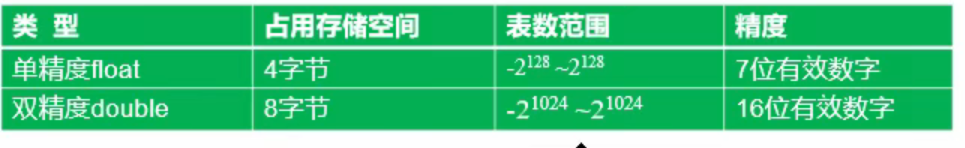
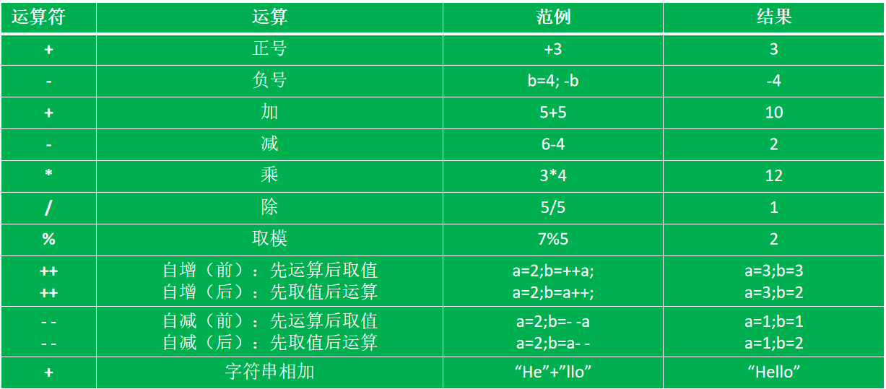

# 1.1 基础常识
### 系统软件和应用软件
### 人机交互方式：图形化界面（GUI） 和 命令行方式（CLI）
<br>

## 常用DOS命令
### 窗口按键+R再输入cmd开启命令行界面
* dir：查看有哪些文件夹
* md：创建目录
* rd：删除目录（要求目录是空的）
* cd：进入到指定目录
* d:：进入D盘
* cd..：返回上级目录
* cd\\：返回根目录
* del：删除文件（这里删除文件夹是删除文件夹里所有文件）
<br>
### 注意所有符号要英文
<br>

# 1.2 JAVA语言概述
## 面向过程与面向对象
* 面向过程：例如张三打篮球。
* 面向对象：人的对象，人运动的动作，运动的器械三个对象，实例化一个张三的对象，对象有个打篮球的动作，器械是篮球。

### JAVA是纯面向对象的语言
### JAVA需要先被编译再被解释
### JAVA原生支持多线程
<br>

## JAVA编号
### JDK1.0、1.2、1.3、1.4、1.5（更名为Java5.0）、目前最新为JDK17
<br>

## Java技术体系平台
* SE：标准版，桌面级应用
* EE：企业版，针对Web应用程序开发
* ME：小型版，移动终端
* Java Card：小程序

### 主要是SE和EE
<br>

# 1.3 Java语言运行机制以及运行过程
## 三个特点：
* 面向对象
* 健壮性
* 跨平台：原理通过虚拟机JVM转化成操作系统识别指示代码

## 两种核心机制：
* Java虚拟机JVM
* 垃圾回收机制GC

## 跨平台性的体现

### 每个操作系统有专门翻译JAVA语言的JVM，“一次编译，处处执行”

### 先编译成class字节码文件再在虚拟机JVM上运行
<br>

## JAVA的垃圾回收（回收内存空间）
### C，C++手动编写代码回收（准确高效但容易失误出现bug）
### JAVA垃圾回收是自动的，开了个系统级线程去自动检测（不会出现忘记回收但是回收可能不及时）

# 1.4 JAVA语言环境的搭建
* 下载JDK
* 安装JDK
* 配置环境变量
* 验证是否成功：java -version

### JDK一般选择稳定版本
### 工作中可能需要各种版本的JDK支持，可以下载不同版本的JDK压缩包，需要哪个解压哪个

## 环境变量配置
### 此电脑->属性->高级系统设置->高级-环境变量->系统变量->新建:
### 变量名:JAVA_HOME,变量值:JDK压缩包解压后目录
### 变量名:CLASSPATH,变量值:.;%JAVA_HOME%\lib\dt.jar;%JAVA_HOME%\lib\tools.jar
### ->PATH->新建:%JAVA_HOME%\bin
### ->PATH->新建:%JAVA_HOME%\jre\bin
<br>

## JDK与JRE
* JDK：JAVA开发工具包（开发工具+JRE）
* JRE：JAVA运行环境（有这个就能运行JAVA程序）

## JVM
* JRE中含有JVM

<br>

## 关于如何获取ZIP文件
### **下面的方法获取的jdk的jar文件可能会有损坏，可以直接允许exe安装程序，在安装路径中找到相应的jdk的jar包**
### 在官网上只能下载到windows的exe文件
### 通过7-zip提取该exe文件获取到tools.zip(如果是32位)


### 提取后未获得tools.zip文件，则进入提取出的文件夹
### 路径为：~\jdk-8u241-windows-x64.rsrc\1033\JAVA_CAB10
### 找到111文件通过7-zip进行提取便可得到tools.zip
<br>

### 注意lib下的tools.jar和jre\lib下的rt.jar，看是否存在，有可能的情况是存在rt.pack 和 tools.pack
### 如果是pack文件需要用到lib文件夹下的unpack200解压成jar
### 因为path里面已经设置了lib文件夹所以可以直接使用unpack200命令


### 需要更改java版本直接修改JAVA_HOME变量即可

# 1.5 注释
* 单行注释//
* 多行注释/**/
* 文档注释/***/


# 2.1 关键字

### 特点：都是小写
### 定义：被java语言赋予了特殊含义，用作专门用途的字符串
<br>

## 保留字：可能在以后被用来作为关键字的字符串。
<br>

# 2.2 标识符
### 凡是可以自己取名的地方（比如类名）

## 定义合法标识符
* 26个字母大小写，数字，$和_
* 数字不能开头
* 不能用关键字和保留字但是可以包含
* 严格区分大小写
* 不包含空格
* 长度无限

<br>

## JAVA命名规范
* 包名：多单词所有字母小写xxxyyyzzz
* 类名与接口名：多单词所有单词首字母大写XxxYyyZzz
* 变量名方法名：第二个单词开始首字母大写（驼峰命名法）：xxxYyyZzz
* 常量名：所有单词大写，单词间用_连接：XXX_YYY_ZZZ

<br>

# 2.3 变量
### Java中变量的定义:数据类型 变量名 = 变量的值
### 例如int i = 1
* 变量放在内存
* 先声明后使用
* 值可以改变
* 有类型和名称

#### 注意声明变量过程中的=，不是数学意义上的等号，代表的是赋予变量值

### 作用于在一对大括号中有效
### 变量一定要有初始化值（例如int i；是不对的）

## 变量的分类-按数据类型

### 分为基本数据类型（8种）和引用数据类型

## 整数类型
### byte是-128~127

### 整形常量默认为int
### long赋值要在数字后面加l：long l = 3l

#### 比特和字节：1字节等于8比特
<br>

## 浮点类型:float、double
* 下面这篇文章说明了浮点类型的存储方式:[文章](https://www.cnblogs.com/recorderM/p/15489651.html)

### float变量赋值后面要跟上字母f:float f = 1.22f
<br>

## 字符类型
### 用英文单引号括起来的单个字母、数字、符号。
### 转义字符\
<br>

## 布尔类型
### boolean b1 = true
### boolean b2 = false
<br>

## 引用类型：String类
### 用于接收字符串：0到多个字母数字符号共同组成的一个串，用双引号括起来
### String str = "hello world!";
<br>

### **凡是引用类型都可以用null为值，可以在初始化的时候赋值null**

### String可以用+拼接
### String类是一个不可变类
> int i1 = 1;<br>
> int i2 = 1;<br>
> 这种情况会存储两个1的值

> String s0 = "hello";<br>
> String s1 = "hello";<br>
> String s2 = "he" + "ll" + "o";<br>
> 这种情况不会存储几个"hello",只存储一个<br>
> "hello"存在字符串常量池<br>
> s0,s1,s2其实是引用"hello"的内存地址


## 集成开发环境
#### eclipse 位数要和jdk位数一致

## 基本数据类型转换
### 容量小的能自动转换成容量大的,反过来不行

### byte、short、char不相互转换，三者计算时首先转换成int(char转换成ASCAII码的值)

```
byte i = 1;
short s = 2;
short s1 = i + s;//报错int无法赋值给short
```

### 多种数据类型计算时都转换成容量最大的数据类型再计算
### 任何类型和字符串用+连接都会转化成字符串

### **注意当多个+连接时按顺序转化运算**

<br>

## 强制类型转换
```
int k = 7;
byte b0 = (byte)k;//不会报错
````
<br>

### 隐式转换和强制转换一般都是基本数据类型
### 布尔类型不能转换成其它基本数据类型
<br>

# 算术运算符

### 整数除以整数会将小数部分抛弃
```
7/3 = 2
```

<br>

### 对负数取模负号忽略，被模数是负数则不可忽略
```
7%5 = 2;
7%-5 = 2;
-7%5 = -2;
-7%-5 = -2;
```

## 赋值运算符
### 符号：=
#### 支持连续赋值


### 扩展赋值运算
### +=、-=、/=、*=、%=
```
//以下二者等同
int i = 1;
i = i + 2;
i += 2;
```
### 字符串的+=是字符串的拼接
### 扩展赋值时自动做了一次强制类型转换
```
short s = 3;
s = (short)s + 3;//不加short报错
s += 3;//已经自动强制类型转换
```
<br>

## 比较运算符


## Eclipse快捷键
[Eclipse快捷键](https://www.runoob.com/eclipse/eclipse-shortcuts.html)