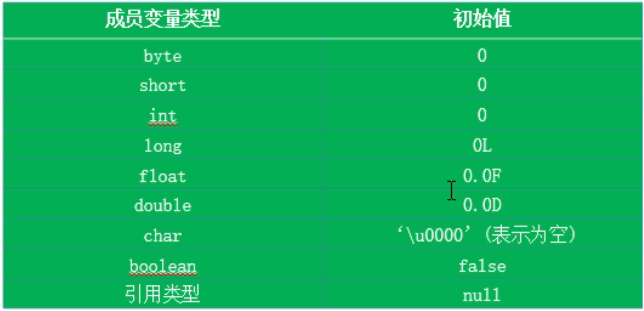

## 逻辑运算符
> &逻辑与<br>
> |逻辑或<br>
> !逻辑非<br>
> ^逻辑异或（两个条件不一样为真）<br>
> &&短路与<br>
> ||短路或

### 不能写3<x<4要写成x>3 && x<4
### &和&&区别：
* 结果相同
* &无论如何右边参与计算
* &&如果左边为假那么右边不参与计算

### |和||同理：
* ||如果左边为真那么右边不参与计算

<br>

## 位运算符
### 直接对二进制进行运算
<br>

#### 进制的意思就是逢几进一
<br>

#### 十进制到二进制转换

#### 得到的结果倒着写101010就是42的二进制
<br>

#### 负数二进制表示

#### **补码 = 反码+1**
#### 逆运算直接-1再反码得到负十进制数
> 左移 m << n 即为 m * 2^n <br>
> 右移 m >> n 即为 m * 2^-n(**保留整数部分**) <br>
> 无符号右移 m >>> n m * 2^-n(m为正数) <br>
> &运算（同位与运算）<br>
> |运算(同位或运算)<br>
> ^运算(同位异或运算)<br>
> ~反码(0变1，1变0)<br>

#### 与或运算


#### 无符号右移和右移的区别

#### **右移才考虑补0还是补1，左移都补0**
<br>

#### *注意int是4个字节32bit，所以每移动32位置一个循环，计算机中最高位为正负号*
<br>

#### 负号右移不是补0是补1，无符号右移是补0
```
System.out.println(-31 >> 2);//-8
```

#### 注意左移取整的问题，如果是整数左移取整数部分，负数左移取整数部分+1

```java
System.out.println(5 >> 2); // 1
System.out.println(-5 >> 2); // -2
```

#### 例子：
```java
System.out.println(1 << 30);
System.out.println(1024*1024*1024);// 2^30
		
System.out.println(1 << 31);
System.out.println(1024*1024*1024*2);// -2^31
		
System.out.println(1 << 32);// 1 
System.out.println(1 << 33);// 2, 1<<1
		
System.out.println(1024*1024*1024*2 << 32); // -2^31
System.out.println(1024*1024*1024*2); // -2^31
System.out.println(1024*1024*1024 << 33); // -2^31
		
System.out.println(1024*1024*1024*2 >> 32);//-2^31
System.out.println(1024*1024*1024*2 >> 33);//-2^30
```

### 总结


## 三元运算符
### 格式：
```
(条件表达式) ? 表达式1 : 表达式2
//条件表达式为true运算表达式1
//条件表达式为false运算表达式2
```

### 获取较大数
```java
int i = 0, k = 1;
System.out.println(i > k ? i : k);//获取两数中较大数
		
int i = 1, k = 1, m = 2;
System.out.println((i>k ? i : k) > m ? (i>k ? i : k) : m);//获取三数中较大数
System.out.println(i > k ? (i > m ? i : m) : (k > m ? k : m));//第二种写法
// 也可以使用Math.max函数
System.out.println(Math.max((Math.max(i, j)), k));
```

## 运算符优先级


# 2.5 程序流程控制
## 顺序结构
## 分支结构if-else
```
if () {

}

if () {

} else {

}

if () {

} else if () {

} else {

}
```

## 分支结构switch-case
```
int i = 2;
switch (i) {
    case 1 :
        break;
    case 2 :
        break;
    default:
        break;
}
```
### switch(表达式)中表达式的返回值类型一定在:byte、short、char、int、枚举、String中。
### case后的值一定是常量
### 如果没有break则会在匹配的那个case后全部执行掉。
```
String str = "a";
switch (str) {
case "a":
    System.out.println("aaa");
//			break;
case "b":
    System.out.println("bbb");
//			break;
default:
    System.out.println("nnn");
//			break;
//输出：
//aaa
//bbb
//nnn
```

## 循环结构
* for
* while
* do/while

### for循环
```
for(int i = 0; i < 5; i++){
    System.out.println(i);
}
```

### while循环
```
//输出1-100
int i = 1;
while(i <= 100){
    System.out.println(i);
    i++;
}
```

### do-while循环
```
int i = 1;
do{
    System.out.println(i);
    i++;
}while(i <= 100);
```

### do-while和while的区别
* 执行顺序不一样:
  * while是先判断条件-执行-判断条件-执行...
  * do-while是执行-判断条件-执行-判断条件-执行...
  * 也就是说do-while无论如何会先执行一次

#### 无限循环
```
for(;;){
    System.out.println("循环中...");
}

while(true){
    System.out.println("循环中...");
}
```

### 嵌套循环
#### 小循环执行次数等于大循环次数*小循环次数
#### 写嵌套循环的时候尽量保证外层循环次数小

#### 打印99乘法表
```
//打印99乘法表
for(int i = 1; i <= 9; i++){
    for(int j = 1; j <= i; j++){
        System.out.print(i + "x" + j + "=" + (i * j) + " ");//不换行
    }
    System.out.println();//换行
}
```

#### 1-100中所有质数
```
int res = 0;
for(int i = 2; i <= 100; i++){
    res = 0;
    for(int j = 2; j < i; j++){
        if(i % j == 0){
            res = 1;
            break;
        }
    }
    if(res == 0){
        System.out.println(i);
    }
}
```

## 特殊流程控制语句
### break:
### 终止**当前所在**循环
<br>

### continue:
### 跳出当前这一次循环继续往下执行

## 一维数组
### 声明方式：
### type value[] 或 type[] value
```
int a[];
int[] a;
double b[];
Mydate[] c;
```
### 一维数组初始化
### 动态初始化
```
int[] ii = new int[4];//声明一个能放4个int类型的数组
```
### 静态初始化
```
int[] ii0 = new int[]{1,2,3,4};//声明一个存放了1,2,3,4四个值的数组
```
* 一维数组new对象时必须要初始化，以下写法报错
```java
int[] is = new int[];
```

### 数组元素的应用-通过下标
#### 下标都是从0开始的数字
#### 数组有个lengh来表示数组的长度
<br>

#### 数组只要定义了就有默认值（包括动态定义）比如数字类型的默认值是0，对象的是null
<br>

## 多维数组
### 动态初始化
```java
int[][] ii = new int[2][3];//第一维长度为2（存储元素为2），第二维也就是第一维每个元素的长度是3

int[][] ii1 = new int[2][];//第一维长度为2，第二维先不定义
/*
这里的第二维不定义的话就是第二维度为空值，
在代码的其它部分可以赋予第二维度int数组
*/
```
### 静态初始化
```
int[][] ii0 = new int[][]{
    {1,2.3},
    {2,3,4}
};
```

### 特殊写法
```
int[] x,y[];定义了x是一个一维数组，y是二维数组
```
## 数组算法
### 数组复制
```java
//数组复制（和赋值不一样）
int[] arr = new int[]{2,4,7,1,8,9};
int[] copy = new int[arr.length];
for(int i = 0; i < arr.length; i++){
    copy[i] = arr[i];
}
```
### 数组反转
```java
//数组反转
int[] arr = new int[]{2,4,7,1,8,9};
int[] temp = new int[arr.length];
//考虑倒着循环arr，正着给temp赋值
for(int i = 0; i < arr.length; i++){
    temp[i] = arr[arr.length - i - 1];
}
for(int i = 0; i < temp.length; i++){
    System.out.println(temp[i]);
}
```

### 数组与泛型
* 数组最好不要和泛型一起用，因为java处理泛型有个擦除的过程，将所有的泛型转化成Object，但是数组不允许这样做，会出很多的问题

例如:
```java
public static <T> T[] test3(T[] objs) {
//  T[] res = new T[objs.length]; 报错，不能创建泛型数组
    T[] res = (T[]) new Object[objs.length];
    for (int i = 0; i < objs.length; i++) {
        res[i] = objs[i];
    }
    return res;
}
```

### 冒泡排序
#### 思想是先两两比较获得最大的数字，再得到第二大的，以此类推。
```java
//冒泡排序
public static int[] test4(int[] arr) {
    int len = arr.length;
    // i代表这一轮比出第几大的值
    for (int i = len - 1; i >= 0; i--) {
        for (int j = 0; j < i; j++) {
            if (arr[j] > arr[j+1]) {
                int temp = arr[j+1];
                arr[j+1] = arr[j];
                arr[j] = temp;
            }
        }
    }
    return arr;
}
```
* 复杂度:n + (n-1) + (n-2) + ... = O(n^2)

#### 遍历数组
```java
public static void test11() {
    int[] is = {1,2,3,4,5,6,7};
    for(int j : is) {
        System.out.println(j);
    }
}
```

## 数组常见问题
### 数组下标越界异常
### 空指针异常
* 指的是数组指向null，再在这个数组里面用下标取值就会出现空指针异常
<br>

# 3.面向对象编程
# 3.1 面向对象与面向过程
## 面向对象的三大特征
* 封装
* 继承
* 多态

# 3.2 java语言的基本元素：类和对象

## 类中的成员
* 成员变量
* 成员方法（或函数）

### 定义一个类:
* 定义类
* 定义属性
* 定义方法
```java
/**
 * 人
 * @author le
 *
 */
public class Person {
	//属性，成员变量,类的成员变量可以先声明不用初始化，因为是有默认值的
	String name;//String默认值是null
	int age;//int默认值是0
	
	//行为，方法，也叫函数
	/**
	 * 打印姓名
	 */
	public void showName(){//方法名称驼峰命名法
		System.out.println("姓名:" + name);
	}
	/**
	 * 获取年龄
	 * @return
	 */
	public int getAge(){//如果是个有返回值的方法，那么方法体最后一行一定用return返回相应数据，返回的数据类型与方法定义一致
		return age;
	}
}
```

# 3.2 对象的创建和使用
### 类的实例化，既创建类的对象
### 通过new创建新的对象
```java
//实例化Person类,也就是创建Person对象
Person person = new Person();//声明一个Person类型的变量，变量名叫person，并且给person赋值，赋的值就是Person的实例
//new Person()就是实例化Person类
person.name = "张三"; //给person对象的name属性赋值
person.showName();
int age = person.getAge();//有返回值的方法，调用之后就会有一个值，这个值就是方法中return的那部分
System.out.println(age);

person.age = 11;//给person对象的age属性赋值
System.out.println(person.getAge());
```

# 3.3 类的成员之一:属性
### 格式：
### 修饰符 类型 属性名 = 初值
#### 说明：
* private：该属性只能用该类的方法访问
* public：该属性可以被该类以外的方法访问

#### 变量的分类：
* 成员变量：写在类里面的变量
  * 实例变量：在类实例为对象后才能使用（不用static修饰）
  * 类变量：这样的变量不需要类实例化为对象就可以使用，直接就可以通过类名.属性的方式调用（使用static（意思是静态的）修饰）
* 局部变量：写在方法里面的变量
  * 形参：方法定义的变量（需要的参数名）
  * 方法局部变量：定义在方法内部的变量
  * 代码块局部变量

## 成员变量（属性）和局部变量的区别
* 成员变量整个类能使用
* 成员变量中的实例变量只有在实例化后才能使用，在堆内存中
* 成员变量有默认的初始化值
* 成员变量的修饰符可以根据需要选择


<br>

* 局部变量只能在它所属的方法的范围内可以使用
* 在栈内存中
* 作用范围结束后释放
* 没有默认初始化值（不包括形参）
* 不指定修饰符

# 3.4 类的成员之二：方法
## 格式：
### 修饰符 返回值类型 方法名（参数列表）{
    方法体语句;
}

### **方法中只能调用方法不能定义方法**
### **同一个类中所有方法可以直接调用类中的其它方法，不用实例化对象**

## 对象的产生
### 对象产生后会对变量进行初始化赋值


### 匿名对象
```
//不用把某个对象赋予某个变量
new Student().showInfo();
```
### 注意
### 类的访问机制：类中的方法可以直接访问访问类中的成员变量（但是static方法不能访问非static的成员变量）

## 方法的重载(overload)
### 概念：
### 同一个类中，允许存在一个以上的同名方法，只要参数个数或者参数类型不同即可。
  * 参数类型不同
  * 参数个数不同
  * 参数属性呢
* 方法签名是由：**方法名称 + 参数类型 + 参数个数**组成的一个唯一值，这个唯一值就是方法签名，而 JVM（Java 虚拟机）就是通过这个方法签名来决定调用哪个方法的。
* 所以重载只考虑**方法+参数**，不用考虑返回值，**返回值可以相同也可以不同**
* 如果只有参数类型不同，JVM是无法辨别调用哪个方法的:例如
```java

public class OverloadExample {
    public static void main(String[] args) {
        OverloadExample example = new OverloadExample();
        example.method("test"); // JVM 应该调用哪个方法？
    }
 
    public int method(String name) {
        // doSomething
        return 666;
    }
 
    public String method(String name) {
        // doSomething
        return "test";
    }
}
```

```java
//顺序不同也构成重载
void show(int a, char b, double c){}
void show(int a, double c, char b){}
//两者构成重载
```

## 可变个数的形参
#### 可以输入的是个数组
#### 如果没有参数就要定义一个空数组或者null
```java
public void printInfo(String[] args){
    //问题：现在可能给方法传递不同的参数
    //如果在这种情况下，我们不知道想给方法传递多少个参数
    //设置可变个数的形参
    for(int i = 0; i < args.length; i++){
        System.out.println(args[i]);
    }
}
```
#### java有特有的传递多个参数的方法
#### ...表示可以传递0到多个参数
* **如果传递0个参数接收到的就是一个长度为0的空数组**，而不是null。
#### 注意：**这里可以一个参数都不写**
#### 如果一个方法有多个形参，可变的形参（...这种）一定要放到所有参数最后:
* public void printInfo1(int i, String... args)是对的
* public void printInfo1(String... args, int i)不对
* public void printInfo1(int... i, String... args)也不对
```java
/**
* 用java特有的方式传递可变个数的参数，这种参数在使用时与数组的使用方式相同
* @param args
*/

public void printInfo1(String... args){
    for(int i = 0; i < args.length; i++){
        System.out.println(args[i]);
    }
}
```
#### 调用方式
```java
Person3 p3 = new Person3();
p3.printInfo1("lisi","23","男");

//也可以直接传递数组
String[] ss = new String[]{"北京市", "13333333333", "13"};
p3.printInfo1(ss);
```

## 方法的参数传递
### 方法只有被调用才有意义
* 形参：方法声明时的参数
* 实参：方法调用时传递给形参的实际值

### **Java里的参数传递方式只有一种：值传递**
### 值传递不是地址传递

### JVM内存模型

### 堆实际存放对象
### 栈存放对象的实际地址
### 基础数据类型直接存储在栈中

### 总之，基本数据类型在参数传递的时候就是将实参的值复制到形参上。

### 方法的参数传递之引用对象


### 总结：
* 若果形参是**基本数据类型，那么实参（实际的数据）向形参传递参数时就是直接传递值，把实参的值复制给形参**。
* 如果形参是**对象，那么实参（实际的对象）向形参传递参数时，也是把值给形参，这个值是实参在栈内存中的值，也就是引用对象在堆内存中的地址**。
* 总之是**传递在栈内存中的值**，对于基本数据类型是它的实际值对于对象就是该对象在堆中的地址

<br>

## 软件包
### Java中包的概念类似于文件夹的概念
### 用于解决文件太乱和文件同名问题
* 包可以有层及结构，用.来连接（例如day06.test,这就是day06包下的test包) 
* 包通常用小写单词
* 如果要引用包下的类要用import声明
* 同一个包下的类引用可以不用import声明

#### import 的三种方法
#### 要引用day06包下test包中的Person类
* import day06.test.Person Person p = new Person();
* import day06.test.* Person p = new Person();
* day06.test.Person p = new day06.test.Person();


# 3.7 面向对象的特征之一：封装和隐藏
### 对不能让调用者随意使用的属性进行封装和隐藏
### 可以用private修饰成员变量，在设定方法来赋值

### 修饰符

### 一个Java文件中可以写多个类但是只有一个类可以用public修饰(不包括内部类，多个内部类也可以使用public修饰)且类名要和文件名一致

# 3.8 类的成员之三：构造器（构造方法）
### 构造方法名称与类名相同
```java
public class Person{
    public Person(){}
    //默认构造方法（写不写都存在），因为是public class才是public修饰符，如果class修饰符缺省构造器的修饰符也该缺省
}

Person p = new Person();//new Person对象调用的就是public Person(){}
```
### 可以显示定义一到多个构造方法
### 显示定义构造器后系统将不会再提供构造器
### 父类的构造器不会被子类继承
### 希望在new对象的时候自己给属性不同的值

## 构造器重载

# 3.9 关键字-this
* 在方法内部使用表示这个方法所属对象的引用
* 在构造器内部使用，表示该构造器正在初始化的对象

```java
public class Person7 {

	public Person7(int age, String name){
		this.age = age;
		this.name = name;
	}
	int age;
	String name;

    public void setName(String name){
		this.name = name;
	}

    public void setName1(String name){
		this.setName(name);//这里也可以不写this,但写了可以增加可读性
	}

    public void showInfo(){
		System.out.println("姓名:" + this.name);//这里也可以不写this,但写了可以增加可读性
	}
}
```

### 形参与类变量重名用this区分
### 使用当前类的成员变量或成员方法可以添加this增加程序的可读性

<br>

### this也可以调用构造方法
```java
public Person(){

}

public Person(int age){
    this.age = age;
}

public Person(String name){
    this();//调用Person()
    this.name = name;
}

public Person(int age, String name){
    this(1);//调用Person(int age)
    this.age = age;
    this.name = name;

}
```
### 注意：
* 使用this（）必需放在构造器首行
* 实际上禁止构造器自己调用自己

## JavaBean
