# 4.1 面向对象的特征之一：继承
### extends
### 代码演示：
### Person类(父类)
```java
public class Person {
    int age;
    String name;
    int sex;

    public void showInfo(){
        System.out.println(this.age);
        System.out.println(this.name);
        System.out.println(this.sex);
    }
}
```
### Student类（子类）
```java
public class Student extends Person{
    String school;

    @Override//表示重载
    public void showInfo() {
        System.out.println(this.age);
        System.out.println(this.name);
        System.out.println(this.sex);
        System.out.println(this.school);
    }
}
```
### 子类的共性代码都是继承于父类的（方法和属性）
### 子类只用写自己的特有代码
### **不要仅为了获取其它类某个功能而去继承，继承要有逻辑关系**（比如狗类不要继承人类，虽然都是姓名、年龄、性别）
### 子类不是父类的子集而是对父类的扩展

* 不能直接访问父类私有成员变量
* java只支持单继承，**一个子类只能有一个父类，但是父类可以有多个子类，父类也可以有父类**

# 4.2 方法的重写
* 就是方法的覆盖
* 子类重写只是重写方法体的代码，其它的要一样（方法名、参数、返回值类型）
* 重写的访问权限不能更严格（指方法的修饰符）
* 重写与被重写的方法必需同为static或者同不为static
* 不能重写私有（private）的代码

# 4.4 关键字super
* super可以用于访问父类定义的属性
* super可以用于访问父类定义的成员方法
* super可以用于在子类构造方法中调用父类的构造器
* 当父子类出现同名成员时可以用super区分
* **使用super子类可以调用子类之上的所有父类层级**

#### 例：Mankind类
```java
ublic class Mankind {
    int sex;
    int salary;

    public void manOrWoman(){
        if(this.sex == 1){
            System.out.println("man");
        }else if(this.sex == 0){
            System.out.println("woman");
        }
    }

    public void employed(){
        if(this.salary == 0){
            System.out.println("no job");
        }else{
            System.out.println("job");
        }
    }
}
```
#### Kids类
```java
public class Kids extends Mankind{
    int yearsOld;

    public void printAge(){
        System.out.println(this.yearsOld);
    }

    public int getYearsOld() {
        return yearsOld;
    }

    public void setYearsOld(int yearsOld) {
        this.yearsOld = yearsOld;
    }

    @Override
    public void employed() {
        System.out.println("Student should study");
    }
}
```
#### Kk类
```java
public class Kk extends Kids{
    public void test(){
        super.salary = 1;//追溯父类的父类
        super.yearsOld = 1;//追溯父类
        super.employed();//追溯父类的方法
        super.manOrWoman();//追溯父类的父类的方法
    }
}
```
* 如果父类重写了父类的父类的方法或者父类和父类的父类有着同名变量，那么super只能追溯到父类，不能追溯到父类的父类，也没有super.super的写法。

## 调用父类的构造器
* **子类所有的构造器都会默认调用父类空参数的构造器**
* **父类没有空参数构造器的时候子类，子类必需通过super调用父类的有参构造来构造子类，并且super必需写到子类构造器的第一行**

## this和super的区别
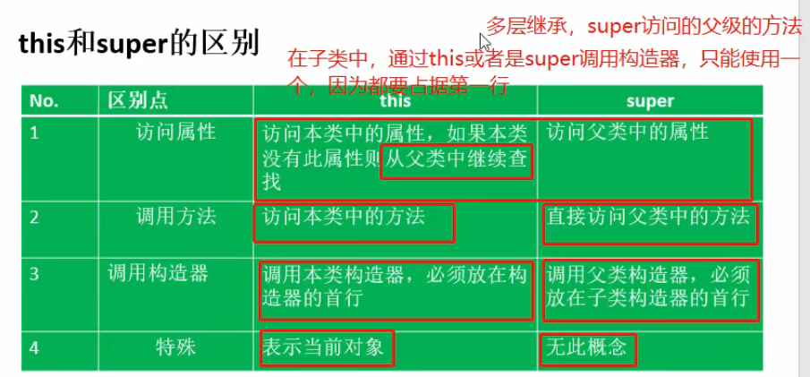
### **当子类调用的属性方法在子类中不存在时，那么this和super都是调用父类的属性或者方法**

# 4.5 简单类对象的实例化过程
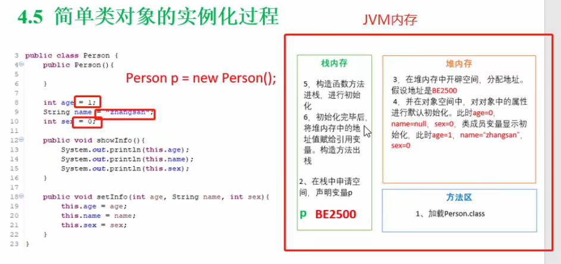

# 子类对象的实例化过程
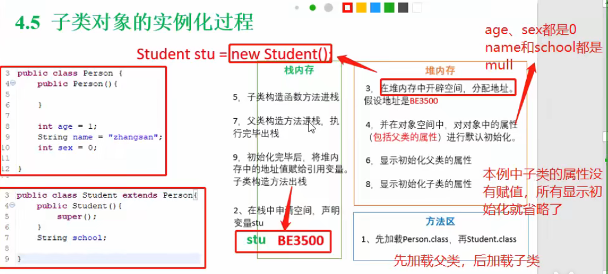

* 简单对象实例化的过程是:
  1. 默认初始化
  2. 构造函数进栈
  3. 显示初始化
  4. 执行构造函数

* 子类对象实例化的过程是:
  1. 默认初始化
  2. 子类构造函数入栈
  3. 父类构造函数入栈
  4. 父类显示初始化
  5. 执行父类构造函数内容
  6. 父类构造方法出栈
  7. 子类显示初始化
  8. 执行子类构造函数

* 总结:**显示初始化总发生在构造函数入栈后，构造函数内容执行前**，自己可以用调试验证


# 4.6 面向对象的特征之三：多态性
* 1.方法重载（overload）和重写（overwrite）
* 2.对象的多态性--直接应用在抽象类的接口上

### java变量两个类型：
* 编译时类型
* 运行时类型
* 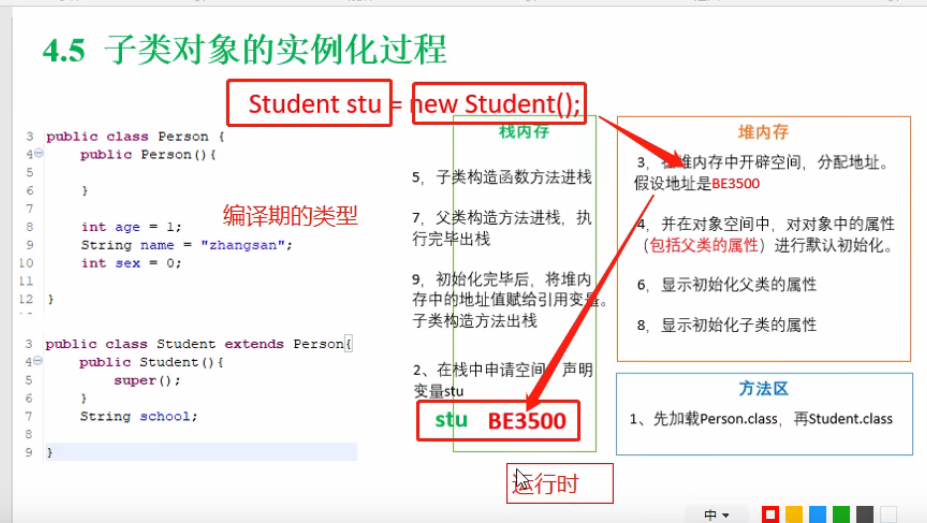
#### 编译时类型和运行时类型不同就会产生多态（对象的多态）
#### java中，子类的对象可以替代父类的对象使用,因为子类可以看做特殊的父类，这种指向叫做**向上转型**
```java
//父类的应用对象可以指向子类的实例
Person e = new Student()
```
```java
Person p = new Person();
p = new Student();
//此时的p引用的是Student这个实例变量，但是p无法访问子类中添加的属性和方法
p.school = "xxxx"//报错
```
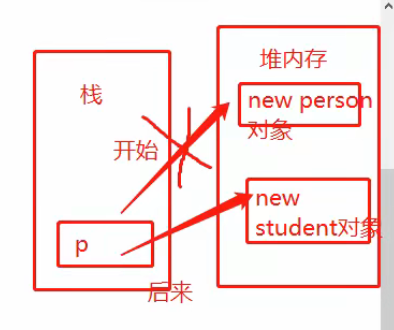
#### **属性是编译期确定的**
#### **注意只是不能访问子类中添加的属性和方法，但是重载的方法依旧是使用子类中的（这是在运行期确定的）**
```java
public class Person {
    protected int age;
    String name;
    int sex;

    public void showInfo(){
        System.out.println("Person中的showInfo");
        System.out.println(this.age);
        System.out.println(this.name);
        System.out.println(this.sex);
    }
}

```

```java
public class Student extends Person{
    String school;

    @Override//表示重载
    public void showInfo() {
        System.out.println("Student重载Person中的showInfo");
        System.out.println(this.age);
        System.out.println(this.name);
        System.out.println(this.sex);
        System.out.println(this.school);
    }

    public void showSchool(){
        System.out.println(this.school);
    }

    public static void main(String[] args) {
        Person p = new Person();
        p = new Student();
        p.showSchool;//报错
        p.showInfo();//输出的是“Student重载Person中的showInfo”
    }

}
```
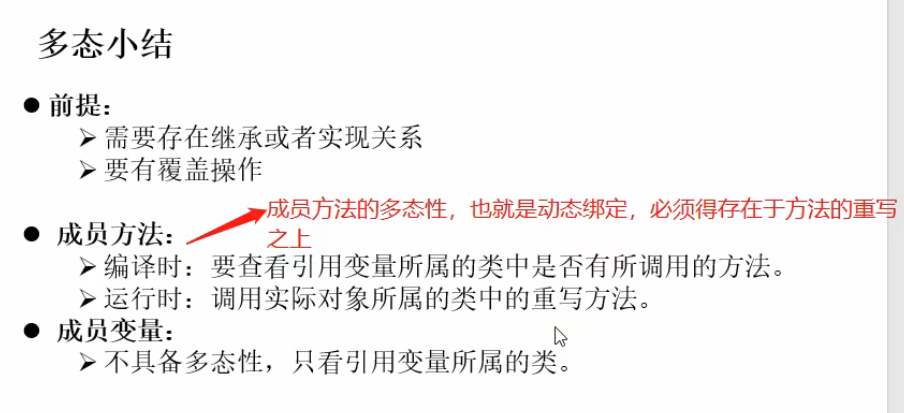
* 子类中重写的方法会覆盖父类中的
* 但是子类可以定义名称相同的实例变量，并不会覆盖父类中的
  * 如果子类和父类有相同的变量名，**这两个变量依旧是完全独立的**。想要调用父类的属性要用super。
    ```java
    public class Test {
        public static void main(String[] args) {
            B b = new B(); //子类对象
            b.i = 200;
            b.B();
        }
    }
    class A {
        int i = 10;
        public void A() {
            System.out.println(i);
        }
    }
    class B extends A {
        int i = 100;
        public void B() {
            A();
        }
    }
    /*
    上述代码输出结果为10，子类的 i 和父类的 i 是完全独立的，内存中同时保存了父类的 i 和子类的 i 。b.i 改变的是子类的值，把 i = 100 变成了 i = 200。
    B()方法调用父类的A()方法，输出父类的 i ，值为10。
    */
    ```
    ```java
    public class Test {
        public static void main(String[] args) {
            B b = new B(); //子类对象
            b.i = 200;
            b.B();
        }
    }
    class A {
        int i = 10;
        public void A() {
            System.out.println(i);
        }
    }
    class B extends A {
        //int i = 100;
        public void B() {
            A();
        }
    }
    /*
    上述代码输出结果为200，子类的 i 继承自父类，内存中只保留父类的 i = 10。b.i = 200实际是把父类的 i 改变了。
    调用父类的A()方法，输出父类的 i ，值为200。
    */
    ```
  * 父类的声明，子类的引用(多态性的体现)时，调用的依旧是父类的属性
    ```java
    public class Person {
        public String name = "Person";
        public String age;
    }

    public class Student extends Person{
        public String name = "Student";
    }

    public class Test {
        public static void main(String[] args) {
            Person p = new Student();
            System.out.println(p.name);
        }
    }
    /*
    输出是Person
    */
    ```
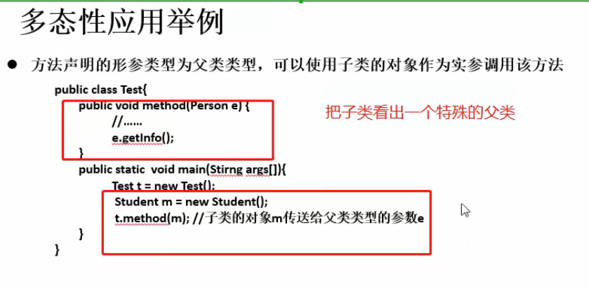
#### 形参要求父类但是可以传子类进去
<br>

## instanceof操作符
#### 判断是否为某类对象（包括子类）
```java
Person p = new Person();
Student s = new Student();
System.out.println(s instanceof Person);//true
System.out.println(p instanceof Person);//true
System.out.println(p instanceof Student);//false

Person e = new Student();
System.out.println(e instanceof Student);//true
```

# 4.7 Object类
* Object类是所有Java类中的根父类也就是基类
* 没有extends时默认基础Object
```java
method(Object obj)//默认接收任何类作为参数
```
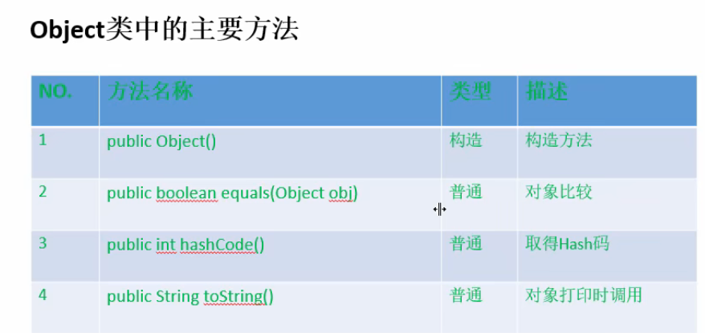
* equals要求指向的是同一个对象
* toString输出的是引用对象的内存地址

## 对象的类型的转换
* 子类到父类可以自动进行转换
* 父类到子类可以强制类型转换
```java
Student s = new Student();
Person p = s;
```

```java
Person p = new Person();
p = new Student();//必需有这步不然报错
Student s = (Student) p;
```

### 以下为示例用法
```java
public void method(Person e){
    if (e instanceof Student){
        Student s = (Student) e;//父类转子类
        s.getSchool();
    }else{
        e.test();
    }
}
```

## ==操作符与equals方法
* ==比较对象时指向同一对象才为true，并且要求两边类型要兼容不然报错
* equals只能比较引用类型，作用与==符号相同(比较内存地址)
* 特例：**对于File、Date、String以及包装（Wrapper Class）类来说是比较类型和内容而不考虑是否同一对象**
* 如果想改变某个类的equals不想比较内存地址，就需要重写equals方法

```java
String s1 = new String("abc");
String s2 = new String("abc");
System.out.println(s1 == s2);//false
System.out.println(s1.equals(s2));//true
```

### String对象的创建
* 字面量创建对象,字符串常量存在堆中的常量池中

```java
String s1 = "abc";
String s2 = "abc";//s1、s2指向同一个对象
```

* new 创建String对象，现在常量池中添加对象，再在常量池外的堆中添加对象，最后指向常量池外的对象

```java
String s3 = new String("abc");
String s4 = new String("abc");//s3、s4指向不同对象
``` 

* 字面量方式比new省内存

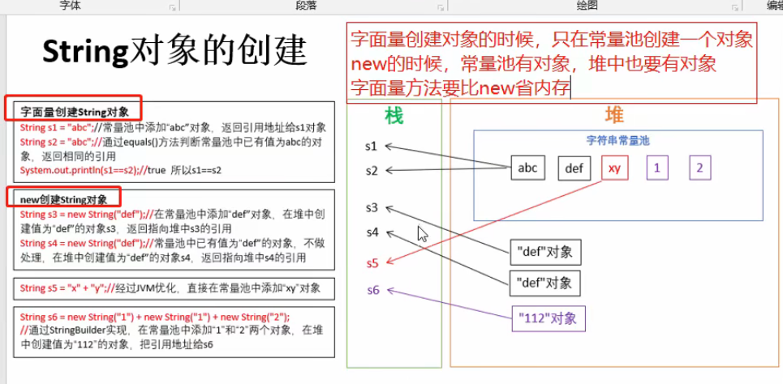
#### **有new String才会在常量池外创建对象**

# 4.7 包装类（Wrapper Class）
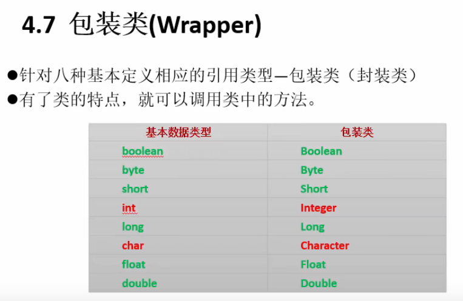
#### 通过装箱可以将字符串转数字
```java
Integer i = new Integer("123");
```
#### 拆箱使用xxxValue()
```java
Integer i = new Integer("123");
int i0 = i.intValue();
```
#### **JDK1.5后支持自动拆装箱**
```java
Integer i = 112;
int i0 = i;
```
#### 字符串转化基本数据类型可以通过
* 包装类构造器

```java
int i = new Integer("12");
```

* 包装类parseXxx(String s)函数实现

```java
float f = Float.parseFloat("1.1415926");
```

#### 基本数据类型转字符串
* 通过字符串重载的valueOf()方法
* 直接+""

### toSring()
* 打印对象默认执行对象的toString函数

# 5.1 关键字static
* 类变量，不用实例化就能用，类的一部分，**被这个类的实例化变量所共享**
* 方法也可以用static修饰

### 设计思想
* 想让属性不因对象的不同而改变
* 方法与调用者无关（做工具类）

### 例子
* 用于计数count
* 创建一个中国人的类国家属性
* 做工具类

### **static中不能使用this和super**

## 单例设计模式
* 单例的意思是有且只有一个实例
* 适用于实例化对象的创建要消耗大量的时间和资源

* 饿汉式单例设计

```java
/**
 * 实现一个饿汉式的单例
 */
public class Single {
//    public Single(){
//        //执行1000行代码，占用很大的资源，耗时长
//        //每次new Single需要10秒，运行1000行代码
//        //这种情况使用单例模式，只new一次对象
//    }

    //私有的构造,调用这个类的人不能直接使用new来创建对象
    private Single(){

    }

    //私有的Single类型的类变量
    private static Single single = new Single();

    public static Single getInstance(){
        return single;
    }
}
```

* 懒汉式单例设计（等到第一次被调用时才new一个对象，之后所有调用者都用这个对象)

```java
/**
 * 懒汉式单例模式
 */
public class Single1 {
    //先私有化构造
    private Single1(){
        
    }
    
    private static Single1 s1 = null;
    
    public static Single1 getInstance(){
        if(s1 == null){
            s1 = new Single1();
        }
        return s1;
    }
}
```

# 5.2 理解main方法的语法
```java
public class TestMain {
    public static void main(String[] args) {
        for(int i = 0;i < args.length; i++){
            System.out.println(args[i]);
        }
    }
}
```


# 5.3 类的成员之四：初始化块
* 对java对象进行初始化

## 非静态代码块

```java
public class Person {
    String name;

    public Person() {
        this.name = "张三";
        System.out.println("执行的是构造方法");
    }

    //非静态代码快
    {
        System.out.println("执行的是非静态代码块");
    }
}
```

```java
public static void main(String[] args) {
    new Person();
}
```
#### 输出
```java
执行的是非静态代码块
执行的是构造方法
```

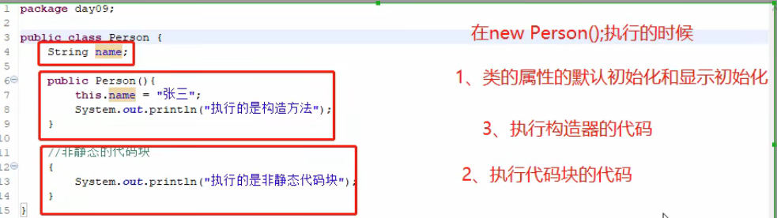

#### 多个非静态代码块按照编写顺序从上到下执行

## 静态代码块**只能使用静态修饰的属性和方法**
### **静态代码块只会执行一次**
```java
public class Person {
    String name;
    static int age;

    public Person() {
        this.name = "张三";
        System.out.println("执行的是构造方法");
    }

    //非静态代码快
    {
        System.out.println("执行的是非静态代码块");
    }

    //静态代码块
    static {
        age = 1;
        System.out.println("执行的是静态代码块");
    }
}

```java
public static void main(String[] args) {
    System.out.println("程序开始运行");
    new Person();
    new Person();
}
```

```java
程序开始运行
执行的是静态代码块
执行的是非静态代码块
执行的是构造方法
执行的是非静态代码块
执行的是构造方法
```

* 执行顺序:
  1. 属性默认初始化
  2. 构造函数进栈
  3. 属性显示初始化
  4. 执行非静态代码块
  5. 执行构造函数中内容
  6. 构造函数出栈

### 实际开发中static用的多一些用于初始化类的静态属性

# 5.4 关键字final
* **修饰类类不能被继承**
* **修饰方法，方法不能被子类重写**
* **修饰变量，变量值不能再改变既常量**，全大写。
  * **常量必需显示赋值**
  * final static一起修饰变量就是全局常量
  * 常量最好全字母大写，单词间用_连接
  * **只能赋值一次不能再改变**
  * 注意这里的变量如果是引用类型，那么只是这个变量的地址不能再修改，也就是不能重新指向其它的引用类型，但是修改堆内存中该引用类型的一些属性是可以的

# 5.5 抽象类(abstract class)
* 抽象类就是没有具体的内容
* 用abstract修饰的类就是抽象类
* abstract也可以修饰方法
  * 抽象的方法只有声明没有实现
* 抽象类不能被实例化
  * 抽象类主要是被继承的
* 只要类中有一个抽象的方法，这个类必需是一个抽象类
* final和abstract不能一起修饰
* **抽象类可以有构造方法只是不能实例化**

## 模板方法设计模式
* 抽象类作为多个子类的通用模板

#### 例子：
```java
/**
* 模板设计模式
* 计时器
*/
public abstract class Template {
    public abstract void code();

    public final void getTime(){
        long start = System.currentTimeMillis();
        code();
        long end = System.currentTimeMillis();

        System.out.println("code方法执行的时间:" + (end - start));
    }
}

class TestTmp extends Template{
    @Override
    public void code() {
        int k = 0;
        for (int i = 0; i < 500000; i++) {
            k += i;
        }
    }
}
```

# 5.6 接口
* java不支持多继承，但可以通过接口得到多重继承的效果
* 接口(interface)是抽象方法和常量值定义的集合
* 接口是一种特殊的抽象类
```java
//接口实现
class SubClass implements InterfaceA{}
```

## 接口特点
* 没有构造器
* 所有成员变量默认public static final修饰
* 所有方法默认由public abstract修饰
* 没有构造器
* 采用多重继承机制
* 接口可以继承接口，使用extends连接
* 实现接口的类必需实现接口的所有方法，不然是抽象类
* 如果一个类又有继承又有实现那么应该先继承后实现

## 为什么要用接口
* 一个类可以实现多个无关的接口
* 继承需要保证逻辑上的关系
* 可以使用接口来接收方法

## 抽象类和接口
* 抽象类是对于**一类事物**的高度抽象，其中既有属性也有方法
* 接口是对方法的抽象，也是对一系类**动作**的抽象

## 工厂方法
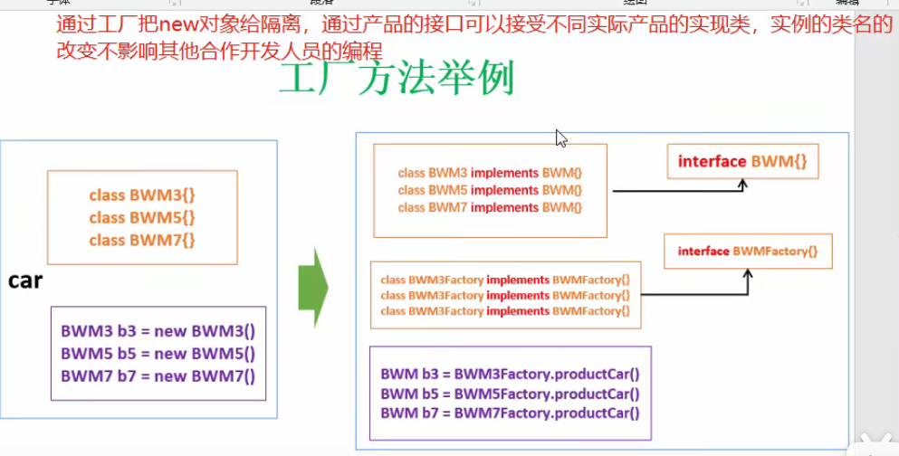
* 橙色和蓝色分别是两个人开发
* 用工厂把这两个隔离开
#### 定义不同产品
```java
/**
 * 产品接口
 */
public interface BWM {
    //可以有很多东西
    void showInfo();
}

/**
 * 构建具体的类
 */
class BWM3 implements BWM{

    @Override
    public void showInfo() {
        System.out.println("3系");
    }
}

class BWM5 implements BWM{

    @Override
    public void showInfo() {
        System.out.println("5系");
    }
}

class BWM7 implements BWM{

    @Override
    public void showInfo() {
        System.out.println("7系");
    }
}
```
#### 生产不同产品的工厂
```java
/**
 * 生产接口
 */
public interface BWMFactory {
    BWM productBWM();
}

/**
 * 实现具体产品的生产工厂
 */
class BWM3Factory implements BWMFactory{

    @Override
    public BWM productBWM() {
        System.out.println("生成BWM3");
        return new BWM3();
    }
}

class BWM5Factory implements BWMFactory{

    @Override
    public BWM productBWM() {
        System.out.println("生成BWM5");
        return new BWM5();
    }
}

class BWM7Factory implements BWMFactory{

    @Override
    public BWM productBWM() {
        System.out.println("生成BWM7");
        return new BWM7();
    }
}
```
#### 最终产品生产
```java
public static void main(String[] args) {
        BWM b3 = new BWM3Factory().productBWM();
        b3.showInfo();
        BWM b5 = new BWM5Factory().productBWM();
        b5.showInfo();
        BWM b7 = new BWM7Factory().productBWM();
        b7.showInfo();
    }
```


# 5.7 类的成员之五：内部类
* 一个类定义与另一类内部

### 例子：
```java
public class Test3 {
    int i;
    public int z;
    private int k;
    class A{//内部类
        public void setTest3Filed(){
            Test3.this.i = 1;
            Test3.this.z = 2;
            Test3.this.k = 3;
        }
    }

    public void setInfo(){
        new A().setTest3Filed();//外部类要用内部类要先new对象
    }

    public void showInfo(){
        System.out.println(this.i);
        System.out.println(this.z);
        System.out.println(this.k);
    }

    public static void main(String[] args) {
        Test3 t = new Test3();
        t.setInfo();
        t.showInfo();
    }
}
```

### 特性：
* 可以声明为final
* 可以定义多个
* 可以使private和protect
* 可以声明为static
* 可以定义为abstract可以被**其他内部类**继承

### 内部类的作用：
* 主要解决Java不能多重继承的问题

```java
/**
 * 现在类A想要同时获得类B和类C的方法，并且重写
 * 可以使用内部类来变相实现内部类的多重继承
 */

class A{
    public void testB(){
        new InnerB().testB();
    }

    public void testC(){
        new InnerC().testC();
    }

    private class InnerB extends B{
        @Override
        public void testB() {
            System.out.println("这是重写之后的testB方法");
        }
    }
    private class InnerC extends C{
        @Override
        public void testC() {
            System.out.println("这是重写之后的testC方法");
        }
    }
}

class B{
    public void testB(){

    }
}

class C{
    public void testC(){

    }
}
```