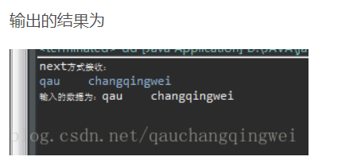

# 主要内容
* java.io.File类的使用
* IO原理及流的分类
* 文件流（基于文件的操作）
* 缓冲流（基于内存的操作）
* 转换流
* 标准输入/输出流
* 对象流
  * 将对象转化成一个数据流进行读写
* 随机存取文件流
  * 例如一个TXT文件，其中100行数据，可以直接读取第50行数据
  * 也可以在89行直接插入数据


## File类
* 操作文件或者路径
* 但File不能访问文件内容

```java
/*
这个时候对象f就是tt.txt文件
f1也是tt.txt文件
注意，\在文件中是路径的分隔符，但是java中\是转义符，
所以\\或者/才是java中路径的分隔符
也可以用File.separator做文件分隔符
    */
File f = new File("D:\\test\\abc\\tt.txt");
//这是目录
File fl = new File("D:\\test\\abc");
//        File f1 = new File("D:\\test","abc\\tt.txt");//使用相对较少

//获取文件名/当前文件夹名称
System.out.println(f.getName());//tt.txt
System.out.println(fl.getName());//abc

//获取当前路径
System.out.println(f.getPath());//D:\test\abc\tt.txt


File f5 = new File("src/day12/Test.java");
//创建File时输入的路径
System.out.println(f5.getPath());//src\day12\Test.java
//绝对路径
System.out.println(f5.getAbsolutePath());//D:\ideademo\src\day12\Test.java

System.out.println(f5);//src\day12\Test.java
//返回一个用当前文件的绝对路径创建的对象
System.out.println(f5.getAbsoluteFile());//D:\ideademo\src\day12\Test.java


//返回父级路径
System.out.println(f5.getParent());//src\day12

//给文件/文件夹重命名
//重命名后并不会改变f的值，f依旧是tt.txt
f.renameTo(new File("D:\\test\\abc\\tt1.txt"));

//查看文件/文件夹是否存在
File f6 = new File("D:\\test\\abc\\tt1.txt");
System.out.println(f6.exists());//true

File f7 = new File("D:\\test\\abc\\tt2.txt");
System.out.println(f7.exists());//false

File f8 = new File("D:\\test\\abc1");
System.out.println(f8.exists());//false

//判断文件是否可写/可读
System.out.println(f6.canRead());//true
System.out.println(f6.canWrite());//true

//如果一个文件不存在，那它既不是文件夹也不是文件
//判断是不是一个文件
System.out.println(f6.isFile());//true

//判断是不是一个文件夹
System.out.println(f6.isDirectory());//false

//获取文件最后修改时间，返回的是一个毫秒数
System.out.println(f6.lastModified());

//返回文件长度（字节数）
System.out.println(f6.length());

//创建文件tt2.txt
if(!f7.exists()){//判断文件是否存在
    try {
        System.out.println(f7.createNewFile());
    } catch (IOException e) {
        e.printStackTrace();
    }
}

//删除文件
//如果要删除某个目录，那么该目录必须为空
System.out.println(f7.delete());

File f9 = new File("D:\\test\\abc\\cc\\");

//创建单层目录,无法创建多级目录
//如果目录已经存在放回false
System.out.println(f9.mkdir());

File f10 = new File("D:\\test\\abc\\a\\b\\c");
//创建多层目录
System.out.println(f10.mkdirs());

File f11 = new File("D:\\test\\abc");
//返回当前文件夹的子集（目录和文件）的名称
String[] f1 = f11.list();
for(String s : f1){
    System.out.println(s);
}
/*
a
cc
tt1.txt
*/

//返回文件（具体文件和目录）
File[] fs = f11.listFiles();
for(File ff : fs){
    System.out.println(ff);
}
/*
D:\test\abc\a
D:\test\abc\cc
D:\test\abc\tt1.txt
*/
```

## 递归便利文件夹中全部文件

```java
/**
* 递归遍历文件
* @param file
*/
public static void test(File file) {
    if (file.isFile()) {
        System.out.println(file.getAbsolutePath() + "是文件");
    } else {
        System.out.println(file.getAbsolutePath() + "是文件夹");
        //如果是文件夹，那么文件夹就有子文件或者目录
        File[] fs = file.listFiles();
        if (fs != null && fs.length > 0) {
            for (File ff : fs) {
                test(ff);
            }
        }
    }
}
```

```java
/*
需要遍历d盘先test文件夹下所有文件
使用递归的方式
*/
File f = new File("D:/test");
test(f);
```

## Java IO原理
* 通过流（stream）来进行输入输出
* 不论输入还是输出都是指的计算机（或者说这个程序）
  * input电脑读取外部输入
  * output电脑输出到外界

### 流的分类：
* 单位
  * 字节流（8bit）
  * 字符流（16bit）
* 流向不同
  * 输入流
  * 输出流
* 角色不同
  * 节点流
  * 处理流


## 文件字节输入流

```java

/**
* 文件字节输入流
*/
public static void testFileInputStream(){
    try {
        FileInputStream in = new FileInputStream("D:\\test\\abc\\tt1.txt");

        byte[] b = new byte[9];//设置一个比特数组接收读取的文件内容
        /*
        read方法有一个返回值
        返回值是读取的数据的长度
        如果读取到最后一个数据
        还会向后读一个
        返回值是-1
        也就意味着当read（）返回值是-1时
        那整个文件就读完了
            */
//            in.read(b);

        int len = 0;
        while ((len = in.read(b)) != -1){
            /*
            读取byte数组
            b 字节数组
            0 开始位置
            len 读取长度
                */
            System.out.println(new String(b, 0, len));
        }

//            System.out.println(new String(b));

        in.close();//流在使用完毕后一定要关掉

    } catch (Exception e) {
        e.printStackTrace();
    }
}
```

## 文件字节输出流

```java
/**
* 文件字节输出流FileOutputStream
*/
public static void testFileOutputStream(){
    try {
        //指定向tt2输出数据
        //如果文件存在会覆盖文件内容，如果文件不存在会创建一个新文件
        FileOutputStream out = new FileOutputStream("D:\\test\\abc\\tt2.txt");
        String str = "瑟吉欧覅带你翻发酵";
        //将数据写到内存
        out.write(str.getBytes(StandardCharsets.UTF_8));
        //将内存中的数据刷写到硬盘，不是buffer流可以不写这一步
        out.flush();
        out.close();
    } catch (Exception e) {
        e.printStackTrace();
    }
}
```

## 复制文件

```java
/**
* 复制文件到指定位置
*/
public static void copyFile(){
    try {
        //读取的源文件
        FileInputStream in = new FileInputStream("D:\\test\\abc\\tt1.txt");
        //复制到的文件
        FileOutputStream out = new FileOutputStream("D:\\test\\abc\\cc\\tt.txt");
        byte[] b = new byte[1024];
        int len = 0;
        while ((len = in.read(b)) != -1){
            /*
            参数1是写的缓冲数组
            参数2是重哪个位置开始写
            参数三十获取数组的长度
                */
            out.write(b, 0, len);
        }
        //把写的数据刷到硬盘
        out.flush();

        //关闭流
        out.close();
        in.close();

    } catch (Exception e) {
        e.printStackTrace();
    }
}
```

#### **文件字符流非常通用，可以用了操作各种类型文件（文档、图片、压缩包）**

<br>

```java
/**
* 字符流拷贝文件，这里只能拷贝文本文档
* @param inPath 输入文件路径
* @param outPath 输出文件路径
*/
public static void copyCharFile(String inPath, String outPath){
    try {
        FileReader fr = new FileReader(inPath);
        FileWriter fw = new FileWriter(outPath);

        char[] c = new char[100];
        int len = 0;
        while ((len = fr.read(c)) != -1){
            fw.write(c, 0, len);
        }
        fw.flush();
        fw.close();
        fr.close();

    } catch (Exception e) {
        e.printStackTrace();
    }

}
```

### 字符流和字节流发差别
* 流对象是Reader对象
* 存放数据的临时数组是char[]
* 字符流只适合操作内容是字符的文件

#### 注意：
* 写入文件时同名文件被覆盖
* 读取文件时必需保证该文件已存在

<br>

## 处理流之一：缓冲流
* FileInputStream/FileOutputStream和FileReader/FileWriter这些都是相对硬盘的读写，受到硬盘读写速度的制约
* 为了提高读写速度，一定程度上绕过硬盘的限制，Java提供了一种缓冲流来实现
* 缓冲流是基于内存的，就是先把数据缓冲到内存里，在内存中去做IO操作

```java
/**
* 缓冲字节输入流
* 使用抛出异常
* throws Exception
*/
public static void testBufferedInputStream() throws Exception {
    //文件字节输入流对象
    FileInputStream in = new FileInputStream("D:\\test\\abc\\tt1.txt");

    //缓冲字节输入流
    //将文件字节流放入缓冲字节流中
    //BufferedInputStream需要一个inPutStream对象作为参数
    BufferedInputStream br = new BufferedInputStream(in);

    //用法和字节输入流一样
    byte[] b = new byte[9];
    int len = 0;
    while ((len = br.read(b)) != -1){
        System.out.println(new String(b, 0, len));
    }

    //关流要先开后关
    br.close();
    in.close();
}
```

```java
/**
* 缓冲字节输出流
*/
public static void testBufferOutputStream() throws Exception {
    //创建字节输出流对象
    FileOutputStream out = new FileOutputStream("D:\\test\\abc\\tt.txt");
    //把字节输出流对象放到缓冲字节输出流对象中
    BufferedOutputStream bo = new BufferedOutputStream(out);

    String s = "斯蒂芬解耦器文件覅";
    //写到内存
    bo.write(s.getBytes(StandardCharsets.UTF_8));
    //刷到硬盘上
    bo.flush();

    bo.close();
    out.close();

}
```

```java
/**
* 复制文件
* @param inPath 输入文件路径
* @param outPath 输出文件路径
*/
public static void copyFile(String inPath, String outPath) throws Exception {
    //简洁写法
    BufferedInputStream br = new BufferedInputStream(new FileInputStream(inPath));
    BufferedOutputStream bo = new BufferedOutputStream(new FileOutputStream(outPath));

    byte[] b = new byte[90];
    int len = 0;
    while ((len = br.read(b)) != -1){
        bo.write(b, 0, len);
    }
    bo.flush();

    bo.close();
    br.close();
}
```

### 字符流

```java
/**
* 缓冲字符输入流
* @throws Exception
*/
public static void testBufferedReader() throws Exception {
    BufferedReader br = new BufferedReader(new FileReader("D:\\test\\abc\\tt.txt"));

    char[] c = new char[10];
    int len = 0;
    while ((len = br.read(c)) != -1){
        System.out.println(new String(c, 0, len));
    }

    br.close();
}

/**
* 缓冲字符输出流
* @throws Exception
*/
public static void testBufferedWriter() throws Exception {
    BufferedWriter bw = new BufferedWriter(new FileWriter("D:\\test\\abc\\tt3.txt"));

    bw.write("阿萨德能覅圣诞福利年龄是大姐夫");
    bw.flush();
    bw.close();
}

/**
* 字符流复制文件
* @param input
* @param output
* @throws Exception
*/
public static void copyFile(String input, String output) throws Exception {
    BufferedReader br = new BufferedReader(new FileReader(input));
    BufferedWriter bw = new BufferedWriter(new FileWriter(output));

    char[] c = new char[4];
    int len = 0;
    while ((len = br.read(c)) != -1){
        bw.write(c, 0, len);
    }
    bw.flush();
    bw.close();
    br.close();
}
```
* 字符流之内用于可转化成字符的文档
* 字符流的write可以直接输入String，但是字节流的write只可以输入byte[]

<br>

## 处理流之二：转换流

```java
/*
所有文件都是有编码格式的
对于我们来说，TXT和JAVA文件有三种编码
ISO8859-1，西欧编码，纯英文编码，不适应汉字
GBK和UTF-8,这两种适用于中文
我们一般使用UTF-8
*/
```

* 转换流可以提供字符流和字节流之间的转换
* 当字节流的数据都是字符时使用转换流效率更高

```java
/**
* 字节流转换成字符流
* @throws Exception
*/
public static void testInputStreamReader() throws Exception {
    FileInputStream fi = new FileInputStream("D:\\test\\abc\\tt.txt");

    //把字节流转化成字符流
    //参数1是字节流，参数2是编码
    InputStreamReader in = new InputStreamReader(fi, StandardCharsets.UTF_8);

    char[] c = new char[100];
    int len = 0;
    while ((len = in.read(c)) != -1){
        System.out.println(new String(c, 0, len));
    }

    in.close();
    fi.close();
}

/**
* 字节输出流转字符流
* @throws Exception
*/
public static void testOutputStreamWriter() throws Exception {
    FileOutputStream fo = new FileOutputStream("D:\\test\\abc\\tt5.txt");
    BufferedOutputStream bo = new BufferedOutputStream(fo);
    OutputStreamWriter ow = new OutputStreamWriter(bo, StandardCharsets.UTF_8);

    ow.write("司法冻结哦额我给你哦气我");
    ow.flush();

    ow.close();
    bo.close();
    fo.close();
}
```

## 处理流之三：标准输入输出流
* System.out和System.in

```java
public static void testSystemIn() throws Exception {
    //创建一个接收键盘输入数据的输入流
    InputStreamReader is = new InputStreamReader(System.in);

    //将输入流放到缓冲流里
    BufferedReader br = new BufferedReader(is);

    //定义一个临时接收数据的字符串
    String str = "";

    /*
    readLine()是读一行
    直到读到null说明结束
        */
    while ((str = br.readLine()) != null){
        System.out.println(str);
    }

    br.close();
    is.close();
}
```
* readLine是流结束了才会输出null，如果流不结束就会等待输入，也就是说上面的程序如果不设定一个终止字符，那么将无法终止。

## 数据流（专门读写基本数据类型）

* 数据流可以写多个数据也可读多个数据，问题是读完了不会返回个-1而是直接抛出异常

```java
/**
* 数据输出流
* 写到文件中的数据是乱码的
* 不能直接辨认出来
* 需要数据输入流读取
* @throws Exception
*/
public static void testDataOutputSteam() throws Exception {
    DataOutputStream dop = new DataOutputStream(new FileOutputStream("D:\\test\\abc\\tt7.txt"));
//        dop.writeBoolean(true);
//        dop.writeDouble(1.35);
//        dop.writeInt(100);
    dop.writeChar('s');
    dop.writeChar('b');
    dop.flush();

    dop.close();
}

/**
* 用数据的输入流读数据时
* 要保证使用和当时写的数据类型一致的数据类型来读取
* @throws Exception
*/
public static void testDataInputSteam() throws Exception {
    DataInputStream dip = new DataInputStream(new FileInputStream("D:\\test\\abc\\tt7.txt"));

    System.out.println(dip.readChar());
    System.out.println(dip.readChar());
    dip.close();
}
```

## 处理流之六：对象流
* 存储和读取对象的处理流
* 对象写入IO流叫序列化
* IO流转化为对象叫反序列化
* 无法序列化static和transient修饰的成员变量，针对的是对象的各种属性，不针对类的各种属性

<br>

* 实现接口Serializable接口
* 需要一个静态变量serialVersionUID表明类的不同版本的兼容性

<br>

* 注意：**对象的序列化和反序列化使用的类要严格一致（**包名**、类名、类结构）都要一致**

```java
/**
* 对象的序列化
* @throws Exception
*/
public static void testSerializable() throws Exception {
    //定义对象输出流，将序列化对象放到指定文件中
    ObjectOutputStream out = new ObjectOutputStream(new FileOutputStream("D:\\test\\abc\\Person.abc"));

    Person p = new Person("张三", 11);

    out.writeObject(p);
    out.flush();

    out.close();

}

/**
* 对象的反序列化
* @throws Exception
*/
public static void testDeserializable() throws Exception {
    //创建对象输入流对象，从指定的文件中把序列化对象的流读取出来
    ObjectInputStream in = new ObjectInputStream(new FileInputStream("D:\\test\\abc\\Person.abc"));
    Person p1 = (Person) in.readObject();

    System.out.println(p1);
    in.close();
}
```
* 对象流可以一次存多个对象，读也可以一次读多个，但是如果文件中已经没有对象了还在读就会报错。

## RandomAccessFile类
* 可以跳到文件的任意地方来读写文件
* 使用seek（）确定开始位置（从第几个**字节**开始）(光标在第几个字节之后,0就是从头开始读)

<br>

#### 关于字节使用
* 中文占的字节数

* 英文
  * 若使用ASCAII编码占1字节
  * 使用Unicode占2个字节
* 但是使用seek（）时发现\n占了两个字节，理论上应该是一个字节的（因为ASCAII）


```java
/**
* 随机读文件
*/
public static void testRandomAccessFileRead() throws Exception {
    /*
    参数一是读写文件的路径
    参数二是访问模式
    r:只读
    rw:打开以便读取和写入
    rwd:打开以便读取和写入，同步文件内容的更新
    rws:打开以便读取和写入，同步文件内容和元数据的更新
    最常用的是r和rw
        */
    RandomAccessFile ra = new RandomAccessFile("D:\\test\\abc\\tt10.txt", "r");

    /*
    UTF-8一个汉字3字节
    一个字母一字节
    一个换行符两个字节
        */
    ra.seek(5);//设置读取文件内容的起始点(从第几个字节开始读)

    //也是通过byte读取
    byte[] b = new byte[1024];
    int len = 0;
    while ((len = ra.read(b)) != -1){
        System.out.println(new String(b, 0 ,len));
    }
    ra.close();
}

/**
* 随机写
*/
public static void testRandomAccessFileWriter() throws Exception {
    RandomAccessFile ra = new RandomAccessFile(new File("D:\\test\\abc\\tt10.txt"), "rw");

    ra.seek(ra.length());//设置写的起始点,0代表从开头写，ra.length代表从结尾写

    //如果从开头或者中间开始写会覆盖等长的原内容
    ra.write("你好".getBytes(StandardCharsets.UTF_8));

    //注意：这里不用flush

    ra.close();

}
```

#### Scanner类用法

* next()：作为字符串输入的方法，自动屏蔽掉输入的分隔符，如空格、Tab键、回车键，直到遇到有效地字符输入后，则将这些分隔符作为结束标志。
* nextLine()；则是将从开始运行所输入的所有的字符，包括分隔符，均作为控制台输入，只有在遇到enter回车键时，才结束输入，并将所有的内容作为输入内容传给Scanner；

```java
public class dd {
 
	public static void main(String[] args) {
        Scanner scan = new Scanner(System.in);
        // 从键盘接收数据
 
        // next方式接收字符串
        System.out.println("next方式接收：");
        // 判断是否还有输入
        if (scan.hasNext()) {
            String str1 = scan.next();
            System.out.println("输入的数据为：" + str1);
        }
        scan.close();
    }
```


```java
Scanner scanner = new Scanner(System.in);
//将if改成while
while (scanner.hasNext()) {
    System.out.println(scanner.next());
}
scanner.close();
```


```java

import java.util.Scanner;
public class dd {
 
	public static void main(String[] args) {
        Scanner scan = new Scanner(System.in);
        // 从键盘接收数据
 
        // next方式接收字符串
        System.out.println("nextLine方式接收：");
        // 判断是否还有输入
        if (scan.hasNext()) {
            String str1 = scan.nextLine();
            System.out.println("输入的数据为：" + str1);
        }
        scan.close();
    }
}
```

