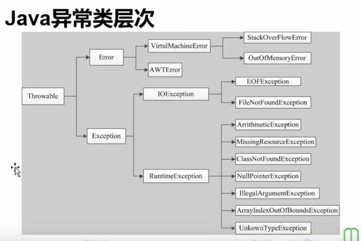
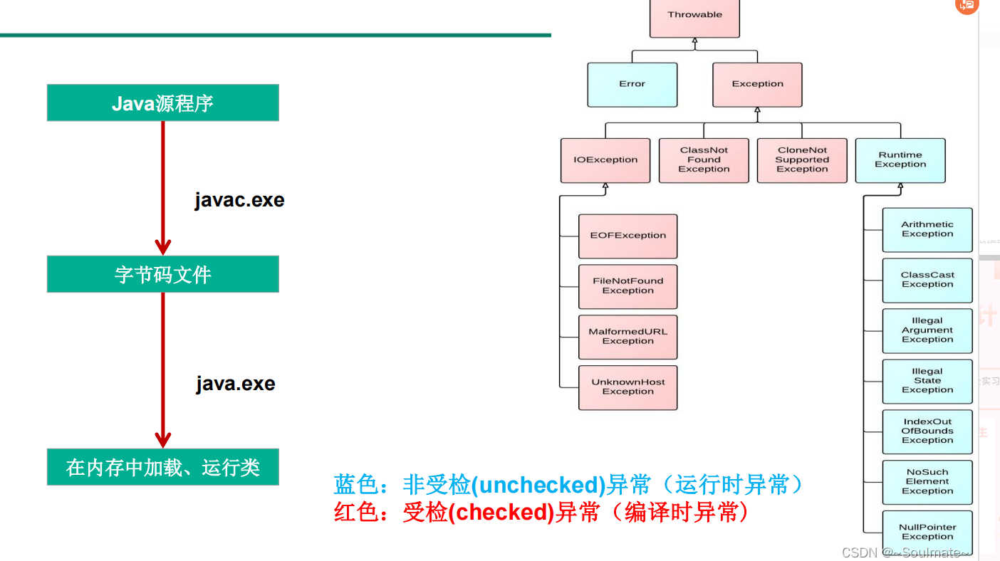

# Java异常
* Error ：JVM内部错误、资源耗尽等严重情况
* Exception：一般性问题
  * 空指针访问
  * 读取不存在文件
  * 网络连接中断
#### java.lang.ArrayIndexOutOfBoundsException数组越界异常
#### java.lang.NullPointerException空指针异常
```java
class A{
    int i;
}

A a = null;
System.out.println(a.i);
```
#### java.lang.ArithmeticException: / by zero除0异常

* StackOverFlowError 栈溢出
* OutOfMemoryError 内存溢出
* RuntimeException 运行时异常

# 异常处理机制

### 程序通常之能处理Exception，Error无法处理
* 捕获try-cash

```java
int i = 0;
try {//用try()来括住一段有可能出现异常的代码段
    System.out.println(3 / i);//由于异常使程序中断，可以通过异常处理机制防止程序中断
}catch (Exception e){//当不知道捕获的是什么类型的异常时，用所有异常的父类Exception
    e.printStackTrace();//打印出捕获的异常
    System.out.println(e.getMessage());//输出/by zero
}
System.out.println("ok");
```

#### 输出
```java
java.lang.ArithmeticException: / by zero
	at day10.Test.main(Test.java:16)
/ by zero
ok

```

#### finally 最终会执行的代码
```java
int i = 0;
try {//用try()来括住一段有可能出现异常的代码段
    System.out.println(1);
    System.out.println(3 / i);//由于异常使程序中断，可以通过异常处理机制防止程序中断
    System.out.println(2);
}catch (Exception e){//当不知道捕获的是什么类型的异常时，用所有异常的父类Exception
//            e.printStackTrace();//打印出捕获的异常
//            System.out.println(e.getMessage());//输出/by zero
    System.out.println(3);
}finally {//可写也可不写，最终一定会执行的部分，未来IO操作和JDBC会用到  
    System.out.println(4);
}
System.out.println("ok");
```
#### 输出
```java
1
3
4
ok
```
#### 多个cash时捕获到第一个异常后**后面的程序（try{}代码块中)都不会执行**
```java
String[] strs = new String[]{"a", "b"};
A a = null;

try{
    System.out.println(strs[2]);
    System.out.println(a.i);
}catch (ArrayIndexOutOfBoundsException e1){
    e1.printStackTrace();
}catch (NullPointerException e2){
    System.out.println(e2.getMessage());
}finally {
    System.out.println("finally");
}
```
#### 输出(并没有输出空指针异常，只输出了数组越界异常)
```java
java.lang.ArrayIndexOutOfBoundsException: 2
	at day10.Test.main(Test.java:32)
finally
```

#### catch代码块的异常类顺序一定是先子类后父类，否则直接编译时异常。
```java
try {
    int i = 3/0;
    //ArithmeticException必须在Exception前面
} catch (ArithmeticException e) {
    System.out.println("A异常");
} catch (Exception e) {
    System.out.println("E异常");
}
//输出:A异常，当异常被ArithmeticException捕获后不会再被Exception捕获
```


* 抛出
#### 抛出异常时将异常交给调用者处理
#### 如果调用的函数抛出了异常，要么本方法继续抛出异常，要么使用try-catch捕获异常,不然编译报错。
* 异常又分为运行时异常RuntimeException和编译时异常
* 抛出编译时异常的时候需要继续抛出或者使用try-catch捕获异常


```java
class B{
    int i;
    public void test() throws NullPointerException{
        // throws 代码抛出异常，在调用方去处理
        B b = null;
        System.out.println(b.i);
    }
}


B b = new B();
try{// throws 抛出异常，在调用方法处理
    b.test();
}catch (Exception e){
    e.printStackTrace();
}
System.out.println("ok");
```
#### 输出
```java
java.lang.NullPointerException
	at day10.B.test(Test1.java:20)
	at day10.Test1.main(Test1.java:7)
ok
```
#### 子类重写父类方法时，子类不能抛出比父类抛出的更大的异常

<br>

#### 也可以人工抛出异常(自定义异常)
```java
class B {
    int age;

    public void test1(int age) throws Exception {
        if (age >= 0 && age <= 150) {
            this.age = age;
            System.out.println("年龄是:" + this.age);
        } else {
            throw new Exception("年龄不在0~150之间");
        }
    }
}


B b = new B();
try {
    b.test1(-100);
} catch (Exception e) {
    e.printStackTrace();
}
```

* 抛出异常后线程中止
* 如果想要运行抛出异常后的内容需要用try-catch包裹throw
#### 输出
```java
java.lang.Exception: 年龄不在0~150之间
	at day10.B.test1(Test1.java:38)
	at day10.Test1.main(Test1.java:16)
```

#### 也可以创建用户自定义异常类
```java
class MyException extends Exception{
    public MyException(String msg) {
        super(msg);//调用父类的构造方法
    }
}
```

```java
class B {
    int age;
    public void test2(int age) throws MyException{
        if(age >= 0 && age <= 150){
            this.age = age;
            System.out.println("年龄是：" + this.age);
        }else{
            throw new MyException("年龄不在0~150之间");
        }
    }
}
```

```java
B b = new B();
try {
    b.test2(-100);
} catch (MyException e) {
    e.printStackTrace();
}
```

```java
day10.MyException: 年龄不在0~150之间
	at day10.B.test2(Test1.java:55)
	at day10.Test1.main(Test1.java:23)
```

#### Java提供的异常类一般是够用的，一般只在特殊情况下使用异常类