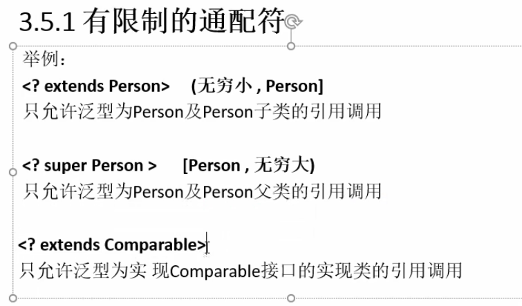

# 泛型
* Java中的泛型只在编译阶段有效，泛型信息不会进入运行阶段

# 泛型使用
## 3.1 泛型类
```java
/**
 * 此处的泛型T可以任意的取名，叫啥都行，一般要大写，代表是类的类型
 * 一般使用T，意为type
 * @param <T>
 */
class A<T>{
    private T key;

    public T getKey() {
        return this.key;
    }

    public void setKey(T key) {
        this.key = key;
    }
}
```

```java
A<String> a1 = new A<String>();
a1.setKey("le");
System.out.println(a1.getKey());//le

A<Integer> a2 = new A<Integer>();
a2.setKey(132);
System.out.println(a2.getKey());//132

A a3 = new A();//不指定泛型相当于指定Object类型
a3.setKey(new Object());
System.out.println(a3.getKey());//java.lang.Object@131245a

//同样的类，指定不同的泛型，不能相互赋值
a1 = a2;//报错
```

## 3.2 泛型接口
```java
interface IB<T>{
    T test(T t);
}

/**
 * 未传入泛型实参定义,泛型的声明也要加入类中（类也要声明泛型<T>）
 * @param <B>
 */
class B1<B> implements IB<B>{

    @Override
    public B test(B t) {
        return t;
    }
}

/**
 * 实现接口时指定了泛型的具体数据类型
 * 这个类实现接口所以方法的位置都要替换成具体数据类型
 */
class B2 implements IB<String>{

    @Override
    public String test(String s) {
        return null;
    }
}
```

```java
B1<String> b1 = new B1<String>();
System.out.println(b1.test("le"));//le

B2 b2 = new B2();
System.out.println(b2.test("le"));//null
```

## 3.3 泛型方法
* 修饰符后面跟上泛型

```java
class Cc{

    /**
     * 静态方法的泛型方法
     * @param t
     * @param <T>
     */
    public static <T> void test3(T t){
        System.out.println(t);
    }

    /**
     * 无返回值的泛型方法
     * @param s
     * @param <T>
     */
    public <T> void test(T s){
        System.out.println(s);
    }

    /**
     * 有返回值的泛型方法
     * @param t
     * @param <T>
     * @return
     */
    public <T> T test1(T t){
        return t;
    }

    /**
     * 形参为可变参数类型的泛型方法
     * @param ts
     * @param <T>
     */
    public <T> void test2(T... ts){
        for(T t : ts){
            System.out.println(t);
        }
    }
}
```

```java
Cc cc = new Cc();
/*
泛型方法在调用前没有固定的数据类型，
在调用是，输入的参数是什么类型，就会把泛型改成什么类型
也就是说泛型方法会在调用时确定泛型的具体类型
*/
cc.test("xxxx");
cc.test(123);
Boolean b1 = cc.test1(true);
```

## 3.4 通配符是(?)

```java
/**
* test方法需要一个list集合，不确定list集合存的数据类型是什么
* @param list
*/
public void test(List<?> list){
}
```

### 3.5.1 有限制的通配符


