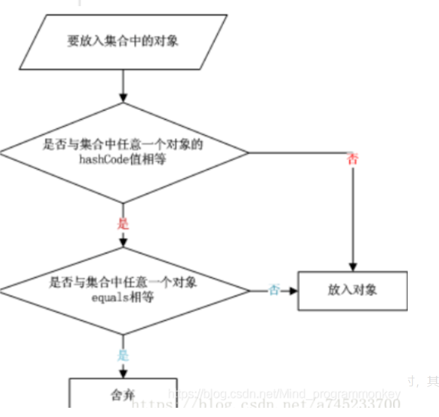
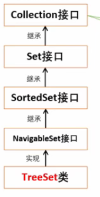
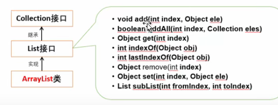

# 集合概述
* 集合类存在java.util包中
* 集合之内存放对象，如果存放基本数据类型，则会自动转换为对应的引用类型再存储
* 集合存放的实际上还是对象的引用（地址）
* 集合可以存放不同类型，不限量的数据类型

<br>
* Java集合可以分为三大类
  * Set:无序不可重复
  * List:有序可重复
  * Map:有映射关系的集合

<br>

* JKD5之后加入了泛型，是的JAVA集合之内存对应类型的对象
* 泛型对象不能是基本数据类型

## HashSet
### 大多数使用Set就是使用HashSet
### 特点：
* 不能保证元素的排列顺序（存在set集合的那个位置由对象的hashCode决定）
* 就算两个元素hashCode一样也可以存进去(例如String"通话"和"重地"的hashCode是一样的)
* 不论是包含还是删除某个元素是操作equals()相等的元素，而不只是hashCode相等
* 不可重复
* 不是线程安全
* 可以存null
  * null算一个元素
* 放入对象的流程:



* 一般要保证:
  * 两个对象的equals()相等，hashCode()必相等
  * 两个对象的hashCode()相等，equals()不一定相等。
  * **相等的对象必须拥有相等的hash code**

  
```java
Set set = new HashSet();
/*
添加元素的时候会返回boolean值，
表示添加的元素是否已经存在
*/
set.add(1);//添加元素
set.add("a");
System.out.println(set);

set.remove(1);//移除元素
System.out.println(set);

System.out.println(set.contains(1));//判断是否包含元素

set.clear();//清空集合
System.out.println(set);

set.add("a");
set.add("b");
set.add("c");
set.add("d");
set.add("a");//展示不可重复
set.add(null);//set可以存null
System.out.println(set);

/*
addAll()和removeAll()
输入参数是集合
可以添加或者删除这个集合中的所有元素
返回值是boolean，表示是否正常添加/删除
关于removeAll
如果输入的集合有一部分是原集合有的元素，有一部分是原集合没有的
那么只会删除有的元素同时返回true
containsAll()是是否包含指定集合中所有的元素
*/
Set<String> ss = new HashSet<>();
ss.add("123");
ss.add("46");
set.addAll(ss);
System.out.println(set);
ss.add("a");
ss.add("abc");
System.out.println(set.removeAll(ss));;
System.out.println(set);

//使用迭代器便利集合
Iterator it = set.iterator();

while (it.hasNext()){//如果迭代器中有下一个
    System.out.println(it.next());
}

//for each迭代集合
for (Object obj: set) {//将set的每个值取出来赋值给obj直到循环set所有值
    System.out.println(obj);
}

//输出集合大小
System.out.println(set.size());
```

```java
[1, a]
[a]
false
[]
[null, a, b, c, d]
null
a
b
c
d
null
a
b
c
d
5
```

### 指定泛型
```java
//如果想要集合只能存相同类型的对象
//那么该使用泛型
//以下指定String为集合泛型
Set<String> set1 = new HashSet<String>();

set1.add("a");
set1.add(1);//报错

//指定所有类型
Set set = new HashSet();
Set<Object> set = new HashSet<Object>();//与上面等价
```

## TreeSet
### 确保元素属于排序状态
### 支持自然排序和定制排序（默认是自然排序）

#### 使用方法和set一样
* 但是不能存储null，null也无法和其它元素比较排序
```java
Set<Integer> set = new TreeSet<Integer>();

//TreeSet自然排序
set.add(5);
set.add(2);
set.add(4);
set.add(3);
System.out.println(set);//[2,3,4,5]

set.remove(5);
System.out.println(set);//[2,3,4]

System.out.println(set.contains(3));//true

set.clear();
System.out.println(set);//[]

set.add(5);
set.add(2);
set.add(4);
set.add(3);
//遍历集合
Iterator<Integer> it = set.iterator();
while(it.hasNext()){
    System.out.println(it.next());
}

for(Integer integer : set){
    System.out.println(integer);
}
```
### TreeSet会调用集合元素的compareTo(Object obj)方法比较元素大小关系然后按照元素升序排序
### **必需放入同类型的对象**，否则可能会发生类型转换异常

<br>

### 自定义对象排序
```java
class Person implements Comparator<Person> {
    //将Person对象存到TreeSet中并按照年龄排序
    int age;
    String name;

    public Person() {
    }

    public Person(int age, String name) {
        this.age = age;
        this.name = name;
    }

    @Override
    public int compare(Person o1, Person o2) {//年龄正序排列
        if(o1.age > o2.age){
            return 1;
        }else if(o1.age < o2.age){
            return -1;
        }else{
            return 0;
        }

    }
}
```

```java
Person p1 = new Person(23, "zhangsan");
Person p2 = new Person(24, "lisi");
Person p3 = new Person(29, "lucy");

Set<Person> set = new TreeSet<Person>(new Person());
set.add(p1);
set.add(p2);
set.add(p3);

for(Person p : set){
    System.out.println(p.age + "" + p.name);
}
```
#### **注意这里这样写的话年龄一样算作一个元素**

## List与ArrayList

* 元素有序可重复
* 可以通过索引来访问集合
* 按照元素添加顺序设定索引
* ArrayList是线程不安全的

```java
List<String> list = new ArrayList<String>();
/*
list的add(E element)函数有返回值，表示list是否被更改
list的add(int index, E element)函数没有返回值
list的addAll(Collecton<? extends E> c)和
addAll(int index, Collecton<? extends E> c)都有返回值
表示list是否被更改
*/
list.add("a");//第一个索引下标0
list.add("b");
list.add("c");
list.add("d");
list.add("a");
System.out.println(list);//[a,b,c,d,a]
System.out.println(list.get(2));//c

// 取值用get
list.get(0);

list.add(1, "f");//指定下标处插入数据,其它数据后移
list.add(1, "g");
System.out.println(list);//[a,g,f,b,c,d,a]

List<String> l = new ArrayList<String>();
l.add("123");
l.add("456");
//指定索引插入集合
/*
addAll返回一个boolean值，告知原集合是否改变
*/
list.addAll(3, l);
System.out.println(list);//[a,g,f,123,456,b,c,d,a]

/*
contains()和containsAll()
返回集合是否含有这些元素，containsAll()全部包含时才返回true
*/

//获取指定元素在指定集合中第一次出现的下标
System.out.println(list.indexOf("a"));
//获取指定元素在指定集合中最后一次出现的下标
System.out.println(list.lastIndexOf("a"));
//如果list中没有该元素将返回-1

//移除元素(根据索引或者元素本身移除）
/*
remove返回boolean值
告知列表中是否含有该元素
*/
list.remove("a");//只移除第一个
System.out.println(list);//[g,f,123,456,b,c,d,a]
// 如果是remove(int index)删除会返回删除的元素
// 如果越界会抛出异常
list.remove(0);
System.out.println(list);//[f,123,456,b,c,d,a]
/*
removeAll输入是一个集合
会删除掉该集合中出现的所有元素，
返回值代表原集合是否被改变
和remove不同，如果原集合中出现了多个相同的元素要被删除时，
这些元素会全部被删除而不只是被删除第一个
*/
List<String> l = new ArrayList<>();


//根据指定下标修改list中值,返回原理的值
list.set(0, "ff");
System.out.println(list);//[ff, 123, 456, b, c, d, a]

//根据索引下标的起始位置截取一段元素形成一个新的集合
//截取时包含开始索引不包含结束索引
List<String> sublist = list.subList(1,3);
System.out.println(sublist);//[123,456]

//长度
System.out.println(list.size());//7
```

## Map
* 存有映射关系的数据
* key和value都可以是引用各种类型
* 通过指定的key能找到确定的value
* HashMap是对Map的一个经典实现
* Hashtable是个古老的Map实现类，不建议使用
* Hashtable线程安全，HashMap线程不安全
* Hashtable不允许使用null作为key和value但是HashMap可以

```java
Map<String,Integer> map = new HashMap<String,Integer>();

//map保存数据
map.put("b", 1);
map.put("c", 2);
map.put("e", 1);
System.out.println(map);//{b=1, c=2, e=1}

// 存入另一个map
Map<String, Integer> mm = new HashMap<>();
mm.put("e", 5);
mm.put("f", 6);
map.putAll(mm);

//map取值
System.out.println(map.get("b"));//1

//移除键值对
//返回对应的value值，如果map中没有输入的key则返回null(如果对应value为null也返回null)
//和set与list不同map没有removeAll
map.remove("c");
System.out.println(map);//{b=1, e=1}

//长度
System.out.println(map.size());//2

//是否包含
System.out.println(map.containsKey("c"));//false
System.out.println(map.containsKey("b"));//true
System.out.println(map.containsValue(1));//true
System.out.println(map.containsValue(10));//false

//清空集合
map.clear();
System.out.println(map);//{}

map.put("b", 1);
map.put("c", 2);
map.put("e", 1);

/*
修改map中的内容，
可以直接用put，
也可以用replace
*/
map.put("b", 3)//返回1
map.put("f", 1)//返回null
map.replace("b", 1)//返回3
map.repalce("g", 1)//返回null

//遍历map集合
//获取集合的所有key的集合,返回一个Set<String>
System.out.println(map.keySet());//[b,c,e]
//获取集合的所有value值,返回一个Collection<Integer>
System.out.println(map.values());//[1,2,1]

//通过map.keySet()遍历
for(String key : map.keySet()){
    System.out.println("Key:" + key + ", value:" + map.get(key));
}

//通过map.entrySet();遍历
Set<Map.Entry<String, Integer>> entries = map.entrySet();
for(Map.Entry<String, Integer> en : entries){
    System.out.println("Key:" + en.getKey() + ", value:" + en.getValue());
}

//TreeMap是一个自动排序的Map
Map<String, Integer> map1 = new TreeMap<String, Integer>();
map1.put("a", 0);
map1.put("ab", 1);
map1.put("c", 1);
map1.put("123", 0);
map1.put("234", 0);
System.out.println(map1);//{123=0, 234=0, a=0, ab=1, c=1}
```

# 操作集合的工具类：Collections
* 一般只能操作list
```java
class Student implements Comparator<Student>{
    int age;
    String name;

    public Student() {
    }

    public Student(int age, String name) {
        this.age = age;
        this.name = name;
    }

    //根据年龄倒叙排列对象
    @Override
    public int compare(Student o1, Student o2) {
        if(o1.age > o2.age){
            return -1;//倒叙排列
        }else if(o1.age < o2.age){
            return  1;
        }else{
            return 0;
        }
    }
}
```

```java
List<String> list = new ArrayList<String>();
list.add("b");
list.add("cd");
list.add("ca");
list.add("a");
list.add("1");
list.add("d");

System.out.println(list);//[b, cd, ca, a, 1, d]

//顺序反转，没有返回值
Collections.reverse(list);
System.out.println(list);//[d, 1, a, ca, cd, b]

//随机排序,没有返回值
Collections.shuffle(list);
System.out.println(list);//[1, b, ca, cd, d, a]

//字典升序排列,没有返回值
Collections.sort(list);
System.out.println(list);//[1, a, b, ca, cd, d]


Student s1 = new Student(14, "zhangsan");
Student s2 = new Student(14, "lisi");
Student s3 = new Student(15, "wangwu");
Student s4 = new Student(16, "lucy");

List<Student> stus = new ArrayList<Student>();
stus.add(s1);
stus.add(s2);
stus.add(s3);
stus.add(s4);

for(Student stu : stus){
    System.out.println(stu.age + " " + stu.name);
}

//排序
Collections.sort(stus, new Student());
System.out.println("----------------------");
for(Student stu : stus){
    System.out.println(stu.age + " " + stu.name);
}
/*
结果
16 lucy
15 wangwu
14 zhangsan
14 lisi
    */

//指定调换集合中元素,没有返回值
Collections.swap(list, 0 ,4);
System.out.println(list);//[cd, a, b, ca, 1, d]

//输出最大最小值
System.out.println(Collections.max(list));//d
System.out.println(Collections.min(list));//1

//根据Comparator来确定最大最小值
System.out.println(Collections.max(stus, new Student()).name);//zhangsan
System.out.println(Collections.min(stus, new Student()).name);//lucy

list.add("a");
list.add("a");
//返回指定元素出现次数
System.out.println(Collections.frequency(list, "a"));//3
System.out.println(Collections.frequency(list, "bucunzai"));//0

//新值换旧值
//返回一个boolean值表示原list中是否含有旧值
System.out.println(list);//[cd, a, b, ca, 1, d, a, a]
Collections.replaceAll(list, "a", "aa");
System.out.println(list);//[cd, aa, b, ca, 1, d, aa, aa]
```