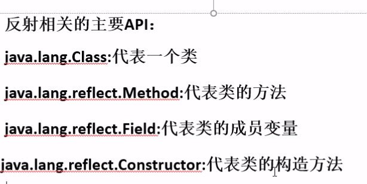

# 反射（Reflection）

* 前提：已经加载过这个类
* 可以通过类名来寻找这个类的所有相关信息




## 1. Class类
* 一个类在JVM中只有一个Class实例
* 一个Class对象对应的是一个加载到JVM中的一个.class文件
* **通过Class可以完整的获得一个类的完整结构**

```java
//clazz对象就包含了p对象所属类的所有信息
Class clazz = p.getClass();
```


### Class类的创建方式

```java
//通过类名创建Class对象
Class c0 = Person.class;

//通过实例创建Class对象
Class c1 = p.getClass();

//通过类的全路径来获取（包名.类名）
//这是常用方式
Class c2 = Class.forName("day14.Person");
```

## 2. 通过反射调用类的完整结构 

* 下面作为反射示例的类

```java
public class Student extends Person implements Move, Study{

    String school;

    public Student() {
//        System.out.println("无参构造");
    }

    public Student(String school) {
//        System.out.println("一个参数");
        this.school = school;
    }

    private Student(String name, int age){
        this.name = name;
        this.age = age;
    }

    public void showInfo(){
        System.out.println(this.school);
    }

    @Override
    public void moveType() {
        System.out.println("走路");
    }

    @Override
    public void studyInfo() {
        System.out.println("学习");
    }
}
```

* 获得类的接口和父类

```java
Class clazz = Class.forName("day14.Student");
//获取父类
Class superClass = clazz.getSuperclass();
System.out.println(superClass.getName());//day14.Person

//获得实现接口的数组
Class[] interfaces = clazz.getInterfaces();
for(Class c : interfaces){
    System.out.println(c.getName());
}

```

## 3.获取类的全部构造器
* getConstructors是获得类的公有(public)的构造方法
* getDeclaredConstructors是获得类的所有方法，包括公私有

```java
try {
    Class clazz = Class.forName("day14.Student");

    //获取父类
    Class superClass = clazz.getSuperclass();
    System.out.println(superClass.getName());//day14.Person

    //获得实现接口的数组
    Class[] interfaces = clazz.getInterfaces();
    for(Class c : interfaces){
        System.out.println(c.getName());
    }

    Constructor[] cons = clazz.getConstructors();
    for(Constructor c : cons){
        //获取方法名称
        System.out.println(c.getName());
        //获取修饰符
        /*
        返回数字1代表public
        返回数字2代表private
            */
        System.out.println(c.getModifiers());//1

        //有几个参数，数组就有几个元素
        Class[] paramClazz = c.getParameterTypes();
        for(Class pc : paramClazz){
            System.out.println("构造方法：" + c.getName() + "的参数类型是:" + pc.getName());
            //输出：构造方法：day14.Student的参数类型是:java.lang.String
            //构造方法：day14.Student的参数类型是:int
        }

    }

    Constructor[] cons1 = clazz.getDeclaredConstructors();//获取所有的构造方法
    for(Constructor c : cons1){
        //获取方法名称
        System.out.println(c.getName());
        //获取修饰符
        System.out.println(c.getModifiers());//1，2

        Class[] paramClazz = c.getParameterTypes();
        for(Class pc : paramClazz){
            System.out.println("构造方法：" + c.getName() + "的参数类型是:" + pc.getName());
            //输出：构造方法：day14.Student的参数类型是:java.lang.String
        }
    }

} catch (Exception e) {
    e.printStackTrace();
}
```

## 用反射的方法创建对象

```java
 try {
    Class clazz = Class.forName("day14.Student");
    //用反射的方法创建对象

    /*
    newInstance（）相当于调用的无参构造方法
        */
    Student stu = (Student) clazz.newInstance();
    System.out.println(stu.school);//null

    /*
    指定获取有一个参数类型为String类型的共有的构造方法
        */
    Constructor c = clazz.getConstructor(String.class);
    //通过newInstance构造对象
    Student stu1 = (Student) c.newInstance("一中");
    System.out.println(stu1.school);//一中

    /*
    通过反射机制强制调用私有的构造方法
        */
    //调用有两个参数的构造方法，这两个参数分别为String和Int
    //注意这里不能写Integer.class,要写int.class
    Constructor c1 = clazz.getDeclaredConstructor(String.class, int.class);
    /*
    解除掉私有的封装
    下面才可以对该方法强制调用
        */
    c1.setAccessible(true);
    Student stu2 = (Student) c1.newInstance("zhangSan", 15);
    System.out.println(stu2.age + "," + stu2.name);//15,zhangSan

} catch (Exception e) {
    e.printStackTrace();
}
```

## 用反射获取类的方法

```java
try {
    Class clazz = Class.forName("day14.Student");
    /*
    获取到类的所有公有方法
    包含父类的方法
    */
//            Method[] ms = clazz.getMethods();

    /*
    获取类的所有方法包括公有和私有
    不包含父类的方法
    */
    Method[] ms = clazz.getDeclaredMethods();
    for(Method m : ms){
        System.out.println("方法名：" + m.getName());
        // 1代表public，2代表private，0代表缺省，4代表protected
        System.out.println("返回值：" + m.getReturnType());
        System.out.println("修饰符：" + m.getModifiers());

        /*
        获取参数类型，是一个数组
        */
        Class[] pos = m.getParameterTypes();
        if(pos != null && pos.length > 0){
            for(Class pc : pos){
                System.out.println("参数类型" + pc.getName());
            }
        }

        System.out.println("=====================");
    }

} catch (ClassNotFoundException e) {
    e.printStackTrace();
}
```
* 注意:**得到的方法不包括父类的方法**

## 用反射获取类的属性和包

```java
try {
    Class clazz = Class.forName("day14.Student");

    /*
    获取类的公有属性
    包含了父类的属性
    */
//            Field[] fs = clazz.getFields();

    /*
    获取所有属性包括私有
    不包含父类的属性
    */
    Field[] fs = clazz.getDeclaredFields();
    for(Field f : fs){
        System.out.println("属性名称：" + f.getName());
        System.out.println("修饰符：" + f.getModifiers());
        System.out.println("属性类型：" + f.getType());
        System.out.println("================================");
    }

    /*
    获得类所在的包
    */
    Package p = clazz.getPackage();
    System.out.println(p.getName());//day14

} catch (ClassNotFoundException e) {
    e.printStackTrace();
}
```

## 通过反射调用指定方法

```java
try {
    Class clazz = Class.forName("day14.Student");
    /*
    得到名称是setInfo
    参数是String,String的方法
    */
    Method m = clazz.getMethod("setInfo", String.class, String.class);

    //获取无参构造
    Constructor c = clazz.getConstructor();
    //使用无参构造创建对象
    Object obj = c.newInstance();
    /*
    使用invoke调用
    参数1是需要实例化的对象
    后面的参数是调用当前方法的实际参数
    */
    m.invoke(obj, "张三", "一中");


    /*
    如果想要调用一个私有方法
    */
    Method m1 = clazz.getDeclaredMethod("test", String.class);
    /*
    解除私有封装
    强制调用私有方法
    */
    m1.setAccessible(true);
    m1.invoke(obj, "李四");

    /*
    调用一个重载方法
    */
    Method m2 = clazz.getMethod("setInfo", int.class);
    m2.invoke(obj, 1);

    /*
    有返回值的方法
    */
    Method m3 = clazz.getMethod("getSchool");
    String school = (String) m3.invoke(obj);
    System.out.println(school);

}catch (Exception e){
    e.printStackTrace();
}
```

## 调用指定属性
```java
try {

    Class clazz = Class.forName("day14.Student");

    /*
    反射创建一个对象
    */
    Constructor c = clazz.getDeclaredConstructor(String.class, int.class);
    c.setAccessible(true);
    Student stu = (Student) c.newInstance("张三", 11);

    /*
    获取名称为school的属性
    */
    Field f = clazz.getField("school");
    f.set(stu, "第三中学");
    String school = (String) f.get(stu);
    System.out.println(school);//第三中学

    Field f1 = clazz.getField("name");
    System.out.println((String) f1.get(stu));//张三


}catch (Exception e){
    e.printStackTrace();
}
```

## Java动态代理


* 接口

```java
public interface ITestDemo {
    void test1();
    void test2();

}
```

* 实现

```java
public class TestDemoImpl implements ITestDemo{
    @Override
    public void test1() {
        System.out.println("执行test1方法");
    }

    @Override
    public void test2() {
        System.out.println("执行test2方法");
    }
}
```

* 动态代理

```java
/**
 * 这是动态代理类
 */
public class ProxyDemo implements InvocationHandler {

    Object obj; //被代理的对象

    public ProxyDemo(Object obj) {
        this.obj = obj;
    }

    @Override
    public Object invoke(Object proxy, Method method, Object[] args) throws Throwable {

        System.out.println(method.getName() + "开始执行");

        Object result = method.invoke(this.obj, args);//执行的是代理对象指定的方法

        System.out.println(method.getName() + "执行完毕");

        return result;
    }
}
```

* 调用

```java
ITestDemo test = new TestDemoImpl();

/*
注意一个对象想要通过Proxy.newProxyInstance方法被代理
那么对象的类一定要有相应的接口
就像本例中的ITestDemo和ITestDemoImpl接口一样
*/

test.test1();
test.test2();
System.out.println("=================");

/*
动态代理
*/

InvocationHandler handler = new ProxyDemo(test);

/*
第一个参数：代理对象的类加载器
参数二：被代理的对象的接口
参数三：是代理对象
返回值就是成功被代理后的对象,返回的object类型，需要强制转换类型
*/
ITestDemo t = (ITestDemo) Proxy.newProxyInstance(handler.getClass().getClassLoader(),
        test.getClass().getInterfaces(),
        handler);

t.test1();
t.test2();
```