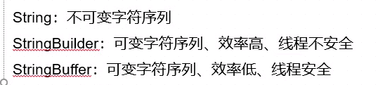

# String
## String常用函数

```java
/*
构建字符串对象
    */
//字面量方式
String s0 = "Hello";
//构造方法
String s1 = new String("sss");
//通过char数组
char[] chs = new char[]{'a', 'b', 'c', 'd'};
String s2 = new String(chs);
System.out.println(s2);
//通过部分的char数组
/*
参数1 ： char数组
参数2 ： 起始位置
参数3 ： 读几个元素
    */
String s3 = new String(chs, 1, 2);
System.out.println(s3);//bc
System.out.println("===========================");

/*
判断(以某个字符串)开头结尾
    */
String s4 = "Hello";
System.out.println(s4.startsWith("Hel"));//true
System.out.println(s4.endsWith("lo"));//true

/*
CompareTo
按字典顺序对指定字符串进行比较
1.先比较两个字符串第一个字符，如果不同，就不用往下比，直接计算第一位两个字符的差
如果第一位相同，就比较第二位。。。
依次往下比较
2.如果在比较的过程中，字符串都相同，只是一个字符串比另一个字符串长
比如“abcd”与“abc”
这样的情况计算两个字符串长度的差（第一个字符串减第二个字符串）
3.如果两个字符串一样返回0
4.严格区分大小写
    */
System.out.println(s4.compareTo("hello"));//-32

/*
compareToIgnoreCass
    */
System.out.println(s4.compareToIgnoreCase("hello"));//0
System.out.println("==========================");

/*
判断字符串是否含有某个字符串
    */
System.out.println(s4.contains("llo"));//true
System.out.println("====================");

/*
indexOf
判断一个字符串在另一个字符串中所处的位置（默认从第0位开始）
fromIndex是重哪个元素开始看
如果不存在返回-1
    */
System.out.println("abcdebc".indexOf("bc"));//1
System.out.println("abcdebc".indexOf("bc", 3));//5

/*
lastIndexOf
获取一个字符串在另一个字符串中最后出现的位置
fromIndex也是重哪个元素开始看，不过是往前看
    */
System.out.println("abcdebc".lastIndexOf("bc"));//5
System.out.println("abcdebc".lastIndexOf("bc", 4));
System.out.println("===========================");

/*
关于这个从哪个元素开始:
如果是indexOf
"abcdabcd".indexof("abcd", 0) 输出是0
"abcdabcd".indexof("abcd", 1) 输出就是4了

如果是lastIndexOf:
"abcdabcd".lastIndexOf("abcd", 7) 输出是4
"abcdabcd".lastIndexOf("abcd", 6) 输出还是是4
"abcdabcd".lastIndexOf("abcd", 5) 输出还是是4
"abcdabcd".lastIndexOf("abcd", 4) 输出还是是4
"abcdabcd".lastIndexOf("abcd", 3) 输出才是0

可以这么看:
indexOf输出值一定大于等于fromIndex
lastIndexOf输出值一定小于等于fromIndex
*/

/*
字符串截取,从哪个位置向后执行到最后
开始和结束位置（不包括结束位置），原字符串不变
    */
System.out.println("hello".substring(1));//ello
System.out.println("hello".substring(1,3));//el
System.out.println("======================");

/*
去掉字符串前后空格
返回新的字符串，原字符串不变
    */
System.out.println("     hello      ".trim());//hello
System.out.println("======================");

/*
按照指定的字符串，把一个字符串切割成字符串的数组，原字符串不变
    */
String s5 = "hello,world,!!";
String[] strs = s5.split(",");
for (String str : strs) {
    System.out.println(str);
}
/*
结果：
hello
world
!!
    */
System.out.println("======================");


/*
替换字符串
和list中的replace不一样，是全部替换
将字符串中的老字符串替换成新字符串，原字符串不变
*/
System.out.println("abcdabcd".replace("b", "12"));//a12cda12cd
/*
replaceAll(s1, s2);可以用s2替换字符串中所有与正则表达式s1匹配的地方
*/
```

## 字符串转其它类型
```java
String s = "10";


/*
Xxxxx.parseXxxxx
(不包括char)
另外Boolean.parseBoolean(s);
情况下，只有s="true"的情况下为true
其它输入都为false
    */

/*
Xxxxx.parseXxxx(s)可以将字符串转化成基本数据类型
Xxxxx.valueOf(s)可以将字符串转化成封装类型
*/
int i = Integer.parseInt(s);
System.out.println(i);//10

System.out.println(Boolean.parseBoolean("true"));
```

## 字符串与字符数组
```java
char[] c1 = new char[10];
/*
起始截取位置
最终截取位置
(和subString一样包头不包尾)
存放的数组
从数组哪个位置开始放
    */
"abcdef".getChars(1, 3, c1, 1);
for (char c : c1) {
    System.out.println(c);
}
System.out.println("==================================");

/*
把字符串全部转化成一个字符串数组
*/
char[] c2 = "abcedfg".toCharArray();
for (char c : c2) {
    System.out.println(c);
}
System.out.println("===================");
```

## 字符串与字节数组
```java
 /*
字符串与字节数组相互转化(按照指定的编码)
*/
byte[] b = "abcdefg".getBytes(StandardCharsets.UTF_8);
System.out.println(new String(b));//abcdefg
/*
参数1：转化的字节数组
参数2：从哪一位开始转化
参数3：转化的长度
*/
System.out.println(new String(b, 1, 3));//bcd
```

## StringBuffer类

```java
//在内存中存在一个”我喜欢学习的对象“
String s = new String("我喜欢学习");
//在内存中存在又给”我喜欢学习数学的对象“
//实际上形成了两个对象，造成了浪费
//用StringBuffer就不会出现这种问题
s += "数学";

//内存中生成一个内容是”我喜欢学习”的StringBuffer对象
StringBuffer sb = new StringBuffer("我喜欢学习");
//改变之前的StringBuffer对象的内容为“我喜欢学习数学”
//内存中只存在了一个对象
sb.append("数学");

/*
从上面可以看出，如果使用s += "数学";来频繁改变字符串，
实际上会生成很多个对象，就会打量占用内存
而使用StringBuffer始终只有一个对象
    */
```

* 三种构造方法

```java
//构造一个空的StringBuffer对象
StringBuffer sb1 = new StringBuffer();
//构建一个空的StringBuffer对象，同时给对象初始化一定的内存空间
//但实际上当输入的内容大于初始化的空间时会自己扩展空间
StringBuffer sb2 = new StringBuffer(4);
sb2.append("asdfasdfeaafaeafsd");
System.out.println(sb2);
//直接根据字符串构造StringBuffer对象
StringBuffer sb3 = new StringBuffer("abcd");
```

* 常用方法
  * 注意StringBuffer的方法通常不仅会改变原StringBuffer的内容还会将该StringBuffer作为返回值

```java
//转化成字符串
System.out.println(sb2.toString());

//追加，可以追加任何基本类型
//可以使用append连续追加
sb3.append("!!");
sb3.append(true).append(1).append(1.14);
System.out.println(sb3.toString());//abcd!!true11.14

//获取某个位置上的字符
System.out.println(sb3.charAt(2));//c
//在某个位置上插入一个字符,会替换掉原来位置的字符
sb3.setCharAt(1, '*');
System.out.println(sb3.toString());//a*cd!!true11.14
//在某个指定位置插入字符串,后面的字符串依次后移
sb3.insert(1, "==");
System.out.println(sb3.toString());//a==*cd!!true11.14
//把原来的字符串倒序排列,并返回倒序的StringBuffer
//这里原来的StringBuffer也变成倒序的了
StringBuffer sb4 = sb3.reverse();
System.out.println(sb3.toString());//41.11eurt!!dc*==a
System.out.println(sb4.toString());//41.11eurt!!dc*==a

//删除对象[1,5)
//sb3和sb5都被删了
StringBuffer sb5 = sb3.delete(1, 5);
System.out.println(sb3.toString());//4eurt!!dc*==a
System.out.println(sb5.toString());//4eurt!!dc*==a

//替换某个位置,区间[1,3)
//如果替换的长度和区间长度不一样，后面的部分相应前移或者后移
StringBuffer sb6 = sb3.replace(1,3, "666");
System.out.println(sb3.toString());
System.out.println(sb6.toString());
```
* StringBuffer返回值都是StringBuffer的地址，所以改变StringBuffer改变一次，所有的接收返回值的变量都会改变，这一点和String有区别

## StringBuilder与StringBuffer用法基本一致
  * 唯一一点StringBuilder是线程不安全的而StringBuffer是线程安全的
  * 所谓的线程安全与线程不安全，是指作为线程的共享资源的时候，是否或发生错乱，如果不会就是线程安全的



# Data类与DataFormat类
* 在java.util包中，Data类无参构造对象获取本地时间

```java
//创建日期对象
//这个对象中的时间是new对象时程序运行所在机器的时间
Date date = new Date();
//这个时间是格林威治时间（GMT），国际标准时间
System.out.println(date);//Sat Feb 26 20:59:38 GMT+08:00 2022

/*
格式化
yyyy代表年份
MM代表月份
dd代表日
HH代表小时
mm代表分钟
ss代表秒

格式化的分隔符可以自由定义
    */
//创建日期格式化对象
DateFormat df = new SimpleDateFormat("yyyy-MM-dd HH:mm:ss");
//对日期进行格式化
String s = df.format(date);
System.out.println(s);//2022-02-26 21:01:42
```

## Calendar类
* 对日期字段之间进行操作


```java
Calendar c = Calendar.getInstance();

Date date = new Date();

c.setTime(date);

System.out.println(c.get(Calendar.YEAR));
//注意这个月份是0-11所以二月显示的是1
System.out.println(c.get(Calendar.MONTH));
System.out.println(c.get(Calendar.DAY_OF_MONTH));
//注意这里也是从周日开始算1-7，所以周六是7
System.out.println(c.get(Calendar.DAY_OF_WEEK));
System.out.println(c.get(Calendar.HOUR));//12小时制
System.out.println(c.get(Calendar.HOUR_OF_DAY));//24小时制
System.out.println(c.get(Calendar.MINUTE));
System.out.println(c.get(Calendar.SECOND));

//改属性
c.set(Calendar.YEAR, 2030);

//对属性做加减
c.add(Calendar.YEAR, -10);
System.out.println(c.get(Calendar.YEAR));

//返回Date
Date newDate = c.getTime();
DateFormat sf = new SimpleDateFormat("yyyy/MM/dd HH:mm:ss");
System.out.println(sf.format(newDate));//2020/02/26 21:21:00
```

# Math类

```java
//取绝对值
System.out.println(Math.abs(-1));//1

//三角函数(输入弧度)
System.out.println(Math.sin(Math.PI));//1.2246467991473532E-16

//平方根
System.out.println(Math.sqrt(4));//2.0
System.out.println(Math.sqrt(-4));//NaN
System.out.println(Double.isNaN(Math.sqrt(-1)));//true

//平方
System.out.println(Math.pow(2,10));//1024.0
System.out.println(Math.pow(2,-1));//0.5

//最大最小值
System.out.println(Math.max(3, 4));//4
System.out.println(Math.min(3, 4));//3

//随机数
//[0,1)之间Double类型的随机数
System.out.println(Math.random());

//对Double数据四舍五入
System.out.println(Math.round(3.99));//4

//把角度转化成弧度
System.out.println(Math.toRadians(60));//1.0471975511965976

//产生随机整数
public static int test2(int min, int max) {
    return (int) (min + Math.random() * (max - min + 1));
}
```

# BigDecimal类
```java
/*
在计算机中浮点型数据不能精确表示
*/
BigDecimal b1 = new BigDecimal(0.2);//不建议使用,出来的依旧不是精确表示的数
BigDecimal b2 = new BigDecimal("0.2");
BigDecimal b3 = new BigDecimal(Double.toString(0.2));
System.out.println(b3.toString());
System.out.println("========================");

//加减乘除
BigDecimal a = new BigDecimal("1.3");
BigDecimal b = new BigDecimal("2.9");
System.out.println(a.add(b));
System.out.println(a.subtract(b));
System.out.println(a.multiply(b));
//两个参数不能整除报错
//        System.out.println(a.divide(b));

/*
两个数字不能整除的时候要使用
public BigDecimal divide(BigDecimal divisor,int scale,java.math.RoundingMode roundingMode )
参数1是除数
参数2是保留后几位小数
参数3是舍入的方式
*/
System.out.println(a.divide(b, 2, RoundingMode.CEILING));

/*
BigDecimal做加减乘除都是生成一个BigDecimal对象对原来对象没有影响
*/
System.out.println(a);
```

* 关于RoundingMode参数:
  * [RoundingMode 参数详解](https://blog.csdn.net/hantangduhey/article/details/83508068)