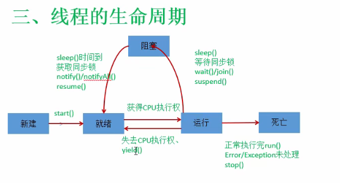
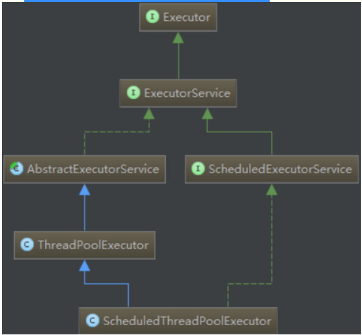

# 线程
## 1.基本概念
* CPU和CPU核数和主频
  * CPU中央处理器
  * CPU核数是CPU的物理核，代表同一个瞬时时间能处理的任务数
  * CPU在进程间频繁地切换，所有看起来能执行很多个进程
* 程序，就是静态的代码
* 进程，就是正在运行的程序（比如四核CPU能执行四个进程）
* 线程，一个程序内部可以同时执行多个子程序
  * 进程相当于一条河
  * 线程就相当于河流的分支

<br>

* 何时需要多线程
  * 同时执行两个或多个任务
  * 程序需要执行一些需要等待的任务
    * 用户输入
    * 文件读写
    * 网络操作
    * 搜索等
  * 需要一些后台运行的操作

## 多线程的创建和使用
* 通过java.lang.Thread来实现

<br>

### Thread的特性
* 想要在多线程中运行的代码逻辑写道run方法里
* start()用来启动线程，本质上来运行run方法

<br>

### 创建线程的两种方式
### 方法一
* 继承Thread类
* 子类中重写run方法
* 创建Thread子类对象，既创建了线程对象
* 调用线程对象的start方法：启动线程，调用run方法

```java
/**
 * 继承Thread类的方法实现多线程
 */
public class TestThread extends Thread{
    @Override
    public void run() {
        System.out.println("线程运行的主逻辑");
        for (int i = 0; i < 5; i++) {
            System.out.println("这是多线程的逻辑代码:" + i);
        }
    }
}
```

```java
Thread t0 = new TestThread();
t0.start();//启动线程开始运行run方法中的代码
System.out.println("======================");
System.out.println("======================");

/*
从控制台多次运行main方法之后
发现main打印的两行分隔符与开启线程运行的run方法中的打印语句是混合起来的
而且main方法中的语句与run方法中打印语句的顺序是不固定的

因为在main执行t0.start()开启多线程之后，就相当于在main方法中开启一个支流
两者并行运行，像两条河流一样，各走各的
控制台输出的结果就是两条并行程序的运行结果的总和
拆开看是各自保持自己的输出顺序
这就是多线程的异步性(没有顺序关系)（同步就是严格从上到下执行）
*/
```

### 注意：**可以同个主程序中可以开辟多个线程，这多个线程之间也是异步的**

### 方法二
* 实现Runnable接口

```java
/**
 * 通过实现Runnable方式实现多线程
 */
public class TestRunnable implements Runnable{

    @Override
    public void run() {
        System.out.println(Thread.currentThread().getName() + ":Runnable多线程运行的代码");
        for (int i = 0; i < 5; i++) {
            System.out.println(Thread.currentThread().getName() + ":这是Runnable多线程的逻辑代码:" + i);
        }
    }
}
```

```java
//需要传入一个Runnable实例
Thread t3 = new Thread(new TestRunnable());
t3.start();
System.out.println("========================");

/*
参数1：一个Runnable实例
参数2：线程名称
加上名字可以在控制台上清楚的看到各个线程的执行情况
默认是Thread-i(i = 0,1,2,3...)
*/
Thread t4 = new Thread(new TestRunnable(), "t-1");
t4.start();
```

#### 两种方法的联系与区别
* 区别
  * 一个是继承Thread类，重写Thread类中的run方法
  * 一个是实现Runnable接口，实现Runnalbe类的run方法
* 联系
  * 都是通过Thread父类的start()方法开启线程

<br>

* 一般使用实现接口的方式实现多线程
  * 避免了单继承的局限性
  * 多个线程可以共享同一个接口实现类的对象


```java
/**
 * 通过实现Runnable方式实现多线程
 */
public class TestRunnable implements Runnable{

    int count = 0;

    @Override
    public void run() {
        System.out.println(Thread.currentThread().getName() + ":Runnable多线程运行的代码");
        for (int i = 0; i < 5; i++) {
            count ++;
            System.out.println(Thread.currentThread().getName() + ":这是Runnable多线程的逻辑代码:" + count);
        }
    }
}
```

```java
Runnable run = new TestRunnable();
Thread t6 = new Thread(run, "t-1");
Thread t7 = new Thread(run, "t-2");
t6.start();
t7.start();

/*
这两个多线程共享了count资源

输出：
t-2:Runnable多线程运行的代码
t-1:Runnable多线程运行的代码
t-2:这是Runnable多线程的逻辑代码:1
t-1:这是Runnable多线程的逻辑代码:2
t-2:这是Runnable多线程的逻辑代码:3
t-1:这是Runnable多线程的逻辑代码:4
t-1:这是Runnable多线程的逻辑代码:6
t-1:这是Runnable多线程的逻辑代码:7
t-2:这是Runnable多线程的逻辑代码:5
t-1:这是Runnable多线程的逻辑代码:8
t-2:这是Runnable多线程的逻辑代码:9
t-2:这是Runnable多线程的逻辑代码:10

进程已结束,退出代码0
*/
```

### 优点


## Thread类的相关方法
```java
Runnable run0 = new TestRun();
Runnable run1 = new TestRun();

Thread t0 = new Thread(run0);
Thread t1 = new Thread(run1);

//设置线程优先级
t1.setPriority(10);

t0.start();
t1.start();

//设置线程名称
t0.setName("线程t0");

//创建线程时没有指定名称，系统会给出默认名称
System.out.println("t0Name:" + t0.getName());//线程t0
System.out.println("t1Name:" + t1.getName());//Thread-1

/*
线程的优先级
就是哪个线程有较大的概率被执行
优先级是用数字1-10表示，数字越大优先级越高
如果没有默认优先级是5
这里也是一个概率问题，并不是一定数字大的先执行
*/

//获取线程优先级
System.out.println("t0优先级:" + t1.getPriority());//5

System.out.println("=====================");
System.out.println("=====================");
System.out.println("=====================");
```

* yield():
  * 暂停当前正在执行的线程，把执行机会让给优先级相同或者更高的线程
  * 若队列中没有同优先级的线程，忽略此方法

```java
class TestRun0 implements Runnable{
    @Override
    public void run() {
        System.out.println(Thread.currentThread().getName() + ":Runnable多线程运行的代码");
        for (int i = 0; i < 5; i++) {

            /*
            线程让步
            i是偶数的时候进行线程让步
             */
            System.out.println(Thread.currentThread().getName() + ":i值是:" + i);
            if(i % 2 == 0){
                Thread.yield();
            }

        }
    }
}
```

```java
//创建线程
Runnable run0 = new TestRun0();
Runnable run1 = new TestRun0();
Thread t0 = new Thread(run0, "t-0");
Thread t1 = new Thread(run1, "t-1");

//设置t0给t1让步
t1.setPriority(10);

t0.start();
t1.start();
```

#### yiedld这个方法是让当前线程回到可执行状态，以便让具有相同优先级的线程进入执行可执行状态，但不是绝对的保证其它线程立即得到CPU。而且一般的电脑CPU都是4核的，你自启动了两个线程，所以它们本质上是在两个CPU上执行的，不存在竞争CPU的问题。

* 如果想要看到明显的效果可以用以下代码
```java
public class TestRun1 implements Runnable{
    @Override
    public void run() {
        for (int i = 0; i < 10; i++) {
            System.out.println("其它的线程逻辑:" + i);
        }
    }
}

public class TestRun2 implements Runnable{
    @Override
    public void run() {
        System.out.println(Thread.currentThread().getName() + "主逻辑");
        for (int i = 0; i < 100; i++) {
            System.out.println(Thread.currentThread().getName() + "逻辑:" + i);
            if (i % 2 == 0) {
                Thread.yield();
            }
        }
    }
}

public static void test7() {
    Runnable run = new TestRun1();
    new Thread(new TestRun2()).start();
    for (int i = 0; i < 10; i++) {
        new Thread(run).start();
    }
}
/*
可以很明显的看到TestRun2线程运行到偶数时会先执行很多其它的线程，但是在执行到奇数时就不会这样
*/
```


* join()
  * 当某个线程调用其它线程的join方法时，调用线程将被阻塞，直到join方法加入的join线程执行完毕为止
  * 低优先级的线程也可以获得执行

```java
class run120 implements Runnable{

    @Override
    public void run() {

        Thread t1 = new Thread(new run121(), "t-1");
        //设置t1优先级较低
        t1.setPriority(1);
        t1.start();

        for (int i = 0; i < 10; i++) {
            System.out.println(Thread.currentThread().getName() + ":i的值是:" + i);

            /*
            从3开始阻塞该线程直到执行完t1
             */
            if(i >= 3){
                try {
                    t1.join();
                } catch (InterruptedException e) {
                    e.printStackTrace();
                }
            }
        }
    }
}

class run121 implements Runnable{

    @Override
    public void run() {
        for (int i = 0; i < 10; i++) {
            System.out.println(Thread.currentThread().getName() + ":i的值是:" + i);

        }
    }
}
```

```java
Thread t0 = new Thread(new run120(), "t-0");
//设置成t0优先级高
t0.setPriority(10);
t0.start();
```

```java
/**
当t-0的i值到3之后被阻塞
直到执行t-1结束
*/
t-0:i的值是:0
t-1:i的值是:0
t-0:i的值是:1
t-1:i的值是:1
t-0:i的值是:2
t-0:i的值是:3
t-1:i的值是:2
t-1:i的值是:3
t-1:i的值是:4
t-1:i的值是:5
t-1:i的值是:6
t-1:i的值是:7
t-1:i的值是:8
t-1:i的值是:9
t-0:i的值是:4
t-0:i的值是:5
t-0:i的值是:6
t-0:i的值是:7
t-0:i的值是:8
t-0:i的值是:9

进程已结束,退出代码0

```

* 也可以直接使用内部类的方法(内部类声明时可以**直接使用局部变量t1**)
```java
public static void test9() {
    Thread t1 = new Thread(new TestJoin1(), "t-1");
    t1.setPriority(1);
    Thread t0 = new Thread(new Runnable() {
        @Override
        public void run() {
            for (int i = 0; i < 10; i++) {
                System.out.println(Thread.currentThread().getName() + "线程的i值:" + i);
                if (i >= 3) {
                    try {
                        t1.join();
                    } catch (InterruptedException e) {
                        e.printStackTrace();
                    }
                }
            }
        }
    }, "t-0");
    t0.setPriority(10);
    t0.start();
    t1.start();
}
```

* sleep(long millis)
  * 当前线程随眠millis毫秒
  * 用法:`Thread.sleep(1000)`睡眠1s

<br>

* stop():强制线程生命周期结束
  * `t1.stop()`强制停止线程t1

<br>

* boolean isAlive():返回boolean，判断线程是否存活

## 线程的生命周期
* 新建：线程示例的创建（new方法之后）
* 就绪：执行.start()方法之后，等待CPU
* 运行：run方法代码开始执行，获得CPU资源
* 阻塞：让出CPU并临时中止自己的执行
* 死亡：线程自然死亡或者被强制终止
  * 自然死亡：程序执行完毕、发生异常
  * 强制死亡：执行stop()方法、杀掉进程



## 四、线程的同步


```java
/**
 * 银行账户，可以取钱
 */
class Account {
    //一个静态变量
    private static Double money = 3000.0;
    /*
    用户取钱操作
    多线程共享资源时就出现了问题
    解决方法，先让一个线程整体执行完成这个方法，另一个线程再执行
    通过synchronized来执行
    在普通的方法上加同步锁，锁的是某个对象而不是某个方法
     */
    public void drawing(Double m) {

        //记录是哪个线程操作
        String name = Thread.currentThread().getName();

        //判断钱够不够
        if (this.money < m) {
            System.out.println(name + ":金钱不足,要取" + m + "元" + "现在只有" + this.money + "元");
        } else {
            System.out.println(name + ":当前金额:" + this.money);
            System.out.println(name + ":想取金额:" + m);
            this.money -= m;
            System.out.println(name + ":剩余金额" + this.money);
        }
    }
}
```

```java
/**
 * 用户取钱
 * 使用线程取钱
 */
class GetMoney implements Runnable{
    Account account;
    Double m;

    public GetMoney(Account account, Double m) {
        this.account = account;
        this.m = m;
    }

    @Override
    public void run() {
        account.drawing(m);
    }
}
```

```java
Account a = new Account();
/*
分别用微信和支付宝同时取钱
*/
Thread t0 = new Thread(new GetMoney(a, 2000.0), "微信");
Thread t1 = new Thread(new GetMoney(a, 2000.0), "支付宝");
t0.start();
t1.start();
```
#### 取钱结果
```java
微信:当前金额:3000.0
支付宝:当前金额:3000.0
微信:想取金额:2000.0
支付宝:想取金额:2000.0
微信:剩余金额1000.0
支付宝:剩余金额-1000.0
```

* 给draw加上同步锁

```java
public synchronized void drawing(Double m)
```

```java
微信:当前金额:3000.0
微信:想取金额:2000.0
微信:剩余金额1000.0
支付宝:金钱不足,要取2000.0元现在只有1000.0元
```

* 用不同类取钱

```java
Account a = new Account();
Account a1 = new Account();
/*
分别用微信和支付宝同时取钱
    */
Thread t0 = new Thread(new GetMoney(a, 2000.0), "微信");
Thread t1 = new Thread(new GetMoney(a1, 2000.0), "支付宝");
t0.start();
t1.start();
```

```java
微信:当前金额:3000.0
支付宝:当前金额:3000.0
微信:想取金额:2000.0
支付宝:想取金额:2000.0
微信:剩余金额1000.0
支付宝:剩余金额-1000.0
```

* 用同一个类的不同方法取钱


```java
/**
加上一个drawing1方法
*/
public synchronized void drawing1(Double m) {

    //记录是哪个线程操作
    String name = Thread.currentThread().getName();

    //判断钱够不够
    if (this.money < m) {
        System.out.println(name + ":金钱不足,要取" + m + "元" + "现在只有" + this.money + "元");
    } else {
        System.out.println(name + ":当前金额:" + this.money);
        System.out.println(name + ":想取金额:" + m);
        this.money -= m;
        System.out.println(name + ":剩余金额" + this.money);
    }
}
```

```java
/**
用不同方法取钱
*/
@Override
public void run() {
    if (Thread.currentThread().getName().equals("微信")) {
        account.drawing(m);
    } else {
        account.drawing1(m);
    }
}
```

```java
/**
用同一个类取钱
*/
Thread t0 = new Thread(new GetMoney(a, 2000.0), "微信");
Thread t1 = new Thread(new GetMoney(a, 2000.0), "支付宝");
t0.start();
t1.start();
```

```java
/**
可以锁住，同步锁里面放的是这整个类
*/
微信:当前金额:3000.0
微信:想取金额:2000.0
微信:剩余金额1000.0
支付宝:金钱不足,要取2000.0元现在只有1000.0元
```

#### **这里发现在类非静态方法加的同步锁只能锁当前的这个类的实例，并且并非只锁这个方法，而是锁当前的这整个类**

* 使用synchronzed锁代码块

```java
public void drawing3(Double m) {

    synchronized (this){
        //记录是哪个线程操作
        String name = Thread.currentThread().getName();

        //判断钱够不够
        if (this.money < m) {
            System.out.println(name + ":金钱不足,要取" + m + "元" + "现在只有" + this.money + "元");
        } else {
            System.out.println(name + ":当前金额:" + this.money);
            System.out.println(name + ":想取金额:" + m);
            this.money -= m;
            System.out.println(name + ":剩余金额" + this.money);
        }
    }
}
```
#### 同一个类实例都用drawing3可以锁住
#### 不同的类实例用drawing3锁不住
#### 两个线程一个用drawing一个用drawing3可以锁住

* 用synchronzed锁静态方法

```java
public static synchronized void drawing4(Double m) {

    //记录是哪个线程操作
    String name = Thread.currentThread().getName();

    //判断钱够不够
    if (this.money < m) {
        System.out.println(name + ":金钱不足,要取" + m + "元" + "现在只有" + this.money + "元");
    } else {
        System.out.println(name + ":当前金额:" + this.money);
        System.out.println(name + ":想取金额:" + m);
        this.money -= m;
        System.out.println(name + ":剩余金额" + this.money);
    }
}
```
#### 用不同的类实例也可以锁住
#### 但是同一个类实例线程一个用drawing1一个用drawing4就锁不住

* **总结:**
  * java中的同步锁分为对象锁和类锁:
    * **对象锁**是用于对象实例方法或者一个对象实例上的
    * **类锁**是用于类的静态方法或一个类的class对象上的
    * 类的对象实例可以有很多，但是每个类只有一个class对象
    * 所以不同对象实例的对象锁互不干扰
    * 类锁只是一个概念上的东西，并不是真实存在的
  * 对象锁:
    * 非静态方法用synchronized修饰
    * 代码块使用synchronized修饰，并且传入的参数是this
    * **某个线程得到了对象锁之后，该对象的其它对象锁方法也是锁定的，其它线程不能访问**
    * **某个线程得到了对象锁，其它线程还是可以访问没有进行对象锁的方法**
  * 类锁:
    * 使用synchronized修饰static方法
    * 使用synchronized修饰代码块，输入是当前类的class
    * **某个线程得到了类锁之后，该对象的其它类锁方法也是锁定的，其它线程不能访问**
    * **类锁和对象锁是不同的锁，两个锁方法，一个是静态，一个不是，可以同时被两个不同线程访问**
  * **当某个线程获得锁后，只能阻止其它线程获得同一个锁**

## 死锁


## 5.线程通信
* wait()、notify()、notifyAll()都是Object类的方法
* wait：令当前线程挂起并放弃CUP资源
* notify：唤醒线程中优先级最高者
* notifyAll：唤醒所有线程

* wait()、notify()、notifyAll()方法特点:
  * 是Object的本地final方法，不能被重写
  * wait()是阻塞当前线程，前提是**必须获得锁**，一般配合synchronized关键字使用。所以一般在synchronized代码块中使用这三个方法
  * 由于三者在synchronized代码块中执行，说明当前线程一定是获得锁了的。
    * 当线程执行wait()方法，会释放当前的锁，进入等待状态
    * 只有当notify()或者notifyAll()被执行时，才会唤醒一个或者多个处于等待状态的线程，然后继续往下执行，直到执行完synchronized代码块，或者中途遇到wait()再次释放锁
    * 也就是说notify()和notifyAll()的执行只是唤醒沉睡的线程，而不会立即释放锁，锁的释放要看代码块的执行情况
    * wait()需要被try-catch包围，以便发生异常中断也可以使wait等待的线程唤醒
    * notify()和notifyAll()的区别:
      * notify方法只唤醒一个等待（对象的）线程并使该线程开始执行。所以如果有多个线程等待一个对象，这个方法只会唤醒其中一个线程，选择哪个线程取决于操作系统对多线程管理的实现。
      * notifyAll 会唤醒所有等待(对象的)线程，尽管哪一个线程将会第一个处理取决于操作系统的实现。如果当前情况下有多个线程需要被唤醒，推荐使用notifyAll 方法。
    * notify唤醒沉睡的线程后，线程会接着上次的执行继续往下执行。所以在进行条件判断时候，可以先把 wait 语句忽略不计来进行考虑。主要考虑使用if还是使用while。

#### **锁定哪个对象就要用哪个对象来调用wait等方法**
```java
public synchronized void drawing5(Double m) {

    //记录是哪个线程操作
    String name = Thread.currentThread().getName();

    /*
    如果是微信，那么挂起
        */
    if (name.equals("微信")){
        try {
            this.wait();
        } catch (InterruptedException e) {
            e.printStackTrace();
        }
    }

    //判断钱够不够
    if (money < m) {
        System.out.println(name + ":金钱不足,要取" + m + "元" + "现在只有" + money + "元");
    } else {
        System.out.println(name + ":当前金额:" + money);
        System.out.println(name + ":想取金额:" + m);
        money -= m;
        System.out.println(name + ":剩余金额" + money);
    }

    /*
    如果是支付宝，则唤醒
        */
    if (name.equals("支付宝")) {
        this.notify();
    }
}
```

```java
支付宝:当前金额:3000.0
支付宝:想取金额:2000.0
支付宝:剩余金额1000.0
微信:金钱不足,要取2000.0元现在只有1000.0元
```

## 经典例题：生产者和消费者


```java
/**
 * 生产者和消费者
 * 生产者生产完毕后消费者消费
 * 消费者消费完毕后生产者再生产
 */
public static void test11() {
    Store store = new Store();
    store.setProductNum(0);
    Producer producer = new Producer();
    Consumer consumer = new Consumer();
    producer.setStore(store);
    consumer.setStore(store);

    Thread t1 = new Thread(producer, "生产者");
    Thread t2 = new Thread(consumer, "消费者");
    t1.start();
    t2.start();
}

/**
 * 仓库
 */
public class Store {
    public static final int MAX_PRODUCT = 3;
    private int productNum;

    public int getProductNum() {
        return productNum;
    }

    public void setProductNum(int productNum) {
        this.productNum = productNum;
    }
}

/**
 * 生产者
 */
public class Producer implements Runnable{
    private Store store;

    public void setStore(Store store) {
        this.store = store;
    }

    @Override
    public void run() {
        // 要一直运行
        while (true) {
            // 生产消费不能同时进行
            synchronized (store) {
                while (store.getProductNum() >= Store.MAX_PRODUCT) {
                    // 如果仓库已经满了，等待
                    try {
                        store.wait();
                    } catch (InterruptedException e) {
                        e.printStackTrace();
                    }
                }
                // 没有满就生产一个
                int productNum = store.getProductNum();
                store.setProductNum(++productNum);
                try {
                    Thread.sleep(1000);
                } catch (InterruptedException e) {
                    e.printStackTrace();
                }
                System.out.println("生产者生产,当前仓库剩余:" + store.getProductNum());
                // 唤醒全部线程
                store.notifyAll();
            }
        }
    }
}

/**
 * 消费者发现库存存在的时候开始消费
 * 如果没有则不消费
 */
public class Consumer implements Runnable{
    private Store store;

    public void setStore(Store store) {
        this.store = store;
    }

    @Override
    public void run() {
        while (true) {
            synchronized (store) {
                while (store.getProductNum() <= 0) {
                    try {
                        store.wait();
                    } catch (InterruptedException e) {
                        e.printStackTrace();
                    }
                }

                int productNum = store.getProductNum();
                store.setProductNum(--productNum);
                try {
                    Thread.sleep(1000);
                } catch (InterruptedException e) {
                    e.printStackTrace();
                }
                System.out.println("消费者消费,当前仓库剩余:" + store.getProductNum());

                store.notifyAll();
            }
        }
    }
}
```

```java
// 输出
生产者生产,当前仓库剩余:1
生产者生产,当前仓库剩余:2
生产者生产,当前仓库剩余:3
消费者消费,当前仓库剩余:2
消费者消费,当前仓库剩余:1
消费者消费,当前仓库剩余:0
生产者生产,当前仓库剩余:1
```
* 关于输出:
  * 总是生产者先生产到满然后消费者再消费，这好像与生产者生产一个后，生产者与消费者共同竞争CPU的写法不符合,实际上这应该是底层执行的问题，如果在生产者的while(true)下休眠1s(一定要在synchronized前加，因为sleep不会释放锁)，这时的输出结果就是生产者生产一个，消费者用一个。

* 关于释放锁:
  * wait()会释放锁
  * join()底层调用的wait()会释放锁，但是注意释放的是调用join()线程的锁
  * yield()不会释放锁
  * sleep()不会释放锁


# Executor线程调度框架
* 在Java 5之后，并发编程引入了一堆新的启动、调度和管理线程的API。
* Executor框架便是Java 5中引入的，其内部使用了线程池机制，它在java.util.cocurrent 包下，通过该框架来控制线程的启动、执行和关闭，可以简化并发编程的操作。
* 因此，在Java 5之后，通过Executor来启动线程比使用Thread的start方法更好:
  1. 更易管理，效率更好（用线程池实现，节约开销）
  2. 有助于避免**this逃逸问题**——如果我们在构造器中启动一个线程，因为另一个任务可能会在构造器结束之前开始执行，此时可能会访问到初始化了一半的对象用Executor在构造器中
* Eexecutor作为灵活且强大的异步执行框架，其支持多种不同类型的任务执行策略，提供了一种标准的方法将任务的提交过程和执行过程解耦开发，基于生产者-消费者模式，其提交任务的线程相当于生产者，执行任务的线程相当于消费者，并用Runnable来表示任务，Executor的实现还提供了对生命周期的支持，以及统计信息收集，应用程序管理机制和性能监视等机制。

## Executor的UML图：（常用的几个接口和子类）



* Executor框架包括：线程池，Executor，Executors，ExecutorService，CompletionService，Future，Callable等。

## Executor和ExecutorService
* Executor:一个接口，其定义了一个接收Runnable对象的方法executor,其方法签名为executor(Runnable command),该方法接收一个Runable实例，它用来执行一个任务，任务即一个实现了Runnable接口的类，一般来说，Runnable任务开辟在新线程中的使用方法为：new Thread(new RunnableTask())).start()，但在Executor中，可以使用Executor而不用显示地创建线程：executor.execute(new RunnableTask()); 
* ExecutorService：是一个比Executor使用更广泛的子类接口，其提供了生命周期管理的方法，返回 Future 对象，以及可跟踪一个或多个异步任务执行状况返回Future的方法；可以调用ExecutorService的shutdown（）方法来平滑地关闭 ExecutorService，调用该方法后，将导致ExecutorService停止接受任何新的任务且等待已经提交的任务执行完成(已经提交的任务会分两类：一类是已经在执行的，另一类是还没有开始执行的)，当所有已经提交的任务执行完毕后将会关闭ExecutorService。因此我们一般用该接口来实现和管理多线程。

## Executors类
* Executors类，提供了一系列工厂方法用于创建线程池，返回的线程池都实现了ExecutorService接口。
  1. `public static ExecutorService newFiexedThreadPool(int Threads)` 创建固定数目线程的线程池。
  2. `public static ExecutorService newCachedThreadPool()`：创建一个可缓存的线程池，调用execute 将重用以前构造的线程（如果线程可用）。如果没有可用的线程，则创建一个新线程并添加到池中。终止并从缓存中移除那些已有 60 秒钟未被使用的线程。
  3. `public static ExecutorService newSingleThreadExecutor()`：创建一个单线程化的Executor。
  4. `public static ScheduledExecutorService newScheduledThreadPool(int corePoolSize)`:创建一个支持定时及周期性的任务执行的线程池，多数情况下可用来替代Timer类。

## Executor、ExecutorService和Executors类
* Executor 和 ExecutorService 这两个接口主要的区别是：ExecutorService 接口继承了 Executor 接口，是 Executor 的子接口
* Executor 和 ExecutorService 第二个区别是：Executor 接口定义了 execute()方法用来接收一个Runnable接口的对象，而 ExecutorService 接口中的 submit()方法可以接受Runnable和Callable接口的对象。
* Executor 和 ExecutorService 接口第三个区别是 Executor 中的 execute() 方法不返回任何结果，而 ExecutorService 中的 submit()方法可以通过一个 Future 对象返回运算结果。
* Executor 和 ExecutorService 接口第四个区别是除了允许客户端提交一个任务，ExecutorService 还提供用来控制线程池的方法。比如：调用 shutDown() 方法终止线程池。可以通过 《Java Concurrency in Practice》 一书了解更多关于关闭线程池和如何处理 pending 的任务的知识。
* Executors 类提供工厂方法用来创建不同类型的线程池。比如: newSingleThreadExecutor() 创建一个只有一个线程的线程池，newFixedThreadPool(int numOfThreads)来创建固定线程数的线程池，newCachedThreadPool()可以根据需要创建新的线程，但如果已有线程是空闲的会重用已有线程。

### Callable和Runnable的区别
1. Callable规定的方法是call()，而Runnable规定的方法是run()
2. Callable的任务执行后可返回值，而Runnable的任务是不能返回值的
3. call()方法可抛出异常，而run()方法是不能抛出异常的
4. 运行Callable任务可拿到一个Future对象

* Future接口的方法:
  1. `boolean cancel(boolean mayInterruptIfRunning)`:取消任务的执行。参数指定是否立即中断任务执行，或者等等任务结束
  2. `boolean isCancelled()`:任务是否已经取消，任务正常完成前将其取消，则返回 true
  3. `boolean isDone()`:任务是否已经完成。需要注意的是如果任务正常终止、异常或取消，都将返回true
  4. `V get()`:等待任务执行结束，然后获得V类型的结果。InterruptedException 线程被中断异常， ExecutionException任务执行异常，如果任务被取消，还会抛出CancellationException
  5. `V get(long timeout, TimeUnit unit) `:同上面的get功能一样，多了设置超时时间。参数timeout指定超时时间，uint指定时间的单位，在枚举类TimeUnit中有相关的定义。如果计算超时，将抛出TimeoutException
     * 关于get，如果在主线程中调用get函数，阻塞主线程直到get的线程返回结果


* 测试代码:

```java
public class CallableDemo {
    public static void main(String[] args) {
        int timeout = 1;
        ExecutorService executor = Executors.newSingleThreadExecutor();
        Boolean result = null;
        Future<Boolean> future = executor.submit(new TaskThread("发送请求"));
        try {
            result = future.get(timeout, TimeUnit.SECONDS);
            System.out.println("线程返回结果:" + result);
        } catch (ExecutionException e) {
            System.out.println("线程服务出错");
            future.cancel(true);
            e.printStackTrace();
        } catch (InterruptedException e) {
            System.out.println("线程中断出错");
            future.cancel(true);//中断执行此任务的线程
            e.printStackTrace();
        } catch (TimeoutException e) {
            System.out.println("超时");
            future.cancel(true);
            e.printStackTrace();
        } finally {
            System.out.println("线程服务关闭");
            executor.shutdown();
        }
    }

    static class TaskThread implements Callable<Boolean> {
        private String t;

        public TaskThread(String t) {
            this.t = t;
        }

        @Override
        public Boolean call() throws Exception {
            // for模拟超时
            for (int i = 0; i < 999999999; i++) {
                if (Thread.interrupted()) {
                    return false;
                }
            }
            System.out.println("继续执行");
            return true;
        }
    }
}
```

