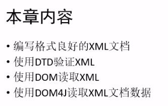
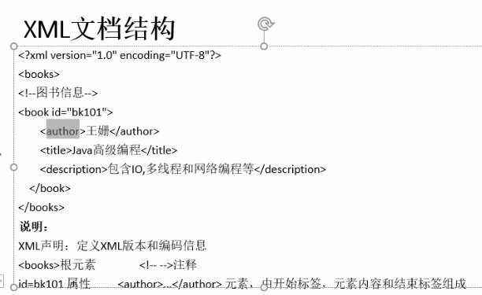
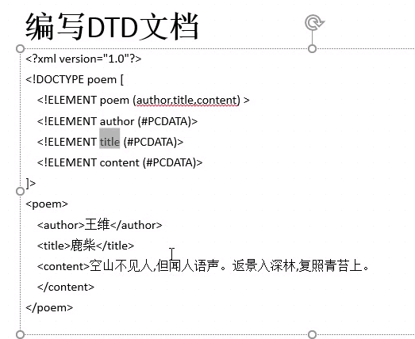
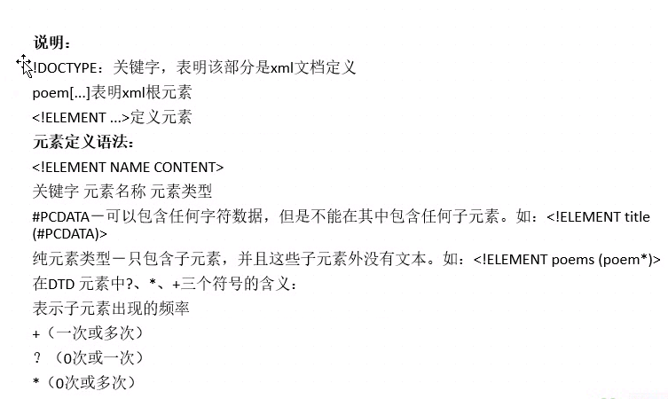
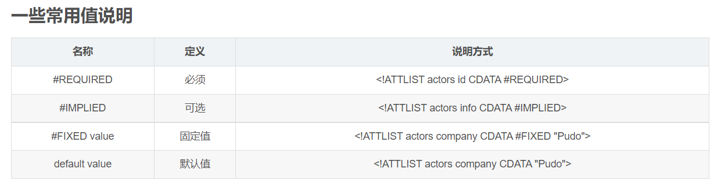
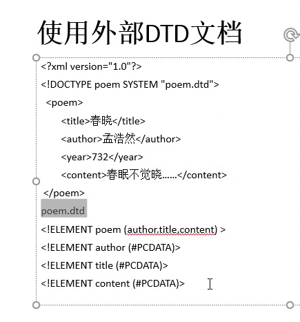
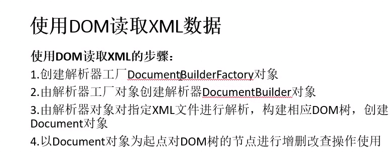

# XML编程
 



## 良好格式要求
* XML声明语句:
`<?xml version="1.0" encoding="UTF-8"?>`
* **有且只有一个根元素**
* 标签大小写敏感
* 属性值用双引号
* 标签成对
* 元素正确嵌套（逻辑上）

## DTD
#### 既文档类型定义
#### 作用：使每个XML文件可以携带一个自身格式的描述

<br>

### 包含内容：

* 元素定义规则
* 元素之间的关系规则
* 属性的定义规则

```java
<!DOCTYPE poem [
    <!ELEMENT poem (author,title,content)>
    <!ELEMENT author (#PCDATA)>
    <!ELEMENT title (#PCDATA)>
    <!ELEMENT content (#PCDATA)>
]
>
```




* 如果定义属性可以用:`<!ATTLIST 标签名 属性名 属性类型 是否可选>`定义

* 举例:
```java
<!ELEMENT books (book*)>
    <!ELEMENT book (name, author, publishdate)>
    <!ATTLIST book id CDATA #IMPLIED>
    <!ATTLIST book type (科学|技术|玄幻) #REQUIRED>
    <!ELEMENT name (#PCDATA)>
    <!ELEMENT author (#PCDATA)>
    <!ELEMENT publishdate (year, month, day)>
        <!ELEMENT year (#PCDATA)>
        <!ELEMENT month (#PCDATA)>
        <!ELEMENT day (#PCDATA)>
```




### 外部DTD文档
* 使用SYSTEM将poem.dtd文档引入



## XML解析
* 通过代码的方式读取xml文件的内容
* 对xml文件进行操作

## DOM解析
* 一次性读写XML文件，在内存中构建一个树形结构
* 整个文档放到内存中，有优点也有缺点

### 使用DOM读取XML数据


```java
public class DOMTest {
    public static void main(String[] args) throws Exception {
        //创建解析器工厂对象
        DocumentBuilderFactory dbf = DocumentBuilderFactory.newInstance();
        //创建解析器对象
        DocumentBuilder db = dbf.newDocumentBuilder();
        //创建一个File对象指定XML对象
        File file = new File("D:\\ideademo\\src\\day18\\users.xml");
        //将相应的XML文件解析到内存中，生成一个Document树
        Document doc = db.parse(file);

        //获取根节点
        Element root = doc.getDocumentElement();

        //创建一个新的节点，节点的标签名是user
        Element newUser = doc.createElement("user");
        //设置节点的属性名
        newUser.setAttribute("id", "u_003");
        //将该节点加入根节点
        root.appendChild(newUser);

        //给newUser加上子节点
        Element username = doc.createElement("username");
        username.setTextContent("测试的用户名");
        newUser.appendChild(username);

        //和map集合类似，新增和修改都是用set
        username.setTextContent("修改后的用户名");

        //删除下面的一个节点
//        root.removeChild(newUser);


        //根据标签名称获取当前节点下的子节点
        NodeList userList = root.getElementsByTagName("user");

        //查看取到了多少个子节点
        System.out.println(userList.getLength());//2

        Element user = null;
        for (int i = 0; i < userList.getLength(); i++) {
            user = (Element) userList.item(i);
            //节点名称
            //获取节点的指定属性的值
            System.out.println(user.getNodeName() + "," + user.getAttribute("id"));//user，u_001/2

            //获取当前节点下的所有子节点（不包括子节点的子节点...）
            NodeList userChild = user.getChildNodes();
            Element e= null;
            for (int j = 0; j < userChild.getLength(); j++) {

                /*
                子节点会把回车也给遍历进去
                 */

                if (userChild.item(j) instanceof Element) {
                    e = (Element) userChild.item(j);

                    System.out.println("子节点user下的属性:" + e.getNodeName());
                    System.out.println("节点文本值:" + e.getTextContent());
                }
            }
        }

        /*
        以上这些增删改的操作都是操作解析XML文件在内存中生成的Document对象
        不论怎么改都不会对XML文件进行影响
        如果要把改变落到XML文件上
        就要进行以下操作
         */
        TransformerFactory tff = TransformerFactory.newInstance();
        Transformer tf = tff.newTransformer();

        //生成doc数据源
        DOMSource ds = new DOMSource(doc);

        tf.setOutputProperty(OutputKeys.ENCODING, "utf-8");
        tf.setOutputProperty(OutputKeys.INDENT, "yes");

        StreamResult sr = new StreamResult(new FileOutputStream(file));
        tf.transform(ds, sr);
    }
}
```

### 使用SAX解析
* 轻量级
* 事件驱动，基于(callback)机制
* 优点：
  * 边读边解析
* 缺点：
  * 只支持读
  * 访问效率低
  * 只能顺序访问

```java
/**
 * SAX解析XML
 */
public class SAXTest {
    public static void main(String[] args) throws Exception {
        //通过工厂获得SAX解析器工厂
        SAXParserFactory saxPF = SAXParserFactory.newInstance();
        //获得解析器
        SAXParser saxP = saxPF.newSAXParser();
        //从解析器里面获得Reader对象
        XMLReader reader = saxP.getXMLReader();

        //设置内容处理器
        reader.setContentHandler(new XMLContentHandler());

        //加载需要读取的文件的路径
        reader.parse("D:\\ideademo\\src\\day18\\users.xml");
    }
}

/**
 * 内容处理器
 */
class XMLContentHandler implements ContentHandler {

    @Override
    public void setDocumentLocator(Locator locator) {

    }

    /**
     * 开始读取XML文档
     * @throws SAXException
     */
    @Override
    public void startDocument() throws SAXException {

    }

    /**
     * 停止读取XML文档
     * @throws SAXException
     */
    @Override
    public void endDocument() throws SAXException {

    }

    @Override
    public void startPrefixMapping(String prefix, String uri) throws SAXException {

    }

    @Override
    public void endPrefixMapping(String prefix) throws SAXException {

    }

    /**
     * 开始读取节点
     * @param uri XLM文档的命名空间
     * @param localName 标签的名字
     * @param qName 带命名空间的标签名字（一般用的是这个）
     * @param atts 标签的属性集合
     * @throws SAXException
     */
    @Override
    public void startElement(String uri, String localName, String qName, Attributes atts) throws SAXException {
        //拼接标签的开头
        System.out.print("<" + qName);

        //拼接标签的属性
        for (int i = 0; i < atts.getLength(); i++) {
            System.out.print(" " + atts.getQName(i) + "=" + atts.getValue(i));
        }

        System.out.println(">");
    }

    /**
     * 读取节点结束
     * @param uri
     * @param localName
     * @param qName
     * @throws SAXException
     */
    @Override
    public void endElement(String uri, String localName, String qName) throws SAXException {
        System.out.println("<" + qName + "/>");
    }

    /**
     * 得到标签之间的字符串
     * @param ch
     * @param start
     * @param length
     * @throws SAXException
     */
    @Override
    public void characters(char[] ch, int start, int length) throws SAXException {
        System.out.println(new String(ch, start, length));
    }

    @Override
    public void ignorableWhitespace(char[] ch, int start, int length) throws SAXException {

    }

    @Override
    public void processingInstruction(String target, String data) throws SAXException {

    }

    @Override
    public void skippedEntity(String name) throws SAXException {

    }
}

```

### DOM4J解析
* 有针对java文档的易用性和直观操作
* 这个需要下载jar包
* 官网:[http://www.dom4j.org/](http://www.dom4j.org/)
* 最新下载网址:[http://nchc.dl.sourceforge.net/sourceforge/dom4j/dom4j-1.6.1.zip](http://nchc.dl.sourceforge.net/sourceforge/dom4j/dom4j-1.6.1.zip)
* 已经下载到:`D:\文档\编程\JAVA\求知讲堂Java\day18\资料`

```java
public class Dom4jTest {
    public static void main(String[] args) throws Exception {
        //创建XML阅读器
        SAXReader saxReader = new SAXReader();
        //解析XML文件
        Document doc = saxReader.read("D:\\ideademo\\src\\day18\\users.xml");
        //获取根节点
        Element root = doc.getRootElement();
        System.out.println(root.elements().size());//4


        //指定获取
        Element user1 = root.elements().get(1);

        //给user增加一个子节点
        //返回值就是添加的节点
        user1.addElement("测试用户签名").setText("啦啦啦");

        //删除user1的username节点
        user1.remove(user1.element("username"));
        user1.addAttribute("用户id", "31415926");

        //打印
        printElements(root, 0);

        //写入
        writeXML(doc, "D:\\ideademo\\src\\day18\\users.xml");

    }

    /**
     * 一个打印函数
     * @param element 根节点
     * @param indent 缩进次数
     */
    public static void printElements(Element element, int indent){
        List<Element> es = element.elements();
        StringBuffer tabIndent = new StringBuffer("");
        for (int i = 0; i < indent; i++) {
            tabIndent.append("    ");
        }

        System.out.print(tabIndent.toString() + "<" + element.getName());
        //打印属性
        for (Attribute a:element.attributes()) {
            System.out.print(" " + a.getName() + "=" + a.getValue());
        }
        System.out.println(">");
        if (es.size() == 0) {
            //如果是叶节点，则打印值
            System.out.println(tabIndent.toString() + element.getText());
        } else {
            //不是叶节点则向下遍历
            for (Element e:es) {
                printElements(e, indent+1);
            }
        }

        System.out.println(tabIndent.toString() + "</" + element.getName() + ">");

    }

    /**
     * 写入XML文件
     * @param doc
     * @param filePath
     */
    public static void writeXML(Document doc, String filePath) throws Exception {
        //设置输出格式
        //注意这里可以选择换不换行
        OutputFormat outputFormat = OutputFormat.createPrettyPrint();
        outputFormat.setEncoding("utf-8");

        XMLWriter writer = new XMLWriter(new FileOutputStream(filePath), outputFormat);
        writer.write(doc);
        writer.close();
    }
}

```