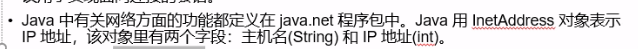

# 网络基础
* 直接或间接地通过网络协议与其它计算机进行通讯
* 两个主要问题
  * 定位主机
  * 可靠高效地数据传输
* 不仅要知道双方的地址，还必须遵循一定的规则
* 两套参考模型
  * OSI参考模型：过于理想化，没有广泛推广
  * TCP/IP协议
  * UDP协议

## TCP/IP协议簇


### TCP和UDP区别
* 是否有链接
* 是否保证可靠交付
* TCP面对字节流；UDP面对的是数据包（没有拥塞控制，网络出现拥塞不会使得源主机发送速率降低）（对IP电话、事实视频等很有用）
* TCP点到点，UDP可以一对多、多对一、多对多
* TCP逻辑信道是全双工可靠信道，UDP是不可靠信道

# InetAddress类
* Internet上主机两种方式表示地址
  * 域名：www.baidu.com
  * IP地址：202.108.35.210
* InetAddress类对象含有一个Internet主机地址的域名和IP地址：www.baidu.com/202.108.35.210

## InetAddress的使用


```java
try {
    //根据域名查找主机的IP地址(由于可能有多个服务器，ip地址并不是唯一的，要想获取准确的，还需要获取所有的地址才行)
    InetAddress inetAddress=InetAddress.getByName("www.baidu.com");
    System.out.println(inetAddress);//结果：14.215.177.38
    //反向查找主机名
    InetAddress byName = InetAddress.getByName("113.105.245.103");
    System.out.println("反向查找主机名：   "+byName.getHostName());//如果没有主机名，会返回IP地址
    
    //得到主机的所有地址
    InetAddress[] inetAddresses=InetAddress.getAllByName("www.taobao.com");
    for (InetAddress address : inetAddresses) {
        System.out.println(address);
    }
    
    //getLocalHost获取当前主机名和IP地址
    InetAddress me = InetAddress.getLocalHost();//得到主机名/IP地址 的形式
    System.out.println(me);//如果电脑没有联网，会返回127.0.0.1
    System.out.println(me.getHostName());//得到主机名
} catch (UnknownHostException e) {
    // TODO Auto-generated catch block
    e.printStackTrace();
}
```
* 注意:
  1. getByName()参数可以是主机的名称也可以是ip地址
  2. 如果getByName()参数是ip地址时再调用getHostName()则会反向查找主机名称，如果不成功会一直尝试，大概阻塞10s
  3. 反向解析为什么会不成功?
     1. 操作系统的限制(防火墙之类的)
     2. 本地的网络配置(包括IP, 网关, DNS等)
     3. 局域网网关的网络配置


# TCP程序设计
* 客户端（Client）：为客户提供本地服务
* 服务端：为客户端服务
* 服务端作为程序要先在机器上运行起来，之后在别的机器上运行的客户端来访问服务端。在整个访问过程中，客户端要先访问服务端，这个被称为客户端请求服务端，服务端针对客户端请求给一个应答，这个被称为服务端响应客户端。也就是一次访问的过程至少包括一次请求与响应

## IP和端口号


## 套接字（Socket）操作


## Socket编写TCP程序
```java
/**
 * TCP服务端
 */
public class Server {
    public static void main(String[] args) {
        try {
            //创建服务端，绑定9999端口
            ServerSocket server = new ServerSocket(9999);
            //监听连接服务端的客户端
            Socket socket = server.accept();
            //获取客户端发送的数据
            InputStream in = socket.getInputStream();
            //转化成字符缓冲流
            BufferedReader br = new BufferedReader(new InputStreamReader(in));

            String line = br.readLine();
            System.out.println("服务端接收到客户端的请求:" + line);

            //服务端的输出流，用来响应客户端的请求
            OutputStream out = socket.getOutputStream();
            BufferedWriter bw = new BufferedWriter(new OutputStreamWriter(out));

            bw.write("我已经收到了你的请求");
            //这里写只是写到了缓冲区
            //需要flush一下不然对面收到的是null
            bw.flush();

            //关闭输出流
            socket.shutdownOutput();
            //关闭输入流
            socket.shutdownInput();

            socket.close();
            server.close();


        } catch (Exception e) {
            e.printStackTrace();
        }
    }
}
```

```java
/**
 * TCP客户端
 */
public class Client {
    public static void main(String[] args) {
        try {
            //127.0.0.1本机IP
            //客户端连接127.0.0.1的机器上端口号是9999的服务端
            Socket socket = new Socket(InetAddress.getByName("127.0.0.1"), 9999);

            //输出流，向服务端输出请求
            OutputStream out = socket.getOutputStream();
            BufferedWriter bw = new BufferedWriter(new OutputStreamWriter(out, StandardCharsets.UTF_8));

            bw.write("你好服务端！");
            bw.flush();
//            out.write("你好服务端!".getBytes(StandardCharsets.UTF_8));

            /*
            这里有一点需要注意
            服务端使用的reader.readLine接收
            如果在write的字符串时没有换行符，那么服务端会一直等待直到你输入换行符
            直到你输入换行符或者输出流被关闭才会继续执行
            */
            //关闭输出流
            socket.shutdownOutput();

            //接受服务端响应内容
            InputStream in = socket.getInputStream();
            BufferedReader br = new BufferedReader(new InputStreamReader(in));

            String line = br.readLine();
            System.out.println("服务端响应:" + line);

            //关闭输入流
            socket.shutdownInput();
            socket.close();

        } catch (Exception e) {
            e.printStackTrace();
        }
    }
}
```

#### 注意
* 如果直接关闭输入输出流

```java
OutputStream os = socket.getOutputStream;
os.close
```
* 类似这种关闭流的操作会导致Socket关闭，所以后续如果有对Socket的操作，都会抛出

```java
java.net.SocketException: Socket is closed
```

* 所以应该用shutdown关闭

```java
socket.shutdownInput();
socket.shutdownOutput();
```

* 用TCP实现登录功能
* 用TCP实现文件上传和下载功能


## Socket类常用方法


## ServerSocket常用方法


## UDP网络编程
* UDP实现登录功能
* UDP实现文件上传和下载功能

```java
/**
 * UDP服务端
 */
public class UDPServer {
    public static void main(String[] args) {
        try {
            //创建UDP服务端对象
            DatagramSocket socket = new DatagramSocket(8888);

            //创建临时存放接受的数据的数组
            byte[] buf = new byte[1024];
            //创建数据包
            DatagramPacket p = new DatagramPacket(buf, buf.length);

            socket.receive(p);//接收客户端传来的数据包

            //取出数据包中内容
            String line = new String(p.getData(), 0, p.getLength());

            System.out.println("客户端发送的数据：" + line);

            byte[] b = "已收到".getBytes(StandardCharsets.UTF_8);
            //设置响应客户端的数据包
            DatagramPacket p1 = new DatagramPacket(b, 0, b.length, p.getAddress(), p.getPort());

            socket.send(p1);//发送数据包到客户端

            socket.close();


        } catch (Exception e) {
            e.printStackTrace();
        }
    }
}
```

```java
/**
 * UDP客户端
 */
public class UDPClient {
    public static void main(String[] args) {
        try {
            /*
            实际上UDP的服务端和客户端对象是同一个类型
             */
            DatagramSocket socket = new DatagramSocket(7777);

            byte[] b = "你好".getBytes(StandardCharsets.UTF_8);

            /*
            设置要发送给服务端的数据包
             */
            DatagramPacket p = new DatagramPacket(b, 0, b.length, InetAddress.getByName("127.0.0.1"), 8888);

            socket.send(p);//向服务端发送数据包

            byte[] buf = new byte[1024];

            DatagramPacket p1 = new DatagramPacket(buf, buf.length);
            socket.receive(p1);

            byte[] tmp = p1.getData();

            String line = new String(tmp, 0, p1.getLength());

            System.out.println("服务器响应:" + line);


            socket.close();

        } catch (Exception e) {
            e.printStackTrace();
        }

    }
}
```

## URL编程


```java
public class URLTest {
    public static void main(String[] args) {
        try {
            URL ur1 = new URL("https://blog.csdn.net/weixin_39638801/article/details/115781077");
            System.out.println("协议名:" + ur1.getProtocol());
            System.out.println("主机名:" + ur1.getHost());
            System.out.println("端口号:" + ur1.getPort());
            System.out.println("文件路径:" + ur1.getPath());
            System.out.println("文件名:" + ur1.getFile());
            System.out.println("文件相对位置:" + ur1.getRef());

            System.out.println("==============================");

//            //读取文件
//            InputStream in = ur1.openStream();
//            BufferedReader br = new BufferedReader(new InputStreamReader(in));
//
//            String line = "";
//            while ((line = br.readLine()) != null) {
//                System.out.println(line);
//            }
//
//            br.close();
//            in.close();

            //返回URLConnection对象
            URLConnection uc = ur1.openConnection();

            //uc.getInputStream()获取到当前URL代表的信息

        } catch (Exception e) {
            e.printStackTrace();
        }

    }
}

```

