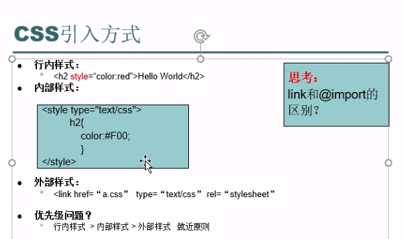
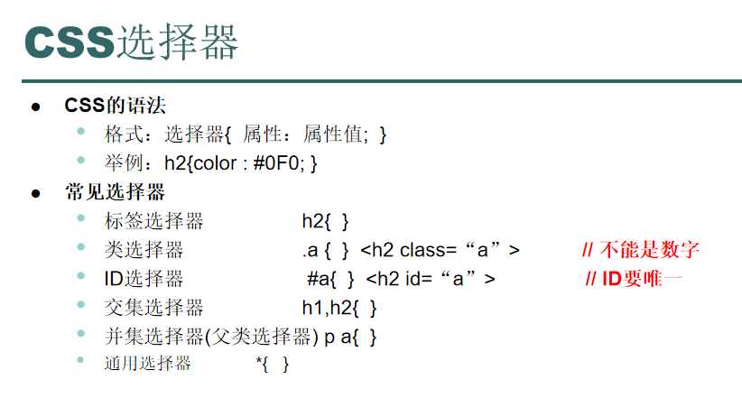
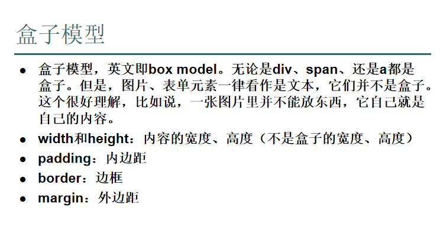
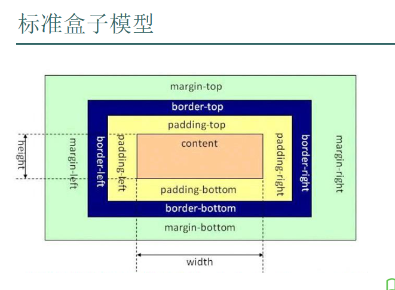
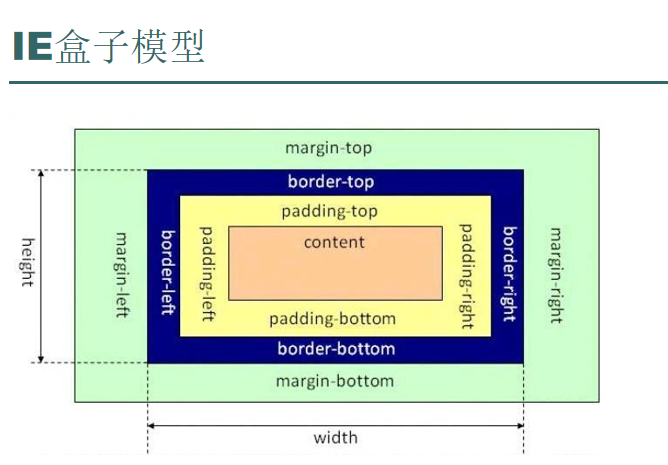

# CSS
* 开发网页的样式，让网页更精美
* 页面的结构和表现分离


```html
<!DOCTYPE html>
<html lang="en">
<head>
    <meta charset="UTF-8">
    <title>Title</title>

    <style type="text/css">
        h2{
            color: #F00;
        }
        h3{
            color: #0F0;
        }
    </style>
    <link href="test1.css" type="text/css" rel="stylesheet">


</head>
<body>

<h1 style="color: red">欢迎观看</h1>
<h2>Hello</h2>
<h3 style="color: #00F">测试外部样式表</h3>

</body>
</html>
```
#### css文件内容
```css
h3{
    color: #F00;
}
```

## CSS选择器


* 优先级：ID>类>标签>通用
* id和class不要数字打头
* 交集选择器是指的两者都会受到影响
* 并集选择器是父类的子类会受到影响

```html
<!DOCTYPE html>
<html lang="en">
<head>
    <meta charset="UTF-8">
    <title>Title</title>

    <style type="text/css">
        *{
            color: palevioletred;
        }
        h1{
            color: #00FF00;
        }
        h2{
            color: black;
        }
        .a1{
            color: #0000FF;
        }
        #abc{
            color: #FF0000;
        }
        h3,h4{
            color: brown;
        }
        .a1 #cd{
            color: darkmagenta;
        }
    </style>

</head>
<body>

<h1>h1标题1</h1>
<h1>h1标题2</h1>

<h2 class="a1">h2标题1</h2>
<h2 class="a1">h2标题2</h2>
<h2 id="abc" class="a1">h2标题3</h2>
<h2>h2标题4</h2>
<div class="a1">
    <h2 id="cd">h2标题5</h2>
</div>

<h3>h3标题1</h3>
<h3>h3标题2</h3>

<h4>h4标题1</h4>
<h4>h4标题2</h4>


</body>
</html>
```

## CSS属性
`参考：D:\文档\编程\JAVA\求知讲堂Java\day21\资料`

# 盒子模型
* 能作为容器的标签可以看成盒子







* IE模型和标准盒子模型区别是：
  * 标准盒子模型计算的是content的height和width
  * IE盒子模型计算的是border的height和width

# 绝对定位和相对定位
```html
<!DOCTYPE html>
<html lang="en">
<head>
    <meta charset="UTF-8">
    <title>Title</title>

    <style type="text/css">
        #d_1{
            background-color: #FF0000;
            height: 100px;
            width:500px;
        }
        #d_2{
            background-color: #0000FF;
            height: 100px;
            width:500px;

            position: absolute;
            top: 50px;
        }
        #d_3{
            background-color: #00FF00;
            height: 100px;
            width:500px;
        }
    </style>

</head>
<body>

<div id="d_1">块1</div>
<!--
	绝对定位，就是把设置绝对定位position: absolute;属性的块从之前的位置拿出来，按照设置根据body来定位，来决定怎么移动
	相对定位，根据设置相对定位属性position: relative;的块的邻近的上和左的块来定位，决定怎么移动
-->
<div id="d_2">块2</div>
<div id="d_3">块3</div>
</body>
</html>
```