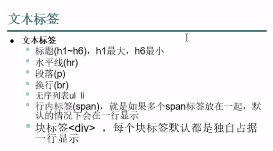

# 简介
* 超文本标记语言：
  * 超文本：页面数据可以通过标签改变样式，可以通过超链接直接跳到下一个页面
  * 标记：html是通过标签来定义的语言，代码由标签组成，不需要编译
* 平台无关
* 其实就是文本文件 


## 文本标签




## 字符实体


```html
<!DOCTYPE html>
<html lang="en">
<head>
    <meta charset="UTF-8">
    <title>Title</title>
</head>
<!--文本标签的示例-->
<body>
<!-- h1到h6是标题标签 -->
<h1>文本标签h1</h1>
<h2>文本标签h2</h2>
<h3>文本标签h3</h3>
<h4>文本标签h4</h4>
<h5>文本标签h5</h5>
<h6>文本标签h6</h6>
<!-- hr是水平线 -->
<hr>
<!-- p是段落 -->
<p>段落1</p>
<!-- br是换行 -->
<br>
<p>段落不会换行段落不会换行段落不会换行段落不会换行段落不会换行段落不会换行段落不会换行段落不会换行段落不会换行段落不会换行段落不会换行段落不会换行段落不会换行段落不会换行段落不会换行段落不会换行段落不会换行段落不会换行段落不会换行</p>
<!-- ul是无序列表，li是无序列表的中的每一行 -->
<hr>
<ul>
    <li>li1</li>
    <li>li2</li>
    <li>li3</li>
</ul>
<hr>
<!-- span是行内标签 -->
<!--行内标签都在一行-->
<span>行内标签1</span>
<span>行内标签2<br></span>
<span>行内标签3</span>
<hr>

<!--块标签-->
<!--块标签会自动换行-->
<div>块标签1</div><div>块标签2</div><div>块标签3</div>

<hr>

<!-- 字符实体，有些字符是HTML中有特殊含义，我们用&xxx;这样的转义字符来替代原字符 -->
<!-- ，比如想在网页页面上显示一个<,这个小于号就用&lt;替代 -->
<div>&lt;span&gt;&lt;/span&gt;</div><div>&nbsp;&nbsp;&nbsp;&nbsp;&nbsp;1111</div>

</body>
</html>
```

## tabel表格
* table、th、tr、td

```html
<!DOCTYPE html>
<html lang="en">
<head>
    <meta charset="UTF-8">
    <title>Title</title>
</head>
<body>
<table border="1">
    <!-- 一组tr标签代表表格的一行，一组tr中有几组td标签，就是这一行就几个单元格，简称一行三列 -->
    <tr>
        <th>姓名</th>
        <th>性别</th>
        <th>年龄</th>
    </tr>
    <tr>
        <td>张三</td>
        <td>男</td>
        <td>11</td>
    </tr>
    <tr>
        <td>李四</td>
        <td>女</td>
        <td>16</td>
    </tr>
</table>

<hr>

<!--下面一个四行八列的表格-->

<!--
	在合并单元格时，保留被合并的所有单元格中最左上角的这个单元格，在这个单元格去设置，
	如果要横向合并3个单元格，就给这个被合并的所有单元格中最左上角的单元格设置colspan="3"
	如果要纵向的合并2个单元格，就给这个被合并的所有单元格中最左上角的单元格设置rowspan="2"
	在html中保留被合并的所有单元格中最左上角的这个单元格，其他的被合并范围内的单元格都删除掉即可
	 -->
<table border="1">
    <tr>
        <td colspan="2">&nbsp;&nbsp;&nbsp;&nbsp;&nbsp;&nbsp;&nbsp;</td>
        <td>&nbsp;&nbsp;&nbsp;&nbsp;&nbsp;&nbsp;&nbsp;</td>
        <td>&nbsp;&nbsp;&nbsp;&nbsp;&nbsp;&nbsp;&nbsp;</td>
        <td>&nbsp;&nbsp;&nbsp;&nbsp;&nbsp;&nbsp;&nbsp;</td>
        <td>&nbsp;&nbsp;&nbsp;&nbsp;&nbsp;&nbsp;&nbsp;</td>
        <td>&nbsp;&nbsp;&nbsp;&nbsp;&nbsp;&nbsp;&nbsp;</td>
        <td>&nbsp;&nbsp;&nbsp;&nbsp;&nbsp;&nbsp;&nbsp;</td>
    </tr>
    <tr>
        <td>&nbsp;&nbsp;&nbsp;&nbsp;&nbsp;&nbsp;&nbsp;</td>
        <td>&nbsp;&nbsp;&nbsp;&nbsp;&nbsp;&nbsp;&nbsp;</td>
        <td rowspan="2">&nbsp;&nbsp;&nbsp;&nbsp;&nbsp;&nbsp;&nbsp;</td>
        <td>&nbsp;&nbsp;&nbsp;&nbsp;&nbsp;&nbsp;&nbsp;</td>
        <td>&nbsp;&nbsp;&nbsp;&nbsp;&nbsp;&nbsp;&nbsp;</td>
        <td>&nbsp;&nbsp;&nbsp;&nbsp;&nbsp;&nbsp;&nbsp;</td>
        <td>&nbsp;&nbsp;&nbsp;&nbsp;&nbsp;&nbsp;&nbsp;</td>
        <td>&nbsp;&nbsp;&nbsp;&nbsp;&nbsp;&nbsp;&nbsp;</td>
    </tr>
    <tr>
        <td>&nbsp;&nbsp;&nbsp;&nbsp;&nbsp;&nbsp;&nbsp;</td>
        <td>&nbsp;&nbsp;&nbsp;&nbsp;&nbsp;&nbsp;&nbsp;</td>
        <td>&nbsp;&nbsp;&nbsp;&nbsp;&nbsp;&nbsp;&nbsp;</td>
        <td>&nbsp;&nbsp;&nbsp;&nbsp;&nbsp;&nbsp;&nbsp;</td>
        <td colspan="3" rowspan="2">&nbsp;&nbsp;&nbsp;&nbsp;&nbsp;&nbsp;&nbsp;</td>
    </tr>
    <tr>
        <td>&nbsp;&nbsp;&nbsp;&nbsp;&nbsp;&nbsp;&nbsp;</td>
        <td>&nbsp;&nbsp;&nbsp;&nbsp;&nbsp;&nbsp;&nbsp;</td>
        <td>&nbsp;&nbsp;&nbsp;&nbsp;&nbsp;&nbsp;&nbsp;</td>
        <td>&nbsp;&nbsp;&nbsp;&nbsp;&nbsp;&nbsp;&nbsp;</td>
        <td>&nbsp;&nbsp;&nbsp;&nbsp;&nbsp;&nbsp;&nbsp;</td>
    </tr>
</table>
</body>
</html>
```

#### 画一个复杂表格


## HTML链接和图像
* `<a>`标签
* ``标签
  * align位置
  * alt说明
  * border边框

```html
<!DOCTYPE html>
<html lang="en">
<head>
    <meta charset="UTF-8">
    <title>Title</title>
</head>
<body>
<!--链接标签-->
<a href="D:/webDemo/web/pags/day01/test3.html">test3.html</a>
<a href="https://www.baidu.com">百度</a>
<hr>


</body>
</html>
```

## HTML框架标签
* iframe画中画标签（页面套页面）
* frameset标签（可以不用写在body里）
  * cols
  * rows
  * frameborder
  * frame属性：noresize（让当前页面不能缩放）
* frame和img属性一样都不需要结尾符号（`</frame>`)

#### HTML单位
* 百分比设置宽高是指的相对的单位
* px（像素）是绝对单位
* 一般情况使用百分比单位

```html
<!DOCTYPE html>
<html lang="en">
<head>
    <meta charset="UTF-8">
    <title>Title</title>
</head>
<body>

<!-- height="30%" width="50%",这两个里面都是百分数，这个百分数就是相对应当前这个标签所在的页面的百分比
	比如说height="30%" width="50%"，就是对iframe标签设置，它的高是当前页面的30%，宽是当前页面的50%
	这种百分比设置宽高是相对的单位
 -->
<iframe src="Test5.html" height="100%" width="100%"></iframe>
<!--
	设置宽高还可以px，这个绝对的单位，指的是电脑显示屏像素，1px就是1个像素点
	一般情况下要使用百分比相对的单位，
	因为网页是用浏览器就能看，浏览器是装在电脑上的，电脑的显示屏型号不同，大小不同，像素也不同
	在这种情况下，我们使用绝对单位设置宽高，就可能造成在不同的电脑显示就不同了，
	使用相对单位就不会，这个会随着电脑的不同去等比例放大或者缩小页面
 -->
<iframe src="test3.html" height="200px" width="500px"></iframe>

</body>
</html>
```

```html
<!DOCTYPE html>
<html lang="en">
<head>
    <meta charset="UTF-8">
    <title>Title</title>
</head>

<!-- cols属性，让frameset中的分页面在一行并排的排列
	rows属性，让frameset中的分页面每个各占一行
	frameborder设置边框外观
	noresize设置是否允许拖动分页边框
 -->
<frameset rows = "20%, 30%, 50%">
    <frame src="Test5.html" noresize="">
    <frame src="test3.html" frameborder="4">
    <frame src="test2.html">
</frameset>


<body>

</body>
</html>
```

## HTML表单
* 主要用于数据的采集
* 网页与java后台交互数据的主要方式


#### 属性
* action提交地址
* method


```html
<!DOCTYPE html>
<html lang="en">
<head>
    <meta charset="UTF-8">
    <title>Title</title>
</head>
<body>

<form action="" method="post">
    <table border="2">
        <tr>
            <td>用户名：</td>
            <td><input type="text" name="username" value="le"></td>
        </tr>
        <tr>
            <td>密码：</td>
            <td><input type="password"></td>
        </tr>
        <tr>
            <td>性别：</td>
            <!--注意单选框的name要一致-->
            <td>
                <input type="radio" name="sex" value="0">男
                <input type="radio" name="sex" value="1">女
            </td>
        </tr>
        <tr>
            <td>上传图片：</td>
            <td><input type="file"></td>
        </tr>
        <tr>
            <td>省份:</td>
            <td>
                <select>
                    <option value="1">北京市</option>
                    <option value="2">上海市</option>
                </select>
            </td>
        </tr>
        <tr>
            <td>兴趣</td>
            <td>
                <input type="checkbox" name="interest" value="0">读书
                <input type="checkbox" name="interest" value="1">篮球
                <input type="checkbox" name="interest" value="2">旅游
            </td>
        </tr>
        <tr>
            <td>自我介绍:</td>
            <td><textarea cols="30" rows="5"></textarea></td>
        </tr>
        <tr>
            <td colspan="2">
                <input type="button" value="提交">
                <input type="reset" value="重置">
            </td>
        </tr>
    </table>
</form>

</body>
</html>
```
