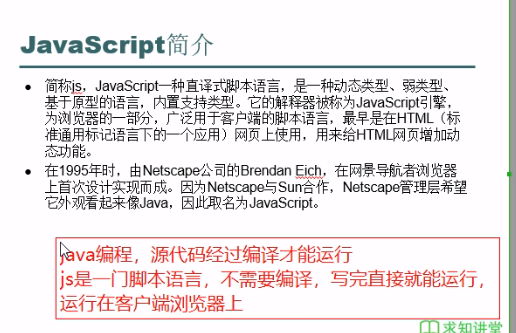
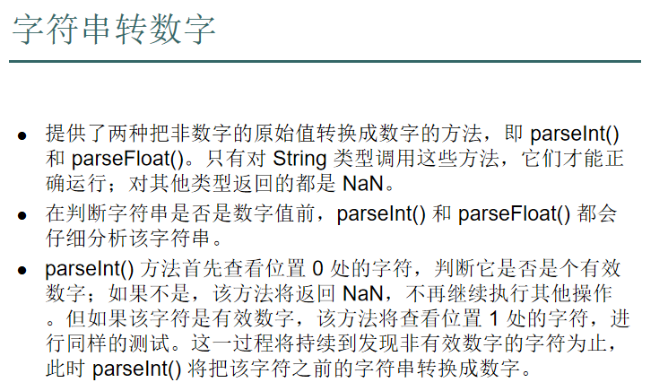
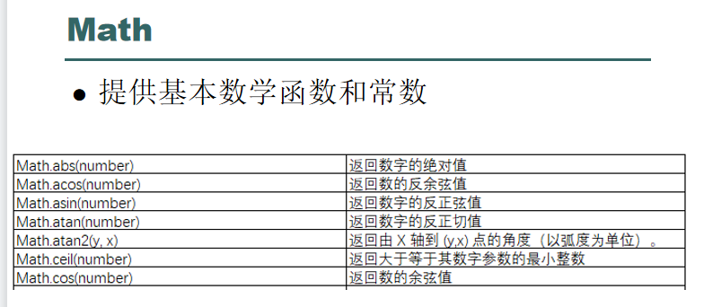
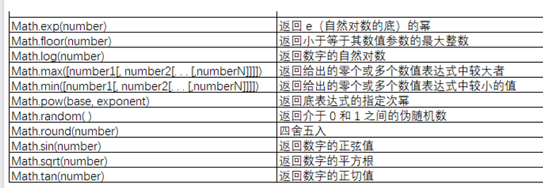

# JS
## 简介
* 给HTML网页增加动态功能




### 网页引用js
```html
<!DOCTYPE html>
<html lang="en">
<head>
    <meta charset="UTF-8">
    <title>Title</title>

    <!-- 内部引用js是只能给当前页面使用
	外部引用js，是引用js文件，这个文件哪个页面引用了哪个页面就能用
	从代码复用的角度来看，如果多个网页都有用到某些js代码，这些js带最后写到一个js文件中，网页如果要使用就引用这个文件
	如果这个js代码确实是只在本网页使用，可以使用内部引用的方式
	在真正的开发中，一般不论哪种情况都是些到js文件中，这样js的逻辑就与HTML分离开，便于维护
 -->
    <script type="text/javascript">
        alert("内部引用js");
        alert("内部引用js1");
    </script>

    <script src="test1.js" type="text/javascript"></script>


</head>
<body>

</body>
</html>
```

# 基本语法
## 变量与赋值
* 不用声明数据类型，因为是弱类型
```html
<!DOCTYPE html>
<html lang="en">
<head>
    <meta charset="UTF-8">
    <title>Title</title>

    <script type="text/javascript">
        var s= "hello";
        var i = 0;
        alert(s);
        alert(i);
    </script>
</head>
<body>
</body>
</html>
```

### var、let与const

#### var

* var操作符定义的变量会成为函数内的局部变量，在执行完毕后变量销毁
```js
function test() {
    var message = "i";
}
test()
console.log(message);//报错
```

* 如果声明时没有加var那么该变量就会是一个全局变量
  * 虽然这样做是允许的，但是不建议，因为局部作用域中定义全局变量会很难维护
```js
function test() {
    message = "i";
}
test();//注意要运行一次test()才能定义message并给它赋值，不然直接输出依然会报错
console.log(message);//报错
```

* 使用var关键字声明变量会存在变量提升,所谓的提升就是将所有变量声明都拉到函数作用域的顶部

```js
function test() {
    console.log(message);
    var message = "i";
}
test();//输出undefined
```
* 上面代码不会报错是因为ECMAscript将上面代码看成以下代码：
```js
function test() {
    var message;
    console.log(message);
    message = "i";
}
```

* var多次声明同一个变量也不会报错

```js
function test() {
    var message = "i";
    var message = 123;
    var message = 456;
    console.log(message);//输出456
}
test();
```

#### let关键字

* **let关键字和var关键字的作用差不多，但是有着非常重要的区别，最明显的就是let声明的范围是块级作用域，而var声明的范围是函数作用域。**

```js
function test() {
    if (true) {
        var message = "i";
    }
    console.log(message);//不报错
}
// test();

function test1() {
    if (true) {
        let message = "i";
    }
    console.log(message);//报错
}
test1();
```

* let也不允许在同一块级作用域中出现冗余声明（就是用let关键字多次声明同一变量），否则就会报错，而var却可以。当然，我们也不可以用了var声明了一个变量然后又用let来声明这个变量，反之也是不可以的。

* let也不会出现变量提升

```js
function test() {
    console.log(message);//报错
    let message = "i";
}
test()
```

* for循环中的let与var
  * for中var定义的变量在for循环后还会继续使用
    ```js
    function test() {
        for (var i = 0; i < 10; i++) {
        }
        console.log(i);//10
    }
    test()
    ```
    * for中let定义的变量在for循环后就不能被继续使用了
    ```js
    function test1() {
        for (let i = 0; i < 10; i++) {
        }
        console.log(i);//报错
    }
    test1();
    ```

* 总结:let声明的变量更像java中的局部变量(作用域和作用域内不能重复声明)，版本允许的情况下可以尽量使用let。

#### const关键字

* const关键字和let基本一致，最大的区别就是声明变量的时候必须同时初始化，而且后面尝试修改变量会报错(类似final?)
* const声明的限制只适用于它执行的变量引用，总而言之就是如果const变量引用的是一个对象，那么修改这个对象内部的属性是可以的。


```js
function test() {
    const message;//报错
}
test();

function test1() {
    const message = "hi";
    message = "123";//报错
}
test1();

function test2() {
    const message = "hi";
    const message = "123";//报错
}
test2()

function test3() {
//    const也是块级作用域
    if (true) {
        const message = "hi";
    }
    console.log(message);
}
test3();
```

## 语句块和注释 

```html
<!DOCTYPE html>
<html lang="en">
<head>
    <meta charset="UTF-8">
    <title>Title</title>

    <script type="text/javascript">
        var i = 7;
        if (i % 2 == 0) {
            alert(i + "是偶数");
        } else {
            alert(i + "是奇数");
        }
        if (i > 9) {
            alert(i + "是十位数");
        } else {
            alert(i + "是个位数")
        }
    </script>
</head>
<body>

</body>
</html>
```

### 注释：
* `//`是单行注释
* `/*...*/`是一个注释块
#### 注意：
* Javascript严格区分大小写

## 基本数据类型
* number所有数字类型
* string字符和字符串
* boolean布尔
* undefined没有变量初始化

### 字符串转数字
* parseInt/parseFloat



```html
<!DOCTYPE html>
<html lang="en">
<head>
    <meta charset="UTF-8">
    <title>Title</title>

    <script type="text/javascript">
        var x = 1;//number
        var y = 3.1415926;//number

        var s1 = "hello world";//string
        var s2 = 'a';//string

        var flag = true;//boolean

        //没有给初始化值，js无法推断这个变量是什么类型，
        //这种的就是undefined类型
        var i;

        var s = "123";
        //parseInt是转整数，小数位不管写的什么都舍弃
        alert(parseInt("10.3"))
        //alert(parseFloat("123.6a54"));parseFloat是可以转小数，在被转的字符串哪个位置不是数字，就停止转换
        //从被转数字的字符串第一个位置就不是数字，返回NaN,代码不是数字
        alert(parseFloat("123.a65"))
    </script>
</head>
<body>

</body>
</html>
```

## 数组与json
* java中可以数组、list、map、set集合等
* js只有两种：数组、json（k、v）

### 定义数组
* 使用[]

### 定义json
* 使用{}
* `(k:v)`间用`,`连接
* k必须为string
* v可以为任何类型

```html
<!DOCTYPE html>
<html lang="en">
<head>
    <meta charset="UTF-8">
    <title>Title</title>
    <script type="text/javascript">
        var arr = [];//声明一个空数组
        arr[0] = 1;
        arr[1] = "a";
        arr[2] = "abcd";

        var arr1 = [1,2,3,4];
        arr[3] = arr1;
        alert(arr[3][3]);

        /*
        js中k,v型的数据，使用json,
        其中v这部分可以是任何类型数据
         */
        var person = {
            name : "张三",
            age : 17,
            sex : "男",
            course : ["语", "数", "外"],
            father : {
                name : "张大三",
                age : 40
            }
        };

        //获取person的key为name的value值
        alert(person["name"]);
        alert(person["course"][1]);
        alert(person["father"]["name"]);
    </script>
</head>
<body>

</body>
</html>
```

## JS运算符
* 与Java的运算符基本一致
* 一个特殊的是`==`和`===`
  * `==` 会自动转换数据类型再比较
  * `===` 不会自动转换数据类型

```html
<!DOCTYPE html>
<html lang="en">
<head>
    <meta charset="UTF-8">
    <title>Title</title>
    <script type="text/javascript">
        var i = 1;
        i++;
        i += 1;
        alert("!(1 > 2):" + !(1 > 2));//&&,||都可以用
        //js中==是先把数据类型转换成一致的，然后进行比较
        alert("\"1\" == 1:" + ("1" == 1));
        //js中===是先看数据类型是否一致，不一致直接返回false，一致再比较
        alert("\"1\" === 1:" + ("1" === 1));
        //在js的开发中，我们要选取合适比较去使用，如果是只为了比较值是否相等，不考虑数据类型，使用==
        //如果需要要个考虑数据类型，比较是否相等时就使用===
    </script>
</head>
<body>

</body>
</html>
```

## Js的循环和判断
* 循环，主要是for
* 判断if...else和if...else if
* 字符串可以看成一个字符的数组，可以直接遍历

```html
<!DOCTYPE html>
<html lang="en">
<head>
    <meta charset="UTF-8">
    <title>Title</title>
    <script type="text/javascript">
    /*
    遍历数组的两种方式
     */
    var arr = [1, "hello", true, 3.14];
    for (var i = 0; i < arr.length; i++) {
        alert("arr[" + i + "] = " + arr[i]);
    }
    /*
    注意：这里的in得到是数组变量的下标
    和java里面的forEach不一样
    如果想要返回元素的话可以使用of
     */
    for (var j in arr) {
        alert("arr[" + j + "] = " + arr[j]);
    }

    /*
    字符串也可以看做是一个字符的数组，可以直接遍历
     */
    var str = "hello";
    for (var m in str) {
        alert("str[" + m + "] = " + str[m]);
    }

    //json遍历
    var person = {
        name : "张三",
        age : 17,
        sex : "男",
        course : ["语文","数学","外语"],
        father : {
            name : "张大三",
            age : 40
        }
    };

    //json可以直接得到key
    for (var key in person) {
        if (key === "father") {
            for (var k in person[key]) {
                alert("person[" + key + "][" + k + "] = " + person[key][k]);

            }
        } else {
            alert("person[" + key + "] = " + person[key]);
        }
    }


    </script>
</head>
<body>

</body>
</html>
```

## Js的方法
```html
<!DOCTYPE html>
<html lang="en">
<head>
    <meta charset="UTF-8">
    <title>Title</title>
    <script type="text/javascript">
        function fn(str) {
            alert("fn方法" + str);
        }
        fn("测试");

        /*
        这里是一种不同于java的函数构造方法
         */
        var fn1 = function () {
            alert("fn1方法")
        };
        fn1();

        /*
        与java中不同的是
        js中的函数可以作为一个函数传递给其它方法使用
         */
        var fn2 = function (f, str) {
            f(str);
        };
        fn2(fn, "测试fn2");

        /*
        带返回值的函数
         */
        var fn3 = function (str) {
            return (str + "!");
        }
        alert("测试:" + fn3("fn3测试"));

    </script>
</head>
<body>

</body>
</html>
```

## Js对象
* 内置对象
  * Boolean
  * Number
  * String
  * Math
  * Date
  * 数组等
* 自定义对象

### String
* 可以通过new String()定义String对象

```html
<!DOCTYPE html>
<html lang="en">
<head>
    <meta charset="UTF-8">
    <title>Title</title>
    <script type="text/javascript">
        var s1 = "hello world";

        alert(s1.charAt(1));//e
        alert(s1.concat("!!!!"));//hello world!!!

    //    返回String对象内第一次出现字符串子字符串的字符位置
        alert(s1.indexOf("ll"));//2
        //第二个参数是从第几个字符开始看起
        alert(s1.indexOf("o", 4));//4
        //从字符串的指定位置位开始找到第一次出现此字符串的位置
        alert(s1.indexOf("o", 5));//7
        //如果没有该子字符串,返回-1
        alert(s1.indexOf("meiyou"));//-1

        //替换字符串中某个子字符串,返回该字符串
        //但是不会改变原来的字符串
        //替换是只换一次
        //除非用正则表达式/o/g表示换全部的o（不用加"）
        alert(s1.replace("hello", "HELLO"));
        //没有找到要替换的子字符串就返回原来的值
        alert(s1.replace("hello!", "HELLO"));

        var s2 = "hello,WORLD,i,LOVE,you"
        //切割子串返回数组
        var ss = s2.split(",");
        for (var ssKey in ss) {
            alert("ss:" + ss[ssKey]);
        }

        //切出来的子串是包头不包尾
        alert(s2.substring(2, 5));

        //转大小写
        alert(s2.toUpperCase());
        alert(s2.toLowerCase());

        alert(s1);
    </script>
</head>
<body>

</body>
</html>
```

### Number
* toFixed()指定小数位数

### Boolean

### Math



```html
<!DOCTYPE html>
<html lang="en">
<head>
    <meta charset="UTF-8">
    <title>Title</title>
    <script type="text/javascript">
        var i =12.098;
        //四舍五入保留小数位
        alert(i.toFixed(1));//12.1

        //Math类
        alert(Math.abs(-1));//绝对值
        alert(Math.cos(Math.PI));//余弦 -1

        //向上取整
        alert(Math.ceil(12.1));//13
        alert(Math.ceil(12.9));//13
        alert(Math.ceil(-12.9));//-12
        //向下取整
        alert(Math.floor(12.1));//12
        alert(Math.floor(12.9));//12
        alert(Math.floor(-12.1));//-13

        //四舍五入
        alert(Math.round(12.1));//12
        alert(Math.round(12.9));//13
        alert(Math.round(-12.7));//-13
        alert(Math.round(-12.3));//-12

        //次方运算
        alert(Math.pow(2,10));//1024

        //返回e的幂
        alert(Math.exp(2));
    </script>
</head>
<body>

</body>
</html>
```

### Date
```html
<!DOCTYPE html>
<html lang="en">
<head>
    <meta charset="UTF-8">
    <title>Title</title>
    <script type="text/javascript">
        var date = new Date();

        var year = date.getFullYear();
        //date.getMonth()是从0开始计数的
        //所以要加上1
        var month = date.getMonth() + 1;
        //日期
        var day = date.getDate();
        //星期几
        var day1 = date.getDay()
        var hour = date.getHours();
        var minute = date.getMinutes();
        var second = date.getSeconds();

        var arr = ["", "一", "二", "三", "四", "五", "六", "日"];

        var str = year + "/" + month + "/" + day + " " + hour + ":" + minute + ":" + second + " 星期" + arr[day1];
        alert(str);

    </script>
</head>
<body>

</body>
</html>
```

### 数组

```html
<!DOCTYPE html>
<html lang="en">
<head>
    <meta charset="UTF-8">
    <title>Title</title>
    <script type="text/javascript">
        var arr = [6,2,7,3,1,9];
        // //数组排序
        // //排序之后数组改变
        // //这里与字符串不一样,相当于返回排序后数组的地址
        // arr.sort()
        // alert(arr);
        // //数组倒序这里也返回地址
        // arr.reverse();
        // alert(arr);


        //一个方法用来格式化输出数组
        //数组里面可能还有数组
        /*
        数组转字符串
        */
        function test1(arr, str) {
            if (Array.isArray(arr)) {
                str += "[";
                for (const a of arr) {
                str = test1(a, str);
                }
                str += "],";
            } else {
                str += arr;
                str += ",";
            }
            return str;
        }

        function fn1(arr) {
            let str = test1(arr, "");
            let str1 = str.replace(/,]/g, "]");
            let str2 = str1.substring(0, str1.length - 1);
            console.log(str2);
        }


        //追加
        arr.push(0);
        alert(fn1(arr));

        //如果添加的是一个数组
        //这个数组将作为一个单独的元素添加到数组中
        arr.push([1,2,3]);
        alert(fn1(arr));

        arr.push([4,5,6,[7,8,9],10,[10,11,2],10]);
        alert(fn1(arr));

        //一次插入多个元素
        arr.push(12,156);
        alert(fn1(arr));

        //从开始插入
        arr.unshift("开始");
        alert(fn1(arr));

        //移除数组中最后又给元素并返回
        var arr1 = [1,23,45,84,4,5,6];
        alert(arr1.pop());
        alert(arr1)

        //移除数组中第一个元素并返回该元素
        alert(arr1.shift());
        alert(arr1);

        //从下标1开始，替换数组的2个元素，提供的内容是"abcd"
        alert(fn1(arr1.splice(1, 2, "abcd")));//返回替换的元素组成的数组
        alert(arr1)

        //数组切割
        alert(fn1(arr1.slice(1, 2)));//返回切割出的数组，包头不包尾
        alert(arr1);//原数组不变

        //组成新数组
        alert(fn1(arr1.concat([1,4,2,8,5,7])));
        alert(fn1(arr1));//arr1的值不变

        //将数组中的元素用|分隔得到一个字符串
        alert(fn1(arr));
        alert(fn1(arr.join("|")));
        alert(fn1(arr));
    </script>
</head>
<body>

</body>
</html>
```

## 定义对象
* 无参构造函数

```html
<!DOCTYPE html>
<html lang="en">
<head>
    <meta charset="UTF-8">
    <title>Title</title>
    <script type="text/javascript">
        /*
        无参构造
         */
        var person = function () {
            alert("这是person的无参构造方法")
        }
        //实例化对象p
        var p = new person();

        //对于js的自定义对象，
        //属性可以任意定义
        p.name = "张三";
        p.age = 21;
        p.father = "张大三";

        //给对象绑定方法
        //方法也是可以任意定义
        p.work = function () {
            alert("工作的方法")
        }

        p.showInfo = function () {
            alert(p.name + p.age + p.father);
        }

        p.work();
        p.showInfo();

        /*
        也可以定义其它外部方法再给p的方法
         */
        var test = function () {
            alert("其它方法")
        }
        p.tt = test;
        p.tt();

    </script>
</head>
<body>

</body>
</html>
```

* 有参构造函数

#### **无论是有参还是无参的构造函数，都可以在得到相应的对象之后给这个对象任意的添加属性和方法，给对象添加的属性和方法只属于对象，在构造函数中设置的属性和方法，只要使用这个构造函数new的对象都有这个属性和方法**

```html
<!DOCTYPE html>
<html lang="en">
<head>
    <meta charset="UTF-8">
    <title>Title</title>
    <script type="text/javascript">
        var Person = function (name, age) {
            this.name = name;
            this.age = age;
            
            this.showInfo = function () {
                alert(this.name + "," + this.age);
            }

            this.work = function () {
                alert("工作函数")
            }
        }

        var p = new Person("张三", 15);
        p.showInfo();
        p.work();

        /*
        依旧可以类似无参构造添加属性和方法
         */

        p.father = "张大三";
        p.showFatherInfo = function () {
            alert(p.father);
        }


    </script>
</head>
<body>

</body>
</html>
```


* Object方式

```html
<!DOCTYPE html>
<html lang="en">
<head>
    <meta charset="UTF-8">
    <title>Title</title>
    <script type="text/javascript">

        //Object,如果你的对象设置的属性和方法只给这个对象本身使用就可以，就可以使用Object
        //比如说，现在我的代码中只是想要构建一个猫的对象，所有的操作都是围绕这个这个猫的对象展开,
        //这样的情况，我们就不需要非要先写一个猫的构造函数，然后构建一个猫的对象，设置猫的对象的属性和方法
        //我们可以直接通过var cat = new Object();直接获取到一个猫的对象，再设置其属性和方法即可
        var cat = new Object();
        cat.name = "lucy";
        cat.age = 5;
        cat.eat = function () {
            alert("吃猫粮");
        }
        cat.showInfo = function () {
            alert(cat.name + "," + cat.age);
        }

        cat.eat();
        cat.showInfo();
    </script>
</head>
<body>

</body>
</html>
```