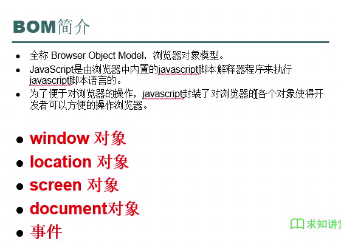
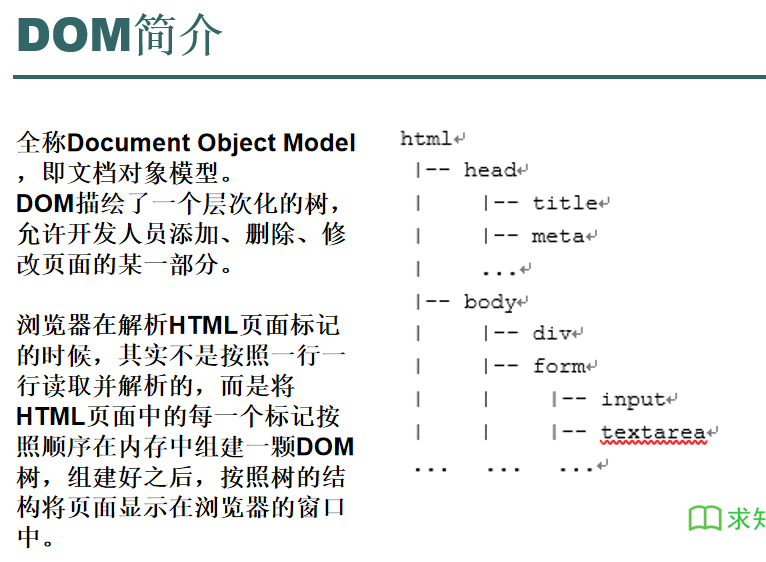
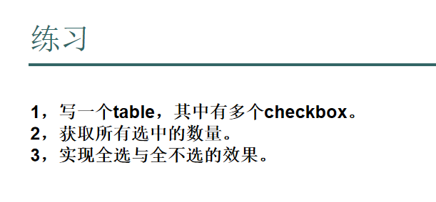
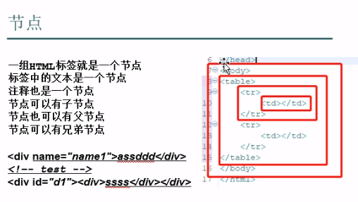

# BOM简介


## window对象
* 代表了一个浏览器窗口，会在`<body>`或者`<frameset>`每次出现时被自动创建。
* 引用时不需要写window

```html
<!DOCTYPE html>
<html lang="en">
<head>
    <meta charset="UTF-8">
    <title>Title</title>
    <script type="text/javascript">
        // alert("这是一个警告框!");

        // comfirm是一个确定框
        // 返回Boolean类型值
        /*
        if (confirm("确定注册吗？")) {
            alert("已注册");
        } else {
            alert("取消注册");
        }
        */

        //prompt是在网页上弹出一个输入框，有两个参数
        //参数1是输入框的名称
        //参数2是输入框的默认值
        //返回点击确定按钮时输入框中的值
        /*
        var s = prompt("用户名:" , "请输入用户名");
        alert(s);
        */

        //open是打开某个url链接，是新弹出一个页面，可能会被浏览器拦截
        /*
        open("https://www.baidu.com", "进入百度");
         */

        //setTimeout方法，在触发setTimeout之后的参数2毫秒后执行参数1
        //代表的方法
        /*
        setTimeout(function () {
            alert("setTimeout定义的内部匿名方法!")
        }, 3000)
         */

        //setInterval方法,在出发setInterval方法后，每间隔参数2毫秒后，
        //执行参数1的方法
        //第一次也是先等待，到时再执行
        /*
        var i =0;
        setInterval(function () {
            document.getElementById("01").innerHTML = "第" + i + "次执行setInterval方法!";
            i++;
        }, 2000)
         */


    </script>
</head>
<body>
<div id="01"></div>
</body>
</html>
```

## location对象
* 由js引擎自动创建，包含有关当前URL的信息
  * href属性，设置或者获取整个URL为字符串
  * reload()属性，重新装入当前页面，刷新

## screen对象
* 由js引擎自动创建的，包含有关客户机显示屏幕的信息。
  * availHeight	获取系统屏幕的工作区域高度，排除 Microsoft Windows 任务栏。 	
  * availWidth	获取系统屏幕的工作区域宽度，排除 Windows 任务栏。 	
  * height		获取屏幕的垂直分辨率。 
  * width		获取屏幕的水平分辨率。

```html
<!DOCTYPE html>
<html lang="en">
<head>
    <meta charset="UTF-8">
    <title>Title</title>
    <script type="text/javascript">
        //获取当前网页的网址
        //alert(location.href);

        //刷新
        /*
        if (confirm("是否刷新?")) {
            location.reload();
        }
         */

        //可以通过重新给location.href设置值，来改变当前的页面，
        //这种方式叫做重定向
        /*
        if (confirm("是否跳转?")) {
            location.href = "https://www.baidu.com";
        }
         */

        alert(screen.availHeight + "*" + screen.availWidth);
        alert(screen.height + "*" + screen.width);


    </script>
</head>
<body>

</body>
</html>
```

## document对象
* 该对象代表整个文档页面(也就是网页中的所有HTML标签部分)。
* 主要用于DOM编程。

### 事件部分
* 鼠标点击相关
  * onclick 在用户用鼠标左键单击对象时触发。
  * ondblclick 当用户双击对象时触发。 
  * onmousedown 当用户用任何鼠标按钮单击对象时触发（按钮按下时触发）。
  * onmouseup 当用户在鼠标位于对象之上时释放鼠标按钮时触发（按钮弹起时触发）。 


* 鼠标移动相关：
  * onmouseout  当用户将鼠标指针移出对象边界时触发。
  * onmousemove 当用户将鼠标划过对象时触发。


* 焦点相关的：主要是输入框:
  * onblur 在对象失去输入焦点时触发。 
  * onfocus 当对象获得焦点时触发。

```html
<!DOCTYPE html>
<html lang="en">
<head>
    <meta charset="UTF-8">
    <title>Title</title>
    <script type="text/javascript">
        var test = function (str) {
            document.getElementById("d01").innerHTML = str;
        }
    </script>
</head>
<body>

<div onclick="alert(11111111111111)">1111111111111111111111</div>
<div ondblclick="alert(222222222)">22222222222222222222</div>
<div onmousedown="alert(33333)">33333333333333333333333333333</div>
<div onmouseup="alert(4444)">444444444444444444444444444444444</div>
<!--<div onmouseout="alert(5555)">55555555555555555555555555555555</div>-->
<!--<div onmousemove="alert(6666)">6666666666666666666666666666666</div>-->

<input type="text" onblur="test('失去焦点')" onfocus="test('得到焦点')">
<div id="d01"></div>
</body>
</html>
```

* 按键相关：(按键相关的必须是键盘能输入的标签，例如input的text类型，div就不能触发按键相关)
  * onkeydown当用户按下键盘按键时触发。
  * onkeyup当用户释放键盘按键时触发。 
  * onkeypress当用户按下字面（英文字母，数字，字符）键时触发(中文不能触发)。


* 其它：
  * onchange当对象或选中区的内容改变时触发，下拉列表或者输入框等
  * onload在浏览器完成对象的装载后立即触发，body上，一般用来初始化网页，不是很常用。
  * onsubmit当表单将要被提交时触发，servlet之后。

```html
<!DOCTYPE html>
<html lang="en">
<head>
    <meta charset="UTF-8">
    <title>Title</title>
    <script type="text/javascript">
        var test = function (str) {
            document.getElementById("d01").innerHTML = str;
        }
    </script>
</head>
<body>

<div onclick="alert(11111111111111)">1111111111111111111111</div>
<div ondblclick="alert(222222222)">22222222222222222222</div>
<div onmousedown="alert(33333)">33333333333333333333333333333</div>
<div onmouseup="alert(4444)">444444444444444444444444444444444</div>
<!--<div onmouseout="alert(5555)">55555555555555555555555555555555</div>-->
<!--<div onmousemove="alert(6666)">6666666666666666666666666666666</div>-->

<input type="text" onblur="test('失去焦点')" onfocus="test('得到焦点')">
<div id="d01"></div>
<input type="text" onkeydown="alert(777)">
<input type="text" onkeyup="alert(888)">
<input type="text" onkeypress="alert(9999)">

</body>
</html>
```

## DOM简介



### 获取节点对象
* getElementById:元素ID是唯一的
* getElementsByTagName
* getElementsByName
* 注意:**JS 在页面渲染（生成）之前就执行了代码,也就是如果在body前引入js代码，那么在js代码中立即执行的获取页面元素将会报错，解决方式是将js代码放到body的最后或者下面**

```html
<!DOCTYPE html>
<html lang="en">
<head>
    <meta charset="UTF-8">
    <title>Title</title>
    <script type="text/javascript">
        var test1 = function () {
            var d1 = document.getElementById("d01");
            alert(d1.innerHTML);
        };
        var test2 = function () {
            var ds = document.getElementsByTagName("div");
            for (var i = 0; i < ds.length; i++) {
                alert(ds[i].innerHTML);
            }
        };
        var test3 = function () {
          var ns = document.getElementsByName("name1");
            for (var i = 0; i < ns.length; i++) {
                alert(ns[i].innerHTML);
            }
        };
    </script>
</head>
<body>
<div id="d01">11111111111111</div>
<div name="name1">2222222222222222222</div>
<span name="name1">33333333333</span>
<hr>
<input type="button" value="根据id获取相应的元素" onclick="test1()">
<input type="button" value="根据tag标签获取相应的元素" onclick="test2()">
<input type="button" value="根据name属性获取相应的元素" onclick="test3()">
</body>
</html>
```
### 获取和设置节点属性
* 设置节点属性setAttribute
* 获得节点属性getAttribute
* 获取节点属性名称的集合getAttributeNames

```html
<!DOCTYPE html>
<html>
<head>
<meta charset="UTF-8">
<title>Insert title here</title>
<script type="text/javascript">
	var test1 = function(){
		var input = document.getElementById("id11");
		alert("value : " + input.getAttribute("value"));
		alert("name : " + input.getAttribute("name"));
		alert("abc : " + input.getAttribute("abc"));
	}
	
	var test2 = function(){
		var input = document.getElementById("id11");
		input.setAttribute("name", "testname");
		input.setAttribute("value", "hello");
	}
	
	var test3 = function(){
		var h1 = document.getElementById("h1");
		
		h1.setAttribute("style", "color: red");
	}
</script>
</head>
<body>
<h1 id="h1">11122121</h1>

<input type="text" value="1223333" name="name111" id="id11" abc="xxxxxx">
<input type="button" value="获取文本输入框的属性值" onclick="test1();">
<input type="button" value="设置文本输入框的属性值" onclick="test2();">
<input type="button" value="把一个标签的内容颜色改为红色" onclick="test3();">
</body>
</html>
```

### innerHTML和innerText的区别
* iinnerHTML属性获取的是元素对象内包含html代码的内容
* innerText属性只获得元素对象内的文本内容

```html
<!DOCTYPE html>
<html lang="en">
<head>
    <meta charset="UTF-8">
    <title>Title</title>
    <script type="text/javascript">
        function test() {
            let d1 = document.getElementById("d1");
            d1.innerHTML = "<h1>这是一个h1</h1>";
        }
    </script>
</head>
<body>
<div id="d1">
    <span>这是一个span</span>
</div>
<input type="button" value="test" onclick="test()">
</body>
<script type="text/javascript">
    let d1 = document.getElementById("d1");
    console.log(d1.innerHTML);//    <span>这是一个span</span>
    console.log(d1.innerText);// 这是一个span
</script>
</html>
```


* CheckBox的checked的属性代表是否被选择
* CheckBox被点击后先更改checked属性在执行onClick中的代码
```html
<!DOCTYPE html>
<html lang="en">
<head>
    <meta charset="UTF-8">
    <title>Title</title>
    <script type="text/javascript">
        var getCount = function () {
            var chs = document.getElementsByName("ch01");
            var count = 0;
            for (var i = 0; i < chs.length; i++) {
                if (chs[i].checked) {
                    count ++;
                }
            }
            alert(count);
        };

        var allCheck = function () {
            var ch = document.getElementById("ch00");
            var chs = document.getElementsByName("ch01");
            for (var i = 0; i < chs.length; i++) {
                chs[i].checked = ch.checked;
            }
        };

        var isCheck0Checked = function () {
            var ch = document.getElementById("ch00");
            var chs = document.getElementsByName("ch01");
            var count = 0;
            for (var i = 0; i < chs.length; i++) {
                if (chs[i].checked) {
                    count ++;
                }
            }
            ch.checked = (count === 3);
        }
    </script>
</head>
<body>
<table border="1">
    <tr>
        <td><input type="checkbox" id="ch00" onclick="allCheck()"></td>
        <td>姓名</td>
        <td>年龄</td>
        <td>性别</td>
    </tr>
    <tr>
        <td><input type="checkbox" name="ch01" onclick="isCheck0Checked()"></td>
        <td>张三</td>
        <td>15</td>
        <td>男</td>
    </tr>
    <tr>
        <td><input type="checkbox" name="ch01" onclick="isCheck0Checked()"></td>
        <td>李四</td>
        <td>16</td>
        <td>男</td>
    </tr>
    <tr>
        <td><input type="checkbox" name="ch01" onclick="isCheck0Checked()"></td>
        <td>Lucy</td>
        <td>19</td>
        <td>女</td>
    </tr>
</table>

<input type="button" value="获取选中的数量" onclick="getCount()">
</body>
</html>
```

## 节点

### 节点属性
* nodeType 节点类型
  * 1 元素 就是标签元素，例如：`<div>...</div>`
  * 3 文本 标签元素中的文本
  * 8 注释 表示为注释
* nodeName 节点名称
  * 元素节点的名称是标签名称
  * 文本节点名称是#text
  * 注释节点的名称是#comment
* nodeValue
  * 文本节点中是文本所包含的节点
  * 注释节点中是注释内容
  * 对于元素节点来说不可用，永远是null

```html
<!DOCTYPE html>
<html lang="en">
<head>
    <meta charset="UTF-8">
    <title>Title</title>
    <script type="text/javascript">
        var test = function () {
            //获得body的所有子节点
            var arr = document.body.childNodes;
            for (var i = 0; i < arr.length; i++) {
                console.log(i + ",type:" + arr[i].nodeType + ",name:" + arr[i].nodeName + ",value:" + arr[i].nodeValue);
            }
        }
    </script>
</head>
<body>
111222333
<div>xxxx</div>
div文本
<!--kkkk-->
啊啊啊啊
<br>
<input type="button" value="测试" onclick="test()">
input的文本
</body>
</html>
```
### 注意：**回车也是一个文本节点，另外childNodes不会得到子节点的子节点**

<br>

### 新增节点
* 在最后添加:appendChild(node)
* 在某个子节点前面添加:insertBefore(newNode, node)

### 删除节点
* fatherNode.removeChild(node)
* 子节点也会一起被删除

### 替换节点
* replaceChild(newNode, node)

### 复制节点
* cloneNode(Boolean)
  * 参数为flase不复制子节点
  * 参数为true复制子节点

#### 注意：在DOM编程中一般把要添加/替换的节点放到第一个参数，这点与其它的习惯不同。

### 通过节点关系查找节点
* parentNode父节点
* childNodes所有下一级子节点：
  * 注意这个子节点有一个包含其中的文本节点
* firstChild第一个子节点
* lastChild最后一个子节点
* nextSibling当前节点同级的下一个节点
* previousSibling当前节点同级的上一个节点

```html
<!DOCTYPE html>
<html lang="en">
<head>
    <meta charset="UTF-8">
    <title>Title</title>
    <script type="text/javascript">
        var test = function () {
            var body = document.body;
            var div = document.createElement("div");
            div.innerHTML = "这是一个js添加的新的div元素";
            div.setAttribute("style", "color: red");
            body.appendChild(div);
        };

        var test1 = function () {
            var body = document.body;
            var div = document.createElement("div");
            var h1 = document.getElementById("h_01");
            div.innerHTML = "这是一个js添加的新的div元素";
            div.setAttribute("style", "color: red");

            body.insertBefore(div, h1);//这里注意第一个参数是新节点，第二个参数是调用insertBefore节点的子节点
        };

        /*
        这里需要注意的一点是
        如果用getElementsByTagName获取全部div元素再用for循环删除
        那么只会删除一半的div元素
        怀疑可能是将每次删除一个div元素会导致其它div元素前移
        所以使用这种写法可以全部删除
        */
        function test2() {
            let body = document.body;
            let div = document.getElementsByTagName("div");
            while (div.length !== 0) {
                body.removeChild(div[0]);
                div = document.getElementsByTagName("div");
            }
        }

        // 同removeChild这里也要用while循环
        function test3() {
            let body = document.body;
            let divs = document.getElementsByTagName("div");
            while (divs.length !== 0) {
                let h = document.createElement("h1");
                h.setAttribute("style", "color: chocolate");
                h.innerHTML = "这是一个h1标签";
                body.replaceChild(h, divs[0]);
                divs = document.getElementsByTagName("div");
            }
        }
        
        var test4 = function () {
            var d_1 = document.getElementById("d_1");
            var d_2 = document.getElementById("d_2");
            var d_3 = d_1.cloneNode(true);

            d_3.setAttribute("id", "d_3");
            d_2.appendChild(d_3);
        }

        var test5 = function () {
            var d_1 = document.getElementById("d_1");
            var ns = d_1.childNodes;
            for (var i = 0; i < ns.length; i++) {
                console.log("第" + i + "个节点," +
                ",nodeType:" + ns[i].nodeType +
                ",nodeName:" + ns[i].nodeName +
                ",nodeValue:" + ns[i].nodeValue)
            }
        };
        /*
        这里的子节点包含元素开始标签和结束标签里面的所有文本
        例如这里的d_1的子节点：
        0.文本节点：测试div1
        1.span节点：s_1
        2.文本节点:两个span中的回车
        3.span节点：s_2
        4.文本节点：第二次测试div1
         */
    </script>
</head>
<body>
<div id="d_1">
    测试div1
    <span id="s_1">
        测试span1
        <div id="d_3">
            测试div3
        </div>
        第二次测试span1
    </span>
    <span id="s_2">测试span2</span>
    第二次测试div1
</div>
<div id="d_2"></div>
<h1 id="h_01">这是一个h1标签</h1>
<input type="button" value="添加新元素" onclick="test()">
<input type="button" value="插入新元素" onclick="test1()">
<input type="button" value="删除d_1的子节点s_1" onclick="test2()">
<input type="button" value="把节点d_1的子节点s_2替换成一个h1标签" onclick="test3()">
<input type="button" value="把节点d_1的复制节点cd_1放到d_2中" onclick="test4()">
<input type="button" value="根据节点关系查找节点" onclick="test5()">
</body>
</html>
```

### 练习
* 一个表格，用按钮实现新增一行，每行的最后一列有删除本行功能的按钮
* 双击表格进行编辑
* 调用函数的时候可以用this表示本节点
```html
<!DOCTYPE html>
<html lang="en">
<head>
    <meta charset="UTF-8">
    <title>Title</title>
    <script type="text/javascript">
        var addRow = function () {
            var table = document.getElementById("t_01");
            var tr = document.createElement("tr");

            var td0 = document.createElement("td");
            td0.innerHTML = "请输入";
            td0.setAttribute("ondblclick", "edit(this)");

            var td1 = document.createElement("td");
            td1.innerHTML = "请输入";
            td1.setAttribute("ondblclick", "edit(this)");

            var td2 = document.createElement("td");
            td2.innerHTML = "请输入";
            td2.setAttribute("ondblclick", "edit(this)");

            var td3 = document.createElement("td");
            td3.innerHTML = "<input type=\"button\" value=\"删除本行\" onclick=\"delRow(this)\">";

            tr.appendChild(td0);
            tr.appendChild(td1);
            tr.appendChild(td2);
            tr.appendChild(td3);

            table.appendChild(tr);
        }

        var delRow = function (button) {
            var tr = button.parentNode.parentNode;
            var table = tr.parentNode;
            table.removeChild(tr);
        }

        var edit = function (td) {
            td.innerHTML = "<input type=\"text\" value=\"\" onblur=\"insert(this)\">"
        }

        var insert = function (text) {
            var td = text.parentNode;
            var str = text.value;
            td.removeChild(text);
            if (str === "") {
                td.innerHTML = "请输入"
            } else {
                td.innerHTML = str;
            }
        };

    </script>
</head>
<body>
<input type="button" value="新增一行" onclick="addRow()">
<table id="t_01" border="1">
    <tr>
        <td>姓名：</td>
        <td>性别：</td>
        <td>年龄：</td>
        <td>操作</td>
    </tr>
</table>
</body>
</html>
```
