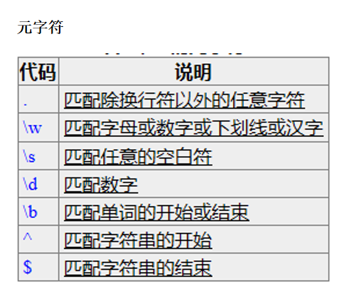
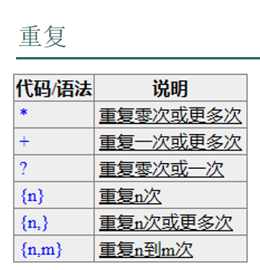
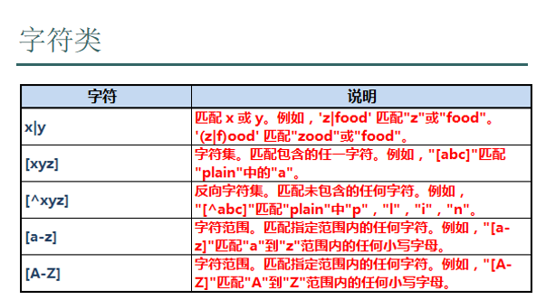
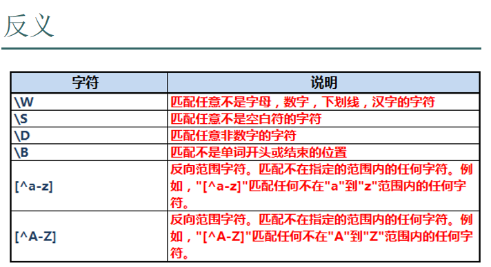
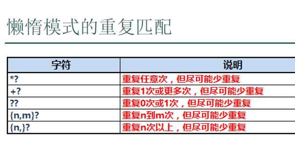
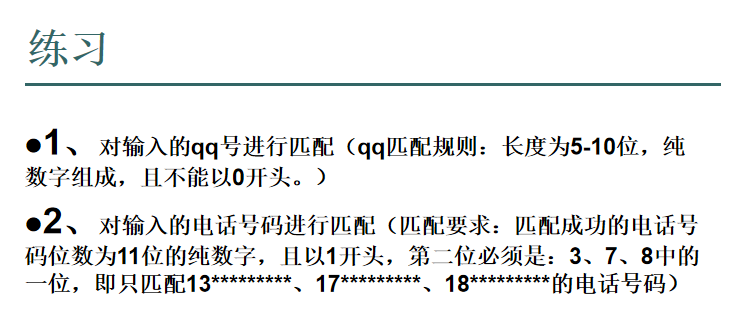

# 正则
* 很多编程语言都支持
* 用于校验

## 开头结尾
* 字符串开头结尾`/^$/`
* 单词`/\b\b/`

## 元字符
* 固定这么写，没有变化
* 测试中`\w`无法匹配汉字



## 重复


## 字符类

* `1|2`和`[12]`是一个意思


```html
<!DOCTYPE html>
<html lang="en">
<head>
    <meta charset="UTF-8">
    <title>Title</title>
    <script type="text/javascript">
        //匹配只有一个字符的字符串，这个字符是一个非换行符，如果是换行符返回false
        //alert(/^.$/.test("\n"));
        //匹配字母、数字、下划线、汉字(汉字不行）
        // alert(/^\w$/.test("1"));
        //匹配空格
        // alert(/^\s$/.test(" "))
        //匹配数字
        // alert(/^\d$/.test("1"));
        //想用正则校验这个字符串是不是一个$
        // alert(/^\$$/.test("$"))
        //*,重复*之前的校验规则0到多次
        // alert(/^\d*$/.test("11a67"))
        //+,重复+之前的校验规则1到多次
        // alert(/^\w+$/.test("aaaa"))
        //?,重复?之前的校验规则0到1次
        // alert(/^\w?$/.test("a"))
        //{n,m},重复{n,n}之前的校验规则n到m次，大于等于n次小于等于m
        // alert(/^\d{2,5}$/.test("133456"))
        //判断指定的字符串是不是hello或者1234
        // alert(/^(hello|1234)$/.test("12345"))
        //判断指定的字符串是不是以a或者b开头，以1或者2结尾
        // alert(/^(a|b)(.*)(1|2)$/.test("bfjoiaje&*^*&TT&^2"))
        //判断指定的字符串第3个位置是属于a、b、c、2中的任意一个
        // alert(/^.{2}[abc2].*$/.test("ab"));
        //判断指定的字符串第3个位置不是属于a、b、c、2中的任意一个
        // alert(/^.{2}[^abc2].*$/.test("dd"));
        //判断一个字符串开头是123，结尾是45，中间是小写字母最少2个最多4个
        // alert(/^123[a-z]{2,4}45$/.test("123aaaaa45"));
        //判断一个字符串开头是123，结尾是45，中间是一个字母或数字，不分大小写
        alert(/^123([a-z]|[A-Z]|\d)45$/.test("123B45"));
    </script>
</head>
<body>

</body>
</html>
```

### 反义

* 小写变大写或者前面加`^`




### 贪婪模式与懒惰模式
* 贪婪模式会匹配最长的字符串
* 懒惰模式会使用最小重复
* 加?



```html
<!DOCTYPE html>
<html lang="en">
<head>
    <meta charset="UTF-8">
    <title>Title</title>
    <script type="text/javascript">
        //匹配非字母数字下划线
        // alert(/^\W$/.test("_"));
        //匹配非空格
        // alert(/^\S$/.test(" "));
        //匹配非数字
        // alert(/^\D$/.test(" "));
        //非小写字母
        // alert(/^[^a-z]$/.test("A"));
        /*
        match() 方法可在字符串内检索指定的值，
        或找到一个或多个正则表达式的匹配。
        该方法类似 indexOf() 和 lastIndexOf()，
        但是它返回指定的值，而不是字符串的位置。
         */
        var s = "12345";
        // alert(s.match(/^1\d+$/));//12345
        alert(s.match(/^1(\d{1,3}?)\d*$/));
        /*
        表达式加上参数g之后，表明可以进行全局匹配
        match() 方法将检索字符串 stringObject，以找到一个或多个与 regexp 匹配的文本。
        这个方法的行为在很大程度上有赖于 regexp 是否具有标志 g。
        如果 regexp 没有标志 g，那么 match() 方法就只能在 stringObject 中执行一次匹配。
        如果没有找到任何匹配的文本， match() 将返回 null。
        否则，它将返回一个数组，其中存放了与它找到的匹配文本有关的信息。
        该数组的第 0 个元素存放的是匹配文本，而其余的元素存放的是与正则表达式的子表达式匹配的文本。
        除了这些常规的数组元素之外，返回的数组还含有两个对象属性。
        index 属性声明的是匹配文本的起始字符在 stringObject 中的位置，
        input 属性声明的是对 stringObject 的引用。

        如果 regexp 具有标志 g，则 match() 方法将执行全局检索，找到 stringObject 中的所有匹配子字符串。
        若没有找到任何匹配的子串，则返回 null。
        如果找到了一个或多个匹配子串，则返回一个数组。
        不过全局匹配返回的数组的内容与前者大不相同，
        它的数组元素中存放的是 stringObject 中所有的匹配子串，
        而且也没有 index 属性或 input 属性。
         */
    </script>
</head>
<body>
</body>
</html>
```
#### 练习

```html
<!DOCTYPE html>
<html lang="en">
<head>
    <meta charset="UTF-8">
    <title>Title</title>
    <script type="text/javascript">
        // 匹配qq号
        var reg = /^[1-9]\d{4,9}$/;
        // 校验手机号
        var reg1 = /^1[378]\d{9}$/;
    </script>
</head>
<body>
</body>
</html>
```