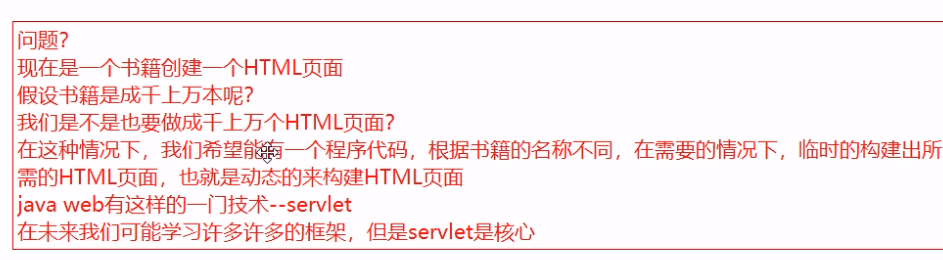
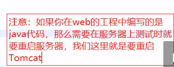
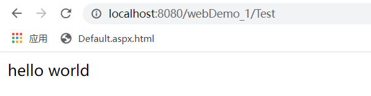
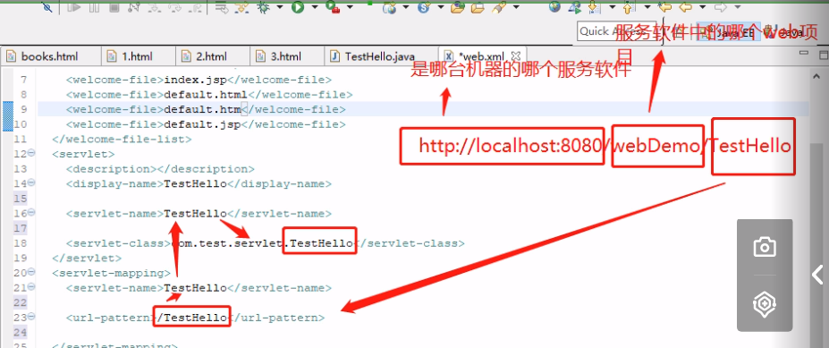
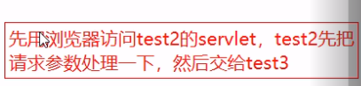

# servlet
### 引入
* 构建一个书籍列表，双击书籍名称的时候进入书籍简介页面

```html
<!DOCTYPE html>
<html lang="en">
<head>
    <meta charset="UTF-8">
    <title>Title</title>
    <script type="text/javascript">
        var desc = function (name) {
            if (name === "JAVA WEB") {
                location.href = "http://localhost:8080/webDemo_1/pages/day07/book1.html";
            } else if (name === "JAVA EE") {
                location.href = "http://localhost:8080/webDemo_1/pages/day07/book2.html";
            } else if (name === "Mysql") {
                location.href = "http://localhost:8080/webDemo_1/pages/day07/book3.html";
            }
        };
    </script>
</head>
<body>
<table border="1">
    <tr>
        <td>编号</td>
        <td>书籍名称</td>
    </tr>
    <tr>
        <td>1</td>
        <td ondblclick="desc('JAVA WEB')">JAVA WEB</td>
    </tr>
    <tr>
        <td>2</td>
        <td ondblclick="desc('JAVA EE')">JAVA EE</td>
    </tr>
    <tr>
        <td>3</td>
        <td ondblclick="desc('Mysql')">Mysql</td>
    </tr>
</table>
</body>
</html>
```


* 我们需要动态的构建html页面
* servlet： 用java语言开发网页动态资源的技术。


## 特点
* servlet就是一个普通的java类，继承HttpServlet类
* 一个普通的java类实现了Servlet接口，也叫Servlet程序。我们通常继承HttpServlet是为了创建一个基于http协议的servlet程序
* servlet程序要交给tomcat服务器运行

## 第一个servlet
* 用servlet做一个页面，页面上是helloworld
* 这里使用servlet库需要将Tomcat中lib文件夹下的servlet-api包引入

* 写一个servlet
```java
package com.test.servlet;

import javax.servlet.ServletException;
import javax.servlet.http.HttpServlet;
import javax.servlet.http.HttpServletRequest;
import javax.servlet.http.HttpServletResponse;
import java.io.IOException;

/**
 * Servlet实际上就是继承了HttpServlet的java类
 */
public class TestHello extends HttpServlet {
    @Override
    protected void doGet(HttpServletRequest req, HttpServletResponse resp) throws ServletException, IOException {
        this.doPost(req, resp);
    }

    @Override
    protected void doPost(HttpServletRequest req, HttpServletResponse resp) throws ServletException, IOException {
        StringBuffer buff = new StringBuffer();

        buff.append("<html><body>");
        buff.append("hello world");
        buff.append("</html></body>");

        resp.getWriter().write(buff.toString());
    }
}
```

* 配置web.xml

```html
    <servlet>
        <servlet-name>testHello</servlet-name>
        <servlet-class>com.test.servlet.TestHello</servlet-class>
    </servlet>
    
    <servlet-mapping>
        <servlet-name>testHello</servlet-name>
        <url-pattern>/Test</url-pattern>
    </servlet-mapping>
```



* 访问



### Servlet的执行过程
`输入：http://localhost:8080/webDemo_1/Test`

<br>

* `http://`:http协议:
  * 本地hosts文件查询域名到ip的映射
  * 没有找到则联网到运营商的DNS服务器找域名和ip的映射
* `8080`:端口:
  * tomcat:8080
* `/webDemo_1`:站点下的web应用的名称
* `/TestHello`:资源名称。截取到/TestHello字符串
  * 在webDemo_1下的web.xml文件中查找是否存在匹配的url-pattern
  * 使用selvlet的内部名称在web.xml文件中查找是否存在相同名称的servlet配置
  * 得到对应的servlet-class内容



### Servlet的doGet和doPost方法
* 表单中的method属性决定执行doGet还是doPost方法
* doGet会将输入的值显示加到URL中
* 对浏览器页面的直接访问调用Servlet是Get方法

#### get与post请求
* get请求就是把参数放到url链接上
* 问题：
  * 安全问题，明码写在URL上
  * 实际上可以越过点击按钮的过程，只要构造一个符合要求的url
  * 浏览器的地址栏的长度有限，服务器软件能够接收的URL长度有限，大概6000字节到几万字节不等，长度有上限。
* post请求不存在这些问题

#### Idea中可以设置注解达到配置web.xml的目的
* `@WebServlet(name = "t1", value = "/t1")`代表设置了一个`url-pattern`为`/t1`的servlet。

```java
package com.test.servlet;

import javax.servlet.*;
import javax.servlet.http.*;
import javax.servlet.annotation.*;
import java.io.IOException;

@WebServlet(name = "t1", value = "/t1")
public class Test1 extends HttpServlet {
    @Override
    protected void doGet(HttpServletRequest request, HttpServletResponse response) throws ServletException, IOException {
        //doGet和doPost共用逻辑卷
        this.doPost(request, response);
        System.out.println("get方法");
    }

    @Override
    protected void doPost(HttpServletRequest request, HttpServletResponse response) throws ServletException, IOException {
        //设置编码为utf-8，不然会中文乱码
        request.setCharacterEncoding("utf-8");
        String userName = request.getParameter("username");
        String sex = request.getParameter("sex");
        System.out.println(userName + "," + sex);
    }
}
```
#### tips：在tomcat7之前默认的编码是iso-8859-1,8以后改成了utf-8

### 关于Tomcat输出乱码的解决
1. idea在设置中配置文件编码都是utf-8
2. Tomcat目录下的conf的logging.properties这个文件编码全部改成utf-8
3. idea的Tomcat配置在虚拟机配置选项中加入 **-Dfile.encoding=UTF-8**
4. 通过帮助idea->帮助->编辑自定义vm选项来编辑vmoptions文件加入 **-Dfile.encoding=UTF-8**
5. 做完这些后注意要重启idea

<br>

#### 需求：

* 在test2使用setAttribute参数给request设置参数
* 再使用getRequestDispacher(路径).forward(request,respond)将request传到test3进行处理。


```java
@WebServlet(name = "t2", value = "/t2")
public class Test2 extends HttpServlet {
    @Override
    protected void doGet(HttpServletRequest req, HttpServletResponse resp) throws ServletException, IOException {
        this.doPost(req, resp);
        System.out.println("get方法");
    }

    @Override
    protected void doPost(HttpServletRequest req, HttpServletResponse resp) throws ServletException, IOException {
//        req.setCharacterEncoding("utf-8");
        String str = req.getParameter("str");
        str += "!!!!!!";

        req.setAttribute("str", str);
        //把当前servlet的请求转发给其他的servlet处理
        //注意，在这个过程中，URL是不发生变化的，属于内部处理过程
        req.getRequestDispatcher("t2/t3").forward(req, resp);
    }
}
```

```java
@WebServlet(name = "getstr", value = "/t2/t3")
public class Test3 extends HttpServlet {
    @Override
    protected void doGet(HttpServletRequest req, HttpServletResponse resp) throws ServletException, IOException {
        this.doPost(req, resp);
    }

    @Override
    protected void doPost(HttpServletRequest req, HttpServletResponse resp) throws ServletException, IOException {
//        req.setCharacterEncoding("gbk");
        String str = (String) req.getAttribute("str");
        System.out.println(str);
    }
}
```

### Resopnse方法
* .getWriter().write():向网页写入内容
* .sendRedirect()重定向

```java
@WebServlet(name = "test5", value = "/t5")
public class Test5 extends HttpServlet {
    @Override
    protected void doGet(HttpServletRequest req, HttpServletResponse resp) throws ServletException, IOException {
        this.doPost(req, resp);
    }

    @Override
    protected void doPost(HttpServletRequest req, HttpServletResponse resp) throws ServletException, IOException {
        String id = req.getParameter("id");

        if (id.length() == 1 && Character.isDigit(id.charAt(0))) {
            resp.sendRedirect("pages/day07/book" + id + ".html");
        } else {
            //在重定向时，如果重定向的连接是需要带参数并且为中文，
            //要把这个参数值URLEncoder.encode("张三", "utf-8")去给其重新的编码
            String name = URLEncoder.encode(id, "utf-8");
            String sex = URLEncoder.encode("男", "utf-8");

            //sendRedirect重定向的方式，要传递参数只能使用get请求方式
            resp.sendRedirect("t1" + "?username=" + name + "&sex=" + sex);
        }
    }
}
```

#### getResponseDispatcher与sendRedirect的区别
* getResponseDispatcher只能传给本地的资源（前面有了默认目录/webDemo_1/)，浏览器中URL不改变
* sendRedirect()将网页导向一个新地址，如果输入的地址最前方有/那么默认目录localhost:8080/,如果输入的地址最前方没有/，默认目录是localhost:8080/webDemo_1/(加上了文件当前目录)。
