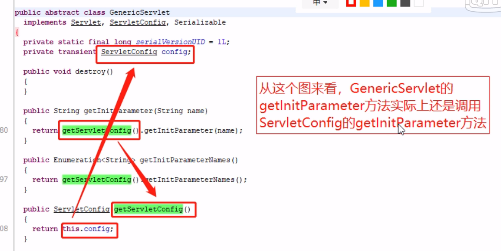

# init方法
* GenericServlet有两个init方法
  * HttpServle继承GenericServlet
  * 一个有参一个无参
  * 有参的init会调用无参的init
  * servlet创建对象时，Tomcat服务器会调用有参init方法
  * 自定义初始化逻辑只用重写无参init就行

```java
private transient ServletConfig config;

public void init(ServletConfig config) throws ServletException {
    this.config = config;
    init();
}
  
public void init() throws ServletException {}
```

# ServletConfig对象
* 有参的init参数就是ServletConfig
* 用来加载servlet配置参数信息
* ServletConfig对象是在创建完Servlet对象之后被创建出来的，然后通过有参的init方法传递到Servlet中

<br>

* 可以在web.xml文件添加配置信息

```xml
<servlet>
    <servlet-name>testHello</servlet-name>
    <servlet-class>com.test.servlet.TestHello</servlet-class>
    <load-on-startup>1</load-on-startup>
    <!-- 设置了两个参数 -->
    <init-param>
        <param-name>aaa</param-name>
        <param-value>aaaValue</param-value>
    </init-param>
    <init-param>
        <param-name>bbb</param-name>
        <param-value>bbbValue</param-value>
    </init-param>
</servlet>
```

* 也可以在注解中通过设置initParams参数

```java
@WebServlet(name = "test5", value = "/t5", initParams = {
        @WebInitParam(name = "aaa", value = "aaaValue"),
        @WebInitParam(name = "bbb", value = "bbbValue")
})
```

* 调用
  * getInitParameter(String name)获取参数值
  * getInitParameterNames()获取参数名称的枚举
  * getServletContext()获得servlet上下文对象
  * getServletName()获得servlet名称

```java
@WebServlet(name = "day09.t1", value = "/d09/t1", initParams = {
        @WebInitParam(name = "aaa", value = "aaaValue"),
        @WebInitParam(name = "bbb", value = "bbbValue")
})
public class Test1 extends HttpServlet {
    @Override
    protected void doGet(HttpServletRequest req, HttpServletResponse resp) throws ServletException, IOException {
        this.doPost(req, resp);
    }

    @Override
    protected void doPost(HttpServletRequest req, HttpServletResponse resp) throws ServletException, IOException {
        String aaa = getInitParameter("aaa");
        String bbb = getInitParameter("bbb");

        System.out.println(aaa + "," + bbb);

        /*
        关于Enumeration类
        这样遍历
        name其实是从-1开始
         */
        Enumeration<String> names = getInitParameterNames();
        while (names.hasMoreElements()) {
            System.out.println(names.nextElement());
        }

        System.out.println(getServletName());//day09.t1
    }
}
```
* **注意：**
  * 这里演示的四个方法其实是GenericServlet的方法，相当于调用父类的方法(省略了super.)。
  * 但是GenericServlet中这四个方法调用了成员变量ServletConfig对应的四个方法。
  * 所以实际上这些方法还是ServletConfig的方法



<br>

* 在GenericServlet中
```java
private transient ServletConfig config;
  
public String getInitParameter(String name) {
    return getServletConfig().getInitParameter(name);
}

public Enumeration<String> getInitParameterNames() {
    return getServletConfig().getInitParameterNames();
}

public ServletConfig getServletConfig() {
    return this.config;
}

public ServletContext getServletContext() {
    return getServletConfig().getServletContext();
}
```

# ServletContext对象
* 叫Servlet的上下文对象，表示当前web应用的环境信息
  * 一个web应用只会创建一个ServletContext对象
* 创建时机
  * 在Tomcat服务器加载完当前web应用后就创建
  * 之后ServletContext作为ServletConfig的成员变量传入Servlet中
  * 可以通过ServletConfig的getServletContext()方法得到

<br>

* getContextPath()方法，获得web应用的上下文路径，也就是部署到Tomcat服务器上运行的web应用名称

```java
//输出：/webDemo_1
System.out.println(getServletContext().getContextPath());
```

## 给web应用设置全局参数
* web应用下的所有servlet都能用
* 在web.xml设置,直接在<web-app>的下层写

```xml
<context-param>
    <param-name>AAA</param-name>
    <param-value>123456</param-value>
</context-param>
<context-param>
    <param-name>BBB</param-name>
    <param-value>654321</param-value>
</context-param>
```

### 获取全局配置信息的方法
* ServletContext.getInitParameter(String name)
* ServletContext.getInitParameterNames()

## 域对象的相关方法
* 域对象是有作用范围的对象
  * ServletContext对象的作用范围是当前的web应用
  * HttpServletRequest对象作用范围是一次请求
* 域对象的相关方法
  * void setAttribute(String name, Object obj)保存数据
  * Object getAttribute(String name)得到数据
  * removeAttribute(String name)清除数据
* 利用域对象可以在多个servlet中传递数据

## web应用读取资源文件
* getRealPath(String path)得到资源文件的绝对路径

```java
//D:\ideaProject\webDemo_1\out\artifacts\webDemo_1_war_exploded
System.out.println(context.getRealPath("/"));
```

* 得到的实际上是web项目在这台电脑上的实际部署位置
* 关于为什么该项目的实际部署位置不在Tomcat的webapps下
  * 是通过idea插件映射到webapps目录下，文件本身并不用放到webapps目录