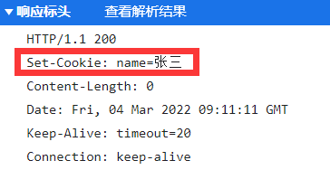
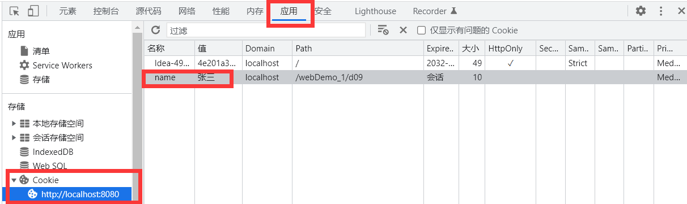
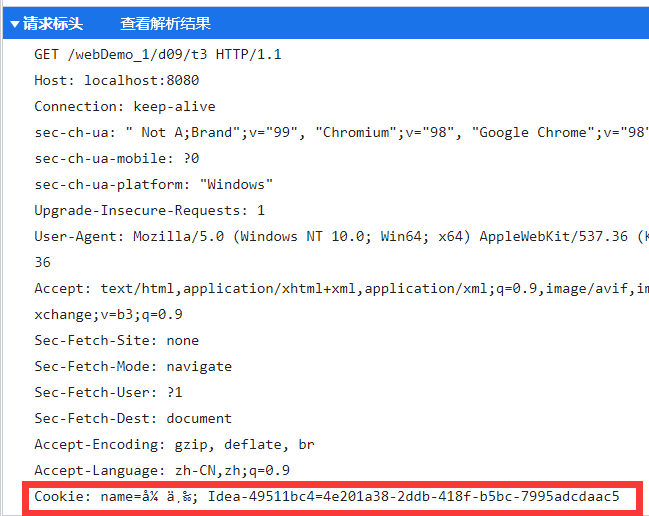
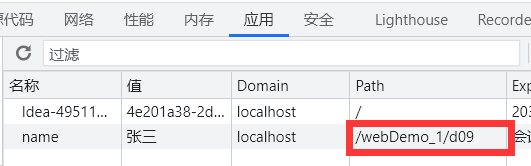
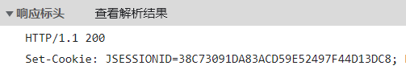
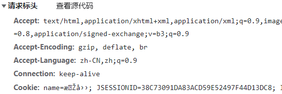

# 会话管理

## 一次会话
* 打开浏览器->访问同一个服务器应用（一次到多次）->关闭浏览器(**不是关闭标签**)

## 两个结论：
* **不同浏览器访问一个web项目产生多个不同的会话**
* **相同的浏览器访问不同的web项目也会产生多个不同的会话**

# Cookie技术
* Cookie类：会保存会话数据，存储在浏览器客户端

## CookieAPI
* 创建Cookie对象
  * new Cookie(String name, String value)
* 设置Cookie对象
  * void setValue(String value):重新设置cookies值
  * void setPath(String url):设置cookie的有效路径
* 发送Cookie数据到浏览器保存
  * response.addCookie(cookie)
* 接收浏览器发送的Cookie数据
  * Cookie[] request.getCookies()

### 一个简单应用
* 创建Cookie
* 
```java
@WebServlet(name = "day09.t2", value = "/d09/t2")
public class Test2 extends HttpServlet {
    @Override
    protected void doGet(HttpServletRequest req, HttpServletResponse resp) throws ServletException, IOException {
        this.doPost(req, resp);
    }

    @Override
    protected void doPost(HttpServletRequest req, HttpServletResponse resp) throws ServletException, IOException {
        Cookie cookie = new Cookie("name", "张三"); 

        resp.addCookie(cookie);
    }
}
```

* 接收Cookie 

```java
@WebServlet(name = "day09.t3", value = "/d09/t3")
public class Test3 extends HttpServlet {
    @Override
    protected void doGet(HttpServletRequest req, HttpServletResponse resp) throws ServletException, IOException {
        this.doPost(req, resp);
    }

    @Override
    protected void doPost(HttpServletRequest req, HttpServletResponse resp) throws ServletException, IOException {
        Cookie[] cookies = req.getCookies();
 
        for (Cookie cookie: cookies) {
            System.out.println(cookie.getName() + "," + cookie.getValue());
        }
    }
}
```

## Cookie原理

* 服务器端生成Cookie数据，设置响应头(Response Header)中set-cookie把数据发给浏览器保存



* 浏览器得到服务器发送的cookie数据，保存在浏览器目录中。



* 浏览器在下次访问服务器时，会带着cookie数据访问服务器。通过cookie请求头把cookie数据发送给服务器端。



* 由于cookie存储在浏览器，所以重启Tomcat对cookie无影响

## Cookie细节
* 设置cookie路径:void setPath(String url):
  * 一个Tomcat可以部署多个应用，比如部署webDemo_1和webDemo_2,如果设定为"/webDemo_2"就算是在webDemo_1中设置的cookie该cookie也只能在webDemo_2中使用。
  * 如果设定为"/"则当前Tomcat下的所有web项目都能使用这个cookie
  * 查看Path举例：
    
  * 使用getCookies()会将符合作用域的所有cookie都取出来作为一个数组，不在乎cookie是否重名。
  * 例子：
    ```java
    Cookie cookie = new Cookie("name", "张三");
    Cookie cookie1 = new Cookie("name", "李四");
    cookie1.setPath("/webDemo_1");

    resp.addCookie(cookie);
    resp.addCookie(cookie1);
    ```

    ```java
    Cookie[] cookies = req.getCookies();

    for (Cookie cookie: cookies) {
        System.out.println(cookie.getName() + "," + cookie.getValue());
    }
    ```

  * 输出：

    ```java
    name,张三
    name,李四
    ```
* 设置cookie有效时长setMaxAge(int value)
  * 输入正整数:例如10，则10s后cookie丢失
  * 输入负整数:浏览器关闭cookie丢失
  * 输入零:删除同名cookie，**注意这里如果有多个作用域不同的同名cookie作用域，只会删除作用域与setMaxAge一致的cookie**
    * 例子:
        ```java
        Cookie cookie = new Cookie("name", "张三");
        Cookie cookie1 = new Cookie("name", "李四");
        cookie.setPath("/webDemo_1/d09");
        cookie1.setPath("/webDemo_1");

        resp.addCookie(cookie);
        resp.addCookie(cookie1);
        ```

        ```java
        Cookie[] cookies = req.getCookies();

        for (Cookie cookie: cookies) {
            System.out.println(cookie.getName() + "," + cookie.getValue());
        }

        Cookie cookie = new Cookie("name", "");
        cookie.setMaxAge(0);
        cookie.setPath("/webDemo_1");
        resp.addCookie(cookie);
        ```
      * 最后只删除了作用域为`/webDemo_1`的cookie
* setDomain(String ip)指定cookie能够在哪个主机上使用
  * 例子:
    ```java
    cookie.setDomain("localhost");
    ```java
* cookie的默认Path是webServlet中value的前一级目录，默认Domain是Tomcat设置的工作IP。
* 可以同时往浏览器发送多个cookie数据，必须是字符串类型（最好不要有中文），浏览器一般只允许存放300个cookie，每个站点（就是web应用）最多存放20个cookie，每个cookie大小限制为4KB。

# Session技术
* 使用cookie技术来保存会话有些问题，需要加入其它技术一起完成

<br>

* Session的API
  * 创建Session对象
    * HttpSession getSession()
    * HttpSession getSession(boolean create)
  * session对象操作会话数据（域对象）
    * void setAttribute(String name, Object obj)
    * Object getAttribute(String name)
    * void removeAttribute(String name)
  * 设置session对象
    * void setMaxInactiveInterval(int intervale):设置session有效时长以(秒为单位)
      * 还可以在web.xml文件中设置session有效时长(以分钟为单位)
        ```xml
        <session-config>
            <!--   设置session的超时时间，单位是分钟    -->
            <session-timeout>1</session-timeout>
        </session-config>
        ```
    * String getId()得到session对象编号
    * void invalidate()销毁session对象
      * 销毁session对象浏览器不会删除对应的cookie中的JSESSIONID的值

## session原理
* Session对象像是一个存储在服务端的大`Map<String, Object>`
* 服务器创建Session对象,分配一个唯一标记(JSESSIONID),会话数据保存在session对象中，服务器把JSESSION作为cookie发送给浏览器保存。
  * 创建新Session对象后响应头会设置JSESSIONID参数
  * 浏览器得到JSESSIONID的cookie，保存在浏览器目录中
* 浏览器下次访问时带者JSESSION的cookie数据访问服务器
* 服务器得到JSESSIONID，在内存中查询是否存在对应编号的session对象
* 如果找到对应的session对象，返回该对象
* 如果找不到session：
  * 如果getSession()参数为true或者不写参数，则创建新的session对象
  * 如果getSession()参数为false，则返回null

<br>

  * 创建session

    ```java
    HttpSession session = req.getSession();

    session.setAttribute("test", "testSession");
    System.out.println(session.getId());
    ```

  * 此时的响应头

    

  * 调用session
    ```java
    HttpSession session = req.getSession();
    String str = (String) session.getAttribute("test");
    System.out.println(str);
    ```

  *  此时的请求头

    

* 关闭浏览器不会导致session对象销毁
* 默认情况下cookie保存在内存中，如果想让cookie保存到硬盘可以设置一个非常大的存活时间值

```java
Cookie cookie = new Cookie("JSESSIONID", session.getId());
cookie.setMaxAge(100000);
response.addCookie(cookie);
```

### 练习
* 用户登录之后，在这个浏览器新开启一个页面来访问其它servlet，在其他的servlet可以展示欢迎这个登录用户的欢迎语


