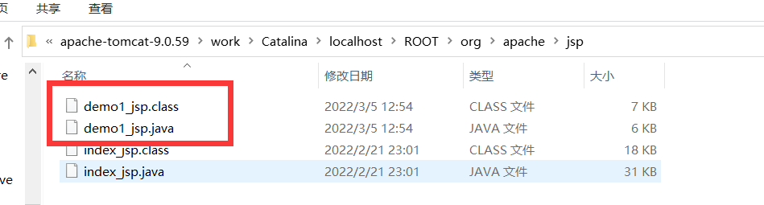
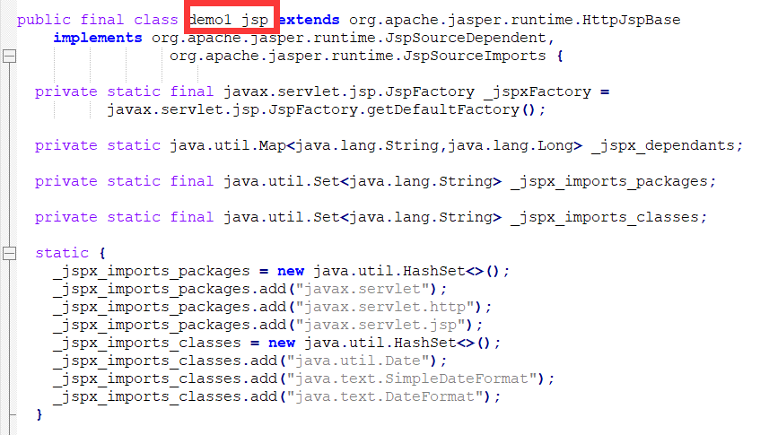
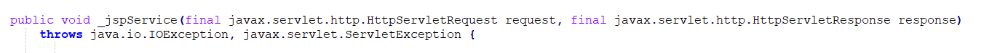
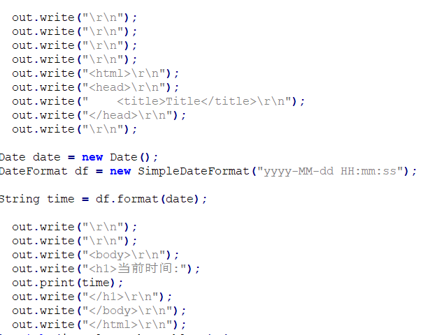
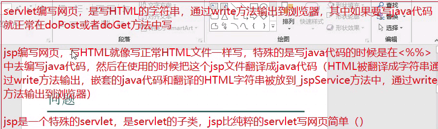

# 为什么使用jsp编程

* 之前使用servlet来开发网页，HTML代码在servlet中写起来很麻烦，HTML都是用的字符串，标签没有高亮变色，看起来不容易，开发容易出错，出错不容易排查。
* 希望有一门技术可以方便地开发HTML，并且可以在其中使用java——jsp

# 什么是JSP

* Java Server Page Java服务页面
* 特点：
    * 用html语言写页面，用java语言写业务逻辑 
    * 既可以写html代码，也可以写java代码
    * 主要作用是用java语言来开发动态资源技术

## JSP练习
* 在当前浏览器输出当前时间

```html
<%@ page import="java.util.Date" %>
<%@ page import="java.text.DateFormat" %>
<%@ page import="java.text.SimpleDateFormat" %><%--
  Created by IntelliJ IDEA.
  User: 乐有明
  Date: 2022/3/5
  Time: 12:52
  To change this template use File | Settings | File Templates.
--%>
<%@ page contentType="text/html;charset=UTF-8" language="java" %>
<html>
<head>
    <title>Title</title>
</head>

<%
    Date date = new Date();
    DateFormat df = new SimpleDateFormat("yyyy-MM-dd HH:mm:ss");

    String time = df.format(date);
%>

<body>
<h1>当前时间:<%=time%></h1>
</body>
</html>
```

# JSP的运行过程
* 第一次访问：
  1.  tomcat服务器把jsp文件翻译成java源文件(work目录下)
  2.  tomcat服务器把java源文件编译成class字节码
  3.  tomcat服务器构造类对象(demo1_jsp)
      1.  这个对象也是**单实例多线程的**,也就是说只会创建一次。
  4.  tomcat服务器调用类对象的方法
* 第n次访问:
  1.  tomcat服务器调用类对象的方法
* 注意:
  1.  如果jsp文件内容改变，会重新翻译和编译jsp文件
  2.  如果java源文件和class字节码文件被删除，再次访问jsp时也会重新翻译和编译。

* 翻译和编译的文件:


* demo1_jsp对象(demo1_jsp)


* tomcat调用的对象中的方法(_jspService)


* 方法的输出


## 问题

1.  jsp文件中的html代码和java代码是如何被执行到。
    * 在上面的_jspService方法中可以看到，html代码转化成字符串通过write()输出，java代码正常执行
2.  jsp和servlet是什么关系?
    * 通过反编译可以看到最后生成的demo1_jsp对象是servlet的子类,jsp实际上是一个特殊的servlet。



# Jsp语法

1.  Jsp模板：
    * Jsp文件中的html代码部分就是模板，这个模板会在jsp文件翻译成java文件后,在_jspService方法中执行（指被转化成字符串通过out.write输出）
2.  Jsp表达式:
    * 语法:`<%=%>`
    * 作用向浏览器输出变量的值或者表达式计算的结果
    * 注意：
      * 原理是使用out.print();方法向浏览器写出内容
      * **结尾不能使用分号**
3.  Jsp脚本:
    * 语法:`<%java代码%>`
    * 作用:嵌套java逻辑代码
    * 注意:
      * 原理是把java脚本代码翻译到java文件中的_jspService方法中执行
      * **Jsp脚本可以穿插html脚本混合使用**
      * **Jsp脚本不能在JS中穿插使用**
4.  Jsp注释:
    * 语法`<%-- 注释 --%>`
    * 注意:
      * html注释会被翻译到java源文件中
      * jsp注释不会被翻译到java源文件中

* 举例:

```html
<%--
  Created by IntelliJ IDEA.
  User: 乐有明
  Date: 2022/3/5
  Time: 13:57
  To change this template use File | Settings | File Templates.
--%>
<%@ page contentType="text/html;charset=UTF-8" language="java" %>
<html>
<head>
    <title>Title</title>
    <%--  注释1:不会被翻译到java源文件中  --%>
</head>
<%
    String[] strs = new String[]{"1", "2", "3"};
%>

<body>

    <%
    for (String str: strs) {
    %>
        <h1>这是:<%=str%></h1>
    <%
    }
    %>

</body>
</html>
```

5. Jsp声明:
   * 语法:`<%! 变量或者方法 %>`
   * 作用:用于声明jsp文件的变量和方法
   * 注意:
     * 声明的是成员变量和成员方法
       * 是这个demo1_jsp对象的成员变量与方法
       * demo1_jsp是一个单实例多线程对象
       * 每个登录的用户共享这些变量和方法
     * 方法不能在脚本中定义
       * 因为脚本在方法中执行，java中不能在方法中定义方法
     * 不能声明和翻译成的java文件中原有的方法重复
       * 原有方法一般以_jsp开头，一般不会重复

# Jsp的三个指令
* 语法:`<%@ 指令名称 属性1="属性1值" ...%>`

## page指令
* 属性:
  1. import:
     * 和java代码中的import是一样的，用于引包
     * `<%@ page import="java.util.Date"%>`
  2. session:
     * 是否会自动创建session对象,默认是true，一般不要改。
  3. buffer:
     * JspWriter输出字符流输出数据的缓存大小，默认8kb
  4. errorPage:
     * 发生错误后跳转到指定资源
     * 用`"/"`开头代表应用下的绝对路径
     * 不用`"/"`开头代表目录下的相对路径
  5. isErrorPage:
     * 发生错误跳转后到指定资源时给浏览器的状态码:
       * 如果是false则状态码200表示正常
       * 如果是true则状态码500表示服务器异常
     * 默认是false
  6. pageEncoding:
     * 使用的编码格式
  7. contextType:
     * 等同于`respond.setContextType("text/html";charset=utf-8");`
     * 注意:
       * 如果不写，会参考pageEncoding的编码
  8. isElIgnored:
     * 是否支持EL表达式
     * 默认是false

## include指令:
* 语法:`<%@ include file="" %>`
* 注意:
  1. 包含与被包含页面先合并内容并翻译到一个java源文件中，再编译执行，叫静态包含(源码包含)
  2. 被包含的页面不要使用全局的html标签(html/body/title/head)

```html
<%@ page contentType="text/html;charset=UTF-8" language="java" %>
<html>
<head>
    <title>Title</title>
</head>
<body>
<h1>这是demo6</h1>
<%@ include file="/pages/day11/head.jsp"%>
</body>
<%@ include file="foot.jsp"%>
</html>
```

* 一个用法:
  * 当很多个页面需要引入js包的时候，可以在一个jsp文件中引入这些js包，在通过include引入这个文件

## taglib指令
* 作用:
  * 在JSP页面中导入JSTL标签库。替换jsp中的java代码片段


# JSP的九个内置对象
* Jsp开发过程中，开发者要频繁地使用到一些对象，，如果每次要使用这些对象就要去创造或者调用方法去得到就比较麻烦，这些对象在jsp中已经创建完成，开发者直接使用这些对象即可。
* 也就是可以在`<% %>`或者`<%= %>`直接使用。

1. request对象:
   * 类型HttpServletRequest
* demo1
```html
<%@ page contentType="text/html;charset=UTF-8" language="java" %>
<html>
<head>
    <title>Title</title>
</head>
<body>
<form action="/webDemo_1/pages/day12/demo2.jsp" method="post">
    <input type="text" name="userName">
    <input type="submit" value="提交">
</form>
</body>
</html>
```
* demo2
```html
<%@ page contentType="text/html;charset=UTF-8" language="java" %>
<html>
<head>
    <title>Title</title>
</head>
<%!
    int count = 0;
%>

<%
    String userName = request.getParameter("userName");
    System.out.println("d2:" + userName);
    count++;
    request.setAttribute("count", count);
    request.getRequestDispatcher("/pages/day12/demo3.jsp").forward(request, response);
%>
<body>

</body>
</html>
```
* demo3
```html
<%@ page contentType="text/html;charset=UTF-8" language="java" %>
<html>
<head>
    <title>Title</title>
</head>
<%
    String userName = request.getParameter("userName");
    int count = (int) request.getAttribute("count");
%>
<body>
<h1>用户名:<%=userName%></h1>
<h1>提交次数:<%=count%></h1>
</body>
</html>
```
2. response
   * 类型:HttpServletResponse
3. session
   * 类型:HttpSession
   * 可以由page指令中的session决定开还是关闭
4. application
   * 类型:ServletContext
   * .getContextPath()获取上下文路径（这里是/webDemo_1）
   * .getInitParameter(String name)获得web.xml设置的初始化上下文参数。
   * .setAttribut和.getAttribute
5. exception
   * 类型:Throwable
   * 由isErrorPage开关(true是开，false是关)
   * .getMessage()和.toString()方法

* demo6
```html
<%@ page contentType="text/html;charset=UTF-8" language="java" %>
<%@ page errorPage="/pages/day12/error.jsp" %>
<%@ page import="java.util.List" %>
<html>
<head>
    <title>Title</title>
</head>
<%
    List<String> list = null;

    list.get(0);
%>
<body>

</body>
</html>
```

* error
```html
<%@ page contentType="text/html;charset=UTF-8" language="java" %>
<%@ page isErrorPage="true" %>
<html>
<head>
    <title>Title</title>
</head>
<%
    String msg1 = exception.getMessage();
    String msg2 = exception.toString();
%>
<body>
<h1><%=msg1%></h1>
<h1><%=msg2%></h1>
</body>
</html>
```
6. page
   * 类型:Object
   * 当前对象this,当前servlet实例

7. config
   * 类型:ServletConfig

8. out
   * 类型:JspWriter
   * 字符输出流
   * `<%= %>`就相当于调用这个

9. pageContext
   * 类型:PageContext
   1. 本身是一个域对象
      * setAttribute(String, Object)
      * getAttribute(String)
      * removeAttribute(String)
   2. 可以操作其它三个域对象(reqest session application)的数据
      * setAttribute(String, Object, int)
      * getAttribute(String, int)
      * removeAttribute(String, int)
      * 填入的数字参数:
        * PageContext.PAGE_SCOPE
        * PageContext.REQUEST_SCOPE
        * PageContext.SESSION_SCOPE
        * PageContext.APPLICATION_SCOPE
      * findAttribute(String name):
        * 自动从page、request、session、application依次查找，找到了就取值，结束查找
   3. 可以创建其它的八个隐式对象
      * 在普通类中可以通过PageContext获得其它JSP隐式对象。自定义标签的时候就使用
   4. 提供了简易的方法
      * pageContext.forward("2.jsp")
        * 转发页面
        * 类似getRequestDispatcher
      * pageContext.include("2.jsp") 

# 四大域对象的实际使用
* PageContext：
  * 存放数据在当前页面有效,开发时使用较少
* ServletRequest:
  * 存放的数据在一次请求(转发)中有效，使用非常多
* HttpSession：
  * 一次会话中有效。使用的比较多。比如:存放用户登录信息、购物车功能。
* ServletContext:
  * application对象
  * 存放的数据在整个应用范围都有效。作用范围太大，应该尽量少用。

# Servlet+jsp
* 利用servlet来处理java相关的逻辑事务，把需要显示的数据发送给jsp，然后在jsp中显示数据。
  
# EL表达式
* expression language表达式语言
* 简化jsp中的java代码开发
* 不是一种开发语言，是jsp中获取数据的一种规范

## EL获取数据
1. 在四个域中获取:
   * `${变量名}`
     * 原理pageContext.findAttribute("变量名")
2. 指定域获取数据:
   * `${域范围.变量}`
     * 原理pageContext.getAttribute(String name, int Scope)
     * Scope包含:pageScope、requestScope、sessionScope、applicationScope。
3. 获取对象的属性或者map的value值:
   * `${对象.属性}`或者`${map名.key值}`
   * 相当于调用get方法:`${u.name}==u.getName()`
     * 所以这样调用对象属性该对象一定要有get方法
* EL对于null这样的数据，页面表现为空字符串。
  * EL对于空值有处理
  * 可以避免空指针异常
    * 当EL中出现`null.属性`时会输出空字符串不会报空指针异常
4. `[]`运算符:除了能取对象的属性和map的value,`[]`还能取数组中的元素。


<br>

* demo1
```java
req.setAttribute("name", "admin");
req.getSession().setAttribute("name", "session");

Person person = new Person();
person.setName("张三");
person.setAge(15);
req.setAttribute("person", person);

Map<String, Person> persons = new HashMap<>();
Person person1 = new Person();
person1.setName("李四");
person1.setAge(16);
persons.put("lisi", person1);
req.setAttribute("personMap", persons);

List<Person> list = new ArrayList<>();
list.add(person);
list.add(person1);
req.setAttribute("lPersons", list);


req.getRequestDispatcher("/pages/day13/demo1.jsp").forward(req, resp);
```

```html
<%@ page contentType="text/html;charset=UTF-8" language="java" %>
<html>
<head>
    <title>Title</title>
</head>
<body>
<h1>${name}</h1>
<h1>request变量值:${requestScope.name}</h1>
<h1>session变量值:${sessionScope.name}</h1>
<h1>personName:${requestScope.person.name}</h1>
<h1>personAge:${requestScope.person.age}</h1>
<h1>person1Name:${requestScope.personMap.lisi.name}</h1>
<h1>person1Age:${requestScope.personMap.lisi.age}</h1>
<h1>p1:${requestScope['lPersons'][1]["name"]}</h1>
<h1>空值:${requestScope.kongzhi.kongzhi}</h1>
<%
    Person p = (Person) request.getAttribute("kongzhi");
%>
<%--下面会报错空指针异常--%>
<%--<h1>空值:<%=p.getName()%></h1>--%>
</body>
</html>
```

## EL运算
* 算数运算`${a+b}`
* 比较`${a<b}`
* 逻辑`${true&&true}`
* 判断空`${empty name}`返回boolean，判断是否为null或者空字符
* 三目运算`${true ? a:b}`


