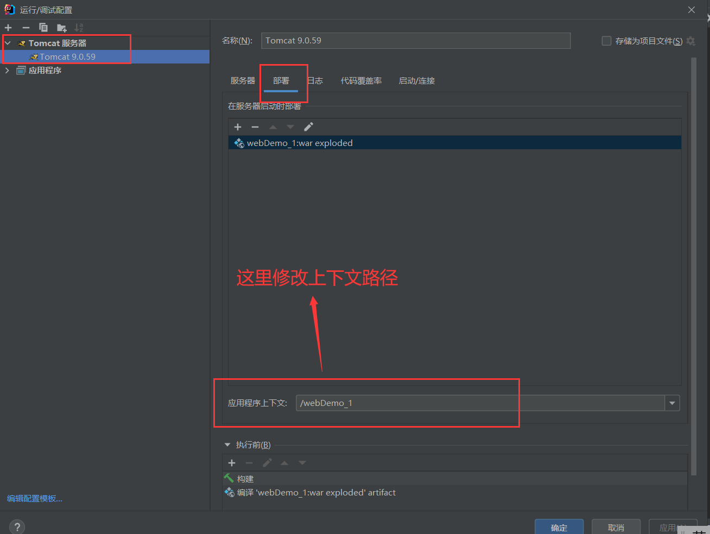

# 项目部署
* 一个web引用开发完成后，如何放到web服务器上?
  1. 打包部署，就是导出war包
  2. 将部署包放到web服务器，以Tomcat为例，就是把war包放在Tomcat下的webapps文件夹下面

# IDEA导出war包
1. 打开项目结构

2. 创建归档应用程序

3. 设置项目名称和输出目录

4. 构建工件

5. 构建成功

* 如果是maven项目可以直接使用maven命令打出war包

# 部署包和创建的web项目的区别
1. 上下文改法不同
   * IDEA修改上下文

    
    

   * Tomcat修改上下文

    

2. 源工程的java源文件在部署包中的WEB-INF中，其中java文件是被编译后的class文件。 

# 修改Tomcat参数
1. 启动超时时间
2. 改端口

# Tomcat的
1. Server标签:
   * 代表整个Tomcat容器
   * 属性:
     * shutdown="SHUTDOWN"
     * prot="8005"
       * 在关闭Tomcat时用8805端口接收SHUTDOWN命令
2. Service标签
   * 包含在Server标签中
   * 多个Connector标签和Engine标签组成
3. Connector标签：
  * 接收客户端浏览器发送过来的请求，并且创建request和response对象（开启线程把请求交给Engine处理）
  * port:是接收请求的端口
  * protocol:是接收请求的协议类型
    * HTTP/1.1
    * AJP/1.3:表示这个Connector的配置是与其它Web容器中间件交互时使用，比如apache组件
  * connectionTimeout:链接的超时时间（单位毫秒）
  * redirectPort:当有SSL协议（通常认为的https协议）请求的转发的端口
4. Engine：
  * 真正处理请求的组件
  * 属性defaultHost
    * 要与一个配置的host名称一致
5. Host组件:
  * 一个虚拟主机，关联真正的项目
  * 属性：
    * name:名称
    * appBase：部署的应用在哪个文件夹下
    * unpackWARs：部署的是war包时启动时是否自动解压
    * autoDeploy：是否热部署，就是改部署包中的文件时不用重启Tomcat

* 访问网址`http://loaclhost:8080/webDemo/pages/day15/demo4.jsp`的过程：
  1. 请求从浏览器发出
  2. http协议，端口是8080
  3. 请求被`<Connector port="8080" protocol="HTTP/1.1"...../>`接收
  4. Connector创建request和response对象，开启线程把这两个对象交给下面的Engine处理
  5. `<Engine name="Catalina" defaultHost="localhost">`的defaultHost="localhost"
  6. 找到name为localhost的Host，就是`<Host name="localhost"  appBase="webapps"...>`
  7. 这个Host通过请求中的上下文appBase="webapps"的文件夹中去找相应的项目
  8. 找到相应的项目后，根据请求连接中的上下文后面的部分`pages/day15/demo4.jsp`找到项目中对应的资源进行访问

