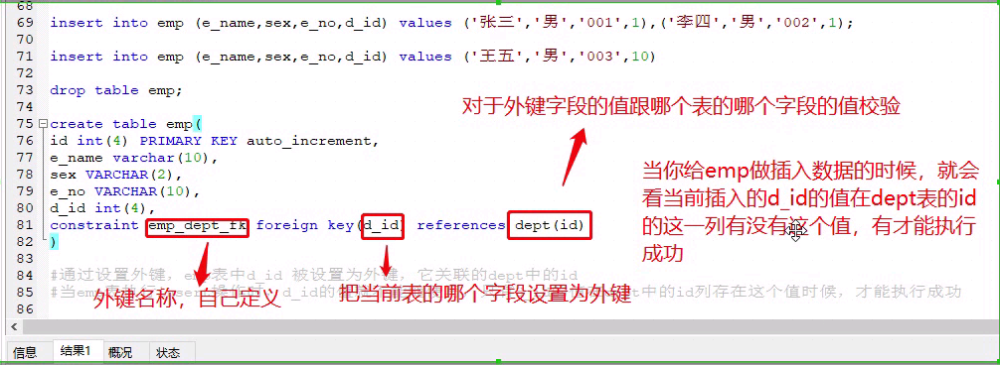

# 为什么需要数据库
1. 数据永远保存
2. 速度比较快
3. 查询和管理数据方便

# 市面常见数据库
* 这些都是关系型数据库(RDBMS)
* SQL Server:微软的产品。和net平台兼容比较好。收费
* Ocacle:甲骨文公司产品。和java平台兼容性最好，收费
* mysql:开源产品。免费。和java平台兼容性最好
* PostgreSQL:开源，跨操作平台，对分布式、缓存和nosql等都有很好的支持，目前是mysql的竞争对手

# 安装mysql
1. 下载安装器

2. 安装的时候要注意一点是选择路径，正常选server only是无法选择安装路径的，要选择手动安装，点击要安装的组件会出现Advance Options选择安装路径

3. 安装完成后在服务可以将mysql服务调成手动，自己去`我的电脑->管理->服务`打开
4. 开启服务后通过cmd命令行可以访问mysql

5. 详细安装教程`D:\文档\编程\JAVA\求知讲堂Java\day35\资料`

# IDEA中有自动连接数据库的工具


# 简单的sql语句
* 结构
  * 现有数据库->在有表->再有数据
* 查询所有数据库:
  * show databases;
* 创建数据库:
  * create database 数据库名 default character set 字符编码 collate 字符编码校验规则
  * create database demo default character set utf8 collate utf8_general_ci;
* 修改数据库的字符编码:
  * alter datebase 数据库名 default character set 字符编码
  * alter datebase demo default character set gbk;
* 删除数据库:
  * drop database 数据库名
  * drop database demo
* 注意:**Mysql语句默认情况下不区分大小写**


# 表的概念
* 类和表的类比
  * 类名`<->`表名
  * 属性`<->`字段
    * 字段数据类型写在字段名的后面
  * 定义一张表和写一个实体类差不多，只有数据类型有差别

## 字段的数据类型
1. 整型:
   * tinyint:1个字节 -128-127
   * smallint:2个字节 -2^15-2^15-1
   * mediumint:3个字节 -2^23-2^23-1
   * int:4个字节 -2^31-2^31-1
   * bigint:8个字节 -2^63-2^63-1
2. 浮点数:
   * float(m,d):单精度浮点数 8位精度(4字节) m位数字总数 d为小数个数
   * double(m,d):双精度浮点数 16为精度(8字节) m位数字总数 d为小数个数
     * 如果存储的数字个数不够则补0
3. 定点数:
   * decimal(m,d):定点数 `m<65` `d<30且d<m`
   * 浮点型放到数据库中是近似值，定点类型在数据库中是精确值
4. 字符串:
   * char(n):固定长度,最多255个字符
   * varchar(n):固定长度，最多65535个字符
     * 如果省略n不写默认最大长度
     * 汉字和英文都算一个字符
   * tinytext:可变长度,255
   * text:可变长度,65535
   * mediumtext:可变长度,2^24-1
   * longtext:可变长度,2^32-1
5. 二进制数据
   * TINYBLOB:可变长度,最多255个字符的二进制长度
   * BLOB:可变,65536
   * MEDIUMBLOB:可变,2^24-1
   * LONGBLOB:可变,2^32-1
6. 日期和时间
   * date:年-月-日
   * time:时:分:秒
   * datetime:年-月-日 时:分:秒
   * timestamp:自动存储记录修改时间
   * 关于datetime和timestamp的不同:
     1. 存储方式不同:
        * timestamp将插入的时间转为UTC（世界标准世界），查询时转化为客户端当前时区进行返回。
        * datetime不做任何改变
     2. 两者所能存储的时间范围不一样
        * timestamp范围:1970-01-01到2038-1-19
        * datatime范围:1000-01-01到9999-12-31   
     3. 总结:对于跨时区的业务，timestamp更合适

## 表的操作
1. 创建表:
   * create table 表名(字段名称 字段类型... default 默认值);
2. 查看当前数据库有哪些表
   * show tables;
3. 查看表结构
   * describe 表名;
4. 删除表
   * drop table 表名;
5. 表的修改:
   1. 添加一个字段
      * alter table 表名 add column 字段名称 字段类型;
   2. 添加多个字段
      * alter table 表名 add 字段名称 字段类型,add 字段名称 字段类型...;
   3. 修改字段数据类型
      * alter table 表名 modify column 字段名称 字段类型;
      * 也可以在后面加default
   4. 修改字段名称
      * alter table 表名 change column 原名称 新名称 字段类型;
      * 也可以改数据类型
      * 也可以在后面加default
   5. 删除字段（可以多个）
      * alter table 表名 drop column 字段名,drop column 字段名...;
   6. 修改表名
      * alter table 原表名 rename to 新表名;

# 数据管理
## 数据插入
1. 单条全量插入数据
   * insert into 表名 values (字段值1,...);
     * 如果前面没有指定，插入数据时要根据表结构的字段顺序给值
2. 单条指定字段插入数据
   * insert into 表名 (字段名称1,...) values (字段值1,...);
   * 插入的值要和前面指定字段的顺序保持一致
3. 批量插入数据
   * insert into 表名 values (字段1,...),(字段1...),...;
## 数据修改
1. 修改某个字段的所有值
   * update 表名 set 字段名称 = 字段值;
2. 修改某一行的某个字段
   * update 表名 set 字段名称 = 字段值 where id = 1;
3. 修改某一行的几个字段
   * undate  表名 set 字段名称 = 字段值,... where id = 1;
## 数据删除
1. 按条件删除
   * delete from 表名 where id = 3;
2. 整体删除
   * delete from 表名;

# 数据查询
1. 查询指定的列:
   * select 字段名1,字段名2 from 表名;
2. 查询时给列取别名
   * select 字段名1 '别名1',... from 表名;
   * 取别名在多表联合查询的时候可能会用到,例如两个表中都有一个字段叫name，我们就可以通过别名来区分。
3. 合并查询列
   * select CONCAT(字段名1,'-',字段名2,字段名3) '1-23' from 表名;
   * 展示的时候会将括号里的所有内容组合起来
4. 合并算数查询
   * select 字段名1,(字段名2+字段名3) from 表名;
   * 会将括号内的内容进行运算
5. 添加常量列
   * select 字段名1,'常量名1' from 表名;
   * 这个字符串在查询是作为一个常量列显示
6. 去除重复数据
   * select distinct 字段名1 from 表名;
   * 只能用于单列查询，不要和其它列一起查询。

## 条件查询
1. 比较条件:
   * `=、<、>、>=、<=、between and`
   ```sql
   #查询所有年龄大于15岁的学生的姓名，性别，班级
   select name, sex, class from student where age > 15;
   #查询所有年龄大于等于15岁的学生的姓名，性别，年龄，班级
   select name, sex, age, class from student where age >= 15;

   #查询所有年龄小于15岁的学生的姓名，性别，年龄，班级
   select name, sex, age, class from student where age < 15;

   #查询所有jsp成绩在80到90之间的学生，（包含80和90）
   select name,jsp from student where jsp between 80 and 90;
   ```
2. 逻辑条件:
   * and
   * or
   ```sql
   use demo;

   #查询二班的jsp成绩在95分以上的学生，这里查询要使用and，意思就并且
   select * from student where jsp >=95 and class = '二班';

   #查询二班的jsp成绩在95分以上的男学生
   select * from student where jsp >=95 and class = '二班' and sex = '男';

   #条件查询中还有or，就是或者
   #例如查询servlet的成绩在85分以上或者jsp成绩在95分以上的学生
   select * from student where servlet >= 80 or jsp >= 95;

   #查询二班jsp成绩在95分以上或者一班servlet成绩在85分以上的学生
   select * from student where (jsp >= 95 and class = '二班') or (servlet >= 85 and class = '一班');
   ```
3. 判空条件:
   * `=''、<>''、is null、 is not null`
     * 其中唯一一个例外`<>`不等于空字符串时也会将null排除
   ```sql
   insert into student (id, name) values (7, ''), (8, null);

   #查询name是''的数据
   #只查出id=7的
   select * from student where name = '';

   #查name不等于''的数据
   #id=7,8都查不出来
   #也就是说<> ''代表的意思是不是''也不是null
   select * from student where name <> '';

   #查询name是null的数据
   #只查出来id=8
   select * from student where name is null ;

   #查询name不是null的数据
   #只查不出来id=8
   #is not null单纯的指的是值不是null
   select * from student where name is not null ;

   #不等于条件<>，还可以用来判断别的值
   select * from student where name <> '张三';
   ```
4. 模糊条件:
   * like:
     * 一般用来查询字符串，配合_或者%一起使用
       * _是匹配一个字符
       * %是匹配零个到多个字符
   ```sql
   insert into student (id, name) values (9, '张三丰'), (10, '大张三'), (11, '小张三');

   #查询name中含有一个张字的学生
   select * from student where name like '%张%';

   #查询姓张的学生,就是名字以张开头就行
   select * from student where name like '张%';

   #查询姓张的学生中，名字是三个字的
   select * from student where name like '张__';

   #查询三个字的名字，张在中间的学生
   select * from student where name like '_张_';
   ```

## 聚合查询
1. 求和SUM
2. 平均数AVG
3. 最大值MAX
4. 最小值MIN
5. 计数COUNT
* 注意:聚合查询需要计算哪个列就只查询哪个列，不然会出现错误(虽然不会报错),比如`select max(age),name`就不能查出真确信息(查出的age和name对不上)。
* where不能接聚合函数

```sql
#查询二班学生jsp的总分之和,使用sum(字段名),这个是用来给值是数字的列做求和的函数
select sum(jsp) '二班jsp总成绩' from student where class = '二班';

#求一班的servlet的平均成绩,平均数是avg(字段名),这个是用来给值是数字的列做求平均数的函数
select avg(servlet) from student where class = '一班';

#查询id最小的值是多少
select min(id) from student;

#查询一班有多少个学生，使用count(),括号里面可以直接用*，这个一班不建议（效率低），一般count(字段)
select count(*) from student where class='一班';
select count(id) from student where class='一班';
select count(name) from student where class='一班';
```

## 分页查询
1. limit
   * 一个参数指查几条数据,相当于默认第一个参数是0。
   * 两个参数指的是隔几条数据查几条数据
   * 如果页数是pageNum，每页显示total条数据
     * select (字段名1...) from 表名 [where ...] limit (pageNum-1)*total, total;
```sql
#查询班级前五条数据
select * from student limit 5;

#分页每页查询三条
#第一页
select * from student limit 0, 3;
#第二页
select * from student limit 3, 3;
#第三页
select * from student limit 6, 3;
#第四页
select * from student limit 9, 3;
```

## 排序查询
1. select 字段名... from 表名 order by 字段名 asc
   * 正序
   * 不写asc也可以(默认)
   * null算最小
2. select 字段名... from 表名 order by 字段名 desc
   * 倒序
* oder by应该放到查询条件最后limit之前
  * 意思是先排列好了再分页
   ```sql
   #排序查询使用order by 字段，想要以哪个字段排序就order by谁
   #正序查询是order by 字段 或者order by 字段 asc
   select * from student order by age asc ;

   #有班级的学生按照年龄倒序排列,倒序排序使用order by 字段 desc
   select * from student order by age desc ;

   #注意：排序order by要在所有的查询条件当中放在最
   #例如我们现在有个查询，包含条件where、分页limit，和排序，先where然后order by，然后是limit
   select * from student where class is not null order by age limit 3,3;
   ```
## 分组查询
1. group by 字段名
   * 根据某个字段分组
   * 字段有多少个不同值分多少组
   * **其实就是改变了聚合函数的聚合哪些，如果没有分组聚合函数就是聚合所有**
   * 此时可以在分组上做聚合查询，用哪个字段分组，我们就可以查询哪个字段
   * 字分组后还可以继续分组
   * group by 要放到where后 order by 之前
   * 排序:`where -> group by -> oder by -> limit`
   * 可以使用having添加分组后的筛选条件
   ```sql
   #查询表中，男学生和女学生都是多少人
   select sex,COUNT(sex) from student where sex is not null group by sex;

   #查询每个班级有多少学生,在做分组group by的时候，by的哪个字段，我们就可以查询哪个字段,做组内的聚合查询
   select class,COUNT(class) from student where class is not null group by class;

   #在做完分组之后，可以在分组上做聚合查询，聚合查询结果是每个分组的自己的结果
   select class,COUNT(class) '学生数',MAX(jsp) '班级jsp最高分' from student where class is not null group by class order by COUNT(class);

   #统计每个班男女多少人，并统计每个班男女的jsp成绩最大值
   #这里先通过班级分组，再通过性别分组
   #聚合的就是每个班的每个性别
   #COUNT(class)和COUNT(sex)值其实一样，因为聚合的的基础都是每个班的每个性别
   select class,COUNT(class),sex,COUNT(sex),MAX(jsp) from student where class is not null group by class, sex;

   #查询班级人数大于1个人的班级
   select class,COUNT(class) from student where class is not null group by class having COUNT(class) > 1;

   #分组查询一般是与聚合查询结合使用，针对每个分组去做聚合（最大值，最小值，计数...）
   #查询中如果有where、group by、order by，使用的顺序group by 必须在where之后，order by之前
   #查询jsp最高分大于90的班级,并用班级的jsp最高分排序
   select class,MAX(jsp) from student where class is not null group by class having MAX(jsp) >= 90 order by MAX(jsp);
   ```

# 数据约束
1. 默认值
   * default 默认值
   * 不插入值的时候就使用默认值
   * 可以插入null,插入null后值就是null不是默认值了
2. 非空
   * not null
   * 非空字符必须赋值
   * 不能赋值null
3. 唯一约束
   * unique
   * 不能重复
   * 可以插入null,并且允许多个数据都插入null
4. 主键
   * primary key
   * 要求该字段非空且唯一
   * 通常情况每张表都会设置一个主键。用于标记每条记录的唯一性
   * 建议不要用包含业务含义的字段作为主键(例如姓名班级这些有实际意义的值),建议给每张表单独设计一个非业务含义的id字段
5. 自动递增
   * 设置整型主键后可以设置自动递增，每次插入数据不用插入主键值，会自动递增设置
   * auto_increment
   * 从1开始增长
   * 如果在前面设定了zerofill则会用0填充多余的位数
   * 删除数据对主键递增值的影响:
     * delete from删除,不影响递增值
     * truncate 删除，影响递增值
```sql
create table test_increment(
    id int(10) zerofill primary key auto_increment,
    name varchar(100)
);

insert into test_increment (name) values ('lucy1');

insert into test_increment (name) values ('lucy2');

insert into test_increment (name) values ('lucy3');

select * from test_increment;

delete from test_increment where id = 3;
#id从4开始不是3
insert into test_increment (name) values ('lucy4');
#删除整张表
truncate test_increment;
#id从1开始不是5
insert into test_increment (name) values ('lucy5');
```
6. 外键
   * 用于约束两张表的数据
   * 例如有张员工表，有张部门表，员工的部门id和部门表的id相关联，员工的部门id不能是部门表id没有的值
   * 声明一个外键约束
     * constraint 外键名称 foreign  key(部门ID) references 部门表(ID)
   * 注意:
     1. 被约束的表称为副表，约束别人的表叫主表，外键设置在副表上的
     2. 主表的参考字段通用为主键
     3. 添加数据:先添加主表，再添加副表
     4. 修改数据:先修改副表，再修改主表
     5. 删除数据:先删除副表，再删除主表
   * 级联操作:
     1. 级联修改:on update cascade
     2. 级联删除:on delete cascade
     3. 添加在外键约束声明之后，修改主表时自动修改副表


```sql
员工表
主键 姓名 性别 工号 部门 部门编号 部门描述
1    张三 男   001  研发部 d001  软件研发
2    李四 男   002  研发部 d001  软件研发
3    王五 男   003  研发部 d001  软件研发
4    lucy 女   004  人事部 d001  人事管理

这种的是有数据冗余的，部门冗余
为了解决这问题，把上面的拆分成2张表，员工表和部门表


员工表                             部门表
主键 姓名 性别 工号 部门id         部门id 部门名称 部门编号 部门描述
1    张三 男   001   1             1      研发部    d001    软件研发
2    李四 男   002   1             2      人事部    d002    人事管理
3    王五 男   003   1 
4    Lucy 女   004   2 

create table dept(
id int(4) PRIMARY KEY auto_increment,
d_name varchar(10),
d_no varchar(10),
d_desc varchar(10)
)

describe dept;

insert into dept (d_name,d_no,d_desc) values ('研发部','d001','软件研发'),('人事部','d002','人事管理');

SELECT * FROM dept;

create table emp(
id int(4) PRIMARY KEY auto_increment,
e_name varchar(10),
sex VARCHAR(2),
e_no VARCHAR(10),
d_id int(4)
)

SELECT * FROM emp;

insert into emp (e_name,sex,e_no,d_id) values ('张三','男','001',1),('李四','男','002',1);

insert into emp (e_name,sex,e_no,d_id) values ('王五','男','003',10)

drop table emp;

create table emp(
id int(4) PRIMARY KEY auto_increment,
e_name varchar(10),
sex VARCHAR(2),
e_no VARCHAR(10),
d_id int(4),
constraint emp_dept_fk foreign key(d_id) references dept(id)
)

#通过设置外键，emp表中d_id 被设置为外键，它关联的dept中的id
#当emp表执行insert操作时，d_id的值就不能随便写，只有d_id的值在dept中的id列存在这个值时候，才能执行成功

emp表设置了外键约束，就是被外键所约束的表，就是副表
dept就是主表，主表约束副表，dept表中的id的值约束emp表中d_id
目前插入emp表的数据中d_id是1或者2,可以成功，detp表中的id有1和2这两个值
如果要是目前插入emp表的数据中d_id是3，不能成功，detp表中的id只有1和2这两个值，没有3

新增一个员工，但是这个员工属于一个新成立的部门，这个部门在部门表dept中不存在
这个情况下，就得先在部门表新增一个部门，然后再在员工表新增一个员工

insert into dept (d_name,d_no,d_desc) values ('项目管理部','d003','项目管理')
SELECT * from dept;
insert into emp (e_name,sex,e_no,d_id) values ('王五','男','003',3)

SELECT * from emp;

想把部门id的值3改成4

先把员工表外键d_id的员工先挂到其他部门下面
update emp set d_id = 1 where e_name = '王五';

解除了部门表id=3和员工表外键d_id=3的关系，因为员工表外键d_id=3的值已经改成1了
解除挂钩之后，就可以修改部门表id的值3改成4
update dept set id = 4 where id = 3;

改完之后，再把之前临时挂到其他部门的员工（这里是王五）给在挂回改好的部门
update emp set d_id = 4 where e_name = '王五';

这就是所谓的修改数据： 先修改副表，再修改主表


删除数据： 先删除副表，再删除主表
员工是要跟部门挂钩，不存在没有部门的员工
例如：想删除部门表dept中id为1的数据
delete from dept where id = 1;

因为id为1的部门还有2个员工，这种情况下就默认为想要把部门和底下的员工全部删除，得先把部门下的员工删除，再删除部门

delete from emp where d_id = 1;
delete from dept where id = 1;

drop table emp;
create table emp(
id int(4) PRIMARY KEY auto_increment,
e_name varchar(10),
sex VARCHAR(2),
e_no VARCHAR(10),
d_id int(4),
constraint emp_dept_fk foreign key(d_id) references dept(id) ON UPDATE CASCADE ON DELETE CASCADE
)

SELECT * from dept;

insert into emp (e_name,sex,e_no,d_id) values ('张三','男','001',2),('李四','男','002',2),('王五','男','003',4);
SELECT * from emp;

insert into dept (id,d_name,d_no,d_desc) values (5,'软件研发部','d001','软件研发')

级联修改，修改主表的主键的值，副表相关的外键的值也会跟着改变
update dept set id = 3 where id = 2;

级联删除，删除部门同时删除部门关联的员工，删除主表的相应的主键数据，副表相关的外键的数据也会跟着删除
DELETE from dept where id = 3 ;
```

# 数据库设计--三大范式
1. 要求表的每个字段必须是不可分割的独立单元
2. 在第一范式的基础上，要求每张表只表达一个意思。表的每个字段都和表的主键有依赖
3. 在第二范式基础，要求每张表的主键之外的其他字段都只能和主键有直接决定依赖关系。
```sql
student表

第一范式： 要求表的每个字段必须是不可分割的独立单元

name
张三，男
李四，男

以上情况违反第一范式

name  sex
张三  男
李四  男


第二范式： 在第一范式的基础上，要求每张表只表达一个意思。表的每个字段都和表的主键有依赖。
就和设计java类，不能在person类中出现car的属性

人类的表
姓名  性别  年龄  家庭  车辆品牌 车辆价格 发动机型号


以上情况违反第二范式

人类的表
姓名  性别  年龄  家庭

汽车表
车辆品牌 车辆价格 发动机型号

第三范式： 在第二范式基础，要求每张表的主键之外的其他字段都只能和主键有直接决定依赖关系。

员工表
主键 姓名 性别 工号 部门名称 部门编号 部门描述
1    张三 男   001  研发部  d001      软件研发
2    李四 男   002  研发部  d001      软件研发
3    王五 男   003  研发部  d001      软件研发
4    lucy 女   004  人事部  d004      人事管理


以上情况违反第三范式，有数据冗余

员工表                             部门表
主键 姓名 性别 工号 部门id         部门id 部门名称 部门编号 部门描述
1    张三 男   001   1             1      研发部    d001    软件研发
2    李四 男   002   1             2      人事部    d002    人事管理
3    王五 男   003   1 
4    Lucy 女   004   2 


第一范式： 要求表的每个字段必须是不可分割的独立单元
保证字段对应的值不可分割，如果值还可以分割，那就不能使用一个字段来表达


第二范式： 在第一范式的基础上，要求每张表只表达一个意思。表的每个字段都和表的主键有依赖。
保证每个表的所有字段描述的事物是同一个，不能存在类型人类表中的字段既有描述人类的又有描述其他的如汽车的字段

			
第三范式： 在第二范式基础，要求每张表的主键之外的其他字段都只能和主键有直接决定依赖关系。
保证表的数据没有冗余
```

# 高级查询
1. 关键字:
   1. in和not in
   * 用来进行多个数据查询
   2. exists和not exists
   * 用来返回一个boolean值
```sql
select * from student;

#查询id为2、3、4、5、6的学生
select * from student where id in (2,3,4,5,6);

#查询id除了7、8、9之外的学生
select * from student where id not in (7,8,9);

#查询班级是一班和二班的学生
select * from student where class in ('二班','一班');

#EXISTS (select查询语句)，括号里面的查询语句是否能够查询到结果，如果能返回true，否则就是false
#括号里面的SQL查询语句具体能查出什么来咱们不关心，只关心到底能不能查出来

select * from student where id = 1 and exists(select * from student where id = 10086);

select * from student where id = 1 and not exists(select * from student where id = 10086);
```
2. 子查询
   * select中的where后还可以套select语句
   * 一般让子查询返回一个column
   ```sql
   #找每个班级的jsp的最高分
   select class,max(jsp) from student where class is not null group by class;

   #通过子查询找到最高分是哪个学生
   select * from student where jsp in (select max(jsp) from student where class is not null group by class);

   #通过sql语句查询每个班的男女比例
   select s0.class,
         s0.sex,
         count(s0.id) '男女总人数',
         (select count(s1.id) from student s1 where s1.class = s0.class) '班级总人数',
         CONCAT(count(s0.id)/(select count(s1.id) from student s1 where s1.class = s0.class)*100,'%') '占班级总人数的百分比'
         from student s0 where class is not null group by class, sex;
   ```
   * 通过上的例子可以知道要实现复杂的mysql查询需要搞清楚:
     * select类似于for会循环返回值
     * 使用了聚合函数就要根据group by的内容判断循环几次，根据什么循环，每次循环的时候class,sex的值又是什么。
3. 多表关联查询
   1. 内连接查询
   ```sql
   #查询员工姓名为张三的员工和部门信息
   #可以用子查询解决
   select e.*,
         (select d.name from dep d where d.id = e.d_id),
         (select d.des from dep d where d.id = e.d_id)
         from emp e where e.name = '张三';

   #虽然以上用子查询解决了问题，但是这个查询是有性能问题
   #mysql的子查询会单独的建一张临时表来保存子查询的结果集，等到整体的查询完成之后会自动的删除掉临时表
   #以上我们做了3个子查询，要建3张临时表，整体的SQL执行完毕之后要删除掉这个3张临时表

   #内联查询，相当于查两张表，然后把两张表的数据拼到一起
   select * from emp e, dep d where e.name = '张三' and d.id = e.d_id;
   #如果一张表查出两个结果，另一张表在第一张表每个结果的基础上又查出两个结果，一共就会有四个结果
   select * from emp e, dep d;

   #内联查询的第二种写法
   select * from emp e inner join dep d on d.id = e.d_id where e.name = '张三';
   select * from emp e inner join dep d on d.id = 3;
   #注意：当使用了...join 来做连接查询时，where后面只能跟 from后面的主表的字段的条件
   #换句话说，join的表的字段不能在where中作为调节,只能在on后面做调节
   ```
   2. 左外连接与右外连接
   * 和自连接的区别在于另一个表没有符合要求的数据的时候主表的数据显不显示
   ```sql
   insert into dep (name, des) VALUES ('足球部门', '足球');
   insert into emp (name, sex, d_id) VALUES ('查理', '男', null);

   #查询部门表所有数据，下面的员工也要一起展示
   #这是内联的写法
   #发现用内联的化如果有个部门没有员工，那个部门也不会显示
   #不会显示足球部门和查理
   select * from dep d, emp e where d.id = e.d_id;
   select * from dep d inner join emp e on d.id = e.d_id;

   #左连接，左边的表作为主表
   #主表会都显示出来，哪怕没有员工,也会用null表示,会显示足球部门不会显示查理
   select * from dep d left join emp e on d.id = e.d_id;
   #只会显示员工，还没有分配部门的员工部门显示为null，会显示查理不会显示足球部门
   select * from emp e left join dep d on d.id = e.d_id;

   #右连接,右边的作为主表
   #其它和左连接一样
   select * from dep d right join emp e on d.id = e.d_id;
   select * from emp e right join dep d on d.id = e.d_id;
   ```
   3. 自连接查询
   * 通常使用左外连接
   ```sql
   create table area(
   code VARCHAR(10) PRIMARY KEY,
   name VARCHAR(10),
   parent_code VARCHAR(10)
   )

   INSERT INTO area (code,name,parent_code) VALUES 
   ('0002','河北省','0'),('00020001','保定市','0002'),('00020002','石家庄市','0002'),
   ('0003','广东省','0'),('00030001','广州市','0003')

   SELECT * FROM area;

   查询市级地区已经其所属的省是哪个？自连接，就自己连接自己查询，通常来说是有左外连接实现

   SELECT a0.code '市编码',a0.name '市名称',a1.name '省名称' FROM area a0 
   LEFT JOIN area a1 ON a0.parent_code = a1.code
   WHERE a0.parent_code <> '0'

   INSERT INTO area (code,name,parent_code) VALUES ('0002000101','涿州市','00020001')

   查询编码为'0002000101'的三级地区的信息已经其他上级市和其所属的省

   SELECT a3.code,a3.name,a2.name,a1.name FROM area a3 
   LEFT JOIN area a2 ON a3.parent_code = a2.code
   LEFT JOIN area a1 ON a2.parent_code = a1.code
   WHERE a3.code = '0002000101'

   在这里我们就可以看到，LEFT JOIN可以在一个查询语句是有多次
   ```

# 存储过程
* 什么是存储过程？
  * 带有逻辑的sql语句(if while)
* 特点:
  * 在数据库的服务器端执行的，所以执行效率非常块，但是消耗服务器资源
  * 移植性很差，不同数据库之间不能移植
  * 一般银行用的比较多，互联网用的比较少
# 存储过程语法
1. 创建存储过程:
2. 输入参数:
   * in
3. 输出参数:
   * out
4. 输入输出参数:
   * inout
```sql
创建存储过程

delimiter $

CREATE procedure pro_test()
BEGIN
SELECT * FROM area;

END $

执行存储过程
call pro_test();

SELECT * FROM area where code = '0002'

创建有参数的存储过程
delimiter $

CREATE PROCEDURE pro_find_area_bycode(IN c VARCHAR(10))
BEGIN
SELECT * FROM area where code = c;
END $

CALL pro_find_area_bycode('0002');


创建一个字符串拼接（-）的存储过程
delimiter $
CREATE PROCEDURE pro_concat(IN a VARCHAR(10),b VARCHAR(10),OUT res VARCHAR(30))
BEGIN
	SET res = CONCAT(a,'-',b);
END $

SET @str := '';

CALL pro_concat('hello','world!',@str);

SELECT @str;

存储过程
输入参数
CREATE PROCEDURE 存储过程名(IN 参数名 数据类型,参数名 数据类型....)
输出参数定义的方式
CREATE PROCEDURE 存储过程名(OUT 参数名 数据类型,参数名 数据类型....)
输入参数和输出参数可以一起使用
CREATE PROCEDURE 存储过程名(IN 参数名 数据类型,参数名 数据类型....,OUT 参数名 数据类型,参数名 数据类型....)

使用有输出参数（有返回值）的存储过程
1、我们要先在外面定义变量来接受存储过程输出参数 set @变量名 := 变量的初始值
2、在调用存储过程时把定义的变量当初参数放在存储过程的括号里 call 存储过程名([输入值..],[@变量名])
3、变量在接受到存储过程的返回值（输出值）就可以直接使用了，例如查询输出变量 SELECT @变量名


创建一个存储过程，输入一个字符串，给这个字符串加上!!返回输出

INOUT输入输出参数，具有in和out的双重功能

delimiter $
CREATE PROCEDURE pro_addstr(INOUT s VARCHAR(50))
BEGIN
	SET s = CONCAT(s,'!!');

END $

SET @str := 'hello';

CALL pro_addstr(@str);

SELECT @str;
```
5. 存储过程的判断
   * elseif和else都是可以不写的
   * 注意细节:
     * if和elseif后面要有条件和then，else不用有
     * end if有空格后面要加分号
```sql
创建一个取数字的绝对值的存储过程

delimiter $
CREATE PROCEDURE pro_abs(IN i INT(10),OUT m INT(10))
BEGIN
	IF i < 0 THEN
		SET m = i*(-1);
	ELSE
		SET m = i;
	END IF;	
END $

SET @num := 0;

CALL pro_abs(9,@num);

SELECT @num;

根据输入是数字输出是星期几

delimiter $

CREATE PROCEDURE pro_getweek(IN i INT(1),OUT str VARCHAR(20))
BEGIN
	IF i = 1 THEN
		SET str = '星期一';
	ELSEIF i = 2 THEN
		SET str = '星期二';
	ELSEIF i = 3 THEN
		SET str = '星期三';
	ELSEIF i = 4 THEN
		SET str = '星期四';
	ELSEIF i = 5 THEN
		SET str = '星期五';
	ELSEIF i = 6 THEN
		SET str = '星期六';
	ELSEIF i = 7 THEN
		SET str = '星期日';
	ELSE
		SET str = '数字输入错误';
	END IF;
END $


SET @myweek := '';

CALL pro_getweek(9,@myweek);

SELECT @myweek;
```

6. 存储过程的循环

```sql
delimiter $
create procedure pro_addnum(in n int(3), out res int(10))
begin
    declare i int(3) default 1;
    declare r int(10) default 0;
    while i <= n do
        set r = r + i;
        set i = i + 1;
        end while;
    set res = r;
end $

set @num := 0;
call pro_addnum(100, @num);
select @num;
```

7. 将查询的结果赋值给变量(into)
```sql
select * from area;

#输入参数是地区的编码，把地区名称返回
delimiter $
create procedure pro_areaname(in c varchar(10), out res varchar(20))
begin
    select name into res from area where code = c;
end $

set @area_name = '';

call pro_areaname('00020001', @area_name);
select @area_name;
```

8. 删除存储过程
   * drop procedure
   * show procedure status查看存储过程列表
```sql
delimiter $
create procedure test_drop()
begin

end $
#查看存储过程列表
show procedure status;
#删除存储过程DROP PROCEDURE 存储过程名
drop procedure test_drop;
```

# 触发器
* 作用:操作某张表时，希望同时触发一些动作和行为。
* 语法要素:
  1. 监视地点(table)
  2. 监视时间(insert/update/delete)
  3. 触发时间(after/before)
  4. 触发事件(insert/update/delete)
* 语法:
   ```sql
   create trigger 触发器名
   after/before insert/update/delete on 被监视表名
   for each row #这句话在mysql固定
   begin
      sql语句(触发事件,只能增删改)
   end;
   ```
```sql
show tables;

create table test_trigger(
    id int(10) primary key auto_increment,
    name varchar(5) not null
);

create table logger(
    id int(10) primary key auto_increment,
    content varchar(256)
);

create trigger tri_log
    after insert on test_trigger
    for each row
    begin
        insert into logger (content) values ('修改了test表');
    end;

select * from logger;

insert into test_trigger (name) values ('李四'),('张三');
# 删除触发器
drop trigger tri_log;
```

# 函数
* 更像java中有返回值的方法，可以拿来直接用
* 和存储过程的区别
  * 存储过程需要创建个变量接收，函数不用

## 内置函数
* `D:\文档\编程\JAVA\求知讲堂Java\day40\资料\MySQL函数大全及用法示例.pdf`
* 常用函数举例
  * concat():合并字符串
    * 如果有一个为null，得到的最终字符串也是null
    * 可以将其它类型转化成字符串
  * length():获得字符串长度
  * reverse():字符串反转
  * 获取时间:三种方法:
    * now()
    * sysdate()
    * current_timestamp()
```sql
select concat('a', 'b', 'c');
select concat('a', null, 'c');
select concat('a', 1, 'c');

select length('abcd');
select reverse('abcd');

select now();
select sysdate();
select current_timestamp();
```

## 自定义函数
* mysql函数一定有返回值
* 注意形参前面没有in/out/inout修饰
* 语法:
   ```sql
   create function 函数名([变量名 变量类型...]) returns 返回值类型
   begin
      sql语句;
      return语句;
   end;
   ```
```sql
#查询student中某个表有多少个学生
create function fn_getcount_byclass(c varchar(2)) returns int(10)
begin
    declare i int(10);
    select count(id) into i from student where class = c;
    return i;
end;

select fn_getcount_byclass('三班');
```


