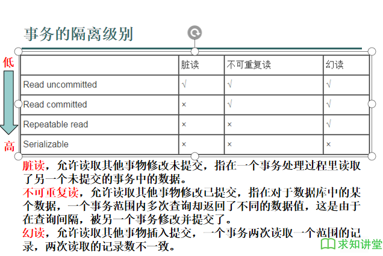

# JDBC
* 使用java程序发送sql语句到数据库服务器端执行，这叫用到了JDBC技术
* 一个简单的jdbc实例
    ```java
    //注册驱动，通过反射的方法
    Class.forName("com.mysql.jdbc.Driver");
    /**
    * 这里有三个参数
    * 参数1:数据库的url地址
    * 最后两个参数是防止中文乱码
    * 一般需要修改的是localhost(数据库地址)和demo(数据库名称)
    * jdbc:mysql://localhost:3306/demo?useUnicode=true&characterEncoding=utf-8
    * 参数2:数据库的用户名
    * 参数3:数据库的密码
    */
    String sqlUrl = "jdbc:mysql://localhost:3306/demo?useUnicode=true&characterEncoding=utf-8";
    String sqlUser = "root";
    String sqlPsd = "root";
    Connection conn = DriverManager.getConnection(sqlUrl, sqlUser, sqlPsd);

    //获取操作sql语句的对象
    Statement stat = conn.createStatement();

    //写sql语句
    String sql = "update student set name = '徐伟', class = '三班', sex = '男', age = 17, servlet = 92, jsp = 97 where id = 10;";
    //执行sql语句
    int i = stat.executeUpdate(sql);
    System.out.println(i);

    stat.close();
    conn.close();
    ```
# Statement对象进行sql操作
* 整体的对数据库的操作可以分为两类:
  * 读操作
  * 写操作:
    * DDL操作:表的创建、删除、字段的增加等
    * DML操作:数据的增删改
## 执行读写操作
1. DDL操作和DML操作
   * 使用executeUpdate(String sql)
```java
try {
    Class.forName("com.mysql.jdbc.Driver");
    Connection coon = DriverManager.getConnection(
            SqlUserInfo.sqlUrl,
            SqlUserInfo.sqlUser,
            SqlUserInfo.sqlPsd
    );
    Statement stat = coon.createStatement();

    //写操作
    //DDL,创建表
    String creSql = "create table tab_stat(" +
            "    id int(10) primary key auto_increment," +
            "    name varchar(10)" +
            ");";

    //DML,操作，表数据的更改
    String addSql = "insert into tab_stat (name) values ('张三'), " +
            "('李四'), ('王五');";

//            int i = stat.executeUpdate(creSql);
    int i = stat.executeUpdate(addSql);
    System.out.println(i);

    stat.close();
    coon.close();

} catch (Exception e) {
    e.printStackTrace();
}
```
2. 读操作
   * 使用executeQuery(String sql)执行
   * 返回一个ResultSet对象
```java
try {
    Class.forName("com.mysql.jdbc.Driver");
    Connection conn = DriverManager.getConnection(
            SqlUserInfo.sqlUrl,
            SqlUserInfo.sqlUser,
            SqlUserInfo.sqlPsd
    );
    Statement stat = conn.createStatement();

    String selSql = "select * from tab_stat;";
    ResultSet res = stat.executeQuery(selSql);

    /**
        * 如果取得的数据从1开始
        * res最开始就是第0个数据
        * res.next()就是到第一个数据
        */
    while (res.next()) {
        /**
            * 每一次循环都是一行的结果
            * res.getxxx("字段名称")
            * 其中:
            * 整型类型res.getInt()
            * float类型:res.getFloat();
            * double类型:res.getDouble();
            * 字符类型(char、varchar、text):res.getString()
            * 日期类型:res.getDate()
            */
        System.out.println(res.getInt("id") + "," + res.getString("name"));

        /**
            * 还可以根据字段的顺序来取当前行数据
            * res.getInt(1)就是取第一个字段的值
            * sql字段从1开始计数
            */
        System.out.println("id:" + res.getInt(1) + ",name:" + res.getString(2));


    }

    //关闭资源
    res.close();
    stat.close();
    conn.close();


} catch (Exception e) {
    e.printStackTrace();
}
```

# PreparedState对象执行SQL操作
1. 写操作
   * State对象是在executeUpdate()中输入sql语句
   * PreparedState事在创建PreparedState对象的时候输入sql语句，然后设置参数。
```java
try {
    Class.forName(SqlUserInfo.jdbcPath);
    Connection conn = DriverManager.getConnection(
        SqlUserInfo.sqlUrl,
        SqlUserInfo.sqlUser,
        SqlUserInfo.sqlPsd
    );
    //写sql
    String insSql = "insert into student (id, name, class, sex, age, servlet, jsp) VALUES (?,?,?,?,?,?,?)";
    //预编译SQL，并返回PreparedStatement对象
    PreparedStatement pst = conn.prepareStatement(insSql);
    /**
        * 给预编译时sql语句中的问好填值
        * pst.setxxx()
        * xxx是数据类型,整形数就是setInt
        * 第一个参数是指的给第几个?填值,从1开始
        * 第二个参数是填的值
        * sql语句中的问好要全部替换
        */
    pst.setInt(1, 12);
    pst.setString(2, "李磊");
    pst.setString(3, "三班");
    pst.setString(4, "男");
    pst.setInt(5, 17);
    pst.setInt(6, 55);
    pst.setInt(7, 61);

    int i = pst.executeUpdate();
    System.out.println(i);

    pst.close();
    conn.close();

} catch (Exception e) {
    e.printStackTrace();
}
```
2. 读操作
   * executeQuery(String sql)
```java
try {
    Class.forName(SqlUserInfo.jdbcPath);
    Connection coon = DriverManager.getConnection(
            SqlUserInfo.sqlUrl,
            SqlUserInfo.sqlUser,
            SqlUserInfo.sqlPsd
    );

    String selSql = "select * from student where name = ? and class = ?;";
    PreparedStatement pst = coon.prepareStatement(selSql);
//            pst.setString(1,"李磊");
//            pst.setString(2,"三班");
    ResultSet res = pst.executeQuery();
    while (res.next()) {
        System.out.println(res.getInt("id")
        + "," + res.getString("name") + "," +
                res.getString("class")
        );
    }
    res.close();
    pst.close();
    coon.close();
} catch (Exception e) {
    e.printStackTrace();
}
```


# Statement和PreparedStatement的区别
* Statement能做的PreparedStatement也能做
* PreparedStatement可以进行sql缓存，执行效率更快
* PrepareStatement可以有效的防止用户SQL注入,Statement有注入风险


# CallableStatement对象执行纯粹过程
1. 没有输出参数的存储过程
   * 使用prepareCall(sql)创建CallableStatement对象
* 调用的过程为:
```sql
create
    definer = root@localhost procedure pro_test(IN c varchar(10))
begin
    select * from area where code = c;
end;
```

```java
Connection coon = SqlUserInfo.getConnect();
//调用存储过程的语句
String cSql = "call pro_test(?);";
//预编译存储过程sql
CallableStatement cStat = coon.prepareCall(cSql);
//设置参数
cStat.setString(1, "0002");
//接收返回结果集
ResultSet res = cStat.executeQuery();
while (res.next()) {
    System.out.println(res.getString("code")
            + "," + res.getString("name")
            + "," + res.getString("parent_code")
    );
}
res.close();
cStat.close();
coon.close();
} catch (Exception e) {
e.printStackTrace();
}
```


2. 有输出参数的存储过程
   * 用registerOutParameter注册输出参数
   * executeQuary执行存储过程
   * getXXX(index)得到输入参数:
     * index为存第几个?的值
* 调用的过程:
```sql
create
    definer = root@localhost procedure prot_getweek(IN i int(1), OUT str varchar(4))
begin
    if i = 1 then
        set str = '星期一';
    elseif i = 2 then
        set str = '星期二';
    elseif i = 3 then
        set str = '星期三';
    elseif i = 4 then
        set str = '星期四';
    elseif i = 5 then
        set str = '星期五';
    elseif i = 6 then
        set str = '星期六';
    elseif i = 7 then
        set str = '星期日';
    else
        set str = '输入错误';
    end if;
end;
```

```java
try {
    Connection coon = SqlUserInfo.getConnect();
    String cSql = "call prot_getweek(?,?);";
    CallableStatement cStat = coon.prepareCall(cSql);
    cStat.setInt(1,9);
    /**
        * 注册输出参数
        * 参数1:输出参数在第几个?的位置
        * 参数2:输出参数的类型,这个参数类型要和sql那边定义的一直
        */
    cStat.registerOutParameter(2, Types.VARCHAR);
    
    //执行存储过程
    cStat.executeQuery();
    
    /**
        * 得到输出参数
        * 参数是在第几个?的位置
        */
    String week = cStat.getString(2);
    System.out.println(week);
    cStat.close();
    coon.close();

} catch (Exception e) {
    e.printStackTrace();
}
```

# 批处理操作
* 使用sql缓冲区,一次返送多条sql到数据库服务器执行
* 不需要每执行一条语句就连接一次数据库
* 一般执行写操作
* Statement和PreparedStatement批处理API是一样的
  * void addBatch(String sql) 添加sql到缓冲区(暂时不发送)
  * int[] executeBatch()执行批处理命令，发送所有的缓冲区sql
  * void clearBatch()清空缓冲区
```java
try {
    Connection coon = SqlUserInfo.getConnect();
    //创建一个空的PreparedStatement对象
    PreparedStatement pSt = coon.prepareStatement("insert into tab_stat (name) values (?);");

    //将需要执行的sql加入批处理中,放在缓冲内
    pSt.setString(1, "批处理1");
    pSt.addBatch();
    pSt.setString(1, "批处理2");
    pSt.addBatch();
    pSt.setString(1, "批处理3");
    pSt.addBatch();

    //执行批处理操作
    int[] is = pSt.executeBatch();

    for (int i : is) {
        System.out.println(i);
    }

    //清空缓冲区
    pSt.clearBatch();
    pSt.close();
    coon.close();

} catch (Exception e) {
    e.printStackTrace();
}
```

# JDBC处理大文本文件
* 现在一般不用数据库存储大文件，一般存储在分布式数据服务器上，所以仅供了解。
1. 写入大文本文件
   * 使用setClob(int, reader)输入要存储的文件(实际上是读取到文件的reader)
   * 也可以用setCharacterStream(int, reader)
```java
try {
    Connection coon = SqlUserInfo.getConnect();
    PreparedStatement pst = coon.prepareStatement("insert into big_text (myText) values (?);");
    FileReader fr = new FileReader(new File("\\ideaProject\\webDemo_1\\src\\com\\test\\jdbc\\day23\\bigfile.txt"));
    pst.setClob(1, fr);
    int i = pst.executeUpdate();
    System.out.println(i);
    pst.close();
    coon.close();
} catch (Exception e) {
    e.printStackTrace();
}
```
2. 读大文本文件
* 将得到的ResultSet通过getClob得到Clob对象
* 将Clob对象通过getCharacterStream()转化成一个reader对象
* 进行IO操作
```java
try {
    Connection coon = SqlUserInfo.getConnect();
    String sql = "select myText from big_text where id = ?;";
    PreparedStatement pst = coon.prepareStatement(sql);
    pst.setInt(1, 1);
    ResultSet rs = pst.executeQuery();
    while (rs.next()) {
        Clob clob = rs.getClob("myText");
        Reader r = clob.getCharacterStream();
        FileWriter fw = new FileWriter("\\ideaProject\\webDemo_1\\src\\com\\test\\jdbc\\day23\\bigfile_temp.txt");

        char[] c = new char[1024];
        int len = 0;
        while ((len = r.read(c)) != -1) {
            fw.write(c, 0, len);
        }
        fw.close();
        r.close();
    }
    rs.close();
    pst.close();
    coon.close();
    
} catch (Exception e) {
    e.printStackTrace();
}
```

# JDBC处理大字节文件
1. 写入大字节文件
   * 使用setBinaryStream(int, inputStream)
   * 也可以用setBlob(int, inputStream)

```java
try {
    Connection coon = SqlUserInfo.getConnect();
    PreparedStatement pst = coon.prepareStatement("insert into big_bit (big_file) values (?);");
    FileInputStream fin = new FileInputStream("D:\\文档\\编程\\JAVA\\笔记\\day15\\picture\\06.png");
    pst.setBinaryStream(1, fin);
    int i = pst.executeUpdate();
    System.out.println(i);
    pst.close();
    coon.close();
} catch (Exception e) {
    e.printStackTrace();
}
```
2. 读取大文件
   * getBlob得到blob
   * 在通过Blob的getBinaryStream得到inputStream

```java
try {
    Connection coon = SqlUserInfo.getConnect();
    PreparedStatement pst = coon.prepareStatement("select big_file from big_bit where id = ?;");
    pst.setInt(1, 1);
    ResultSet rs = pst.executeQuery();
    while (rs.next()) {
        Blob blob = rs.getBlob("big_file");
        InputStream fin = blob.getBinaryStream();
        FileOutputStream fout = new FileOutputStream("pic.png");
        byte[] b = new byte[1024];
        int len = 0;
        while ((len = fin.read(b)) != -1) {
            fout.write(b, 0, len);
        }
        fout.close();
        fin.close();
    }
    rs.close();
    pst.close();
    coon.close();

    pst.close();
    coon.close();
} catch (Exception e) {
    e.printStackTrace();
}
```

# 数据库的事务
* 所谓的事务，如果把要执行的多条写的sql语句看做一个整体（就像一个SQL一样），那么这个整体要么执行成功，要么执行失败！
* 例如A账户往B账户转钱，A扣钱了，B加钱确失败这是不可接受的
  
```sql
# 设置是否自动提交事务,1是0否，默认1
# 手动提交
set autocommit = 0;
#开启事务
start transaction;
# 转账操作
update account set money = '8000' where id = 1;
update account set money = '11000' where id = 2;
# 提交事务
commit;
# 回滚事务，如果没有同时成功，回滚到事务的起点
rollback;
```

# JDBC操作事务
1. 设置手动提交
2. coon.commit()提交
3. 在catch中coon.rollback回滚
4. finally中关闭
```java
Connection coon = null;
PreparedStatement pst = null;
try {
    coon = SqlUserInfo.getConnect();
    //设置手动提交事务
    coon.setAutoCommit(false);
    pst = coon.prepareStatement("update account set money = ? where id = ?;");
    pst.setString(1, "8000");
    pst.setInt(2, 1);
    pst.addBatch();
    pst.setString(1, "11000");
    pst.setInt(2, 2);
    pst.addBatch();

    int[] is = pst.executeBatch();
    for(int i : is) {
        System.out.println("改变了" + i + "条数据!");
    }
    pst.clearBatch();

    //手动提交事务
    coon.commit();

} catch (Exception e) {
    try {
        e.printStackTrace();
        //事务回滚
        coon.rollback();
    } catch (Exception ex) {
        ex.printStackTrace();
    }
} finally {
    try {
        SqlUserInfo.close(coon, pst, null);
    } catch (Exception e) {
        e.printStackTrace();
    }
}
```


# 数据库事务的四大特性
1. 原子性
   * 一个事物内的所有操作共同组成一个原子包，要么全部成功，要么全部失败
2. 一致性
   * 提交前是一个状态，提交后是一个状态，不会出现过程中的状态(指的是正在修改中这种状态)
3. 隔离性
   * 多个事务并行执行不相互影响
4. 持久性
   * 提交后数据库状态永久改变
* 注意:124是事务自带的，3是可以做到的。

# 事务的隔离级别

* 设置:`conn.setTransactionIsolation(conn.TRANSACTION_SERIALIZABLE);`
1. 事务的隔离级别越高，并行效率越高
2. mysql在Repeatable read隔离级别就已经不会产生幻读问题
3. mysql默认隔离级别为Repeatable read
4. Serializable级别当某个查询事务未完成时，其它修改事务要等待查询事务完成才能进行，其它的隔离级别不会这样。


# 数据库连接池
* 一次JDBC执行SQL的过程
  1. TCP连接建立三次握手
  2. Mysql认证的三次握手
  3. 真正的SQL执行
  4. Mysql关闭
  5. TCP的四次握手关闭
* 多次运行JDBC问题
  1. 网络IO多，开销大
  2. 数据库连接有上限
* 解决方案:数据库连接池
  1. 创建一个容器(池子)用来存放数据库连接
  2. 提前创建一些数据库连接放在池子里
  3. 给池子设置最大容量
  4. 需要连接从池子取，没有就新建
  5. 用完的连接重新放到池子里
```java
/**
 * 一个JDBC的Connection连接池
 */
public class JDBCPoolUtil {
    //定义一个连接池
    private static List<Connection> connList = new ArrayList<>();
    //定义初始化的时候连接池中连接数量
    private static int initSize = 2;
    //定义最大连接数
    private static int maxSize = 5;
    //定义当前连接数
    private static int currentSize = 0;

    /**
     * 初始化连接池
     */
    static {
        try {
            for (int i = 0; i < initSize; i++) {
                connList.add(SqlUserInfo.getConnect());
            }
        } catch (Exception e) {
            e.printStackTrace();
        }
    }

    /**
     * 获取连接
     */
    public synchronized static Connection getConnection() throws Exception {
        Connection coon = null;
        if (connList.size() > 0) {
            coon = connList.get(0);
            connList.remove(0);
            currentSize++;
            System.out.println("创建连接.....");
            System.out.println("当前连接数:" + currentSize);
            System.out.println("连接池中连接数量:" + connList.size());
        } else if (currentSize < maxSize) {
            coon = SqlUserInfo.getConnect();
            currentSize++;
            System.out.println("连接池中数量不足，新建连接");
            System.out.println("当前连接数:" + currentSize);
        } else {
            throw new RuntimeException("连接数已达上限");
        }
        return coon;
    }

    /**
     * 回收连接
     */
    public synchronized static void closeConnection(Connection coon) {
        connList.add(coon);
        currentSize--;
        System.out.println("回收连接");
        System.out.println("当前连接数:" + currentSize);
    }
}
```

# 连接池工具
* 自定义的连接池工具有以下问题
1. 无法适用高并发的情况
2. 当连接数达到最大的时候应该等待一段时间，这段时间可能有别的连接池释放出来
3. 当连接池内连接很久没用时应该自动关闭资源

## DBCP连接池
```java
public class DBCPDemo {
    //初始连接数
    private static int initSize = 5;
    //最大连接数
    private static int maxSize = 10;
    //超过最大连接数后，最大等待时间，单位毫秒
    private static long maxWait = 3000;
    //最大空闲时间,单位秒
    private static int maxIdle = 5;

    //创建连接池对象
    private static BasicDataSource ds = new BasicDataSource();

    static {
        //设置数据库的连接参数
        ds.setUrl(SqlUserInfo.sqlUrl);
        ds.setUsername(SqlUserInfo.sqlUser);
        ds.setPassword(SqlUserInfo.sqlPsd);
        ds.setDriverClassName(SqlUserInfo.jdbcPath);

        //设置连接池参数
        ds.setInitialSize(initSize);
        ds.setMaxActive(maxSize);
        //当一个请求来调用方法获取数据库连接时已经超过最大连接数了（没有连接了）
        //等待maxWait毫秒，在这个时间范围内的时候看看有没有被释放回到连接池的连接
        //如果过了这个时间还是没有连接，就抛异常
        ds.setMaxWait(maxWait);
        //在大于这个maxIdle的时间的时候，看连接池中有哪些连接是空闲，会做相应的关闭
        ds.setMaxIdle(maxIdle);
    }

    /**
     * 获取数据库连接
     */
    public static Connection getConnection() {
        Connection coon = null;
        try {
            coon = ds.getConnection();
        } catch (Exception e) {
            e.printStackTrace();
        }
        return coon;
    }
    /**
     * 回收数据库连接
     */
    public static void releaseConnection(Connection coon) {
        try {
            //这里的close并不是关闭资源，而是释放回连接池
            //close（）函数经过重写
            coon.close();
        } catch (Exception e) {
            e.printStackTrace();
        }
    }
}
```


# C3P0连接池
* 用法和DBCP差不多
* 就是几个函数名有变化
* maxWait的类型是int但是DBCP是long

```java
public class C3P0Demo {
    //初始连接数
    private static int initSize = 5;
    //最大连接数
    private static int maxSize = 10;
    //超过最大连接数后，最大等待时间，单位毫秒
    private static int maxWait = 3000;
    //最大空闲时间,单位秒
    private static int maxIdle = 5;

    private static ComboPooledDataSource ds = new ComboPooledDataSource();
    
    static {
        ds.setJdbcUrl(SqlUserInfo.sqlUrl);
        ds.setUser(SqlUserInfo.sqlUser);
        ds.setPassword(SqlUserInfo.sqlPsd);
        try {
            ds.setDriverClass(SqlUserInfo.jdbcPath);
        } catch (PropertyVetoException e) {
            e.printStackTrace();
        }
        ds.setInitialPoolSize(initSize);
        ds.setMaxPoolSize(maxSize);
        ds.setCheckoutTimeout(maxWait);
        ds.setMaxIdleTime(maxIdle);
    }
    
    public static Connection getConnection() { 
        Connection coon = null;
        try {
            coon = ds.getConnection();
        } catch (Exception e) {
            e.printStackTrace();
        }
        return coon;
    }
    
    public static void releaseConnection(Connection coon) {
        try {
            coon.close();
        } catch (Exception e) {
            e.printStackTrace();
        }
    }
    
}
```


