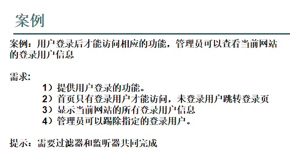

# 过滤器


## 编写一个Filter类
1. 类实现Filter接口
2. 配置web.xml文件

3. 也可以通过注解来进行配置，这样就不用配置web.xml文件了
`@WebFilter(filterName = "", urlPatterns = {"/"})`

* 一个Filter类例子
  * xml文件配置
    ```xml
    <filter>
        <!-- 配置的过滤器名称，自定义，就像之前学习的servlet-name -->
        <filter-name>MyFilter</filter-name>
        <!-- 当前的过滤器的全名称，包名+类名 -->
        <filter-class>com.test.jdbc.day24.MyFilter</filter-class>
    </filter>
    <filter-mapping>
        <!-- 与上面filter配置中的filter-name一样,根据相同filter-name的值可以把filter和filter-mapping绑定 -->
        <filter-name>MyFilter</filter-name>
        <!-- 配置这个过滤器能过滤的请求资源链接，配置/*就是过滤当前项目的所有的请求 -->
        <url-pattern>/*</url-pattern>
    </filter-mapping>
    ```
  * java文件
    ```java
    public class MyFilter implements Filter {
        public void init(FilterConfig config) throws ServletException {
        }

        public void destroy() {
        }

        @Override
        public void doFilter(ServletRequest request, ServletResponse response, FilterChain chain) throws ServletException, IOException {
            //把过滤器中的request和response的类型转换
            HttpServletRequest req = (HttpServletRequest) request;
            HttpServletResponse res = (HttpServletResponse) response;
            /**
            * http://localhost:8080/webDemo/pages/day24/demo1.jsp?name=zhang
            * 当浏览器访问上面的连接的时候，由于一个过滤器的url-pattern配置的是/*
            * 这个请求不会直接请求对应资源（demo1.jsp），会先到过滤器
            * 过滤器就可以通过req拿到请求参数，?name=zhang这样的参数是一次性的
            * 就是使用req.getParameter("name")获取到参数值之后，在请求中就没有了
            * 例如我们在过滤器中通过getParameter("name")拿到参数值，在demo1.jsp就拿不到name的值了
            * 如果要在demo1.jsp中也能拿到name的值
            * 就需要在过滤器中使用req.setAttribute("name", name);方法把值重新放进去
            * 当然，我们由于已经拿到请求对象，我们可以用请求对象做任何操作
            * 例如可以设置新的参数，可以通过请求对象得到session对象，可以请求转发
            */
            String name = req.getParameter("name");
            System.out.println(name);
            req.setAttribute("name", name);
            req.setAttribute("age", 16);
    //        req.getRequestDispatcher("/pages/day24/demo2.jsp").forward(req, res);

            /**
            * 如果只是想要在过滤器中过滤一个请求，然后就让请求传过过滤器到达相应的资源
            * 我们就要使用chain.doFilter(req, res);
            * 如果让请求在过滤器做请求转发或者重定向res.sendRedirect(arg0);
            * 就不能使用chain.doFilter(req, res);
            * chain.doFilter(req, res);与请求转发或者重定向不能共存
            */
        chain.doFilter(req, res);
        }
    }
    ```

* 如果要过滤servlet的名称,直接在`<filter-mapping>`标签中写`servlet-name`标签即可

## 配置过滤类型
```xml
<filter-mapping>
    .....
    <!-- 过滤类型：声明哪种请求才可以被拦截（过滤） -->
    <!-- 默认：来自于直接访问的请求才可以被拦截 -->
    <dispatcher>REQUEST</dispatcher>
    <!-- 来自于转发的请求才可以被拦截 -->
    <dispatcher>FORWARD</dispatcher>
    <!-- 来自于包含的请求才可以被拦截 -->
    <dispatcher>INCLUDE</dispatcher>
    <!-- 来自于错误的请求才可以被拦截 -->
    <dispatcher>ERROR</dispatcher>
    .....
</filter-mapping>
```
1. REQUEST过滤所有直接请求，包括重定向
2. FORWARD过滤所有转发
3. INCLUDE和ERROR是过滤jsp中的include和error转发页面
4. 不管访问的资源存不存在都会执行过滤器中的doFilter

# 过滤器的声明周期
* 过滤器中的方法
  1. 构造方法
     * 在web应用加载时创建过滤器对象，只执行一次
  2. init方法
     * 在创建完对象之后被调用，只执行一次
     * 有个参数FilterConfig
  3. doFilter方法
     * 碰到符合条件的过滤请求时调用，可以执行多次
  4. destroy方法
        * web服务停止是销毁过滤器对象时调用

* FilterConfig对象
  * 可以在web.xml里面给Filter设置初始化参数
    ```xml
    <filter>
        .....
        <init-param>
            <param-name>AAA</param-name>
            <param-value>AAA'value</param-value>
        </init-param>
        <init-param>
            <param-name>BBB</param-name>
            <param-value>BBB'value</param-value>
        </init-param>
        ....
    </filter>
    ```
    * 可以在init方法中取出
    ```java
    config.getInitParameter("AAA")
    ```

# 过滤器链
* 过滤器可以配置多个，当一个目标资源可以被多个过滤器过滤，那么形成一个过滤器链。
* 过滤器链中的过滤器执行顺序问题：
  * 由**web.xml中filter-mapping的配置**决定顺序。**先配置的优先被执行，不管是精确匹配还是模糊匹配**。
* **过滤器可能会出现重复重定向的问题**
  * 例如如果过滤:`/*`,然后在过滤器中重定向一个地址:那么将会不断地经过这个过滤器，但是如果是通过chain.doFilter()函数走就不会再次通过该过滤器。

# 过滤器应用案例
1. 解决servlet编码问题
   * 可以将编码写在web.xml中Filter中的初始化参数中
2. 实现servlet功能
   * 比如接受`/hello/*`
   * 如果url是`/hello/test`执行一个逻辑
   * 如果url是`/hello/test2`执行另一个逻辑


# Web监听器

* 监听的对象分为context、request和session
* 每个对象又分为监听创建和销毁(声明周期)和增删改属性
```java
@WebListener
public class MySessionListener implements HttpSessionListener, HttpSessionAttributeListener {
    @Override
    public void attributeAdded(HttpSessionBindingEvent se) {
        System.out.println("添加s属性:" + se.getName());
        System.out.println("属性值:" + se.getValue());
    }

    @Override
    public void attributeRemoved(HttpSessionBindingEvent se) {
        System.out.println("删除s属性:" + se.getName());
        System.out.println("属性值:" + se.getValue());
    }

    @Override
    public void attributeReplaced(HttpSessionBindingEvent se) {
        System.out.println("修改s属性:" + se.getName());
        System.out.println("属性值:" + se.getValue());
    }

    @Override
    public void sessionCreated(HttpSessionEvent se) {
        System.out.println("创建session:" + se.getSession().getId());
    }

    @Override
    public void sessionDestroyed(HttpSessionEvent se) {
        System.out.println("删除session:" + se.getSession().getId());
    }
}
```

```java
@Override
protected void doPost(HttpServletRequest request, HttpServletResponse response) throws ServletException, IOException {
    request.getServletContext().setAttribute("name", "张三");
    request.getServletContext().setAttribute("name", "李四");
    request.getServletContext().removeAttribute("name");
    System.out.println("============================");
    request.setAttribute("rName", "露西");
    request.setAttribute("rName", "查理");
    request.removeAttribute("rName");
    System.out.println("===========================");
    request.getSession().setAttribute("sName", "王五");
    request.getSession().setAttribute("sName", "赵六");
    request.getSession().removeAttribute("sName");
    request.getSession().invalidate();
}
```

# 案例

* 登录时给session设置name属性
* 过滤器，查看session有没有session属性
* 监听器，用户给session设置name属性后记录在一个列表中
* 将这个列表在一个页面展示