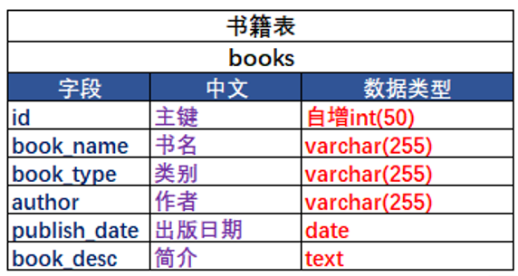

# 项目概要


# 设计开发
1. 数据库表设计
* 比如用户表中性别字段直接存中文吗？一般不这样，设计0男1女，需要一个数据字典，存编码和编码代表的含义
  1. 数据字典表
    
  2. 用户表
     * 学生和老师统一到一个用户表
    
  3. 角色表
     * 用来区分普通用户和管理员用户
    
  4. 用户和角色关联表
    
  5. 书籍表
    
  6. 书籍借阅表
     * 如果将书籍的借阅信息放到角色表中会违反第二范式
    

# MVC设计模式
* MVC是一种经典的设计模式，全名为Model-View-Controller，即模型-视图-控制器。
1. 模型是用于封装数据的载体，一般是一个普通的Java Bean，包含一系列的成员变量及其getter/setter方法。
   * 模型是对交互数据的封装，比如将用户名密码封装到用户这个对象，操作的时候只会操作用户这个对象而不是直接操作里面的属性
2. 视图用于展现，决定了界面到底长什么样子，通常是jsp、HTML等。
3. 控制器用于粘合模型和视图，例如，用户发送一个HTTP请求，此时该请求首先会进入控制器，然后控制器去获取数据并将其封装为模型，最后将模型传递到视图中进行展现。目前，控制器是servlet和filter。
   * 控制器用户接受请求和返回数据
   * 之所以能做到这些是因为有request和respond对象


# 功能模块


# 包名定义


# 封装实体类


# 适用servlet问题


# 创建自己的filter核心控制器
* 将要进行的操作放到链接中以.action结尾
  * 比如要执行UserAction类中的userAdd操作，链接应该为`xxx/.../userAction!userAdd.action`
  * 通过这样可以让一个filter根据链接的不同执行不同的操作
* 配置文件夹
  * 在idea中可以在项目结构将一个文件夹设置为资源文件夹
  * 
  * 这样web项目运行时,IDE编译器会把src下的一些资源文件移至WEB-INF/classes，classes目录就是classPath目录。
  * 可以通过Class.getClassLoader().getResourceAsStream("")获得类目录下文件的inputStream
    * Class是当前类对象
    * 当使用Class.getClassLoader().getResourceAsStream()加载资源时，是从classPath路径下进行加载，放在resources下的文件加载时不能加（"/"）。
```java
public class DispatcherFilter implements Filter {
  private Map<String, String> actionMap = new HashMap<>();
  private String characterEncoding;

  public void init(FilterConfig config) throws ServletException {
      //获取编码
      characterEncoding = config.getInitParameter("characterEncoding");
      /*
        * 获得类名->类的全路径的map
        * 写在资源文件中
        */
      String actionMappingPath = config.getInitParameter("actionMappingPath");
      InputStream in = DispatcherFilter.class.getClassLoader().getResourceAsStream(actionMappingPath);
      BufferedReader br = new BufferedReader(new InputStreamReader(in));
      try {
          String str = null;
          String[] temp = null;
          while ((str = br.readLine()) != null) {
              //userAction=com.mis.test.UserAction
              temp = str.split("=");
              actionMap.put(temp[0], temp[1]);
          }
      } catch (Exception e) {
          e.printStackTrace();
      }

  }

  public void destroy() {
  }

  @Override
  public void doFilter(ServletRequest request, ServletResponse response, FilterChain chain) throws ServletException, IOException {
      HttpServletRequest req = (HttpServletRequest) request;
      HttpServletResponse res = (HttpServletResponse) response;

      req.setCharacterEncoding(characterEncoding);
      res.setCharacterEncoding(characterEncoding);

      String uri = req.getRequestURI();

      /*
        * 规定
        *所有的action的连接的写法都是xxx/xxxx/类名的首字母小写后的字符串!方法名.action
        *
        *比如说，请求想要访问UserAction的add方法
        *连接写法就是userAction!userAdd.action
        */
      //判断是否是用.action结尾，是则执行相应操作，不是则过滤掉
      if (uri.endsWith(".action")) {
          String[] strs = uri.split("/");
          //获得数组的最后一个元素得到类名和方法名
          String[] strs1 = strs[strs.length - 1].replace(".action", "").split("!");
          String classKey = strs1[0];
          String methodName = strs1[1];
          //通过反射的方法调用这个函数
          try {
              Class<?> clazz = Class.forName(actionMap.get(classKey));
              Object obj = clazz.newInstance();
              Method init = clazz.getMethod("init", HttpServletRequest.class, HttpServletResponse.class);
              Method method = clazz.getMethod(methodName);
              init.invoke(obj, req, res);
              method.invoke(obj);
          } catch (Exception e) {
              e.printStackTrace();
          }
      } else {
          chain.doFilter(req, res);
      }

  }
}
```


# 封装java类的controller
* 设定前端传回的变量名都是`类名.属性名`或者`属性名`
* 将改controller的属性设置成前端传回来一样的属性
* 通过反射的方式自动取值并赋值
* 将完成把值封装到model并且将model展示给view的功能

```java
/**
 * 所有controller类的基类
 * 主要用到反射
 * 用于model的封装和将model交给view
 */
public class BaseAction {
    protected HttpServletRequest request;
    protected HttpServletResponse response;

    public void init(HttpServletRequest request, HttpServletResponse response) {
        this.request = request;
        this.response = response;
        try {
            setAttributeToFiled();
        } catch (Exception e) {
            e.printStackTrace();
        }
    }

    /**
     * 请求转发
     */
    public void forward(String url) {
        try {
            request.getRequestDispatcher(url).forward(request, response);
        } catch (Exception e) {
            e.printStackTrace();
        }
    }

    /**
     * 重定向
     */
    public void sendRedirect(String url) {
        try {
            response.sendRedirect(url);
        } catch (Exception e) {
            e.printStackTrace();
        }
    }

    /**
     * 将请求封装到属性中
     */
    public void setAttributeToFiled() throws Exception {
        //获得这个对象的所有属性，除了request和response不用赋值，其它的都要赋值
        Class<?> clazz = this.getClass();
        Field[] fields = clazz.getDeclaredFields();
        String fieldName = null;
        Class<?> fieldType = null;
        String value = null;
        String subFieldName = null;
        Class<?> subFieldType = null;

        for (Field field : fields) {
            //field一般是私有变量，为了下面能够赋值设定setAccessible
            field.setAccessible(true);
            fieldName = field.getName();
            //判断req和res不用赋值
            if (fieldName.equals("request") || fieldName.equals("response")) {
                continue;
            }
            //给其它非引用类型对象赋值
            fieldType = field.getType();
            //判断是不是非引用类型
            //直接判断包名是否包含java.lang即可
            if (fieldType.toString().contains("java.lang")) {
                value = request.getParameter(fieldName);
                if (value == null) {
                    //这里如果value为空下面调用invoke的时候会报空指针异常
                    continue;
                }
                //再判断是否是字符串，字符串可以直接赋值，其它的类型需要转化后赋值
                if (fieldType == String.class) {
                    field.set(this, value);
                } else {
                    field.set(this, fieldType.getMethod("valueOf", String.class).invoke(null, value));
                }
                setAttributeToPage(fieldName, value);
            } else {
                /*
                如果属性是引用类型，需要做两件事
                1.创建一个新的该引用类型对象，并给该对象的所有属性赋值
                2.将该对象赋值给field
                 */
                //创建一个新的引用类型对象
                Object obj = fieldType.newInstance();
                //获得这个引用类型的子属性
                Field[] subFields = fieldType.getDeclaredFields();
                //对每个子属属性赋值
                for (Field subField : subFields) {
                    subField.setAccessible(true);
                    subFieldName = subField.getName();
                    subFieldType = subField.getType();
                    value = request.getParameter(fieldName + "." + subFieldName);
                    if (value == null) {
                        //这里如果value为空下面调用invoke的时候会报空指针异常
                        continue;
                    }
                    //要求每个引用变量的属性都是非引用类型
                    //所以不用判断是否是非引用类型，只用判断以下是不是字符串即可
                    if (subFieldType == String.class) {
                        subField.set(obj, value);
                    } else {
                        subField.set(obj, subFieldType.getMethod("valueOf", String.class).invoke(null, value));
                    }
                }
                //将这个对象赋值给field
                field.set(this, obj);
                setAttributeToPage(fieldName, obj);
            }
        }
    }

    /**
     * 将model封装到请求中返回给页面
     */
    public void setAttributeToPage(String paramName, Object value) {
        request.setAttribute(paramName, value);
    }

}
```


# 登录功能

* C3P0数据库连接池

```java
public class JDBCUtil {
    //初始链接数
    private static int initSize = 5;
    //最大链接数
    private static int maxSize = 10;
    //最大等待时间
    private static int maxWait = 3000;
    //最大空闲时间
    private static int maxIdle = 5;

    private static ComboPooledDataSource ds = new ComboPooledDataSource();

    static {
        ds.setJdbcUrl("jdbc:mysql://localhost:3306/bookmis?userUnicode=true&characterEncoding=utf-8");
        ds.setUser("root");
        ds.setPassword("root");
        try {
            ds.setDriverClass("com.mysql.jdbc.Driver");
        } catch (PropertyVetoException e) {
            e.printStackTrace();
        }
        ds.setInitialPoolSize(initSize);
        ds.setMaxPoolSize(maxSize);
        ds.setCheckoutTimeout(maxWait);
        ds.setMaxIdleTime(maxIdle);
    }

    /**
     * 获取数据库链接
     */
    public static Connection getConnection() {
        Connection coon = null;
        try {
            coon = ds.getConnection();
        } catch (Exception e) {
            e.printStackTrace();
        }
        return coon;
    }

    /**
     * 回收数据库链接
     * 附带关闭功能
     */
    public static void releaseConnection(Connection coon, PreparedStatement pst, ResultSet rs) {
        try {
            if (rs != null) {
                rs.close();
            }
            if (pst != null) {
                pst.close();
            }
            if (coon != null) {
                coon.close();
            }
        } catch (Exception e) {
            e.printStackTrace();
        }
    }

    /**
     * 增删改操作
     * @param objs 替换sql中?部分的数组，数组元素顺序是问好的顺序
     */
    public static int executeWrite(Connection coon, PreparedStatement pst, String sql, Object... objs) throws Exception {
        pst = coon.prepareStatement(sql);
        int i = 1;
        for (Object obj : objs) {
            pst.setObject(i, obj);
            i++;
        }
        return pst.executeUpdate();

    }

    /**
     * 查询操作
     */
    public static ResultSet executeRead(Connection coon, PreparedStatement pst, ResultSet rs, String sql, Object... objs) throws Exception {
        pst = coon.prepareStatement(sql);
        int i = 1;
        for (Object obj : objs) {
            pst.setObject(i, obj);
            i++;
        }
        rs = pst.executeQuery();
        return rs;
    }

}
```

# 用dictionary表中的值替换下拉列表中的值

# 分页模糊查询
1. 使用一个分页的类来存储分页的基本信息
2. 用到了关联查询，主要是user表中sex等字段和dictionary中desc字段的对应关系

# 密码加密
```java
/**
 * MD5加密工具类
 * @author lby
 *
 */
public class MyMD5Util  {
	private static final String slat = "&%5123***&&%%$$#@";
	public static String encrypt(String dataStr) {
		try {
			dataStr = dataStr + slat;
			MessageDigest m = MessageDigest.getInstance("MD5");
			m.update(dataStr.getBytes(StandardCharsets.UTF_8));
			byte[] s = m.digest();
			StringBuilder result = new StringBuilder();
			for (byte b : s) {
				result.append(Integer.toHexString((0x000000FF & b) | 0xFFFFFF00).substring(6));
			}
			return result.toString();
		} catch (Exception e) {
			e.printStackTrace();
		}

		return "";
	}
}
```

# 将下拉列表数据放到缓存中
```java
/**
 * 将下拉列表的值缓存
 */
public class CommonSelect {
    public static List<Dictionary> sex = new ArrayList<>();
    public static List<Dictionary> status = new ArrayList<>();
    public static List<Dictionary> grade = new ArrayList<>();
    public static List<Dictionary> classes = new ArrayList<>();
    public static List<Dictionary> bookType = new ArrayList<>();
    public static List<Dictionary> role = new ArrayList<>();

    static {
        System.out.println("--------开始初始化下拉列表");
        UserService us = new UserService();
        BookService bs = new BookService();
        sex = us.dictionaryRead("sex");
        status = us.dictionaryRead("status");
        grade = us.dictionaryRead("grade");
        classes = us.dictionaryRead("classes");
        role = us.dictionaryRead("role");

        bookType = bs.dictionaryRead("bookType");
        System.out.println("--------结束初始化下拉列表");

    }
}
```

# 项目总结
1. MVC设计模式，自己封装一个MVC小框架
2. jdbc封装
3. 公共部分抽取到base类
4. 实际上还有业务逻辑部分，这个我们单独抽取一个层面，service层
5. jsp页面部分，做了2个公共组件，jstl标签组件，分页展示组件，省去了很多重复的代码开发工作
6. 角色访问控制，在管理系统非常常用，当前用户具有的角色决定能访问哪些功能
7. 登录访问控制，根据实际情况在需要登录的用户才能使用的功能的位置做登录访问的控制
8. 数据缓存，本项目是缓存到当前项目的内存中，作用是减小数据库的压力，可以缓存的数据特点之一是经常使用改变频率非常低
9. 开发套路，页面--action--service-jdbc
10. SQL，增删改查，分页查询
11. 对于我们这次开发的项目，其实业务逻辑不复杂，对于数据的增删改查展示的熟悉的过程
