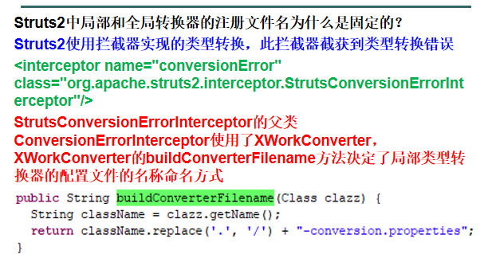

# 框架
* 框架是为了简便开发、减少代码量、保证代码质量等目的，进行代码封装后的产物。

# 什么是Struts2
* Struts2是一个基于MVC设计模式的Web应用框架，它本质上相当于一个Servlet，在MVC设计模式中，Struts2作为控制器(Controller)来建立模型与视图的数据交互。

# Struts2的优势
1. 项目开源，使用及拓展方便，天生优势。
2. 提供Exception处理机制。
3. Result方式的页面导航，通过Result标签很方便的实现重定向和页面跳转。
4. 通过简单、集中的配置来调度业务类，使得配置和修改都非常容易。
5. 提供简单、统一的表达式语言来访问所有可供访问的数据。
6. 提供标准、强大的验证框架和国际化框架。
7. 提供强大的、可以有效减少页面代码的标签。
8. 提供良好的Ajax支持。
9. 拥有简单的插件，只须放入相应的JAR包，任何人都可以扩展Struts2框架，比如自定义拦截器、自定义结果类型、自定义标签等，为Struts2定制需要的功能，不需要什么特殊配置，并且可以发布给其他人使用。
10. 拥有智能的默认设置，不需要另外进行繁琐的设置。使用默认设置就可以完成大多数项目程序开发所需要的功能。

# 基本原理
* 在传统方式的开发中，有一次请求就会对应一个Servlet。这样会导致出先很多Servlet。而Struts2将所有的请求都先经过一个前端控制器，在前端控制器中实现框架的部分功能，剩下具体操作要提交到具体的Action中。Struts2的前端控制器是由过滤器来实现的。
* 类似于之前做的图书管理系统的封装


# 部署Struts2
1. 下载Struts2的开发包
   * Struts2的官网为：`https://struts.apache.org/`
   * 我们这里使用Struts2.5的版本讲解
   * 在`D:\文档\编程\JAVA\求知讲堂Java\day50\资料`中有下载好的Struts2

2. 解压Struts2的开发包

3. 创建一个Web工程引入相应JAR包

4. struts2启动配置
* Struts2框架是通过filter启动的，在web.xml加入如下配置
```xml
<filter>
	<filter-name>struts2</filter-name>
	<filter-class>
        org.apache.struts2.dispatcher.filter.StrutsPrepareAndExecuteFilter
	</filter-class>
</filter>
<filter-mapping>
	<filter-name>struts2</filter-name>
	<url-pattern>/*</url-pattern>
</filter-mapping>
```
5. 创建struts.xml配置文件
   * 在Java Resources目录下创建resource资源文件夹，与src平级
   * 在资源文件夹下创建struts.xml配置文件写入以下内容
    ```xml
    <?xml version="1.0" encoding="UTF-8"?>
    <!DOCTYPE struts PUBLIC
        "-//Apache Software Foundation//DTD Struts Configuration 2.5//EN"
        "http://struts.apache.org/dtds/struts-2.5.dtd">
        <!-- 因为是2.5版本，所以上面写2.5 -->
    <struts>
        
    </struts>
    ```

# Struts2简单示例
1. 写一个java文件
```java
public class demoAction {
    public String execute() throws Exception{
        System.out.println("执行了DemoAction类的execute方法");
        return "ok";
    }
}
```
2. 配置struts.xml文件
```xml
<struts>
    <!--
    package类似java中的包的概念，给这些action分类，在struts中可以有多个
	name，包名，与java的包一样，包名唯一
	extends，继承的是其他的struts配置文件内容，按包名继承
	extends="struts-default"，继承的是struts2-core中的struts-default.xml中的包名为struts-default的package
    -->
    <package name="day31" extends="struts-default">
        <!--
		action具体控制器，一个package可以配置多个
		name，控制器的URL名称，自定义
		class，就是控制器的类
		<action name="demoAction" class="com.test.day31.DemoAction">
		这个访问链接就是http://域名或IP:端口/上下文/action的name值.action
		http://localhost:8080/struts2demo/demoAction.action
		访问这个链接默认访问的就是这个action名称对应的class类的execute方法
		-->
        <action name="demoAction" class="com.test.day31.demoAction">
            <!--
			result结果，就是这个action方法执行完返回到哪去
			name，值对应的action方法的返回值
			标签中间的文本值，跳转到哪
			 -->
            <result name="ok">/index.jsp</result>
        </action>
    </package>
</struts>
```

# struts.xml配置详解
## package属性
* 在struts.xml文件中，package的含义类似于java中的包的含义，里面的放的action（就像java的包里面放的是java类一样），相当于是人为的把一组在逻辑上相关的action配置在一个package里
* 属性:
  1. name:包名，必填，一个项目中唯一
  2. namespace:名字空间，可选，用于区分不同的包的访问路径(区分不同的package下面相同的name名称的action)，默认值是/
     * 访问路径:`http://域名或IP:端口/上下文/namespace的值/action的name值.action`
  3. extends:指定本package继承另一个package的所有配置。父包的配置可以重写。
  4. abstract:布尔值，可选，表示当前包是否抽象，如果当前包是抽象包，那么不能含有action。
  5. strict-method-invocation:布尔值，可选，是否严格方法调用，action中需要使用通配符和动态方法调用的时候把值设置为false。
* 属性中用到的较多的是:name、namespace、strict-method-invocation，一般extends就继承"struts-default"

## action属性
* action映射是框架中的基本“工作单元”。action映射就是将一个请求的URL映射到一个action类的某个方法，当一个请求匹配某个action名称时，框架就使用这个映射来确定如何处理请求。action可以在package中写多个，可以是同一个类的不同方法，也可以是不同类的方法。
* 属性:
  1. name:action的名称，一个package中唯一,也是在拼接URL的最后一部分xxxx.action的xxxx
  2. class:当前action的方法是属于哪个类的
  3. method:指定访问action类的某个方法，每个方法处理一个请求,默认是execute方法
  4. convert:将请求参数转化为自定义对象

## result属性
* Action类的方法是有返回值的，配置返回值之后，可跳转到不同的页面中。result标签里面的name属性值即是Action类里面的方法的返回值。在一个action标签里面可写多个result标签，对应一个方法可能有不同的返回值
* 属性:
  1. name:与action方法的返回值一致,在一个action中唯一
  2. type：跳转的类型
     1.  redirect:重定向
     2.  dispatcher:转发(默认值)
     3.  redirectAction:重定向到Action(该功能已经被redirect包含,并且写法更加复杂)
        * 写法:
        ```xml
        <result name="abc" type="redirectAction">
            <param name="actionName">demoAction</param>
            <param name="namespace">/n02</param>
        </result>
        ```
     4.  chain:转发到action(该功能已经被dispatcher包含)
     5.  stream:下载文件时使用
  3. 标签中间文本:跳转到的页面或者Action

# struts参数接收:
1. 属性驱动方式:
   1. 基本数据类型
   2. 引用数据类型
    ```java
    public class Action01 {
        //    属性驱动
        private String username;
        private String age;

        public void setUsername(String username) {
            this.username = username;
        }

        public void setAge(String age) {
            this.age = age;
        }

        public String test() {
            System.out.println(username);
            System.out.println(age);
            return "";
        }

        private User user;

        /*
        注意当使用属性驱动的时候如果得到的对象是一个模型，那么不止要提供set方法还要提供get方法
        因为拦截器完成完成数据的封装，需要创建User对象，通过get方法可以获得同一个对象，将数据封装到同一个对象中。
        */
        public void setUser(User user) {
            this.user = user;
        }

        public User getUser() {
            return user;
        }

        public String test1() {
            System.out.println(user.getUsername());
            System.out.println(user.getAge());
            return "";
        }
    }
    ```
2. 模型数据驱动
   1. 实现`ModelDriven<?>`接口，泛型选择要接受的模型，并实现getModel()方法
    ```java
    public class Action02 implements ModelDriven<User> {
        //这里一定要先new一个不然报空指针异常
        private User user = new User();

        @Override
        public User getModel() {
            return user;
        }


        public String test() {
            System.out.println(user.getUsername());
            System.out.println(user.getAge());
            return "";
        }
    }
    ```
* 在一个action中想要获取同一个表单提交的数据，可以使用属性封装，也可以使用模型驱动封装，但是这两种方式不能同时使用。**如果同时使用，只会使用到其中的一种，即只会使用模型驱动**。
* 模型驱动只能在一个action中的一个模型中封装数据，如果有多个则应该使用属性驱动的第二种方法
* 在使用属性封装的类接收参数时，Struts2首先通过反射技术调用接收参数的属性封装类的默认构造器创建对象,然后再通过反射技术调用对象中与请求参数同名的属性的setter方法来把请求参数值写到对象属性中。


# struts2传递参数
1. 属性驱动:
   1. 普通属性，需要设置getter方法，页面取值直接`${属性名}`
   2. 对象属性，对象和对象的属性都要设置getter方法，页面取值方式`${对象名.属性名}`
    ```java
    public class Action03 {
        //属性驱动
        private String username;
        private Integer age;

        public String getUsername() {
            return username;
        }

        public Integer getAge() {
            return age;
        }

        public String test() {
            username = "张三";
            age = 15;
            return "ok";
        }

        private User user;

        public User getUser() {
            return user;
        }
        public String test1() {
            user = new User();
            user.setAge(16);
            user.setUsername("李四");
            return "ok";
        }
    }
    ```
2. 模型驱动:
    1. 不用做其他处理，直接在页面使用`${属性名}`取值
    ```java
    public class Action04 implements ModelDriven<User> {
        private User user = new User();
        @Override
        public User getModel() {
            return user;
        }

        public String test() {
            user.setUsername("张三");
            user.setAge(17);
            return "ok";
        }
    }
    ```
# struts2种可以封装集合类型数据
1. List类型
2. Map类型
```java
public class Action05 {
    private List<User> users = new ArrayList<>();
    private Map<String, User> userMap = new HashMap<>();

    public Map<String, User> getUserMap() {
        return userMap;
    }

    public void setUserMap(Map<String, User> userMap) {
        this.userMap = userMap;
    }

    public List<User> getUsers() {
        return users;
    }

    public void setUsers(List<User> users) {
        this.users = users;
    }

    public String test() {
        System.out.println(users.get(0).getUsername());
        System.out.println(users.get(0).getAge());
        System.out.println(users.get(1).getUsername());
        System.out.println(users.get(1).getAge());
        return "";
    }

    public String test1() {
        System.out.println(userMap.get("one").getUsername());
        System.out.println(userMap.get("one").getAge());
        System.out.println(userMap.get("two").getUsername());
        System.out.println(userMap.get("two").getAge());
        return "";
    }
}
```

```jsp
<form action="${pageContext.request.contextPath}/n02/a05_test.action" method="post">
    年龄:<input type="text" name="users[0].age">
    <br>
    姓名:<input type="text" name="users[0].username">
    <br>
    年龄:<input type="text" name="users[1].age">
    <br>
    姓名:<input type="text" name="users[1].username">
    <br>
    <input type="submit" value="提交">
</form>
<br>
<form action="${pageContext.request.contextPath}/n02/a05_test1.action" method="post">
    年龄:<input type="text" name="userMap['one'].age">
    <br>
    姓名:<input type="text" name="userMap['one'].username">
    <br>
    年龄:<input type="text" name="userMap['two'].age">
    <br>
    姓名:<input type="text" name="userMap['two'].username">
    <br>
    <input type="submit" value="提交">
</form>
```

# action的编写方式
1. 创建普通类
2. 实现Action接口
   * 这个接口里只定义了一个execute()方法，该方法返回一个字符串。除此之外，该接口还定义了5个字符串常量，它们的作用是统一execute()方法的返回值。
    
   * 由于Xwork的Action接口简单，为开发者提供的帮助较小，所以在实际开发过程中，Action类很少直接实现Action接口。
3. 继承ActionSupport类(推荐)
   * ActionSupport类本身实现了Action接口，是Struts2中默认的Action接口的实现类，所以继承ActionSupport就相当于实现了Action接口。
   * ActionSupport类还实现了Validateable、ValidationAware、TextProvider、LocaleProvider和Serializable等接口，来为用户提供更多的功能。
   * ActionSupport类中提供了许多的默认方法，这些默认方法包括获取国际化信息的方法、数据校验的方法、默认的处理用户请求的方法等。
   * 实际上，ActionSupport类是Struts2默认的Action处理类，如果让开发者的Action类继承该ActionSupport类，则会大大简化Action的开发。


# 通配符方法调用
```xml
<!-- 动态方法调用 -->
<constant name="struts.enable.DynamicMethodInvocation" value="true"/>
<package name="day33" namespace="/d33" extends="struts-default" strict-method-invocation="false">
    <!--
    通配符的方式配置action
    注意：包要配置strict-method-invocation="false"
    -->
    <!--
    通配符*，可以在action的标签的范围内去任意使用
    *可以单独使用，也可以拼接字符串，也可以把*拼接到一起
    -->
    <action name="a01_*_*" method="test{1}" class="com.test.day33.Action01">
        <result name="success">/pages/day33/test{2}.jsp</result>
    </action>
    <!--
    动态方法调用
    也要设置strict-method-invocation=false
    同时要设置常量struts.enable.DynamicMethodInvocation为true
    访问方式为:`action的name属性!访问的对象方法名`
    -->
    <action name="a01" class="com.test.day33.Action01">
    </action>
</package>
```


# struts常量配置
* struts的常量默认设置在`web\WEB-INF\lib\struts2-core-2.5.20.jar!\org\apache\struts2\default.properties`中
* 一般有三种修改方式
1. 在struts.xml文件中使用`<constant>`元素配置常量`<constant name="struts.enable.DynamicMethodInvocation" value="true"/>`
2. 在struts.properties文件中配置常量(该文件于struts.xml同目录下)
3. 在web.xml文件中通过配置`<filter>`标签下的`<init-param>`元素配置常量(不推荐这么配置)
* 常用配置
```xml
<!-- 设置url请求后缀 -->
<constant name="struts.action.extension" value="do,action,," />
<!-- 指定Web应用的默认编码集,相当于调用HttpServletRequest的setCharacterEncoding方法 -->
<constant name="struts.i18n.encoding" value="UTF-8" />
<!-- 设置浏览器是否缓存静态内容,开发阶段最好关闭 -->
<constant name="struts.serve.static.browserCache" value="false" />
<!-- 当struts的配置文件修改后,系统自动加载该文件不重新启动服务器(热部署),生产环境下是false,开发阶段最好打开 -->
<constant name="struts.configuration.xml.reload" value="true" />
<!-- 开发模式下使用,这样可以打印出更详细的错误信息 -->
<constant name="struts.devMode" value="true" />
<!-- 设置默认主题 -->
<constant name="struts.ui.theme" value="simple"/>
<!-- 上传文件的大小限制（多个文件的总大小），单位：字节 -->
<constant name="struts.multipart.maxSize" value="100000"/>
<!-- 与spring集成的时候，指定由spring负责action对象的创建 -->
<constant name=”struts.objectFactory” value=”spring”/>
<!-- 是否使用动态方法调用 -->
<constant name="struts.enable.DynamicMethodInvocation" value="true"/>
```

# struts2分模块开发配置
* 在实际开发中，我们通常很多人都需要修改同一个配置文件，那就是struts.xml。因为这个文件是Struts2的核心配置文件。而且这个文件一旦改错了一点，那么会导致整个项目都会出项问题。
* Struts2提供了<include>标签解决了这个问题。
```xml
<struts>
    <!-- 不指定路径默认在源文件夹下（resource，src）时的方式 -->
    <include file="struts-user.xml"></include>
    <!-- 配置文件在源文件夹的子文件夹中时的方式 -->
    <include file="test/struts-product.xml" />
</struts>
```
* 应用举例

  * struts.xml内容
    ```xml
    <?xml version="1.0" encoding="UTF-8"?>
    <!DOCTYPE struts PUBLIC
            "-//Apache Software Foundation//DTD Struts Configuration 2.5//EN"
            "http://struts.apache.org/dtds/struts-2.5.dtd">
    <!-- 因为是2.5版本，所以上面写2.5 -->
    <struts>
        <include file="struts-properties.xml"/>
        <include file="demo/struts-day31.xml"/>
    </struts>
    ```
  * struts-porperties.xml(常量配置文件)内容
    ```xml
    <?xml version="1.0" encoding="UTF-8"?>
    <!DOCTYPE struts PUBLIC
            "-//Apache Software Foundation//DTD Struts Configuration 2.5//EN"
            "http://struts.apache.org/dtds/struts-2.5.dtd">
    <!-- 因为是2.5版本，所以上面写2.5 -->
    <struts>
        <!-- 是否使用动态方法调用 -->
        <constant name="struts.enable.DynamicMethodInvocation" value="true"/>
        <!-- 开发模式下使用,这样可以打印出更详细的错误信息 -->
        <constant name="struts.devMode" value="true" />
        <!-- 当struts的配置文件修改后,系统自动加载该文件不重新启动服务器(热部署),生产环境下是false,开发阶段最好打开 -->
        <constant name="struts.configuration.xml.reload" value="true" />
        <!-- 设置浏览器是否缓存静态内容,开发阶段最好关闭 -->
        <constant name="struts.serve.static.browserCache" value="false" />
        <!-- 指定Web应用的默认编码集,相当于调用HttpServletRequest的setCharacterEncoding方法 -->
        <constant name="struts.i18n.encoding" value="UTF-8" />
        <!-- 设置url请求后缀 -->
        <constant name="struts.action.extension" value="do,action,," />
    </struts>
    ```

# struts2的Action名称搜索机制
1. 获得请求路径的URI，例如url是:/hello_a/a/b/helloWorld.action
2. 首先查询namespace为/hello_a/a/b的package，如果存在这个package，则在这个package中查询名字为helloWorld的action，如果不存在这个package则转步骤3
3. 查询namespace为/hello_a/a的package，如果存在这个package，则在这个package中寻找名字为helloWorld的action，如果不存在这个package，则转步骤4
4. 查询namespace为/hello_a的package，如果存在这个package，则在这个package中寻找名字为helloWorld的action，如果仍然不存在这个package，则转步骤5
5. 查询默认的namaspace的package查询名字为helloWorld的action(默认的命名空间为空字符串“/” )如果还是找不到，页面提示404找不到action的异常。

# struts中action配置项的默认值
1. 如果`<action>`中不配置class属性，那么会使用默认的class
   * 默认的class在`web\WEB-INF\lib\struts2-core-2.5.20.jar!\struts-default.xml`中
   * 默认值为:`<default-class-ref class="com.opensymphony.xwork2.ActionSupport" />`
2. 如果`<result>`中不配置name属性,那么就会使用默认的`name = "success"`。

# struts访问到不存在的action
* 如果在浏览器访问一个不存在的action，会报404错误
* 这样的页面，用户体验不好，我们可以配置一个默认的action，当浏览器访问一个不存在的action时，进入这个action
```xml
<package name="noAction" extends="struts-default">
    <!-- 
    设置访问到不存在的Action的时候跳转到哪个action
    这个只在配置了这个属性的package中有效
    如果想要在其它的package中使用可以选择继承这个package
    -->
    <default-action-ref name="notFound"/>
    <action name="notFound" class="test.NoAction">
        <result name="success">/notFound.jsp</result>
    </action>
</package>
```
# Struts2全局结果
* 当多个action中都使用到了相同result，为了避免result的重复，这时我们应该把result定义为全局（当前包）结果。
```xml
<package name="demo" extends="struts-default">
	<global-results>
		<result name="msg">/msg.jsp</result>
	</global-results>
	
	<action name="login" class="test.LoginAction">
		<result name="ok">/index.jsp</result>
	</action>
</package>
```
* 如果全局和局部有同名的result，那么局部会覆盖全局的result。

# 数据转换
* HTTP传递数据传递的都是字符串或者字符串数组，我们有时需要将这个字符串数组转化成特定的数据类型，比如日期。
  * 在struts2中，请求参数的日期字符串是可以自动转换为Date类型的，但是要求日期字符串有固定格式：yyyy-MM-dd
  * 如果我们像将其它的数据类型转化成日期类型，我们就要设置转换器
    1. 自定义转换器继承StrutsTypeConverter
    2. 重写convertFromString和convertToString方法
    3. 注册转换器
       1. 在需要转换参数的Action所在包中建立properties文件,文件名：Action名-conversion.properties
       2. 在properties文件中添加配置，写法：需要转换的字段名=自定义转换器类的全类名
  * 如果给日期定义了转化器，原来默认的yyyy-MM-dd转化将不会生效，只会走转换器中的转换函数
  * 举例:
    
    ```java
    public class MyDate extends ActionSupport {
        private Date date;

        public Date getDate() {
            return date;
        }

        public void setDate(Date date) {
            this.date = date;
        }

        public String priDate() {
            System.out.println(date);
            return "ok";
        }
    }
    ```
    ```java
    public class Str2DateConverter extends StrutsTypeConverter {
        /**
        * 把请求的字符串转化为我们自己需要的数据类型
        */
        @Override
        public Object convertFromString(Map map, String[] strings, Class aClass) {
            // 获取需要的参数
            String str = strings[0];
            DateFormat df = new SimpleDateFormat("yyyy/MM/dd");
            Date date = null;
            try {
                date = df.parse(str);
            } catch (ParseException e) {
                e.printStackTrace();
            }
            return date;
        }

        /**
        * 输出页面，可以把特定的数据类型转换为字符串
        * 需要struts2的特有标签支持
        */
        @Override
        public String convertToString(Map map, Object o) {
            return null;
        }
    }
    ```
    ```
    date=com.test.day34.Str2DateConverter
    ```

# 全局转换器
* 前面我们学习的类型转换器是专门针对某个类的，与类绑定，是局部类型转换器。如果对于某些类型，需要所有action中实现转换，我们每个类写一个配置文件很麻烦，需要使用全局类型转换器来完成。
* 方法:
  1. 自定义转换器继承StrutsTypeConverter
  2. 重写convertFromString和convertToString方法
  3. 注册转换器
     1. 在src(或者资源文件夹)下建立properties文件，固定文件名：xwork-conversion.properties
     2. 在properties文件中添加配置,写法：需要转换的字段的数据类型=自定义转换器类的全类名。(java.util.Date=test.DateTypeConvertor)

# 转换器源码



# struts2使用servletAPI
* ActionContext类
```java
public class UseServletAPI extends ActionSupport {
    /**
     * 获取parameter
     * @return
     */
    public String test1() {
        HttpParameters hp = ActionContext.getContext().getParameters();
        System.out.println(hp.get("name"));
        return NONE;
    }

    /**
     * 设置session
     */
    public String test2() {
        //这个map就相当于session
        Map<String, Object> session = ActionContext.getContext().getSession();
        session.put("age", 15);
        return NONE;
    }

    /**
     * 获取session
     */
    public String test3() {
        Map<String, Object> session = ActionContext.getContext().getSession();
        System.out.println(session.get("age"));
        return NONE;
    }

    /**
     * 设置request的attribute属性并转发
     */
    public String test4() {
        ActionContext.getContext().put("sex", "男");
        return SUCCESS;
    }

    /**
     * 获取request的attribute
     */
    public String test5() {
        String str = (String) ActionContext.getContext().get("sex");
        System.out.println(str);
        return NONE;
    }
}
```
* ServletActionContext对象
```java
public class MyServletActionContext extends ActionSupport {
    public String test1() {
        //获取session对象并赋值
        HttpSession session = ServletActionContext.getRequest().getSession();
        session.setAttribute("name", "张三");
        return NONE;
    }

    public String test2() {
        HttpSession session = ServletActionContext.getRequest().getSession();
        System.out.println(session.getAttribute("name"));
        return NONE;
    }

    /**
     * 设置request对象属性并跳转
     */
    public String test3() {
        HttpServletRequest req = ServletActionContext.getRequest();
        req.setAttribute("age", 15);
        return SUCCESS;
    }

    public String test4() {
        System.out.println(ServletActionContext.getRequest().getAttribute("age"));
        return NONE;
    }

    /**
     * 获取response对象
     */
    public String test5() {
        //可以获取ServletContext对象
        ServletContext servletContext = ServletActionContext.getServletContext();

        //获取response对象
        HttpServletResponse res = ServletActionContext.getResponse();
        try {
            res.getWriter().write("<h1>hello world" +
                    servletContext.getContextPath() +
                    "</h1>");
        } catch (IOException e) {
            e.printStackTrace();
        }
        return NONE;
    }
}
```
* 实现特定接口
  * 与struts2框架耦合最高，不提倡
```java
public class MyServlet extends ActionSupport implements ServletContextAware,ServletRequestAware,ServletResponseAware{

	private ServletContext servletContext;
	private HttpServletRequest request;
	private HttpServletResponse response;
	
	@Override
	public void setServletContext(ServletContext arg0) {
		this.servletContext = arg0;
	}
	
	@Override
	public void setServletRequest(HttpServletRequest arg0) {
		this.request = arg0;
	}

	@Override
	public void setServletResponse(HttpServletResponse arg0) {
		this.response = arg0;
	}

	public String test(){
		//获取session
		request.getSession();
		System.out.println(request.getParameter("name"));
		return NONE;
	}
}
```
```java
public class MyServlet1 extends ActionSupport implements RequestAware,SessionAware,ApplicationAware{
	private static final long serialVersionUID = 1L;

	private Map<String, Object> request;
	private Map<String, Object> session;
	private Map<String, Object> application;//这个就相当于ServletContext对象

	public Map<String, Object> getRequest() {
		return request;
	}

	public Map<String, Object> getSession() {
		return session;
	}

	public Map<String, Object> getApplication() {
		return application;
	}

	@Override
	public void setRequest(Map<String, Object> arg0) {
		this.request = arg0;
	}

	@Override
	public void setSession(Map<String, Object> arg0) {
		this.session = arg0;
	}

	@Override
	public void setApplication(Map<String, Object> arg0) {
		this.application = arg0;
	}
}
```

# 文件上传
* 使用了`commons-io-2.6.jar!\org\apache\commons\io\FileUtils.class`
* 开始要配置`上传文件的大小限制（多个文件的总大小），单位：字节`
* 多个文件上传的时候type为file的input的name值要一样
* 相较于Servlet文件上传的优点是表单中除了文件还可以传其它内容
* 接收文件、文件名、文件类型的三个参数名称一定要按照规则写

```java
public class Upload extends ActionSupport {
    /*
    单文件上传
     */
    private File myFile;//这里要与页面的上传文件框的name值一致
    private String myFileFileName;//需要文件名+FileName，组成上传文件的文件名
    private String myFileContentType;//文件名+ContentType，组成上传文件的Type类型

    public File getMyFile() {
        return myFile;
    }

    public void setMyFile(File myFile) {
        this.myFile = myFile;
    }

    public String getMyFileFileName() {
        return myFileFileName;
    }

    public void setMyFileFileName(String myFileFileName) {
        this.myFileFileName = myFileFileName;
    }

    public String getMyFileContentType() {
        return myFileContentType;
    }

    public void setMyFileContentType(String myFileContentType) {
        this.myFileContentType = myFileContentType;
    }

    public String upload() {
        //文件夹名称
        String path = "D:\\test1\\upload";
        File temp = new File(path, myFileFileName);

        try {
            FileUtils.copyFile(myFile, temp);
        } catch (IOException e) {
            e.printStackTrace();
        }
        return NONE;
    }

    /*
    多文件上传
     */
    private File[] myFiles;
    private String[] myFilesFileName;
    private String[] myFilesContentType;

    public File[] getMyFiles() {
        return myFiles;
    }

    public void setMyFiles(File[] myFiles) {
        this.myFiles = myFiles;
    }

    public String[] getMyFilesFileName() {
        return myFilesFileName;
    }

    public void setMyFilesFileName(String[] myFilesFileName) {
        this.myFilesFileName = myFilesFileName;
    }

    public String[] getMyFilesContentType() {
        return myFilesContentType;
    }

    public void setMyFilesContentType(String[] myFilesContentType) {
        this.myFilesContentType = myFilesContentType;
    }

    /*
    验证struts中的上传文件表单还可以上传其它属性
     */
    private String name;

    public String getName() {
        return name;
    }

    public void setName(String name) {
        this.name = name;
    }

    public String uploadFlies() {
        System.out.println("==============" + name);
        String path = "D:\\test1\\upload";
        for (int i = 0; i < myFiles.length; i++) {
            File temp = new File(path, myFilesFileName[i]);
            try {
                FileUtils.copyFile(myFiles[i], temp);
            } catch (IOException e) {
                e.printStackTrace();
            }
        }
        return NONE;
    }
}
```

# 文件下载
* 在action中设置文件输入流和文件名
* 配置struts.xml文件的result
```java
public class Download extends ActionSupport {
    private InputStream is;
    private String fileName;

    public InputStream getIs() {
        return is;
    }

    public void setIs(InputStream is) {
        this.is = is;
    }

    public String getFileName() {
        return fileName;
    }

    public void setFileName(String fileName) {
        this.fileName = fileName;
    }

    public String downLoad() {
        FileInputStream fis = null;
        try {
            fis = new FileInputStream("D:\\文档\\编程\\JAVA\\求知讲堂Java\\day54\\视频\\1_struts2文件下载.exe");
        } catch (FileNotFoundException e) {
            e.printStackTrace();
        }
        setIs(fis);
        try {
            //注意这里要加后缀名
            setFileName(URLEncoder.encode("测试1.exe", "utf-8"));
        } catch (UnsupportedEncodingException e) {
            e.printStackTrace();
        }

        return "down";
    }
}
```
```xml
<action name="download" class="com.test.day34.Download" method="downLoad">
    <!-- 下载文件的result的type类型一定是stream -->
    <result name="down" type="stream">
        <!--  往StreamResult类中的属性注入内容 -->
        <!-- 返回给浏览器的文件类型。返回通用的二进制 -->
        <param name="contentType">application/octet-stream</param>
        <!-- 返回给浏览器的输入流 -->
        <param name="inputName">is</param>
        <!--  告诉浏览器的方式下载资源
        ${name}: 获取Action中的getName()方法的数据
        -->
        <param name="contentDisposition">attachment;filename=${fileName}</param>
        <!-- 缓存大小 -->
        <param name="bufferSize">1024</param>
    </result>
</action>
```
