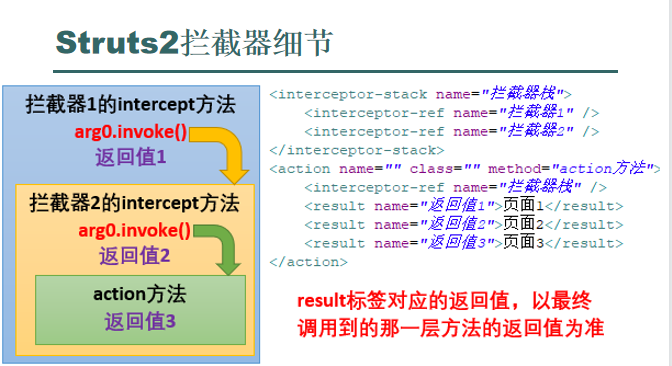
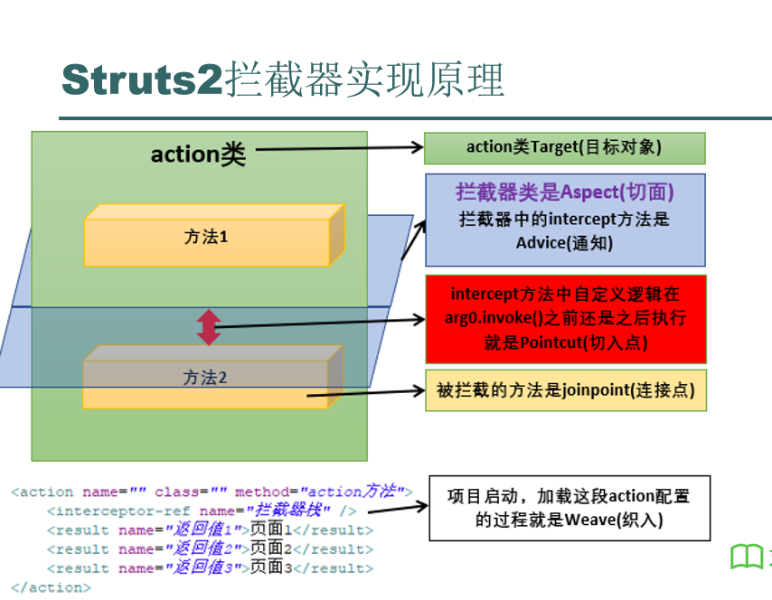
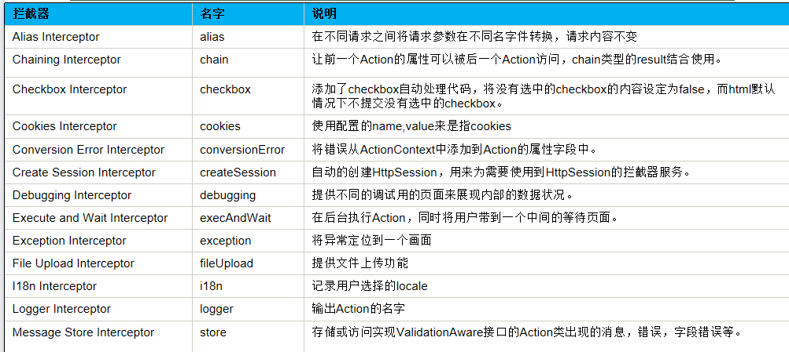
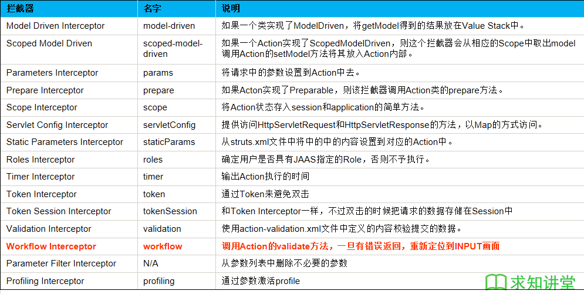

# 背景
* 假设已经实现功能：访问action链接跳转index页面。现在要对这个功能改进，需要先判断用户身份是否是管理员，如果不是不能访问这个action跳转到index页
* 实现方式:
  1. 直接在action中的开头加入代码判断（耦合严重）
  2. 使用filter（依赖servlet容器）
  3. struts2拦截器（不依赖servlet容器，编码简单，耦合低）
* Struts2 拦截器在访问某个 Action 方法之前或之后完成一些工作,Struts2 拦截器是可插拔的, 拦截器是 AOP 的一种实现
  * AOP:面向切面编程

# 拦截器实现
1. 创建拦截器类实现Interceptor接口
   * com.opensymphony.xwork2.interceptor.Interceptor
   * 是单例的
2. 重写以下三个方法:
   1. init:创建后初始化时被调用, 它在拦截器的生命周期内只被调用一次。
   2. destroy:拦截器被销毁之前被调用, 它在拦截器的生命周期内也只被调用一次. 
   3. interecept:每拦截一个动作请求, 该方法就会被调用一次。
3. 配置拦截器
   * 拦截器配置，在package的开头配置，在目标action中引用拦截器,配置时注意，先引用默认的拦截器，默认拦截器识别action
```java
public class MyInterceptor implements Interceptor {
    @Override
    public void destroy() {
        System.out.println("实现了day35.MyInterceptor的destroy方法");
    }

    @Override
    public void init() {
        System.out.println("实现了day35.MyInterceptor的init方法");
    }

    /**
    * http://localhost:8080/struts2demo/n14/d35a01_test.action?name=abc
    * 访问这个链接，实际上访问的这个action的拦截器
    * 在拦截器中可以获取到name参数的值
    * 判断name的值是不是admin
    * 如果是，就执行arg0.invoke()，也就是action的方法，得到action的返回值success
    * 如果不是，返回值error
    * 把返回值返回
    * 根据action配置的result视图的name值，跳到相应的页面
    */
    @Override
    public String intercept(ActionInvocation actionInvocation) throws Exception {
        String res = "error";
        String name = actionInvocation.getInvocationContext().getParameters().get("name").getValue();
        if (name.equals("admin")) {
            res = actionInvocation.invoke();
        }
        return res;
    }
}
```

```xml
<package name="day35" namespace="/d35" extends="struts-default">
    <!-- 声明拦截器 -->
    <interceptors>
        <interceptor name="i01" class="com.test.day35.MyInterceptor"/>

        <!-- 拦截器栈 -->
        <interceptor-stack name="is">
            <!-- 引入默认拦截器，在使用自定义拦截器之前，一定要先有默认的拦截器 -->
            <interceptor-ref name="defaultStack"/>
        
            <!-- 引入自己定义的拦截器 -->
            <interceptor-ref name="i01"/>
        </interceptor-stack>
    </interceptors>

    <action name="demo" class="com.test.day35.demo">
        <!-- 把拦截器栈给这个action使用 -->
        <interceptor-ref name="is"/>
        <result>/pages/day35/index.jsp</result>
        <result name="error">/pages/day35/error.jsp</result>
    </action>
</package>
```

# 拦截器中获取ActionContext对象
* 通过actionInvocation.getInvocationContext()得到对象和ActionContext.getContext()得到的对象一致
```java
ActionContext ac = actionInvocation.getInvocationContext();
System.out.println("action名称:" + actionInvocation.getProxy().getActionName());
System.out.println("action方法:" + actionInvocation.getProxy().getMethod());
System.out.println("action命名空间:" + actionInvocation.getProxy().getNamespace());
```

# 拦截器栈与默认拦截器
* 拦截器栈中的拦截器会依次执行，前一个interceptor中的actionInvocation.invoke()会调用下一个interceptor的intercept方法，最后一个interceptor的actionInvocation.invoke()才会调用action中的方法。
* 可以在包中通过`<default-interceptor-ref name="MyInterceptorStatck"/>`设置默认拦截器，对每个action方法都会先经过这个拦截器
* **result标签对应的返回值，以最终调用到的那一层方法的返回值为准**



# AOP
* Aspect-Oriented Programming, 面向切面编程
* AOP是一种编程思想，**关注的是方法**，是对具体的方法的拓展与分层，便于开发和维护。
* 定义:
  1. Aspect(切面):是一个类，是定义对具体方法怎样进行拓展与分层
  2. Joinpoint(连接点):要进行拓展与分层的方法
  3. Pointcut(切入点):在何时(如:方法执行前后)进行拓展分层
  4. Advice(通知):切面类中具体执行拓展分层的方法
  5. Target(目标对象):要被拓展分层的那个方法(连接点)所属的对象
  6. Weave(织入):将切面应用到目标对象的过程
* 一个简单的AOP举例:

```java
public class Demo1 {
    /*
    Joinpoint连接点
     */
    public String test() {
        System.out.println("执行了demo1中的test方法");
        return "res0";
    }
}
```

```java
/**
 * Aspect(切面)
 */
public class AOPDemo {
    Object obj;

    public AOPDemo(Object obj) {
        this.obj = obj;
    }

    /*
    Advice(通知)
     */
    public String intercept(Method method) {
        String res = null;
        try {
            System.out.println("执行了demo1中的test方法执行前逻辑");//Pointcut切入点
            res = (String) method.invoke(obj);
            System.out.println("执行了demo1中的test方法执行后逻辑");//Pointcut切入点
        } catch (Exception e) {
            e.printStackTrace();
        }
        return res;
    }
}
```

```java
public class Test {
    public static void main(String[] args) throws NoSuchMethodException {
        /*
        下面是Weave(织入)过程
         */
        Demo1 demo1 = new Demo1();//目标对象
        AOPDemo aopDemo = new AOPDemo(demo1);
        Method method = demo1.getClass().getMethod("test");
        System.out.println(aopDemo.intercept(method));
    }
}
```


# 自带拦截器
* 这些拦截器被定义在了名为struts-default的包中，并被设置成了默认拦截器，所以继承这个package就能使用到这些拦截器


