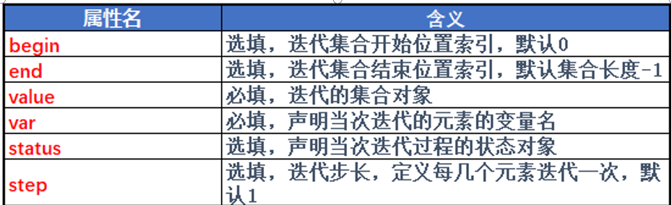
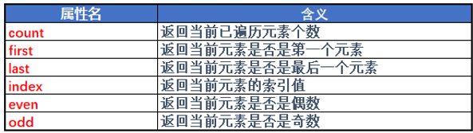

# OGNL
*  OGNL是Object Graphic Navigation Language（对象图导航语言）的缩写，它是一个开源项目。
*  支持:
1. 对象方法的调用
2. 静态方法的调用和访问值
3. 赋值和表达式串联
4. 操作集合对象
```java
public class OGNLDemo {
    public static void main(String[] args) throws Exception {
        /*
        OGNL存值，可以利用(K,V)键值对方式存
        也可以存在根路径下
         */
        OgnlContext context = new OgnlContext();
        context.put("u1", new User("张三", 15));
        context.setRoot(new User("李四", 21));

        /*
        定义查询语句
        使用k-v方式存储的对象对象名前要加#
         */
        Object exp1 = Ognl.parseExpression("#u1.username");
        /*
         * Ognl.getValue(obj1, context, context.getRoot())执行表达式
         * 参数1，定义的表达式对象
         * 参数2，OgnlContext对象
         * 参数3，OgnlContext对象的root对象，通过context.getRoot()方法获得
         */
        System.out.println(Ognl.getValue(exp1, context, context.getRoot()));

        /*
        表达式执行对象方法
         */
        Object exp2 = Ognl.parseExpression("#u1.test()");
        Ognl.getValue(exp2, context, context.getRoot());
        Object exp3 = Ognl.parseExpression("#u1.test1()");
        System.out.println(Ognl.getValue(exp3, context, context.getRoot()));

        /*
        操作在根路径下的对象时
        定义表达式不要写#和key
        直接写属性名或者方法名就可
         */
        Object exp4 = Ognl.parseExpression("username");
        System.out.println(Ognl.getValue(exp4, context, context.getRoot()));
        Object exp5 = Ognl.parseExpression("add(1, '3')");
        System.out.println(Ognl.getValue(exp5, context, context.getRoot()));

        /*
        表达式可以调用静态方法和静态属性
        具体写法是@包名.类名@属性名或方法名
         */
        User.school = "第一中学";
        Object exp6 = Ognl.parseExpression("@com.test.day35.User@school, @com.test.day35.User@showInfo('王五')");
        System.out.println(Ognl.getValue(exp6, context, context.getRoot()));

        /*
        可以在Expression中赋值
        可以在一个Expression中写多条语句，中间用逗号分割
         */
        Object exp7 = Ognl.parseExpression("#u1.username = '王五', #u1.age = 17, #u1");
        System.out.println(Ognl.getValue(exp7, context, context.getRoot()));

        /*
        但是无法给静态变量赋值
         */
        Object exp8 = Ognl.parseExpression("@com.test.day35.User@school = '一中',@com.test.day35.User@school");//报错
        System.out.println(Ognl.getValue(exp8, context, context.getRoot()));

    }

}

class User {
    public String username;
    public int age;
    public static String school;

    public User(String username, int age) {
        this.username = username;
        this.age = age;
    }

    public void test() {
        System.out.println("执行了User的test方法");
    }

    public String test1() {
        return "hello";
    }

    public int add(int a, String b) {
        return a + Integer.parseInt(b);
    }

    public static String showInfo(String name) {
        return name + "的学校是" + school;
    }

    @Override
    public String toString() {
        return "User{" +
                "username='" + username + '\'' +
                ", age=" + age +
                '}';
    }
}
```
# 值栈对象
* ValueStack是Struts2的一个接口，字面意义为值栈
  * 在Servlet中要把数据传递到页面中显示，就要在Servlet里面把数据放到域对象里面，然后在JSP页面中使用el表达式获取域对象里面的值。
  * 而在Struts2框架里面提供了一个东西——值栈，它类似于域对象，值栈应用在Struts2的Action类里面，我们在值栈中可以存值和取值。
* OgnlValueStack是ValueStack的实现类，客户端发起一个请求到action，Struts2框架会创建一个Action实例，同时创建一个OgnlValueStack值栈实例。
* OgnlValueStack贯穿整个Action的生命周期，Struts2中使用OGNL将请求Action的参数封装为对象存储到值栈中，并通过OGNL表达式读取值栈中的对象属性值。

```java
//或缺ActionContext对象
ActionContext context = ActionContext.getContext();
//调用ActionContext对象的方法获取到值栈对象
ValueStack stack = context.getValueStack()
```

# struts2值栈的内部结构
* 值栈内部主要有两个属性:
  1. `CompoundRoot root`:
     * 存储了当前的action实例(包括属性),作为OgnlContext的root对象
     * CompoundRoot继承了ArrayList实现压栈和出栈的功能，拥有栈的特点，先进后出、后进先出，我们称其为对象栈
  2. `Map<String, Object> context`:
     * 这个map里面的key有这些:
       1. parameters:当前请求的请求参数
       2. request:当前request对象中的所有属性
       3. session:当前session对象中的所有属性
       4. application:当前application对象中的所有属性
       5. attr:该map按如下顺序来检索某个属性:request、session、application
     * 上述的key对应value是map

# 值栈的存值
* 方法:
  1. 调用值栈对象中的set方法，输入k-v值
  2. 调用值栈对象中的push方法，存到root
  3. 在action成员变量定义变量，生成这个变量的get方法
* 实际开发中一般使用方法三
```java
public class Action01 extends ActionSupport {
    private User user;

    public User getUser() {
        return user;
    }

    public String test() {
        //获取值栈对象
        ActionContext ac = ActionContext.getContext();
        ValueStack vs = ac.getValueStack();

        //存值
        User u1 = new User("张三", 13);
        vs.set("user1", u1);

        User u2 = new User("李四", 14);
        vs.push(u2);

        user = new User("王五", 15);

        return SUCCESS;
    }
}
```

# 值栈的取值
* 使用`<s:property>`标签取:
  * 要先声明`<%@ taglib prefix="s" uri="/struts-tags" %>`
```xml
<s:property value="user1.name"/>
<s:property value="name"/>
<s:property value="user.name"/>
```
* 使用EL表达式取
```jsp
${user1.name}
${name}
${user.name}
```

* 为什么EL表达式可以获取值栈中的值:
1. Struts的StrutsRequestWrapper类继承了HttpServletRequestWrapper类并重写了里面的getAttribute方法
```java
public Object getAttribute(String key) {
    if (key == null) {
        throw new NullPointerException("You must specify a key value");
    } else if (!this.disableRequestAttributeValueStackLookup && !key.startsWith("javax.servlet")) {
        ActionContext ctx = ActionContext.getContext();
        //先通过父类的方法在域对象中取
        Object attribute = super.getAttribute(key);
        if (ctx != null && attribute == null) {
            //在域对象中没有取得值就在值栈中取
            boolean alreadyIn = BooleanUtils.isTrue((Boolean)ctx.get("__requestWrapper.getAttribute"));
            if (!alreadyIn && !key.contains("#")) {
                try {
                    ctx.put("__requestWrapper.getAttribute", Boolean.TRUE);
                    ValueStack stack = ctx.getValueStack();
                    if (stack != null) {
                        attribute = stack.findValue(key);
                    }
                } finally {
                    ctx.put("__requestWrapper.getAttribute", Boolean.FALSE);
                }
            }
        }

        return attribute;
    } else {
        return super.getAttribute(key);
    }
}
```
2. 先通过父类的方法在域对象中取，如果域对象里面没有值，则得到值栈对象，从值栈对象里面把值获取到，最后放到域对象里面去。


# Struts的标签
* 分类:
  1. 控制标签
  2. 表单标签
* 需要先声明`<%@ taglib uri="/struts-tags prefix="s"%>`

## Struts的控制标签
```java
public class Action02 extends ActionSupport {
    private int age;
    private String name;
    private List<String> list;
    private String out;

    public String getOut() {
        return out;
    }

    public List<String> getList() {
        return list;
    }

    public String getName() {
        return name;
    }

    public int getAge() {
        return age;
    }

    public String test() {
        age = 18;
        name = "李四";
        return SUCCESS;
    }

    public String test1() {
        list = new ArrayList<>();
        list.add("hello");
        list.add("abc");
        list.add("李四");
        list.add("张三");
        list.add("lucy");
        return SUCCESS;
    }

    public String test2() {
        out = "<h1>hello world!</h1>";
        return SUCCESS;
    }
}
```
1. `<s:if>、<s:elseif>、<s:else>`
   * 属性是OGNL表达式，和EL表达式很像，优点是OGNL表达式可以调用属性的方法
    ```jsp
    <body>
    <s:if test="age > 18">
        大于18岁
    </s:if>
    <s:else>
        小于等于18岁
    </s:else>
    <br>
    <s:if test="name == '张三'">
        姓名是张三
    </s:if>
    <s:elseif test="name == '李四'">
        姓名是李四
    </s:elseif>
    <s:else>
        未知姓名
    </s:else>
    </body>
    ```
2. `<s:iterator>`
   * 用于对集合中的数据进行迭代，它可以根据条件遍历集合中的数据
   * 属性:
    
     * 迭代状态的属性:
        
       * 迭代属性需要注意的是引用的时候要加"#",迭代属性不是存在root中的
       * index表示的第几个元素，并不一定和集合中的下标相同(比如设置了begin的时候)
    ```jsp
    <s:iterator value="list" var="list_name" status="st">
        第<s:property value="#st.index"/>个元素是<s:property value="list_name"/><br>
    </s:iterator>
    ```
3. `<s:property>`
   * 用于输出值
   * 属性:
     * value:输出的值，是OGNL表达式
     * default:如果要输出的值为null默认输出的值，如果没有设置当输出的值为null时输出""
     * escapeXxx:是否将字符串中的HTML标签当作字符串输出，默认是true
4. `<s:a>`
   * `<s:a href="链接地址"></s:a>`
5. `<s:debug>`
   * 用于输出ValueStack中的信息
    ```jsp
    <s:property value="out" escapeHtml="fasle"/>
    <s:a href="https://www.baidu.com">转到百度</s:a>
    <s:debug/>
    ```

# UI标签
* 现在的前后端一般不会要一个人写了，并且为了程序的可移植性一般不会使用struts的UI标签，仅作了解即可
* Struts2默认提供了4中主题，分别为simple、xhtml、css_xhtml和Ajax
  * Xml配置：`<constant name="struts.ui.theme" value="simple" />`
  * properties 配置：struts.ui.theme=simple
```jsp
<!-- action属性填action链接不需要写.action后缀 -->
<s:form action="register" method="post"></s:form>

<s:hidden name="user" value="username"></s:hidden>

<s:textfield label="用户名" name="username"></s:textfield>

<s:password label="密码" name="password1"></s:password>

<s:password label="确认密码" name="password2"></s:password>

<!-- s:radio的list属性可以使用ValueStack中的map集合 -->
<s:radio list="#{'0':'男','1':'女'}" 
         label="性别" name="sex" value="0"></s:radio>
<!-- s:checkboxlist的list属性可以使用ValueStack中的list集合 -->
<s:checkboxlist list="{'足球','篮球','游泳'}"
                label="爱好" name="interesters"
                labelposition="left"></s:checkboxlist>
<!-- s:select的list属性可以使用ValueStack中的map集合 -->
<s:select list="#{'beijing':'北京','shanghai':'上海','guangzhou':'广州' }"
          label="所在城市" name="city"
          listKey="key" listValue="value"></s:select>
<s:textarea label="个性签名" name="description"
            rows="5" cols="15"></s:textarea>
<s:file name="upLoadFile" label="头像"></s:file>
<s:reset value="重置"></s:reset>
<s:submit value="提交"></s:submit>
```


