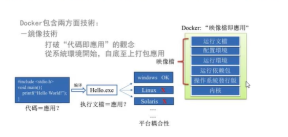
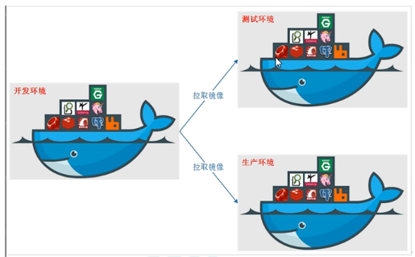
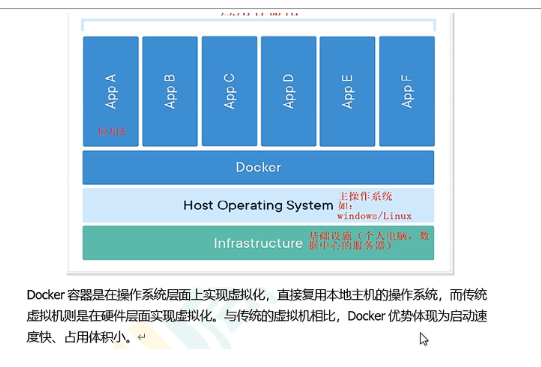
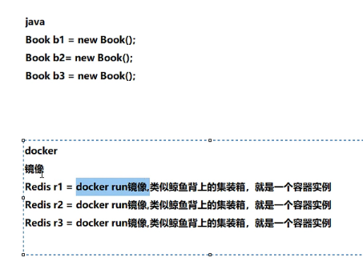
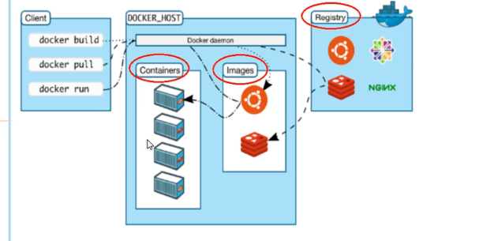
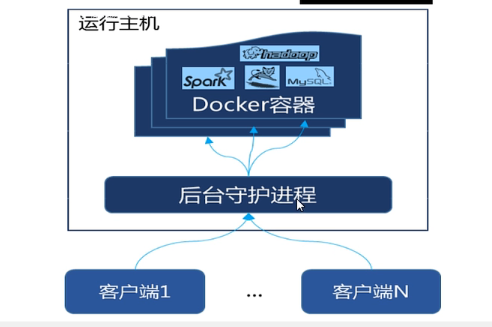

# 1. 介绍
* 基于Go语言实现的云开源项目
* 开发人员身处的配置环境各不相同，同时企业还拥有标准化的测试和生产环境，具有自身的配置和一系列支持文件。目前希望尽可能多在本地模拟这些环境而不产生重新创建服务器环境的开销。
* Docker给出了一个标准化的解决方案--**系统平滑移植，容器虚拟化技术**

* Docker通过镜像(images)将运作应用程序所需的环境系统，自下而上打包，大道应用程式跨平台间的无缝接轨运作
* 实现**一次镜像，处处运行**
* Linux容器基础的一种落地实现
* 解决了运行环境和配置问题的软件容器，方便做持续集成并有助于整体发布的容器

## 1.1 传统虚拟机和容器的比较

1. 虚拟机:
   * 就是带环境安装的一种解决方案
   * 可以在一种操作系统中运行另一种操作系统
   * 传统虚拟机技术基于安装在主操作系统上的虚拟机管理系统，创建虚拟机(模拟出各种硬件)，在虚拟机上安装操作系统，再从操作系统中安装部署各种应用。
   * 缺点:
     * 资源占用多
     * 冗余步骤多
     * 启动慢

2. 容器虚拟化技术:
   * Linux容器(LXC)
   * 容器不必要模拟一个完整的操作系统而是对进程进行隔离，不需要捆绑一整套操作系统，只需要软件工作所需的库和资源
   * 容器内的进程直接运行于宿主的内核，容器内没有自己的内核也没有进行硬件虚拟，因此比传统虚拟机更为轻便
   * 每个容器之间相互隔离，每个容器有自己的文件系统，容器之间进程不会相互影响，能区分计算资源

## 1.2 下载地址

1. docker官网:http://www.docker.com

* Docker必须部署在Linux内核的系统上，如果其它系统想要部署必须安装Linux虚拟环境

2. Docker Hub官网:https://hub.docker.com

## 1.3 docker的基本组成

1. 镜像(image):类比Java中的类模板
2. 容器(container):类比Java中类模板new的实例对象
   * 也可以将容器看成一个简易版的Linux环境和运行在其中的应用程序
3. 仓库(repository):存放镜像的地方
   * 全球最大的容器仓库是Docker Hub
   * 由于Docker Hub在国外，一遍使用阿里云仓库

## 1.4 docker平台架构图

* docker是一个C-S结构的系统，docker守护进程运行在主机上，通过Socket链接从客户端访问，守护进程从客户端接受命令并管理运行在主机上的容器。可以对比Mysql

