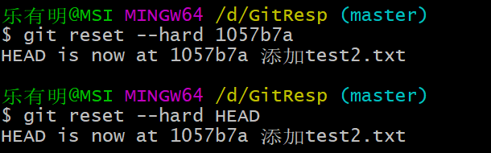
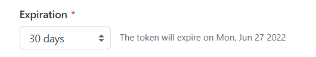

# 1. git介绍

* git概念:Git是一个免费的、开源的**分布式版本控制**系统，可以快速高效地处理从小型到大型的项目
* 版本控制:版本控制是一种记录一个或若干个文件内容变化，以便将来查阅特定版本修订情况的系统
* 版本控制系统的分类:
  1. 集中化版本控制系统:
     * 
     * SVN就是使用的集中化版本控制系统
     * 有一个中央服务器，工作人员将代码上传到服务器，也从服务器下载代码，由服务器进行版本控制
     * 
  2. 分布式版本控制系统:
     * 客户端并不只提取最新版本的文件快照，而是把代码仓库完整地镜像下来。
     * Git是分布式版本控制系统
     * 可以看成每个机器都是服务端
     * 去中心化的思想
     * 
     * GitHub就是一个出名的远端控制服务器
     * 
     * 

# 2. git下载
* 官网:[https://git-scm.com/](https://git-scm.com/)
* 一般都是默认选择就行:
  * 除了安装路径和PATH只在git终端中使用
* 使用Git Bash Here可以打开git终端

# 3. git本地结构

* 工作区:实际写代码的地方
* 暂存区:临时存储的区域
* 本地库:每个历史版本的信息

# 4. 代码托管中心
* 代码托管中心目的是为了维护远程库

## 4.1 本地库和远程库的交互方式

1. 团队内部合作:

2. 跨团队协作:

## 4.2 托管中心总类
1. 局域网环境:可以搭建GitLab服务器作为代码托管中心
2. 外网环境:可以由GitHub或者Gitee(码云)作为代码托管中心

# 5. 初始化本地仓库

1. 创建一个本地文件夹作为本地仓库
2. 打开Git终端:
   * 进去后可以堆自己和编码进行设置
   * 
   * 在Git中的命令和Linux是一样的:
     * 查看版本
     * 
     * 清屏(clear)
     * 设置用户名和邮箱
     * 
     * 本地仓库的初始化操作
     * 
     * .git目录是隐藏的可以调出来查看
     * 
     * 其中的config后续写配置信息的时候要用到
     * 注意:.git目录下本地库相关的文件不要删除和胡乱修改

# 6. Git常见命令

## 6.1 add和commit命令

1. 创建文件:

2. 将文件提交到缓存区:

3. 将缓存区的内容提交到本地库:(-m表示提交说明)

* 注意:只有放在本地仓库的文件并且被add和commit命令提交后的文件，git才会管理

## 6.2 status命令
* 可以查看暂存区和工作区的状态

* 创建一个新文件后查看状态(告诉你Demo2.txt还没有被追踪)

* 将Demo2.txt通过git add提交到暂存区，查看状态

* 将文件通过commit命令提交到本地库

* 修改Demo2.txt文件中的内容，再查看状态

* 修改文件后需要重新添加

## 6.3 log命令

* git log可以让我们查看提交的，显示从最近到最远的日志

* 当历史记录过多的时候，一页展示不下，左下角有个`:`,意思是还有下一页
  1. 进入下一页:空格
  2. 进入上一页:b
  3. 到达尾页，显示END
  4. 退出查看:q

### 6.3.1 更多展示方式

* git log --pretty=oneline进行一行展示

* git log --oneline 只截取一部分索引号进行展示

* git reflog
* 多了信息:HEAD@(数字)说明指针回到当前历史版本需要走多少步

## 6.4 reset命令
* git reset --hard 索引
* 前进或者后退历史版本
* 创建一个test.txt文件依次输入aaa、bbb、ccc每次输入后都提交

* 回退到aaa版本

* test.txt内容确实回退

### 6.4.1 reset命令参数

1. hard参数 git reset --hard 索引:
   * 本地库指针移动时，重置暂存区，重置工作区,在上面的使用中也可以发现，工作区的test.txt文件确实回退
2. mixed参数 git reset --mixed 索引:
   * 本地库指针移动时，重置暂存区，但是工作区不动
3. soft参数 git reset --soft 索引:
   * 本地库指针移动时，暂存区和工作区都不动

* 总结:以后一般都是用hard参数，可以直观地看到哪些文件动了

## 6.5 删除及找回文件

* 新建一个test2.txt文件
* 通过add和commit提交

* 删除工作区中test2.txt

* 将删除操作同步到暂存区和本地库:
  * 依旧是使用add和commit

* 找回本地库中删除的文件
  * 实际上就是回滚版本

### 6.5.1 找回暂存区删除的文件

* 删除工作区数据并同步到缓存区

* 此时想要恢复暂存区数据
  * 也是用reset的hard参数直接返回即可和前面的找回文件操作一样
  * 也可直接通过HEAD表示当前指针的索引

## 6.6 diff命令

* 用于对文件进行比较

### 6.6.1 工作区和暂存区进行比较

* 创建test3.txt文件并提交

* 更改test3.txt文件中内容
  * 先删除原先的aaa这一行，再输入aaabbb
  * 导致工作区和暂存区内容不一致
  * 通过diff进行比较

* 如果不输入文件名则是将所有文件进行比对
  * 对test2.txt进行修改

 

### 6.6.2 暂存区和本地库进行比较

* 将暂存区文件和本地库文件进行比较
  * 输入本地库索引和要比较的文件名

* 不输入文件名则默认比较所有文件

# 7. 分支

* 什么是分支:
  * 版本控制过程中，通过多条线同时推进多个任务。这里面说的多条线就是多个分支
* 通过一张图展示分支:

* 分支的好处:
  * 多个分支并行开发，互相不影响，提高开发效率
  * 如果有个分支功能开发失败，直接删除该分支即可，不会对其它分支产生任何影响

## 7.1 查看分支、创建分支、切换分支

* 创建test4.txt并提交到本地库

* 查看分支:git branch -v

* 创建分支:git branch 分支名

* 切换分支: git checkout branch01

## 7.2 分支冲突以及解决

* 在test4.txt内增加内容,并在branch01分支中提交

* 将分支切换到master
  * 切换回去之后工作区也改变，所以此时的test4.txt中并没有添加内容

* 在主分支中添加内容并提交

* 再次切换到branch01分支
  * 这时test4.txt在主分支中前进了一个版本在branch01中也前进了一个版本

* 想要将branch01分支合并到主分支
  * 先要切换到主分支

  * 将branch01中的内容与主分支内容进行合并:使用merge命令

  * 可以查看冲突内容:

* 冲突问题原因：
  * 多个分支在同一个文件中的同一位置进行过修改

* 解除冲突：
  * 人为决定留下想要的内容

  * 通过add和commit提交:
    * 这里commit后不能带文件名
    * 在执行完commit后可以结束合并状态

# 8. 与Github交互

## 8.1 创建远程仓库

## 8.2 获得远程库地址

 

### 8.2.1 地址本地保存

* 地址一般很长，所以Git提供本地地址保存功能，通过别名保存

* 查看别名:git remote -v

* 添加地址:git remote add 别名 地址

## 8.3 推送push操作

* git push 推送地址 分支名称

* 需要注意的一点是现在Gti使用https推送内容将不再支持用户名密码方式的身份验证，而是使用基于令牌的身份认证

 

### 8.3.1 创建令牌

1. 进入设置页面

2. 左侧边栏单击`<>Developer settings`
3. 在左侧边栏中，单击Personal access tokens
4. 单击生成新令牌

5. 给令牌取名

6. 选择令牌过期日期

7. 授予令牌访问权限或范围，如果使用令牌从命令行访问存储库，选择repo即可

8. 单击生成令牌即可

9.  命令行上使用令牌

