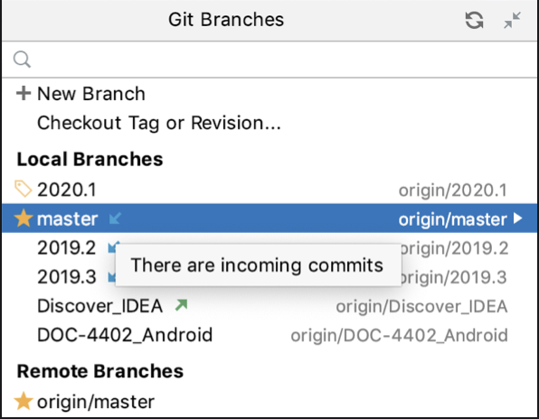
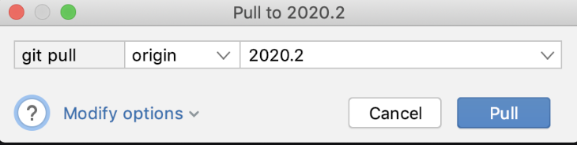

# 与远程 Git 存储库同步（提取、拉取、更新）

在通过将更改推送到上游来共享工作结果之前，您需要与远程存储库同步以确保项目的本地副本是最新的。 您可以通过以下方式之一执行此操作：提取更改、拉取更改或更新您的项目。

Git 分支弹出窗口指示分支是否有尚未获取的传入提交：

## 提取更改

当您从上游提取更改时，自您上次与远程存储库同步以来提交的所有新数据都会下载到您的本地副本中。 此新数据未集成到您的本地文件中，并且更改不会应用于您的代码。

**获取的更改存储为远程分支**，这使您有机会在将它们与文件合并之前查看它们。 由于 fetch 不会影响您的本地开发环境，因此这是一种将所有更改更新到远程存储库的安全方法。

> 要获取更改，请从主菜单中选择 Git | 提取。

## 更新分支

如果您需要将特定分支与其远程跟踪分支同步，请使用更新。 这是提取并随后将更改应用到所选分支的便捷快捷方式。

> * 在 Branches 弹出窗口或版本控制工具窗口的 Branches 窗格中，选择一个分支并从上下文菜单中选择 Update。
>
> GoLand 将从远程分支中拉取更改，并将它们变基或合并到本地分支，具体取决于在设置/首选项 | 中选择的更新方法。 版本控制 | Git。

## 拉取更改

如果您需要从另一个分支而不是其远程跟踪分支获取对当前分支的更改，请使用拉取。 当你拉取时，你不仅下载了新数据，而且将它集成到项目的本地工作副本中。

> 1. 从主菜单中选择 Git | 拉取。 “拉取更改”对话框打开：
>
> 
>
> 2. 如果您有一个多存储库项目，则会出现一个额外的下拉列表，让您选择存储库。
> 3. 如果您为项目定义了多个远程，请从列表中选择一个远程（默认情况下，它是origin）。
> 4. 选择要将拉取更改到当前签出的分支的分支。 默认选择当前本地分支跟踪的远程分支。 如果你指定了不同的分支，GoLand 会记住你的选择，并在以后默认显示这个分支。
> 5. 如果您需要使用选项进行拉取，请单击修改选项并从以下选项中进行选择：
>
> * --rebase：从远程分支提取更改后，GoLand 会将本地未推送的更改重新设置为提取的更改。
> * --ff-only：只有在可以快进的情况下才会解决合并。
> * --no-ff：在所有情况下都会创建合并提交，即使合并可以作为快进解决。
> * --squash：将在当前分支之上创建包含所有拉取更改的单个提交。
> * --no-commit：将执行合并，但不会创建合并提交，以便您可以在提交前检查合并结果。
> * 有关拉取选项的详细信息，请参阅 https://git-scm.com/docs/git-pull。
>
> 6. 点击拉取

## 更新你的项目

如果您有多个项目根，或者想在每次与远程存储库同步时从所有分支获取更改，您可能会发现更新项目是一个更方便的选择。

当您执行更新操作时，GoLang 从所有项目根和分支中获取更改，并将跟踪到的远程分支合并到您的本地工作副本中（相当于拉取）。

> 如果您的项目包含子模块，并且它们在分支上，它们也会自动更新。
>
> 如果子模块处于分离的 HEAD 状态，GoLand 将调用 git submodule update，这将检查根存储库中引用的提交。 这意味着只有当根仓库中的子模块引用发生变化，或者添加了新的子模块时，才会执行更新。

> 