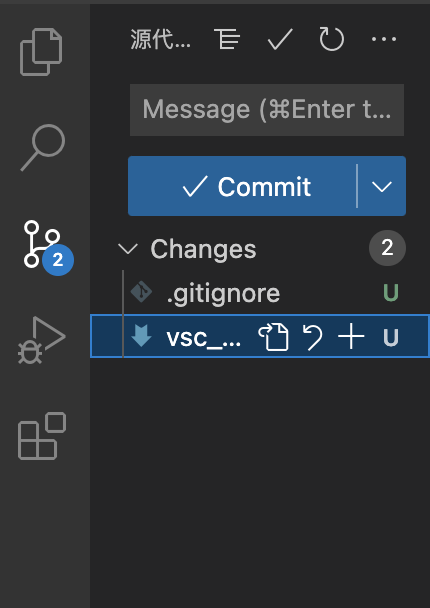
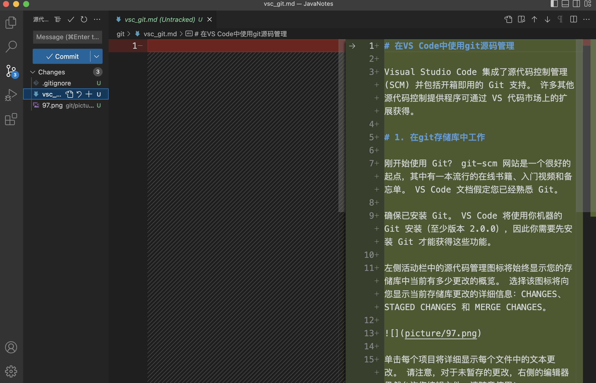
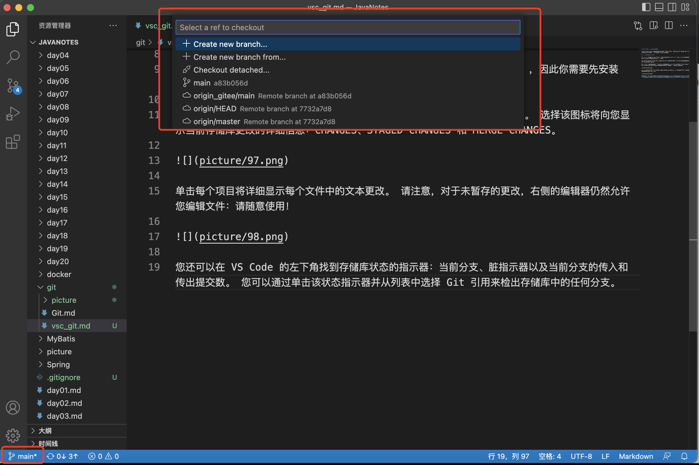
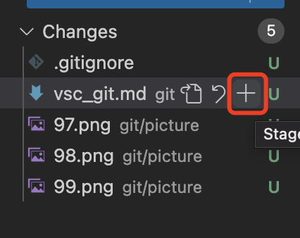
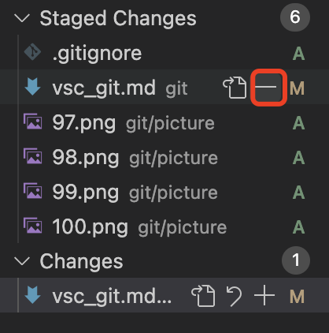
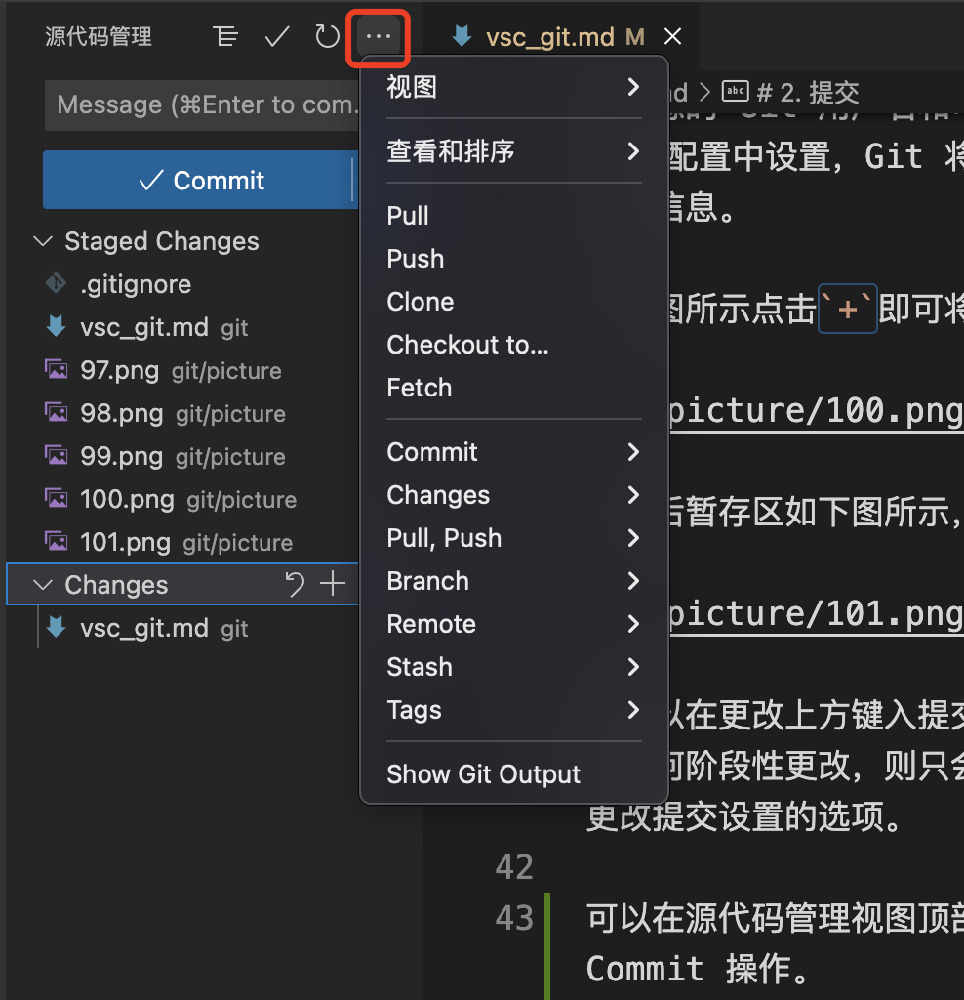

# 在VS Code中使用git源码管理

Visual Studio Code 集成了源代码控制管理 (SCM) 并包括开箱即用的 Git 支持。 许多其他源代码控制提供程序可通过 VS 代码市场上的扩展获得。

# 1. 在git存储库中工作

刚开始使用 Git？ git-scm 网站是一个很好的起点，其中有一本流行的在线书籍、入门视频和备忘单。 VS Code 文档假定您已经熟悉 Git。

确保已安装 Git。 VS Code 将使用你机器的 Git 安装（至少版本 2.0.0），因此你需要先安装 Git 才能获得这些功能。

左侧活动栏中的源代码管理图标将始终显示您的存储库中当前有多少更改的概览。 选择该图标将向您显示当前存储库更改的详细信息：CHANGES、STAGED CHANGES 和 MERGE CHANGES。

单击每个项目将详细显示每个文件中的文本更改。 请注意，对于未暂存的更改，右侧的编辑器仍然允许您编辑文件：请随意使用！

您还可以在 VS Code 的左下角找到存储库状态的指示器：当前分支、脏指示器以及当前分支的传入和传出提交数。 您可以通过单击该状态指示器并从列表中选择 Git 引用来检出存储库中的任何分支。

如下图所示，单击`main`可以进行本地远程分支选择等操作

提示：您可以在 Git 存储库的子目录中打开 VS Code。 VS Code 的 Git 服务仍将照常工作，显示存储库内的所有更改，但范围目录外的文件更改会带有工具提示阴影，表明它们位于当前工作区之外。

# 2. 提交

暂存 (git add) 和取消暂存 (git reset) 可以通过文件中的上下文操作或通过拖放来完成。

配置您的 Git 用户名和电子邮件。 当您提交时，请注意，如果您的用户名和电子邮件未在您的 Git 配置中设置，Git 将回退到使用来自您本地计算机的信息。 您可以在 Git 提交信息中找到详细信息。

如下图所示点击`+`即可将文件暂存

点击后暂存区如下图所示，点击`-`可以取消暂存

您可以在更改上方键入提交消息，然后按 Ctrl+Enter（macOS：⌘+Enter）来提交它们。 如果有任何阶段性更改，则只会提交那些更改。 否则，您会收到提示，要求您选择要提交的更改并获得更改提交设置的选项。

可以在源代码管理视图顶部的 Views and More Actions `...` 菜单中找到更具体的 Commit 操作。

如下图

